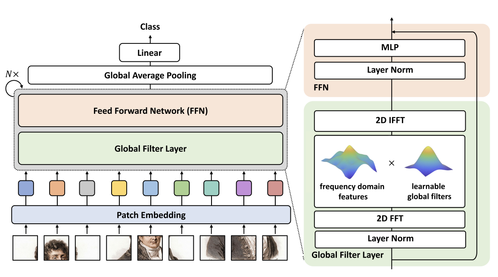
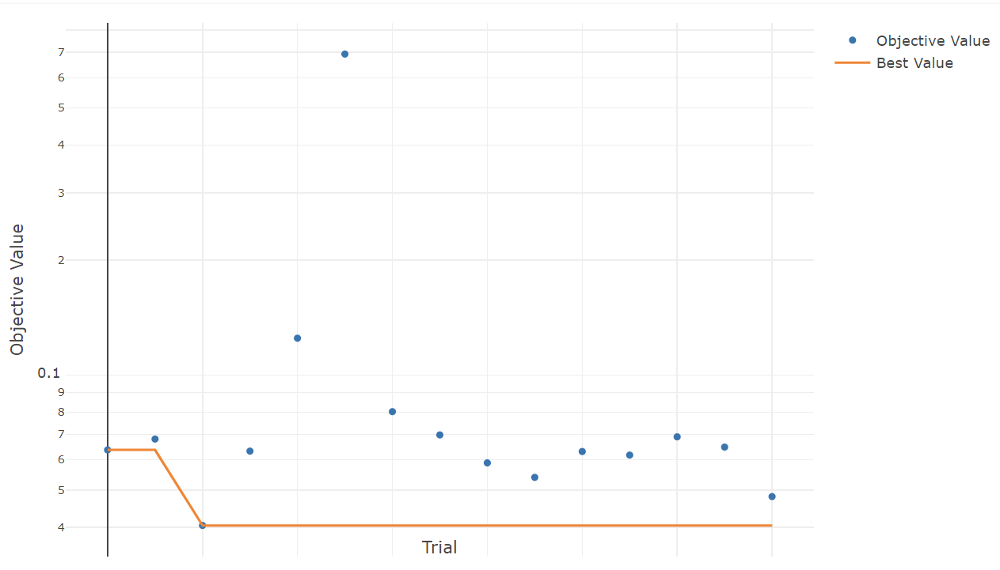
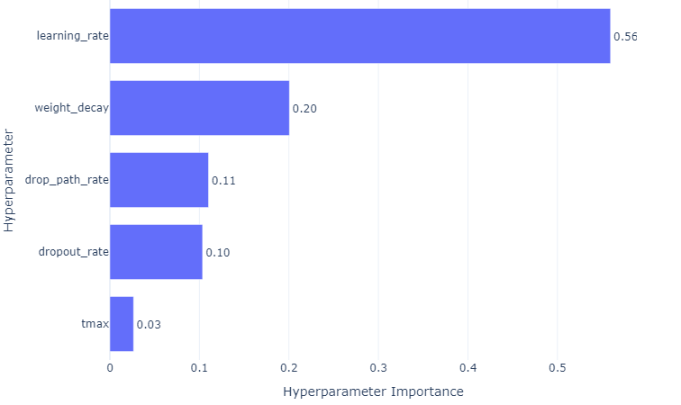
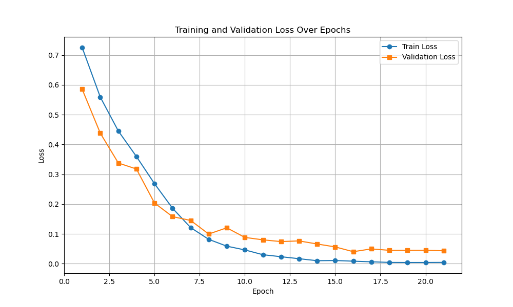

# GFNet for Alzheimer's Disease Classification

## Background
This project focuses on classifying Alzheimer's disease using the ADNI brain data.  

In recent years, the application of machine learning technologies in the medical field has been growing rapidly.
The detection of Alzheimer's disease is no exception.
Alzheimer's disease is a brain disorder that causes problems with memory, thinking, and behaviour.
Early diagnosis and treatment are essential to slow the progression of the disease, but accurate diagnosis can be difficult and often depends on the experience of a specialist.  

The development of deep learning techniques has greatly improved feature extraction and classification accuracy in image processing. Vision Transformer (ViT) is based on a transformer model developed for natural language processing and applied to image processing tasks.
It is a promising alternative to traditional Convolutional Neural Networks (CNN) because it can effectively learn long-range dependencies in images using a self-attention mechanism. However, this mechanism has quadratic complexity, which is a computational limitation of the transformer model [1][4]. 

The model we used is called GFNet, inspired by Vision Transformer.
GFNet differs from ViT in that it uses Fourier transforms rather than multi-head attention to learn the spatial relationships of images.
This approach can efficiently capture various interrelationships while keeping the low computational cost (log-linear) [1].    
In addition, the validation results show that imageNet performs very competitively in classification tasks compared to other transformer-based and CNN models [1].

The ADNI (Alzheimer's Disease Neuroimaging Initiative) dataset is used for the data set. This dataset contains brain MRI images of normal (NC) subjects and Alzheimer's disease (AD) patients.  

## Architecture

Figure1: The architecture of the GFNet from the paper. [1]

Overall, the architecture follows the ordinal ViT structure. The only difference is that GFNet uses a Global Filter Layer instead of multi-head Attention.
### 1. Patch Embedding
The role of patch embedding is to convert images into tokens. We cannot simply input images since the transformer is designed to do NLP tasks.
In ViT, the image $x ∈ R^{H×W×C}$ is divided into patches and treated as tokens. This is done by using a 2D convolutional layer with a kernel size and stride equal to patch_size (we set 4 in our project).
Then, each divided patch is flattened and converted into a one-dimensional vector $x_p ∈ R^{N×(P^2·C)}$.
Here, $N$ is the number of patches, $P$ is the patch size (In our project, we used $4 \times 4$), and $N = HW / P^2$.  

In the hierarchical GFNet model, downsampling takes place after patch embedding. This is achieved using a 2D convolutional layer, where the kernel size and stride match the patch size. 
Initially, one can start with a large feature map (e.g., 56 × 56) and gradually decrease the resolution, downsampling every few blocks. [1]

### 2. Global Filter Layer
This layer is where GFNet differs from ordinal ViT.
In multi-head attention, queries, keys, and values are generated from the input feature map and passed through a linear layer, each with its training parameters. The scaled dot product then performs a similarity-based transformation between vectors using inner products.
Since the relationship between patches is performed on all patch combinations, capturing the relationship between distant pixels is possible.

In contrast, the Global Filter Layer transforms the input features into the frequency domain by performing a two-dimensional fast Fourier transform (FFT).
Element-wise multiplications are then performed for the learnable filter weights and each frequency component. An inverse two-dimensional FFT (IFFT) is then applied to return the data to the spatial domain.
With this approach, the GlobalFilter Layer learns long-term spatial dependencies in the frequency domain with log-linear complexity.

Note: Layer normalisation is performed before the Fourier transform. It normalises the hidden layer values within each sample, specifically the mean and variance of the hidden layer values for each layer in one sample.

### 3. Feed Foward Network
It consists of a two-layer Multilayer Perceptron (MLP)that increases the number of dimensions in the first linear layer, then applies GELU as the activation function and finally returns to the original number of dimensions in the linear layer. 

Before applying the MLP, layer normalisation is performed on the output from the Global Filter Layer. The MLP then transforms the features within each token across different dimensions, reconfiguring the information. The GELU function is smoother than the ReLU function.

After passing through the MLP, a skip connection directly adds the original input to the outputs. The output of each block is added to the original input (residual) to produce the final output.

### 4. Global Averaging Pooling
Take the average of the tokens obtained from the output of the last block and summarise the values for each channel. In other words, summarising the information for each patch summarises the overall characteristics.

### 5. Linear
This is the all-combining layer (Linear Layer) for final classification and prediction. It takes the output of Global Average Pooling and produces the final output through the dense layer.

## Data Loading and Preprocessing
We used 20% of the entire ADNI dataset for the test. 
Additionally, 80% of the remaining 80% was used for training and the remainder for validation to perform hyperparameter tuning.  

We converted each set of images to grayscale.
In addition, since the image size is 256x240, padding was added to make it 256x256 and then resized to 224x224 pixels. The paper trained on a 224x224 sized image, so this was adapted.

The mean and standard deviation were obtained after using the above transformation for the training set. These values were used to normalize the training set, validation set, and test set.  

The training set was further subjected to data augmentation. The augmentation performed was as follows.

- Crops a random portion of the image and resizes the area to 224 x 224 pixels. The scale is chosen randomly in the range of 0.8 to 1.0.
- When resizing, the image is resized to 224x224 using a randomly chosen scale of 0.8 to 1.0.
- Rotations of up to 15 degrees and translations of up to 10% of the original image width and height were randomly selected.
- The image was flipped horizontally 50% of the time.
- Adjusted the sharpness of the image to 0.9 with a probability of 10%.

## Model
We build GFNet-H-B [1] model.
It is a hierarchical architecture consisting of four stages.
Each stage first performs patch embedding and transforms the input features into a high-dimensional vector. Then, multiple blocks (Global Filter Layer and Feed Forward Network) are applied at each stage to extract and transform the features.
Between stages, downsampling is performed, reducing the resolution by half. This allows for learning highly abstract features while progressively decreasing the size of the feature map. The number of blocks in each stage is 3, 3, 27, and 3, respectively.
The input dimensions of the patch embedding for each stage are set to 96, 192, 384, and 768, respectively, and the dimension of the feature vector increases as the resolution decreases.  

In building the model, dropout and drop paths were used for regularization. Dropout was applied in the MLP, where some nodes were randomly deactivated during training. Drop-pass was applied after the Feed Forward Network and before the skip connections. The entire block is skipped by stochastic scaling with respect to the feedforward layer output.

## Training

### Early Stopping
Early Stopping is implemented to detect overfitting. Specifically, training is now terminated when validation loss does not improve by more than 0.0001 for five consecutive epochs.   

### Linear war up
We performed the linear warm-up at the first five epochs.

### Parameters not used for tuning
| Parameter            | Description                                                            | Value                   |
|----------------------|------------------------------------------------------------------------|-------------------------|
| Activation function   | Activation function used in the model                                 | GELU                    |
| Criterion             | Loss function                                                         | BCEWithLogitsLoss       |
| Optimiser             | Optimisation algorithm                                                | AdamW                   |
| Batch size            | Number of samples per batch during training                           | 64                      |
| warmup_epochs         | Number of warmup epochs before applying the learning rate schedule    | 5                       |
| Scheduler             | Learning rate scheduler                                               | CosineAnnealingLR       |
| init_values           | Initial value for `gamma`, the learnable scaling factor of each block | 0.00001                 |
| num_epochs            | Maximum number of training epochs                                     | 100                     |

Table1: parameters we fixed across trials

## Hyper Parameter Tuning with Optuna
Here, we used Optuna to perform hyperparameter tuning; Optuna is an automatic optimization framework for hyperparameters that uses a Bayesian optimization-based method to perform parameter exploration. [4] Specifically, it repeats the process of sampling parameter values to obtain the value of the objective function. Then it uses the result to update the estimate of the next parameter to be explored. This adaptive search allows us to find the optimal hyperparameters more efficiently than grid or random searches.
### Parameters used for tuning

| Parameter        | Description                                          | Range              | Type       |
|------------------|------------------------------------------------------|--------------------|------------|
| learning_rate    | Learning rate                                        | 1e-3 to 1e-2       | Log scale  |
| weight_decay     | Regularization term for weights                      | 1e-5 to 1e-2       | Log scale  |
| dropout_rate     | Dropout probability                                  | 0.0 to 0.5         | Float      |
| drop_path_rate   | Probability for drop path                            | 0.0 to 1.0         | Float      |
| t_max            | Maximum number of iterations for CosineAnnealingLR   | 10 to 50           | Int        |

Table2: parameters we tuned.

## Results
We repeated the training 15 times to search for the optimal parameters while examining the evolution of the validation loss. The graph below shows the transition of the best validation loss obtained in each trial.

Figure2: The best validation loss for each trial

The detailed result of each trial is below.
| Trial | State     | Value      | drop_path_rate | dropout_rate | learning_rate | tmax | weight_decay |
|-------|-----------|------------|----------------|--------------|---------------|------|--------------|
| 0     | COMPLETE  | 0.06371886 | 0.4            | 0.286357692  | 0.001280908   | 13   | 0.003054118  |
| 1     | COMPLETE  | 0.06803985 | 0              | 0.075534059  | 0.004817181   | 22   | 0.004632901  |
| 2     | COMPLETE  | 0.04042224 | 1              | 0.101259144  | 0.005876215   | 19   | 0.000787076  |
| 3     | COMPLETE  | 0.06325819 | 0.1            | 0.066943992  | 0.008371957   | 38   | 0.007546939  |
| 4     | COMPLETE  | 0.12492028 | 1              | 0.231080263  | 0.001898915   | 39   | 0.009578413  |
| 5     | COMPLETE  | 0.69240379 | 0              | 0.448998335  | 0.009932399   | 45   | 0.000518867  |
| 6     | COMPLETE  | 0.08024840 | 0.6            | 0.490752327  | 0.002330070   | 44   | 0.002399047  |
| 7     | COMPLETE  | 0.06974632 | 0.4            | 0.191443283  | 0.001397699   | 11   | 0.008808489  |
| 8     | COMPLETE  | 0.05893210 | 0.1            | 0.024914343  | 0.001817550   | 32   | 0.001195097  |
| 9     | COMPLETE  | 0.05400278 | 1              | 0.077679307  | 0.001138511   | 26   | 0.005586348  |
| 10    | COMPLETE  | 0.06311024 | 0.7            | 0.344847447  | 0.004331467   | 19   | 0.005468487  |
| 11    | COMPLETE  | 0.06177036 | 1              | 0.171951078  | 0.005766146   | 25   | 0.005796418  |
| 12    | COMPLETE  | 0.06894811 | 0.8            | 0.148571963  | 0.003332115   | 29   | 0.003755380  |
| 13    | COMPLETE  | 0.06481859 | 0.9            | 0.116759742  | 0.001063830   | 17   | 0.006896326  |
| 14    | COMPLETE  | 0.04810376 | 0.8            | 0.024972748  | 0.006869314   | 28   | 0.002183022  |

Table3: The result of each trial.

The best result were obtained at trial 2 (the third tiral) with loss value 0.04.

The figure below shows the importance of each parameter. The learning rate is the most important parameter, accounting for more than half of the total.

Figure3: Importance of each parameters.

We predicted our test set (mentioned in the Data Loading and Preprocessing section) with the best parameters we obtained (trial 2 in Table 3).
Here, the bset model mean the model achieved the best loss across the trials. We measured the model's performance using accuracy (1 — misclassification rate). 
As a result, we achieved **98.62%** accuracy on our test set. Below is the loss plots for training and validation over epochs when training with the best parameters. 
We can see that the training effectively completed with early stopping, and overfitting was prevented.

Figure4: Training and validation loss over epoch for trial 2 (the third trial)

## Discussion
In this project, GFNet-H-B was trained using the ADNI dataset and successfully detected Alzheimer's patients with **98.62%** accuracy. As we mentioned earlier, the entire dataset was randomly divided into training, validation, and test sets, respectively, but using the original ADNI split (the official training and test sets), the accuracy was significantly reduced to 56%.
The cause may be an imbalance of data (class imbalance) between the official training and test sets. In particular, if the test set contains data that cannot be learned from the original training set because of this, i.e., data that is not found in the training set, the model may not be able to generalise to that data.
Therefore, a good result may have been obtained by randomly re-splitting the whole set. This indicates that the distribution of the data significantly impacts training, and careful partitioning is necessary.

## Conclusion
We confirmed that GFNet-H-B can detect Alzheimer's disease with high accuracy using the ADNI dataset. It achieved 98.62% accuracy on a randomly resegmented dataset, but accuracy dropped to 56.68% on official data partitioning.
These results suggest that GFNet performance may depend on the amount and distribution of data used for training. Further testing is needed to determine whether further data expansion and data preprocessing that accounts for class imbalance and sample bias in the data set will increase accuracy.

## Running the code
#### Dependencies
- Python: 3.12.4 
- Pytorch: 2.4.0
- Torchvision: 0.19.0
- scikit-learn: 1.5.1
- timm: 1.0.11
- Optuna: 4.0.0
- Matplotlib: 3.9.2
- Pandas: 2.2.2

#### Command
Train: `pyton train.py`  
Predict: `python predict.py`

Assume you are in the directory each file is in, have installed all necessary libraries, and that the datasets are stored in "/home/groups/comp3710/ADNI/AD_N."

## Reference
[1] Rao, Y., Zhao, W., Zhu, Z., Zhou, J., & Lu, J. (2023). GFNet: Global Filter Networks for Visual Recognition. IEEE Transactions on Pattern Analysis and Machine Intelligence, 45(9), 10960–10973. https://doi.org/10.1109/tpami.2023.3263824

[2] ADNI | Alzheimer’s Disease Neuroimaging Initiative. (n.d.). ADNI. https://adni.loni.usc.edu/

[3] Dosovitskiy, A., Beyer, L., Kolesnikov, A., Weissenborn, D., Zhai, X., Unterthiner, T., Dehghani, M., Minderer, M., Heigold, G., Gelly, S., Uszkoreit, J., & Houlsby, N. (2021, June 3). An Image is Worth 16x16 Words: Transformers for Image Recognition at Scale. ArXiv.org. https://doi.org/10.48550/arXiv.2010.11929

‌[4] Optuna - A hyperparameter optimization framework. (n.d.). Optuna. https://optuna.org/

‌[5] raoyongming. (2021). GitHub - raoyongming/GFNet: [NeurIPS 2021] [T-PAMI] Global Filter Networks for Image Classification. GitHub. https://github.com/raoyongming/GFNet

‌

‌

‌