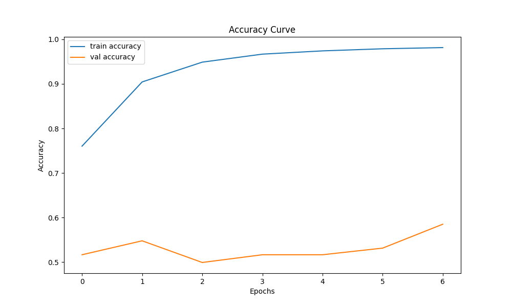

# COMP3710 Project

## 1. Project Overview

GFNet (Graph-Free Vision Transformer) is an advanced vision transformer model designed to handle image recognition tasks. In this project, the main role of GFNet is to distinguish between the two states of cognitive normal (CN) and Alzheimer's disease (AD) from brain MRI scans provided by ADNI (Alzheimer's Disease Neuroimaging Initiative). Through training, the model aims to learn visual patterns and features that distinguish between the two categories to achieve the following goals:

- High Accuracy: The goal of the project is to achieve or exceed a classification accuracy of 0.8, which means that the model is able to correctly identify at least 80% of the test data.
- Robustness: High performance under a variety of conditions and variations, such as images from different stages of the disease or from different scanning devices.
- Generalization ability: The model should be able to handle similar datasets from outside the project, that is, have good generalization ability so that it can be easily adapted to a wider range of medical imaging tasks in the future[^1].

### 1.1 Advantages of the Model (GFNet)

As a Transformer-based model, GFNet has several obvious advantages when dealing with image data:

- Better feature capture capability: Vision Transformers are able to capture global dependencies and complex patterns more effectively than conventional CNNS, which is especially important for subtle variations common in medical imaging.
- Small amount of prior knowledge requirement: GFNet does not need to rely on domain-specific prior knowledge or complex feature engineering as traditional methods do, making it better adaptive on new or unlabeled medical imaging datasets.
- Efficient information integration capability: The Transformer architecture allows the model to integrate information more effectively when processing large image data, which is particularly critical for parsing and classifying high-resolution medical images.
- Adaptation to complex data distribution: Since medical images often contain very complex biological information and variable representations, the self-attention mechanism of GFNet can provide a powerful way to understand these complexities and improve the accuracy of diagnosis.

In general, GFNet shows better performance and potential than traditional methods when dealing with medical image data, especially high-dimensional and high-complexity, and is suitable as the model for this project.

## 2. Data Description

### 2.1 Data Sources

The dataset is provided by Alzheimer's Disease Neuroimaging Initiative (ADNI), with permission to use it from the EECS COMP3710 team at the University of Queensland[^2]. The data has been devided into two floders: train and test, and divided into CN and AD two kinds of data in each folder.

### 2.2 Data Preprocessing

A comprehensive data preprocessing pipeline was implemented for training a deep learning model using TensorFlow. The pipeline involves several crucial steps designed to prepare image data for effective model training.

1. Each image file path undergoes a series of transformations to ensure it's adequately prepared for the model. This includes reading the image from disk, decoding it into a JPEG format, resizing it to a uniform size (224x224 pixels to match the GFNet model input requirements), and normalizing pixel values to the range [0,1] for better neural network performance. Apart from taht, labels are converted from string format to numerical indices, which are necessary for the model to process the labels effectively. This step also includes creating a unique index for each label which aids in classification tasks.
2. The dataset was construsts by using TensorFlow's tf.data.Dataset API, from the image paths and their corresponding numeric labels, and then enhanced with mapping functions that apply the preprocessing steps concurrently, leveraging TensorFlow’s AUTOTUNE feature to optimize loading and transformation operations. To ensure that the model receives data in manageable sizes and in random order, the dataset is batched and shuffled. This step is crucial for training deep learning models as it helps to reduce memory overhead and introduces randomness in the training process, which can improve the model's generalization ability [^3].
3. The dataset is divided into training and validation sets using a stratified approach based on the labels to ensure that each set represents the overall dataset's distribution accurately. This split helps evaluate the model’s performance during training, providing insight into how well the model might perform on unseen data.

### 2.3 Data Size & Categorical Distribution

The experimental dataset comprises 9,000 brain MRI scans, categorized into a binary classification problem: Alzheimer's Disease (AD) and Normal Control (NC). The categorical distribution demonstrates a well-balanced representation with AD samples accounting for 4,460 images (49.56%) and NC samples comprising 4,540 images (50.44%). The variance between classes is minimal (Δ = 80 samples, ~0.88%), indicating a naturally balanced dataset that mitigates the need for class balancing techniques during model training.

## 3. Model Overview

The structure of a complete GFNet mainly includes frequency domain operations, hierarchical structure, multi-layer global filters, etc. Below is a detailed description of GFNet, including the layers used, activation functions, and optimizer.

### 3.1 Structure of Model

1. **Input layer:** Input shape (224,224,3), which is a standard 224x224 size RGB image;
2. **Data augmentation layer:** This model uses *RandomRotation*, *RandomFlip*, and *RandomZoom* to increase the diversity of the input images to help the model generalize better;
3. **Feature extraction layer:** *EfficientNetB0* is used as the backbone feature extractor, where *include_top=False* removes the classification head of the original model and only retains the feature extraction part.
这里可以考虑pooling的问题
4. **Global filter layer:** The Global Filter Layer performs frequency domain conversion, global filtering, and inverse frequency domain conversion. A 2D FFT is used to transform the input feature map from the spatial domain to the frequency domain. We apply a learnable frequency domain filter to capture global features by element-wise multiplication (Hadamard product). The processed frequency domain features were returned to the spatial domain by inverse FFT (iFFT) to prepare features for the subsequent classification layer.
5. **Classification layer:** A fully connected layer is added to the classification layer with an output dimension of 128, an activation function of ReLU, and L2 regularization is used to prevent overfitting. The output of Dense layer is batch normalized to make the model training more stable. *Dropout (rate=0.3)* was used to further prevent overfitting.
6. **Output layer:** The final output layer is *Dense(2, activation='softmax')*, which is used for binary classification tasks and outputs the probability distribution of the two classes.

### 3.2 Design and Experimentation

In order to verify the effectiveness of the model, the experiments mainly focus on the training performance of the model and the generalization ability on the test set.

#### Dataset

The standard binary classification dataset is selected to ensure that the amount of data is sufficient to support the training of deep learning models, and a reasonable split between training and validation sets is ensured.

#### Training parameters

1. **Batch size:** Confirm the memory utilization and training efficiency;
2. **Learning rate:** The adaptive optimizer *Adam* is used with an initial learning rate around 0.0001 - 0.001 and adaptively adjusted during training based on the validation loss;
3. **Callbacks:** *ReduceLROnPlateau* and *EarlyStopping* callbacks are introduced to reduce the learning rate or stop training early if there is no improvement in the validation loss.

#### Evaluation indicators

1. **Accuracy:** This evaluates how accurate the model is on the validation and test sets;
2. **Loss:** Binary cross-entropy loss to track the performance of the model during training and validation;
3. **Confusion matrix:** This analyzes the classification accuracy of the model on the test set, including the distribution of correct and incorrect classifications.

### 3.3 Training Process and Results

回调函数的设置 (early stop)

### 3.4 Challenges and Solutions

#### Memory Usage

During the implementation of our GFNet model, the significant memory management, particularly in handling the large-scale medical image dataset, is the first challenge in this project. The operation always been killed due to out of memory.

This project implements a multifaceted approach to optimize memory usage, combining batch data processing, regular memory cleanup, and GPU memory growth management. The system is configured to handle smaller batches, down from 16 to 4, with automatic memory cleanup after every 4 batches. This strategy, along with TensorFlow's dynamic memory allocation, enables efficient training on GPU hardware while maintaining model performance.

#### Overfitting

In the early stage of project operation, there will be a situation where the training accuracy is above 0.9, but the validation accuracy is only maintained at about 0.5, which can be seen in the figure below.

To solve this problem, first the callback function (early stop) is enabled in this project. This project initially used patience = 5, but the validation accuracy fluctuated a lot during training, then tried increasing patience to 10. The second is to use Dropout layers to reduce the model's dependence on training data by randomly dropping a subset of neurons during training. 30% were discarded in the project to help the model learn features more robustly. The third is to add L2 regularization, which adds a penalty term related to the sum of squares of the model weights to the loss function to limit the growth of the weights and prevent the model from becoming overly complex.

## 5. Dependencies

### 列出

## 6. Reference

[^1]: Y.Rao, W.Zhao, Z.Zhu, J.Zhou, and J.Lu, “GFNet: Global Filter Networks for Visual Recognition,” IEEE Transactions on Pattern Analysis and Machine Intelligence, vol.45, no.9, pp.10960–10973, Apr.2023, doi: <https://doi.org/10.1109/tpami.2023.3263824>
[^2]: “Alzheimer’s Disease Neuroimaging Initiative,” ADNI. <https://adni.loni.usc.edu/>
[^3]: “Better performance with the tf.data API | TensorFlow Core,” TensorFlow. <https://www.tensorflow.org/guide/data_performance>
