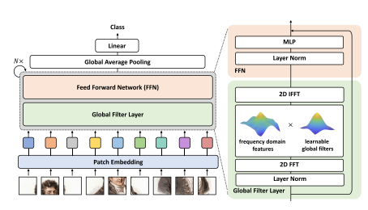
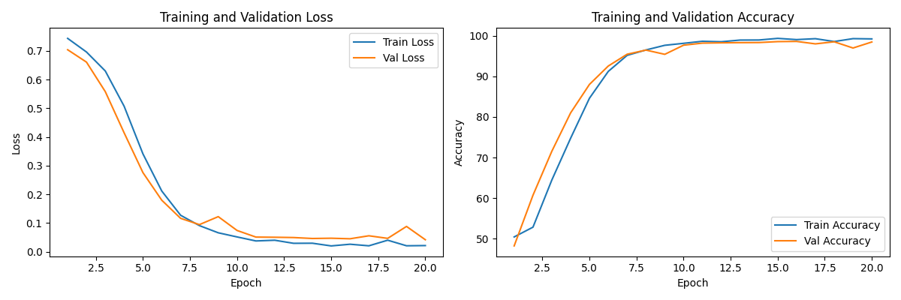
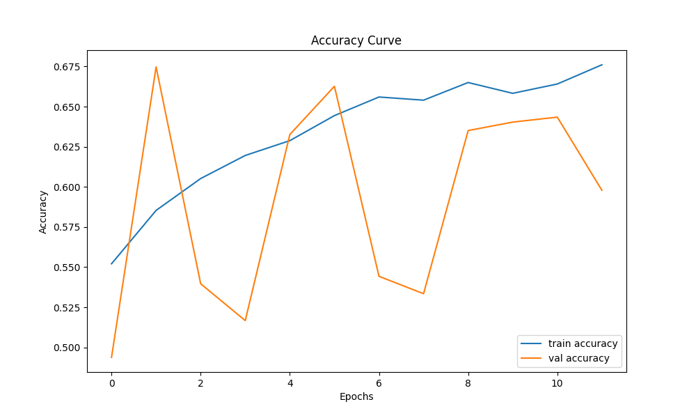

# COMP3710 Project

## 1. Project Overview

GFNet (Graph-Free Vision Transformer) is an advanced vision transformer model designed to handle image recognition tasks. In this project, the main role of GFNet is to distinguish between the two states of cognitive normal (CN) and Alzheimer's disease (AD) from brain MRI scans provided by ADNI (Alzheimer's Disease Neuroimaging Initiative). Through training, the model aims to learn visual patterns and features that distinguish between the two categories to achieve the following goals:

- High Accuracy: The goal of the project is to achieve or exceed a classification accuracy of 0.8, which means that the model is able to correctly identify at least 80% of the test data.
- Robustness: High performance under a variety of conditions and variations, such as images from different stages of the disease or from different scanning devices.
- Generalization ability: The model should be able to handle similar datasets from outside the project, that is, have good generalization ability so that it can be easily adapted to a wider range of medical imaging tasks in the future[^1].

### 1.1 Advantages of the Model (GFNet)

As a Transformer-based model, GFNet has several obvious advantages when dealing with image data:

- Better feature capture capability: Vision Transformers are able to capture global dependencies and complex patterns more effectively than conventional CNNS, which is especially important for subtle variations common in medical imaging.
- Small amount of prior knowledge requirement: GFNet does not need to rely on domain-specific prior knowledge or complex feature engineering as traditional methods do, making it better adaptive on new or unlabeled medical imaging datasets.
- Efficient information integration capability: The Transformer architecture allows the model to integrate information more effectively when processing large image data, which is particularly critical for parsing and classifying high-resolution medical images.
- Adaptation to complex data distribution: Since medical images often contain very complex biological information and variable representations, the self-attention mechanism of GFNet can provide a powerful way to understand these complexities and improve the accuracy of diagnosis.

In general, GFNet shows better performance and potential than traditional methods when dealing with medical image data, especially high-dimensional and high-complexity, and is suitable as the model for this project.

## 2. Data Description

### 2.1 Data Sources

The dataset is provided by Alzheimer's Disease Neuroimaging Initiative (ADNI), with permission to use it from the EECS COMP3710 team at the University of Queensland[^2]. The data has been devided into two floders: train and test, and divided into CN and AD two kinds of data in each folder.

### 2.2 Data Preprocessing

A comprehensive data preprocessing pipeline was implemented for training a deep learning model using TensorFlow. The pipeline involves several crucial steps designed to prepare image data for effective model training.

1. Use *transforms.Resize((224, 224))* to resize all images to a uniform size of 224x224 pixels. Ensure that all input images have the same size so that they can be processed by the model [^3].
2. Using *transforms. RandomHorizontalFlip ()* for random flip horizontal. In this way, the diversity of the dataset can be increased. Images may contain similar features in different directions, and random flipping can help the model learn the features of these different directions, thus improving the generalization ability [^4].
3. Convert the image to grayscale using *transforms.Grayscale(1)* and set the number of channels to 1. The amount of computation and memory usage can be reduced by converting to grayscale images. This can help the model focus only on the basic features of the image such as shape, edges, etc.
4. Use *transforms.RandomErasing()* to randomize a small region of the image (i.e., "erase"). Increasing the robustness of the data helps the model adapt to local information loss [^5].

### 2.3 Data Size & Categorical Distribution

In this dataset, a total of 21,520 images were loaded and divided into two categories:

- AD class (labeled 0) : 10,400 images
- NC category (labeled 1) : 11,120 images

This indicates that the dataset has a relatively balanced distribution of categories, although there are slightly more NC categories. This balanced class distribution is beneficial for classification tasks because it reduces the likelihood that the model will be biased towards one class over another. In addition, the large amount of training data helps the model to capture more features, thus improving the generalization ability of the model.

## 3. Model Overview

The structure of a complete GFNet mainly includes frequency domain operations, hierarchical structure, multi-layer global filters, etc. Below is a detailed description of GFNet, including the layers used, activation functions, and optimizer [^1].


### 3.1 Structure of Model

1. **Input layer:** Input shape (224,224,1), which is a standard 224x224 size RGB image;
2. **Block Embedding Layer:** This model uses the PatchEmbed layer to divide the input image into blocks and embed each block into a higher dimensional space. This is done with a convolutional layer (nn.Conv2d) whose kernel size and step size are set to the patch size (16x16 in this case), resulting in a set of embeddings that can be handled by a transformer-based architecture;
3. **Position Embedding Layer:** We add a learnable position embedding (pos_embed) to the patch embedding to incorporate spatial information, which is essential for Transformers due to their lack of inherent spatial structure. This position information helps the model learn the relative position of the blocks in the original image;
4. **Global Filter Layer:** The global filter layer performs the frequency domain transformation. It uses 2D FFT to convert spatial domain features to the frequency domain, where learnable complex weight filters are applied through element-wise multiplication. The modified features are then transformed back into the spatial domain via inverse FFT (iFFT), enabling the model to capture global dependencies;
5. **Transformer Blocks:** This model consists of multiple block layers (12 by default), each containing Normalization and filtering,descent path and MLP layer;
6. **Normalization Layer:** After the transformer chunking, a final normalization layer (nn.LayerNorm) is applied to normalize the features prior to classification;
7. **Classification layer:** If specified, the model contains an optional representation_size layer, which is a fully connected layer with Tanh activation. This amounts to a pre-logits layer that transforms the features before they reach the final classifier head;
8. **Dropout layer:** An optional Final Dropout (dropcls) is applied before the classification head to prevent overfitting;
9. **Output Layer:** The final output layer (self.head) is a fully connected layer (nn.Linear) whose size matches the number of categories (1000 by default). Output cross-class probability distribution, suitable for multi-class classification.

### 3.2 Design and Experimentation

In order to verify the effectiveness of the model, the experiments mainly focus on the training performance of the model and the generalization ability on the test set.

#### Dataset

The standard binary classification dataset is selected to ensure that the amount of data is sufficient to support the training of deep learning models, and a reasonable split between training and validation sets is ensured.

#### Training parameters

1. **Batch size:** Confirm the memory utilization and training efficiency;
2. **Learning rate:** The adaptive optimizer *Adam* is used with an initial learning rate around 0.0001 - 0.001 and adaptively adjusted during training based on the validation loss;
3. **Callbacks:** *ReduceLROnPlateau* and *EarlyStopping* callbacks are introduced to reduce the learning rate or stop training early if there is no improvement in the validation loss.

#### Evaluation indicators

1. **Accuracy:** This evaluates how accurate the model is on the validation and test sets;
2. **Loss:** Binary cross-entropy loss to track the performance of the model during training and validation;
3. **Confusion matrix:** This analyzes the classification accuracy of the model on the test set, including the distribution of correct and incorrect classifications.

### 3.3 Training Process and Results

This plot shows the Loss and Accuracy during training and validation as the number of epochs increases. The left plot is the loss on the training and validation sets, and the right plot is the accuracy. From this, it can be concluded that both the training loss and the validation loss gradually decrease and become stable near the 10th epoch. Ultimately, the loss value is close to 0, which indicates that the model has a high fit on both the training and validation sets. The loss decreases faster and levels off after the first few epochs, which indicates that the model converges well. There is almost no significant gap between training and validation losses, indicating that the model does not suffer from significant overfitting. The validation accuracy is very close to the training accuracy, which indicates that the model performs well on the validation set and does not overfit or underfit. The accuracy of the model is very high on both the training set and the validation set, which indicates that the model has good generalization ability. In the last few epochs, the training and validation accuracy reaches 98%, indicating that the model performs extremely well on this task.

Given that the test accuracy achieved so far is 74.85%, here is a summary of the efforts already made to improve accuracy, as well as suggestions for potential future improvements.

Several measures have been tried in this project to improve the accuracy of the model. Firstly, a series of methods are applied to data augmentation, including random scaling and cropping, horizontal flipping, random rotation, CLAHE (Contrast Limited adaptive Histogram equalization) contrast enhancement, gamma adjustment, etc., to help the model generalize better on diverse samples and enhance the robustness to image appearance changes. Secondly, a custom function is used to automatically crop the black edges of the image to reduce irrelevant background information and make the model pay more attention to the key features of the target region. In the model architecture, GFNet, a specially designed architecture with global filtering function, is used to capture high-level context information. At the same time, DropPath and MLP layers are used to enhance feature extraction and reduce the risk of overfitting. In addition, hyperparameter tuning is performed to adjust the depth, embedding dimension, dropout rate, and cosine annealing learning rate scheduling is applied to optimize the convergence speed. Finally, we prevent overfitting by stopping early, stopping training when the validation set accuracy stagnates, and saving model checkpoints for each epoch to ensure that the best-performing model version is retained.

In the future, there is time to continue to optimize the model architecture, introduce the Self-Attention mechanism, and add a Multi-Head self-attention (MHSA) layer in each Block to enhance the ability of the model to capture long-distance dependencies. The jump connection or gating mechanism is added to the Mlp module to increase the diversity of feature representation, so that the network can capture richer feature information. Or choose something that takes time but is effective and use semi-supervised or self-supervised learning.

### 3.4 Challenges and Solutions

#### Memory Usage

During the implementation of our GFNet model, the significant memory management, particularly in handling the large-scale medical image dataset, is the first challenge in this project. The operation always been killed due to out of memory.

This project implements a multifaceted approach to optimize memory usage, combining batch data processing, regular memory cleanup, and GPU memory growth management. The system is configured to handle smaller batches, down from 16 to 4, with automatic memory cleanup after every 4 batches. This strategy, along with TensorFlow's dynamic memory allocation, enables efficient training on GPU hardware while maintaining model performance.

#### Overfitting

In the early stage of project operation, there will be a situation where the training accuracy is above 0.9, but the validation accuracy is only maintained at about 0.5 finally.

To solve this problem, first the callback function (early stop) is enabled in this project. This project initially used patience = 5, but the validation accuracy fluctuated a lot during training, then tried increasing patience to 10. The second is to use Dropout layers to reduce the model's dependence on training data by randomly dropping a subset of neurons during training. 30% were discarded in the project to help the model learn features more robustly. The third is to add L2 regularization, which adds a penalty term related to the sum of squares of the model weights to the loss function to limit the growth of the weights and prevent the model from becoming overly complex.

#### Great fluctuation of accuracy on the validation set

While the training set grew steadily, the validation set showed a large fluctuation as shown below.

Finally, it was found that data augmentation was also performed in the validation dataset, which affected the extraction of features, and only doing it on the training dataset would get better results. In addition, the TensorFlow version caused some core computing power to be ignored, and in order to avoid the problem of tool, the final choice was to replace the pytorch code and rewrite the code to run.

## 5. Dependencies

```bash
pip install Python 3.x
pip install torch
pip install torchvision
pip install pillow
pip install timm
pip install numpy
pip install kornia
```

### 5.2 GPU support (optional)

CUDA 11.8 (The version should match the TensorFlow GPU version)

## 6. Reference

[^1]: Y.Rao, W.Zhao, Z.Zhu, J.Zhou, and J.Lu, “GFNet: Global Filter Networks for Visual Recognition,” IEEE Transactions on Pattern Analysis and Machine Intelligence, vol.45, no.9, pp.10960–10973, Apr.2023, doi: <https://doi.org/10.1109/tpami.2023.3263824>
[^2]: “Alzheimer’s Disease Neuroimaging Initiative,” ADNI. <https://adni.loni.usc.edu/>
[^3]: A. Krizhevsky, I. Sutskever, and G. E. Hinton, “ImageNet Classification with Deep Convolutional Neural Networks,” Communications of the ACM, vol. 60, no. 6, pp. 84–90, May 2012, Available: <https://proceedings.neurips.cc/paper_files/paper/2012/file/c399862d3b9d6b76c8436e924a68c45b-Paper.pdf>
[^4]: Th. S. Kumar, “Enhancement of Image Classification through Data Augmentation using Machine Learning,” International Journal of Computer Sciences and Engineering, vol. 6, no. 9, pp. 220–224, Sep. 2018, doi: <https://doi.org/10.26438/ijcse/v6i9.220224>
[^5]: Z. Zhong, L. Zheng, G. Kang, S. Li, and Y. Yang, “Random Erasing Data Augmentation,” Proceedings of the AAAI Conference on Artificial Intelligence, vol. 34, no. 07, pp. 13001–13008, Apr. 2020, doi: <https://doi.org/10.1609/aaai.v34i07.7000>
