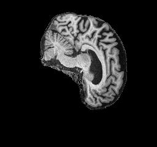
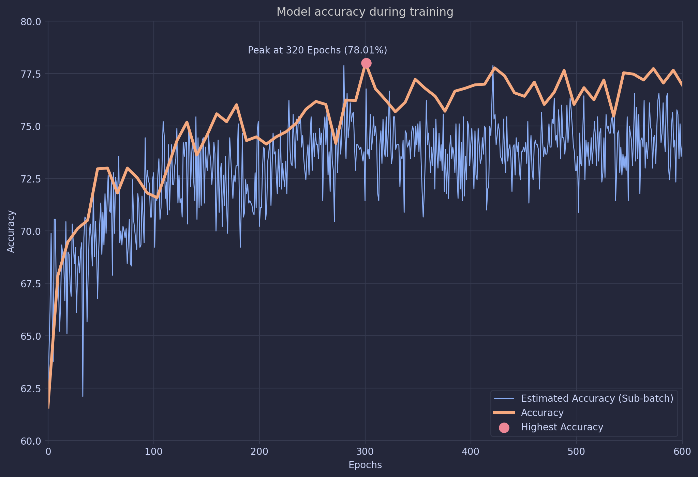

# Detecting Alzheimer’s Disease from the ANDI dataset using Global Filter Vision Transformers.

Author: Benjamin Jorgensen - s4717300

## Problem Description
### Model Solution

This project aims to train a global filter machine learning model with the goal
to obtain an accuracy of 80% when classifying alzheimers disease from the ANDI
dataset. The model is based on Yongming Rao's 2021 paper titled [Global filter
networks for image classification](https://arxiv.org/pdf/2107.00645)[^1] which
is an extension of a classic vision transformer.

The proposed model can correctly classify alzheimers disease with an
accuracy of 78.01% on the test set of the ANDI dataset.

### ANDI Dataset background

The ANDI dataset contains 30539 images collected by the Alzheimer’s Disease
Neuroimaging Initiative. The images are MRI scans of patient's brain's who are
either cognitive normal, or who suffer from Alzheimer's disease. Images in the
dataset are greyscale with a size of 240x256 pixels. It is possible for a
professional to determine if a patient has a Neurocognitive disease such as
Alzheimer's by analysing an MRI scan. From https://www.radiologyinfo.org/en/info/alzheimers,

> MRI can detect brain abnormalities associated with mild cognitive impairment
> (MCI) and can be used to predict which patients with MCI may eventually
> develop Alzheimer's disease. In the early stages of Alzheimer's disease, an
> MRI scan of the brain may be normal. In later stages, MRI may show a decrease
> in the size of different areas of the brain (mainly affecting the temporal
> and parietal lobes).

Comparison of an MRI of of a patient with Alzheimers Disease (AD) on the left and a Normal Cognitive (NC) patient on the right:
 

## GFNet Structure


### Model Overview

The model structure of the Global Network filter is very similar to other
vision transformer models (ViT's). First the input image is split into patches
which just square sections of the original image. Each patch is then converted
into an embedding vector by a 2D convolutional layer. The embeddings have
semantic meaning that is learned from the features of the attention layer. For
example, one element in the embedding vector could represent either a male or
female brain it it was useful to the overall classification problem. In most
cases these embeddings are far to complex to extract any human interpretable
meaning. When the output matrix from the attention layer are applied to these
patches, the result is a vector representing the likelihood of each class. In
this case a binary one indicating AD or NC.

The purpose of attention layer to learn the features of the image.
Typically this involves updating Query and Key matrices for each token or patch
which will be used to update the embeddings though the output matrix. This
operation is O(n^2) time complexity where n is the number of patches.

The key difference between a vision transformer and the GFNet is that the
Key matrices in the attention layer are not applied to the patches but the
discrete Fourier transform of the patches. This operation maintains the
features required from the patches but reduces the dimensionality to log(n)
resulting in an overall complexity of O(long).

The global filter code is similar to the one defined below:
```python
class GlobalFilter(nn.Module):
    """
    @params dim: dimensions of the input data
    @params w: width of the input data in pixels
    @params h: height of the input data in pixels
    """
    def __init__(self, dim, h=14, w=8):
        super().__init__()
        self.complex_weight = nn.Parameter(torch.randn(h, w, dim, 2, dtype=torch.float32) * 0.02)
        self.w = w
        self.h = h

    def forward(self, x, spatial_size=None):
        B, N, C = x.shape
        x = x.view(B, a, b, C)
        x = x.to(torch.float32)
        x = rfft2(x, dim=(1, 2), norm='ortho')
        weight = torch.view_as_complex(self.complex_weight)
        x = x * weight
        x = irfft2(x, s=(a, b), dim=(1, 2), norm='ortho')
        x = x.reshape(B, N, C)

        return x
```


The final layer, the feed forward notwork, will then classify the image based
on the features extracted from the image patches.

### Project Structure

Below is the structure of project and the purpose of each file

`train.py` - Trains the model based on given in `utils.py` (See usage below)

`predict.py` - Runs inference on a single file or evaluation on a test set. (See usage below)

`dataset.py` - Loads the dataset for training or inference/prediction

`modules.py` - Defines the GFNet architecture 

`utils.py` - Contains an Environment class that supplies hyperparameters and other miscellaneous training variables

### Data Processing

The ANDI dataset already contains a training testing split of 70%-30%. This was
preserved for the purposes of training the model. To aid with observability, a
validation set was created from a subset of the testing data. The validation
set was 10% of the test set (3%) of the total available data and was used for
estimating the total validation accuracy quickly while the model is running.

A variety of preprocessing methods were used. All images were resized to square
dimensions for easier manipulation (240x240). All images were normalised in
pixel intensity and distribution.

Data augmentation was used for for training images to prevent overfitting.
Methods such as horizontal and vertical flipping, rotation, color jitter, random translations and random cropping were successful in providing more variety in the training dataset.

```python
_transform = transforms.Compose([
    transforms.ToTensor(),
    transforms.Grayscale(num_output_channels=1),
    transforms.Resize((image_size, image_size)),
    transforms.RandomHorizontalFlip(p=0.5),                                         # Flip horizontally with 50% probability
    transforms.RandomVerticalFlip(p=0.5),                                           # Flip vertically with 50% probability
    transforms.RandomRotation(30),                                                  # Random rotation within ±30 degrees
    transforms.ColorJitter(brightness=0.2, contrast=0.2, saturation=0.2, hue=0.1),  # Randomly change brightness/contrast
    transforms.RandomAffine(degrees=0, translate=(0.1, 0.1)),                       # Random translation
    transforms.RandomCrop(image_size, padding=8, padding_mode='reflect
    transforms.Normalize(mean=self._mean, std=self._std)
    ])
```

`train.py` Can be provided with a path to the dataset but the dataset must contain `train` and `test` subdirectories. More specifically, it should follow this structure:

```
data_directory
│
├── test
│   ├── Class1
│   │   ├── {images.png}
│   │   └── ...
│   ├── Class2
│   │   ├── {images.png}
│   │   └── ...
│   └── ....
│
└── train
    ├── Class1
    │   ├── {images.png}
    │   └── ...
    ├── Class2
    │   ├── {images.png}
    │   └── ...
    └── ....
```

All directory/file names and the number of classes are arbitrary **except** for the `train` and `test` directories.

### Hyperparameters
After many iterations, these hyperparameters were found to be the most effective
```
learning_rate  = 0.001         # The rate at which the model adjusts its weights with respect to the loss gradient
weight_decay   = 0.001         # Regularization term to penalize large weights (L2 norm penalty)
dropout        = 0.0           # Dropout probability for individual neurons during training to prevent overfitting
drop_path      = 0.1           # Probability of dropping an entire network path (layer or branch) during training
batch_size     = 32            # Number of samples processed before updating the model weights
patch_size     = 16            # Size of image patches (in pixels) that will be input to the model
embed_dim      = 783           # Number of dimensions in the embedding space for patch embeddings
depth          = 12            # Number of layers or global filters used in the neural network
ff_ratio       = 3             # Ratio of the hidden layer size to input layer size in the feedforward network
epochs         = 400           # Total number of complete passes through the training dataset

optimizer      = AdamW          # Optimizer used to update model weights (AdamW with weight decay)
scheduler      = OneCycleLR     # Learning rate scheduler to adjust the learning rate dynamically during training
loss_criterion = CrossEntropyLoss  # Loss function to compute the error between predicted and target labels

```


## Dependencies
These packages are required to train the GFNet

 * Python 3.12.7
 * numpy 2.1.2
 * torch 2.4.1
 * torchvision 0.19.1  
 * skikit-learn 1.5.2
 * timm 1.0.9

## Usage

#### train.py

 ```
python train.py [-h | --help] 
                [-c CHECKPOINT | --checkpoint CHECKPOINT] 
                [-m | --monitor] 
                [-s | --save_checkpoint] 
                [-t TAG | --tag TAG] 
                [-b BATCH_SIZE | --batch-size BATCH_SIZE] 
                [-d DEPTH | --depth DEPTH] 
                [-l LEARNING_RATE | --learning-rate LEARNING_RATE] 
                [-e EPOCHS | --epochs EPOCHS] 
                dataset_path
 ```

##### Non-Optional arguments
`dataset_path` : The path to the dataset directory used for training. This must be the direct parent of the `train` and `test` directories.

Example: `python train.py ./ANDI/AD_NC`

##### Optional arguments
`--checkpoint CHECKPOINT`: Specifies the path to a file containing model
weights to load and resume training from. If not provided, the model starts
from scratch. The model hyperparameters must be the same as in `utils.py`

Example: `python train.py -c ./models/Checkpoint-e100-GFNet.pth datapath`

`--tag TAG`: Adds a custom tag to the model to help identify or organize
different training runs. This tag is typically used in logging or when saving
the model files.

Example: `python train.py -t 'version5' datapath`

##### Optional Flags
`--monitor`: Enables monitoring of the training process by creating estimates of loss and accuracy at every iteration. Useful for tracking model performance during training

Example: `python train.py -m datapath`

`--save_checkpoint`: When enabled, the model will save output model weights every 10
epochs. This helps in resuming the training process in case of interruptions.

Example: `python train.py -s datapath`

----

#### predict.py

`predict.py` can be used in in either evaluation mode or inference mode. Inference classifies a single image based on the model whereas evaluation will attempt to calculate the models accuracy based on a test dataset.
```
python predict.py [-h] [-e] [-b BATCH_SIZE] model data_path
```

##### Non-Optional arguments


`model` Path to the pre-trained model file that will be used for prediction.

`data_path` Path to the image for single inference or a directory containing images for batch evaluation.

Example (single image): `python predict.py ./models/GFNet.pth ./data/image1.jpg`
Example (Directory): `python predict.py -e ./models/GFNet.pth ./data/test/`

##### Optional Flags:
`--evaluation`: Enables evaluation mode, where the script will process an
entire directory of images instead of a single image to report model accuracy.
Results will be output after evaluation.

`--batch_size BATCH_SIZE`: Sets the batch size to be used when evaluating
multiple images from a directory. This option is ignored if you are only
predicting a single image.

### Training Output

Typical output from training model might look like:
```
python train.py ./ANDI/AD_NC
```
Output:
```
...
>> Epoch [300/300], Step [651/673] Loss: 0.21193
>> Epoch [300/300], Step [661/673] Loss: 0.21176
>> Epoch [300/300], Step [671/673] Loss: 0.20530
>> ==Finished training====================
>> Testing took 64436.29395890236 secs or 1073.9382326483726 mins in total
>> ==Testing====================
>> Confusion Matrix:
>>  [[2683 1777]
>>  [ 285 4255]]
>> Test Accuracy: 77.09 % | Average Loss: 0.7223
>> Testing took 28.60266423225403 secs or 0.4767110705375671 mins in total
>> =============================
```
Directory Structure:
```
GFNet/
├── losses.csv
├── test_accuracy.csv
├── GFNet.pth
└── test_losses.csv
```
where `GFNet.pth` are the model weights and the csv files are the test and training loss and accuracy. 


### Prediction Output
Typical output from inference on an image might look like:
```
python predict.py ./model/GFNet.pth ./AD_NC/test/AD/388206_78.jpeg
```
Output:
```
>>====Inference===========================================
>>Performing Inference on ../AD_NC/test/AD/388206_78.jpeg
>>Predicted class 1 with 91.66% liklihood.
```

Evaluation on a test set might look like:
```
python predict.py -e ./model/GFNet.pth ./AD_NC/test
```
Output:
```
==Testing====================
Confusion Matrix:
 [[2754 1706]
 [ 572 3968]]
Test Accuracy: 74.69 % | Average Loss: 0.6987
Testing took 283.58 secs or 4.72 mins in total
=============================
```

## Results

### Accuracy


The accuracy graph seen above is the result of a large hyperparameters grid
search and several days of training. The final model was extracted from the
training period at epoch 320 where the accuracy peaked at 78.01%. The model was
not trained any more past 600 epochs to ensure that training was not preventing
others from using computation resources even though it is likely that to
continue training would increase model accuracy.

### Training Loss


Over the 600 epoch training period, the validation loss seems quite steady and
does not appear to show signs of divergence.

### Confusion Matrix


The model appears to have a bias toward classifying the data as Normal Cognitive.

### Global Filter visualisations
!(Global Filter Visualisation)[./assets/global_filters.png]
The global filters are visualised for each layer. The filters will extract
features from each patch. Although the filters seem quite noisy, we can see
patterns starting to emerge in the form of circular shapes.

### Model Limitations / Bottleneck
Although the model does appear to slow down after 200 epochs, I believe that
the model can be more powerful with greater training. The model does not
overfit at 200 epochs judging by the non-diverging loss function and the
accuracy does seem to still trend upward despite slowing down considerably. If
we compare our global filters to the ones published in the original GFNet
paper, the learned filters in this model are much more noisy. Therefore I
believe that this model can become much more performant and reach the goal of
80% within 1000 epochs of training. Unfortunately, the resources required to
reach this value are shared between the cohort and training the model any
further would be inconsiderate to them.

# References
[^1]: Rao, Yongming, et al. "Global filter networks for image classification." Advances in neural information processing systems 34 (2021): 980-993.
