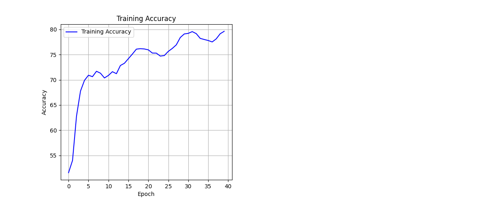
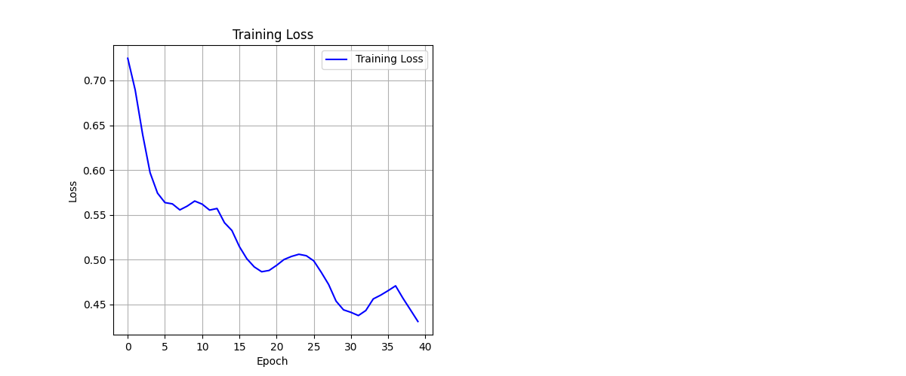
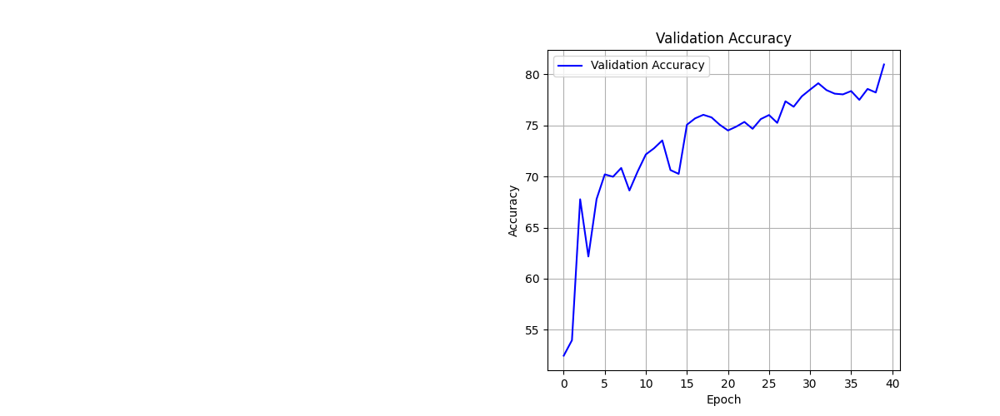

# Classification of Brain Images in the ADNI dataset using the GFNet Vision Transformer
### Benjamin Thatcher/s4784738

## Overview (Classifying Brain Images)
The ADNI dataset contains thousands of human brain images. Some of them are from people who have Alzheimer's disease (AD) and some are from people who don't (normal control, or NC). This project aims to detect whether a patient has Alzheimer's disease or not using image classification techniques. Using the Global Filter Network, or GFNET, I trained a model on the brain images in the ADNI dataset that classifies brain images as Alzheimer's positive or negative.

## How a GFNet Works
The Global Filter Network is a neural architecture that replaces traditional convolutional layers with frequency-domain filters to capture global spatial relationships in images. Instead of relying on local receptive fields like in standard CNNs, the GFNet applies global filters using the fast Fourier transform, enabling it to model long-range dependencies more efficiently. This allows the GFNet to capture both local and global features, making it well suited for tasks where global structure is important, such as image classification.

_See references for more information on GFNet_

## Dependencies
To run this code, the following dependencies must be installed:
-python 3.12.4
-torch 2.4.0
-torchvision 0.19.0
-numpy 1.26.3
-matplotlib 3.9.2
-timm 1.0.9
-pillow 10.2.0

## Installation
The dependencies above can be installed by running:
'''
pip install torch torchvision numpy matplotlib timm pillow
'''

## Directory Structure
'''
recognition/
├── GFNet_s4784738/ 
│   ├── assets/
│   │   ├── GFNet_structure.gif
|   |   ├── training_accuracy.png
|   |   ├── training_loss.png
|   |   ├── validation_accuracy.png
|   |   └── validation_loss.png
│   ├── dataset.py
│   ├── modules.py
│   ├── predict.py
│   ├── train.py
│   ├── utils.py
│   └── README.md 
└── README.md
'''
Note that the /train/ and /test/ image folders (whose paths are specified in utils.py) should have /AD/ and /NC/ subfolders containing Alzheimers and normal control brain images, repectively.
'''
├── train/
|   ├── AD/
|   └── NC/
└── test/
    ├── AD/
    └── NC/
'''

## Data Pre-processing
### Training and Validation Images

### Testing Images

The images in the ADNI dataset are pre-processed in dataset.py. This process involves resizing them to 224x224 pixels, converting them to 3-chanel greyscale, and normalizing them. The training and validation splits recieve additional augmentations to help the model learn their features. These augmentations include random horizontal flips, vertical flips, and rotations.
Images in the train directory of the AD_NC folder where used to construct the training and validation splits, while test directory was the source of the testing split. This ensured that model could not learn the features of the testing data beforehand. The training-validation split I chose was 80-20.

## Configuration settings
Before running the code, it's important to ensure that you have the desired configuration settings. The model configurations are stored and retreived from utils.py. They can also be found below:
''''
here
'''
The image paths are set up to run on UQ's rangpur system by default. If you are running the model anywhere else, please adjust the paths to the training and testing image directories as necessary.
'''
image paths
'''

## Running the Code
### Training the Model
The model can be trained by running
'''
python train.py
'''
This will also run one epoch of inference on all images in the /test/ folder.
Model parameters and image sources can be changed as desired in utils.py.

### Predicting the Classification of an Image
You can run inference on an image by running
'''
python predict.py
'''
You can change the default image in utils.py.

## Plots

Training Accuracy of the Model

Training Loss of the Model

Validation Accuracy of the Model

Validation Loss of the Model

## Reproducability
To make the training reproducible, it is possible to set a seed at the start of the training loop. This could be done as follows:

## References
- Rao, Y., Zhao, W., Zhu, Z., Lu, J., and Zhou, J. (2021). Global filter networks for image classification. Advances in neural information processing systems.
- Original GFNet Code: [GFnet code on Github](https://github.com/raoyongming/GFNet)
