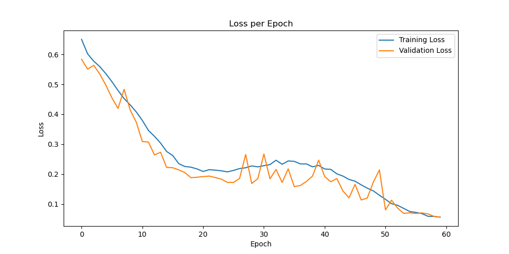

# Alzheimer's Disease Detection with Global Filter Network

## Description

This project implements a **Global Filter Network (GFNet)** to detect Alzheimer's Disease (AD) from brain MRI scans. Alzheimer's Disease is a progressive neurodegenerative disorder that affects memory and cognitive function. Early and accurate detection is crucial for effective management and treatment. The GFNet leverages advanced neural network architectures to analyze and classify MRI images into two categories: Alzheimer's Disease (AD) and Normal Control (NC). By automating the detection process, this algorithm aims to assist medical professionals in diagnosing AD with higher accuracy and efficiency.

## How It Works

The algorithm processes brain MRI images through a series of preprocessing steps, including cropping the brain region and resizing the images to a uniform size of 210x210 pixels. These processed images are then fed into the Global Filter Network, a transformer-based model enhanced with spectral filtering modules to capture long-range dependencies in the data. The network consists of multiple transformer blocks that perform normalization, spectral filtering, and feed-forward operations. During training, the model learns to differentiate between AD and NC images by minimizing the binary cross-entropy loss. After training, the model can accurately classify unseen MRI scans, providing valuable insights for Alzheimer's Disease diagnosis.

## Dependencies

The project relies on the following dependencies:

- **Python**: 3.8 or higher
- **PyTorch**: 2.0.0
- **torchvision**: 0.15.0
- **numpy**: 1.23.5
- **opencv-python**: 4.7.0
- **Pillow**: 9.3.0
- **scikit-learn**: 1.2.2
- **matplotlib**: 3.7.2
- **timm**: 0.6.12
- **tqdm**: 4.65.0

*Note: Ensure that CUDA is properly installed if you intend to use GPU acceleration.*

## Reproducibility

To ensure reproducibility of results, a fixed random seed is set across all relevant libraries (`numpy`, `torch`, and `random`). Additionally, CUDA deterministic behavior is enforced by setting `torch.backends.cudnn.deterministic = True` and `torch.backends.cudnn.benchmark = False`.

## Example Usage

### Training the Model

To train the Global Filter Network, execute the `train.py` script:

This script will preprocess the data, train the model for a specified number of epochs, and save the best-performing model based on validation accuracy.
### Training Output Example
PS C:\Users\macke\OneDrive\Desktop\COMP3710 A3\Working Code> & C:/Users/macke/anaconda3/python.exe "c:/Users/macke/OneDrive/Desktop/COMP3710 A3/Working Code/train.py"
100%|██████████████████████████████████████████████████████████████████████████████████████████████████████████████████████████████████████████████████████████████████████████████████████████████| 304/304 [02:12<00:00,  2.30it/s]
100%|████████████████████████████████████████████████████████████████████████████████████████████████████████████████████████████████████████████████████████████████████████████████████████████| 33/33 [01:00<00:00,  1.85s/it]
Epoch [1/60]
Train Loss: 0.6503, Train Accuracy: 61.91%
Val Loss: 0.5838, Val Accuracy: 67.88%
...
Epoch [60/60]
Train Loss: 0.0565, Train Accuracy: 97.84%
Val Loss: 0.0564, Val Accuracy: 98.15%
Training complete.
Loss plot saved to c:\Users\macke\OneDrive\Desktop\COMP3710 A3\Working Code\logs/GFNet\loss_plot.png

### Making Predictions
After training, use the predict.py script to evaluate the model on the test dataset:
python predict.py
This script will load the trained model, perform inference on the test set, and output metrics such as accuracy, precision, recall, and F1 score. It also provides an interactive prompt to inspect individual patient predictions.

### Prediction Output Example
model.load_state_dict(torch.load(model_path, map_location=device))
Testing: 100%|███████████████████████████████████████████████████████████████████████████████████████████████████████████████████████████████████████████████████████████████████████████████████| 15/15 [00:50<00:00,  3.34s/it]

Confusion Matrix:
TN      FP
216     11
FN      TP
78      145
Precision: 0.93
Recall: 0.65
F1 Score: 0.77
Test Accuracy: 80.22%

Enter the index of the test patient (0 to 449) or 'exit' to quit: 1

Patient Index: 1
Predicted Label: 0
Actual Label: 1

...
Enter the index of the test patient (0 to 449) or 'exit' to quit: exit
Exiting the program.

## Data Preprocessing
### Preprocessing Steps
Cropping: The brain region is isolated from the background using Otsu's thresholding to create a binary mask. This ensures that only relevant brain tissues are analyzed.
Resizing: Cropped images are resized to 210x210 pixels using Lanczos interpolation to maintain image quality.
Padding: Images are padded with black pixels to achieve uniform dimensions, facilitating batch processing.
Normalization: Pixel values are normalized to have zero mean and unit variance, enhancing model convergence during training.
Training, Validation, and Testing Splits
Training Set: 90% of the dataset is used for training the model. This large proportion allows the network to learn comprehensive features from the data.
Validation Set: 10% of the dataset serves as a validation set to monitor the model's performance and prevent overfitting.
Testing Set: A separate test set is used to evaluate the final model's performance, ensuring unbiased assessment.
The splits are randomized with a fixed seed to maintain consistency across different runs.

### Repository Structure
├── dataset.py

├── model.py

├── train.py

├── predict.py

├── README.md

└── logs
    └── GFNet
    ├── best_gfnet.pt
    └── loss_plot.png
        
dataset.py: Contains custom dataset classes for training and testing.
model.py: Defines the Global Filter Network architecture and its components.
train.py: Script to train the model, including data loading, training loop, and validation.
predict.py: Script to perform inference on the test set and evaluate model performance.
logs/GFNet/: Directory where the trained model and loss plots are saved.

## Acknowledgements
The ADNI dataset was used for this project.
Inspired by Global Filter Networks for Image Classification which can be found at https://arxiv.org/abs/2107.00645

