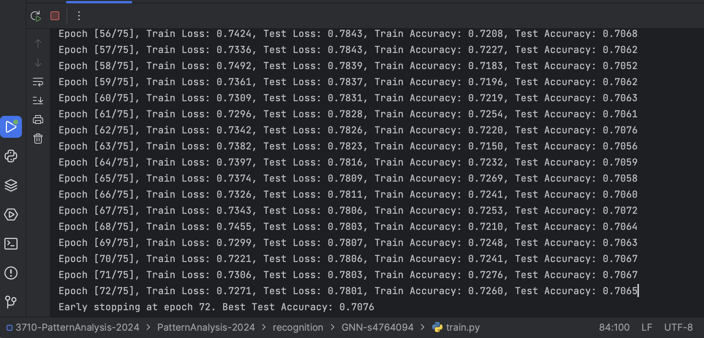
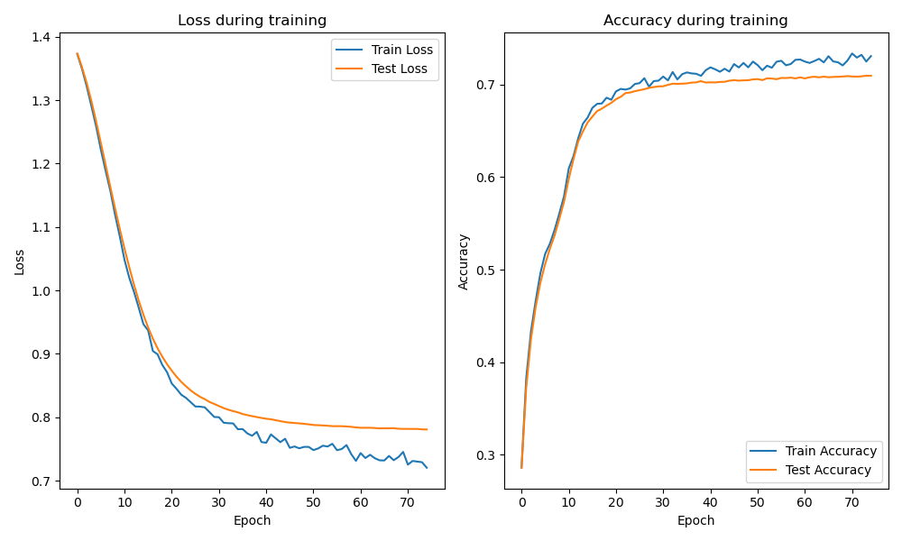
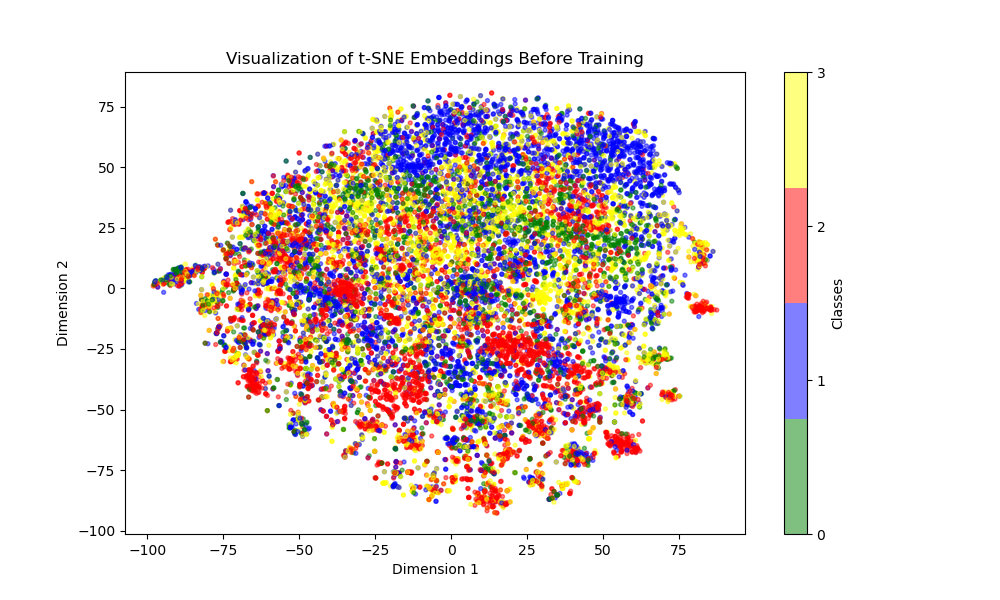
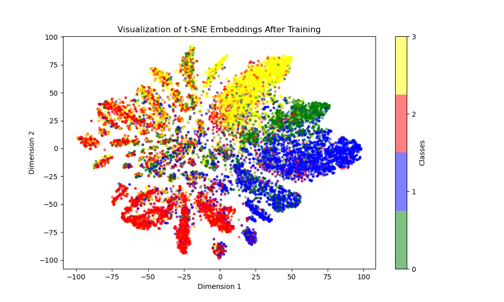

# Report of Graph Neural Network Model (GCN)

## 1. Description

This project implements a semi-supervised classification algorithm based on a Graph Convolutional Network (GCN) that 
uses node features and neighboring information to classify the nodes. It aims to solve the multi-class node 
classification problem in the Facebook Large Page-Page Network dataset, which has four categories. We will use a 
[Partially Processed Dataset](https://graphmining.ai/datasets/ptg/facebook.npz) with 128-dimensional vectors in this project.

## 2. Dependencies

This project will use several dependencies as follows:

```
Python 3.8+
PyTorch 1.8+
torch-geometric 2.0.3+
matplotlib 3.4.3
scikit-learn 0.24.2
numpy 1.21.2
```

## 3. Data Upload and Preprocess

Our dataset was uploaded from [Partially Processed Dataset](https://graphmining.ai/datasets/ptg/facebook.npz) "facebook_large/facebook.npz", 
it contains 22470 data points, with 171002 node edges, 128 various 
features and 4 different target categories. We converted them into the tensor format at first, for our further 
trainings. 

```
tensor_edges = torch.tensor(facebook_data['edges'].T).to(device)
tensor_targets = torch.tensor(facebook_data['target']).to(device)
tensor_features = torch.tensor(facebook_data['features']).to(device)
```

Standardization was also applied to the tensor features 
([sklearn.preprocessing](https://scikit-learn.org/dev/modules/generated/sklearn.preprocessing.StandardScaler.html) 
used in this case)，with a mean of 0 and a standard deviation of 1, to accelerate model convergence and prevent the 
influence of features with different scales.

```
from sklearn.preprocessing import StandardScaler

scaler = StandardScaler()
tensor_features_cpu = tensor_features.cpu().numpy()
normalized_features = scaler.fit_transform(tensor_features_cpu)
tensor_features = torch.tensor(normalized_features, dtype=torch.float32).to(device)
```

For our further training and testing, we split the [Facebook Dataset](https://graphmining.ai/datasets/ptg/facebook.npz)
into 70% for training the model and 30% for testing the performance. Considering the large scale of the original 
dataset, the given data points are sufficient for the model. It prevents model overfitting which can occur with small 
datasets while also minimizing the impact of extreme outlier data points on our prediction results.

Features and targets will be stored in the TensorDataset, and we would directly use it
in the training step:

```
train_set = TensorDataset(train_features, train_targets)
test_set = TensorDataset(test_features, test_targets)
```

## 4. Train the Model
This project utilized external GCN model 
[torch_geometric.nn.conv.GCNConv](https://pytorch-geometric.readthedocs.io/en/latest/generated/torch_geometric.nn.conv.GCNConv.html). 
The main purpose of the GCN model is to learn node embeddings by gathering information from a node and its neighbors. 
The graph convolution updates each node’s features through message passing, allowing the node's representation to include 
its neighborhood’s structure and features. By inputting 128 features into the GCN, we obtained the output predictions 
for four classes.

For the training process, we've set the epoch of 75 with the learning rate of 0.0005. The loss and accuracy for both 
training and test set will be displayed during each epoch. According to the screenshot for the process, as below, We got
the best final test accuracy of approximate 0.7076 at 72/75 Epoch, and the model training process was early stopped.



The learning curves for both sets are as follows, with relevant losses and accuracies:



## 5. Predict and Visualization


We implemented [t-SNE Embeddings](https://www.datacamp.com/tutorial/introduction-t-sne.) to visualize the 
performance of the GCN model, since it is a dimensionality reduction technique used to translate high-dimensional data into a 
lower 2D space. This t-SNE calculates the similarity in high-dimensional space using a Gaussian distribution, where similar points 
have a higher probability of being neighbors. In lower space, it uses a t-distribution to handle larger 
distances and the overcrowded. By minimising the KL divergence, which measures the difference in similarities between 
the two spaces, the final mapping is obtained.

Before and after the model was trained, we projected and displayed its performance. We could observe from the pre-training 
figure as below, that our model was unable to correctly classify the test set points because it was not properly trained.




As the training process finished, we found that the test accuracy improved significantly, with 70% accuracy on the test
set. Based on the TSNE plot after training, most data points were correctly classified into their relevant targets. 
The data structure presented a multi-leaf shape, and the data seemed to be separated into several clusters.



## 6. Conclusion

As a conclusion, although my project met the basic requirements for the classification task, there are areas in the code 
that could be further improved. I tested different combinations of hyperparameters and adjusted the complexity of the 
GCN model to improve performance, but in most cases, the test accuracy only reached at 71%. When I successfully 
increased the training accuracy, the model overfitting also occurred. As shown in the final t-SNE plot, the 
boundaries between different data classes remain unclear, with a considerable number of data points misclassified.

## 7. Reference

* https://scikit-learn.org/dev/modules/generated/sklearn.preprocessing.StandardScaler.html
* https://pytorch-geometric.readthedocs.io/en/latest/generated/torch_geometric.nn.conv.GCNConv.html
* https://www.datacamp.com/tutorial/introduction-t-sne.