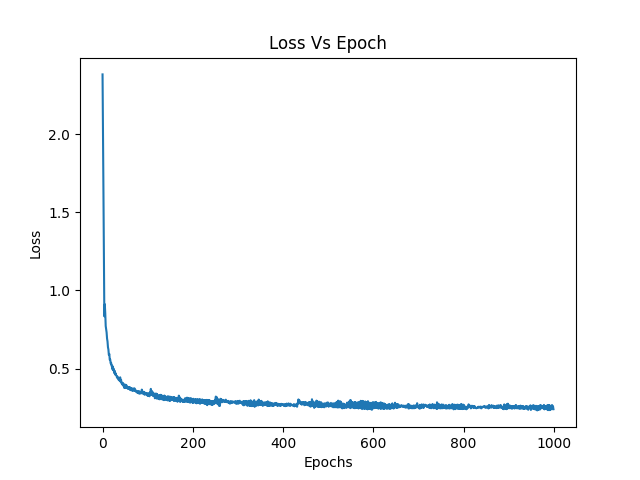
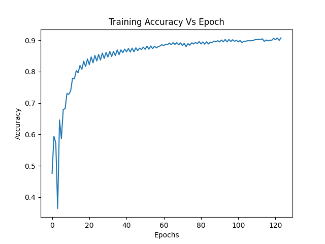
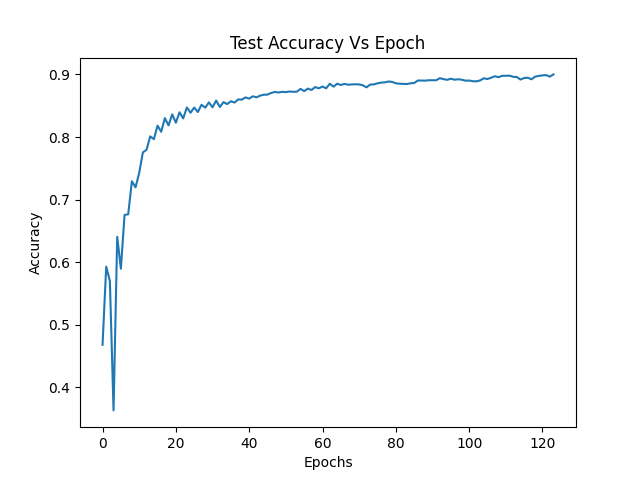
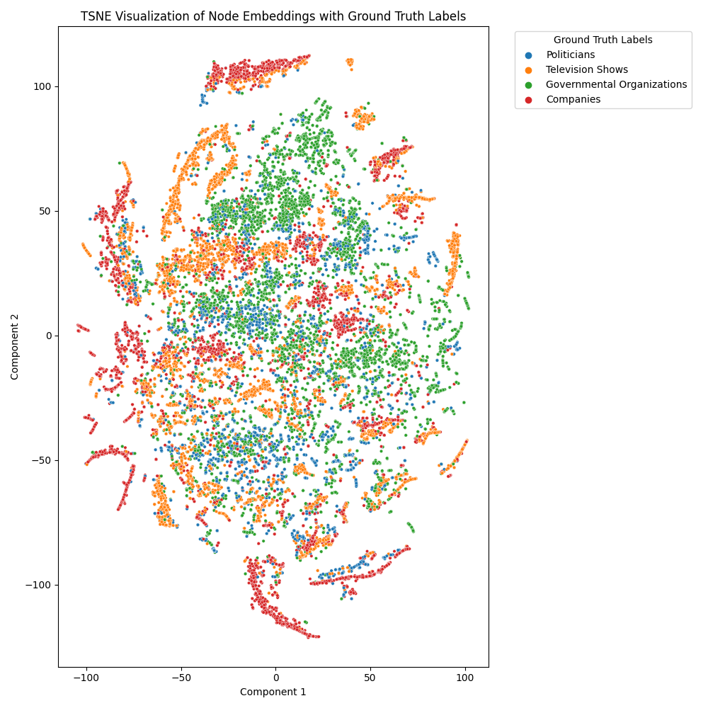
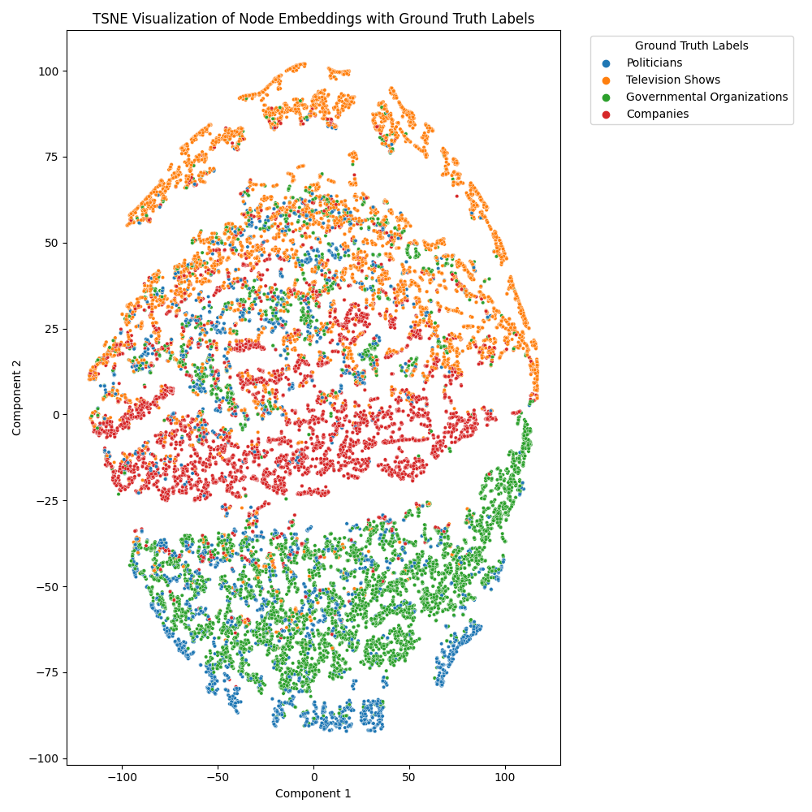
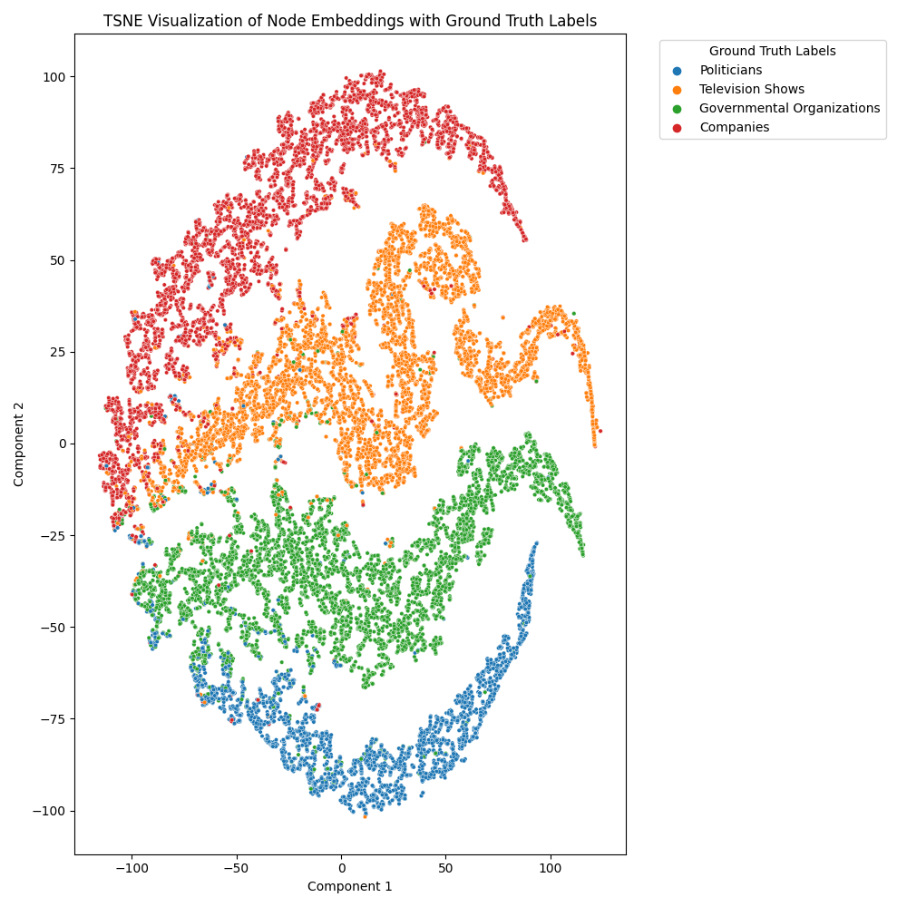

# Pattern Recognition: GNN
### Nicholas Chay 46980801

# Aim
The aim of this project is to create a suitable multi-layer graph neural network (GNN) model to carry out a semi supervised multi-class node classification using Facebook Large Page-Page Network dataset with reasonable accuracy. After a model that can achieve sufficient accuracy is trained, a t-Distributed Stochastic Neighbor Embedding (t-SNE) should be created in order to effectively visualize the results. Should the model meet the requirements, this visualization should display different classes grouped in distinct clusterings to demonstrate how well the model captures features in its embeddings.

The Facebook Large Page-Page Network dataset provided by Stanford University is a graph consisting of nodes and edges. There are no edge weightings and each node contains a label from 0 - 3 describing 4 different site catagories being politicians, governmental organizations, television shows and companies. When importing graph data, it is important to note than storing the graph as an adjacency matrix can be extremely costly as it is mostly sparse. Thus, this implementation requires a partially processed dataset where only the edges are given and not a full adjacency matrix (specific preprocessing described below in dataset.py section). The exact relationship between nodes is described by dataset compiler Luka Leskovec as 'Nodes represent official Facebook pages while the links are mutual likes between sites. Node features are extracted from the site descriptions that the page owners created to summarize the purpose of the site'. It is expected that mutual likes between pages correspond to similar page catagories, hence given unlabeled nodes, a trained GNN should be able to accurately predict what category a page belongs to given its mutual likes. 

The specific GNN chosen for classifying this dataset is a Graph Convolutional Network (GCN). The advantage of a GCN (Particularly for a large dataset like this) is that it it allows the traditional application of a grid-like convolution on an irregular graph like structure in order to extract and learn deep features in the data. The method uses a sliding kernel similar to a CNN, however instead of aggregating pixel information it aggregates neighbor information, where each node updates its representation by aggregating the features of its neighboring nodes, thus learning a nodes embedding to capture both the node's features and its local graph structure. The specific architecture and choices chosen for this GCN is described below in the modules.py section. Training was done using the traditional minimization of loss and gradient descent, with specific hyperparameters and justification described in the train.pt section. Upon backpropagating to find an appropriate minima for the current iteration, the model weights that describe node embeddings based of features and local graph structure are updated. Once trained, new inputs can be run through the model to generate an accurate prediction of a class label based on the connectivity of the new nodes. 
# Files
The project features four files that contribute the key functionality of the model. That being loading and preprocessing the data, defining the model architecture, training the model and finally generating predictions and visualizing the results. Below the specific functionality is detailed such that users can modify the data input, architecture and hyperparameters to suit their own graph classification problems. 
## Requirements
Requirements to run this project can be found in the requirements.txt file. After installing each version of the specified packages and providing a path to your data in dataset.py the project will run as described. If using the Facebook Large Page-Page dataset, the results should be reproduced nearly perfectly with those discussed in the results section. 

## dataset.py
dataset.py handles the loading and preprocessing of the data. The expected file is a .npz file containing edges, features and targets. The path for my specific graphical data is 'facebook.npz' however this can be updated to the desired location of your data. The preprocessor expects the edges to be an nx2 matrix with the columns describing the two connected nodes. The feature and target matrices should have columns correspond to the number of nodes and each row should be a vector of length 128 describing the label. If the expected npz file is provided, the data is loaded into numpy arrays and split into train test and validate. My chosen split was 70% train, 20% test and 10% validate, however this can be customized. The reason I chose this split was because I believe 70% is sufficient for training, anymore would yield diminishing results, 20% was also sufficient for test, although you could probably use less as the test data was simply deployed during training to ensure the model was generalizing appropriately. Finally, validation was only a small 10% as this data was only used in the predict file to show what accuracy the fully trained model could achieve on unseen data. The corresponding numpy arrays are then processed into masks for loading into the pytorch geometric data object, which is the final preprocessed object that will be used in training. 

## modules.py
modules.py contains the architecture of my GCN. The architecture takes a specified hidden dimension that represent the width of each hidden layer. This parameter can be tuned according to your desired model, I picked 64 for my implementation. The number of layers i chose for the model was 4, I believe this is a good middle ground between generalization and ability to learn complex features, however more hidden layers can be added to adjust to the complexity of your dataset. 

## train.py
In order to train my model my chosen loss function was binary cross entropy, a standard choice for penalizing incorrect class predictions. The chosen optimizer was ADAM, as this optimizer has a dynamic learning rate that prevents the model form getting stuck in local minima assuming the starting learning rate is tuned correctly. My learning rate was set to 0.01 which resulted in suitable steps during gradient descent. The number of epochs I selected was 1000 to guarantee convergence, however this could potentially decrease as the loss plot and training accuracy plots below demonstrate a plateau around 93% accuracy, which occurs around 400 epochs. 

### Loss Vs Epoch

### Train Accuracy Vs Epoch

## predict.py
predict.py runs the validation data through the fully trained model by loading the model weights from the weights.pth file that should generate after running train.py to get a sufficient accuracy measure. At the moment my given model achieves 92.25% accuracy on the validation data, which reflects the test accuracy plot below generated uring training. The predict file then generates the TSNE plots at different stages during training to demonstrate how well the model is able to group nodes with common features together. Where more defined larger clusters indicate a better ability for the model to discern the correct label for each node as the correct nodes are grouped together. The TSNE plot also reduces the dimensionality of the feature space for 2D plotting. A brief interpretation is given for each TSNE plot below in the Results section:

# Results 
### Test Accuracy

Clearly the model is able to achieve sufficient accuracy (>90%) within 400 epochs, then from there the accuracy increases diminishingly in relation to epochs. 

### Initial TSNE

We can see initially when looking at the TSNE plot for an untrained model that our TSNE embeddings are very interlaced, aside from some very small local clusters. It is clear the embeddings fail to separate any of the classes effectively and thus would likely be unable to classify an input node with reasonable accuracy. 

### Partially Trained TSNE

After some initial training is done, (Train accuracy ~65%) we can observe proper clusters starting to form in the TSNE plot of the embeddings. This shows us that the model is beginning to learn the features of the data, i.e. how a given pages likes and connections are likely to inform its label. We see 4 different large clusters forming for each class label, however it is clearer that the 'Politicians' label is still heavily intertwined with the other classes indicating it cannot effectively be discerned yet.

### Fully Trained TSNE

The final TSNE plot is for the fully trained model after 1000 epochs that achieves 92.25% accuracy on the test set. We can clearly see a defined separation of each cluster for each different label. There are also some interesting patterns within each cluster that likely result from different relationships between likes and connections for each topic. For example, companies are more likely to interact with each other and market themselves on social media than governments. Although there are a few outlying points that appear in the wrong cluster, this only appears to be about 1-2% of points. Clearly by this stage in training, the model has learned all the complex features it can from the geometric data, and is hence able to group common nodes together extremely effectively. 

