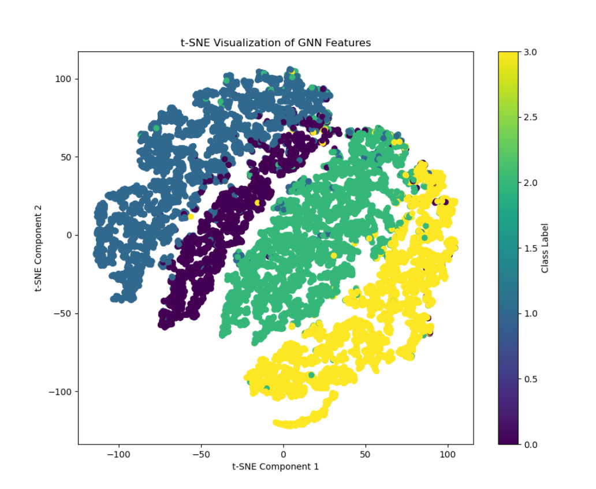

# **Applying Graph Neural Networks for Semi-Supervised Learning on the Facebook Dataset**
## Author
### Xinyue Yuan (Student ID: 48792286)
## Project Overview
#### In this project, we aim to develop a multi-layer Graph Neural Network (GNN) model to perform semi-supervised multi-class node classification using the Facebook Large Page-Page Network dataset. And in my project，I use the GCN.
#### This dataset (https://graphmining.ai/datasets/ptg/facebook.npz)contains nodes representing Facebook pages, with features in the form of 128-dimensional vectors that describe various attributes of each page.
## Environment Dependencies
### This packages/software need to be installed
#### python 3.12
#### numpy 1.26.4
#### matplotlib 3.8.4
#### torch 2.3.1
## Repository Layout
#### dataset.py contains the data loader for loading and preprocessing data
#### modules.py contains the source code of the components of model
#### predict.py contains example usage of  trained model 
#### train.py contains the source code for training
## DataSet
### Data Description
#### Nodes: Each node represents a Facebook page.
#### Edges: An edge between two nodes indicates a relationship between the corresponding pages, such as mutual likes.
#### Features: Each node is associated with a 128-dimensional feature vector. These features capture properties of the Facebook pages.
#### Target Labels: Each node has a corresponding label that denotes its category. The task is to classify these nodes into one of the given categories.
## Model
#### 
#### Fundamentally, a GCN takes as input a graph together with a set of feature vectors where each node is associated with its own feature vector. The GCN is then composed of a series of graph convolutional layers (to be discussed in the next section) that iteratively transform the feature vectors at each node. The output is then the graph associated with output vectors associated with each node. These output vectors can be (and often are) of different dimension than the input vectors. 
#### When performing classification on the nodes, then these per-node vectors can be treated as the model’s final outputs.Node-level classification, these output vectors could, for example, encode the probabilities that each node is associated with each class.
## Results
### 
### 
## Conclusion
###
## Discussion
### 
## References
#### [1]https://jonathan-hui.medium.com/graph-convolutional-networks-gcn-pooling-839184205692
#### [2]Z. Wu, S. Pan, F. Chen, G. Long, C. Zhang, and P. S. Yu, "A comprehensive survey on graph neural networks," IEEE Transactions on Neural Networks and Learning Systems, vol. 32, no. 1, pp. 4-24, Jan. 2021, doi: 10.1109/TNNLS.2020.2978386.
