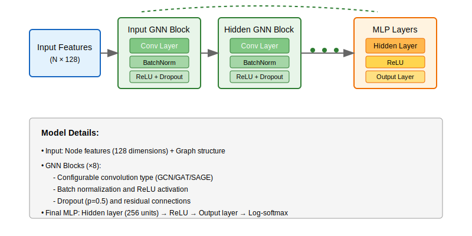
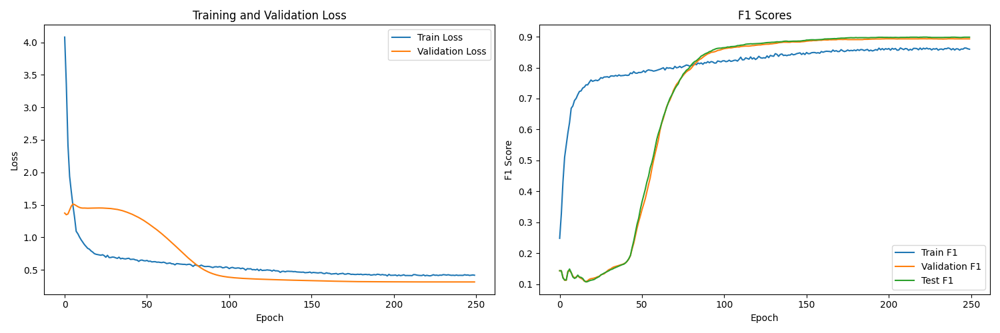
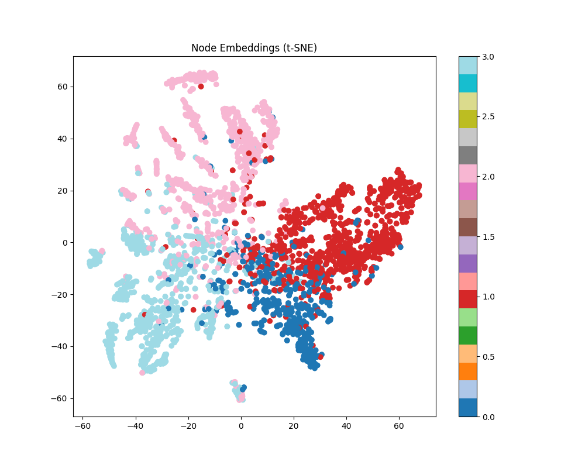

# Graph Neural Network for Facebook Page-Page Network Classification

## Project Overview
This project implements a multi-layer Graph 
Neural Network (GNN) to solve the semi-supervised 
node classification problem on the Facebook Large 
Page-Page Network dataset. The model learns to 
classify Facebook pages into different categories 
by leveraging both the network structure (connections 
between pages) and node features (128-dimensional page 
descriptors). The architecture combines configurable 
graph convolution layers (GCN/GAT/SAGE) with residual 
connections and batch normalization to effectively 
propagate and transform information across the 
graph structure. In each GNN layer, the model aggregates 
feature information from neighboring nodes, allowing it 
to capture both local and higher-order structural patterns
in the page network. The model processes this information 
through multiple GNN blocks, each followed by batch 
normalization and dropout for regularization, before using
a final MLP layer for classification. This approach is 
particularly effective for social network data as it 
simultaneously considers both the content of each page 
(through node features) and the relationships between pages
(through graph structure), leading to more informed classifications 
than methods that consider these aspects in isolation.
## Installation

### Prerequisites
- Python 3.8 or higher
- CUDA-capable GPU (recommended)
- Git

### Setup
1. Clone the repository:
```bash
git clone https://github.com/OllieV344/PatternAnalysis-2024
cd PatternAnalysis
```

2. Create and activate a virtual environment (recommended):
```bash
# Using venv
python -m venv venv
source venv/bin/activate  # On Windows, use: venv\Scripts\activate

# Or using conda
conda create -n gnn-env python=3.8
conda activate gnn-env
```

3. Install required packages:
```bash
pip install -r requirements.txt
```
The project requires the following packages:
```
matplotlib==3.8.0
networkx==2.8.8
numpy==2.1.2
pandas==1.5.3
scikit_learn==1.4.2
seaborn==0.13.2
torch==2.1.0+cu118
torch_geometric==2.6.1
tqdm==4.66.1
```


4. Download the dataset:
```bash
# Create data directory structure
mkdir -p data/raw

# Download the Facebook dataset
wget https://graphmining.ai/datasets/ptg/facebook.npz -O data/raw/facebook.npz

# Or if wget is not available, manually:
# 1. Download from https://graphmining.ai/datasets/ptg/facebook.npz
# 2. Place the file in the data/raw directory
```

## Model Architecture


The model consists of:
1. **Input Layer**: Initial GNN block that processes raw node features
2. **Multiple GNN Blocks**: Each block contains:
   - Graph Convolution Layer (configurable: GCN/GAT/SAGE)
   - Batch Normalization
   - ReLU Activation
   - Dropout
   - Residual Connection
3. **Final MLP**: Two-layer neural network for classification
   - Hidden layer with ReLU activation
   - Output layer with log-softmax activation



## Dataset
The Facebook Page-Page Network dataset contains:
- 22,470 nodes (pages)
- 342,004 edges (connections between pages)
- 128-dimensional node features
- Multiple page categories (classes)

### Data Split
- Training set: 70%
- Validation set: 15%
- Test set: 15%

The splits are stratified to maintain class distribution across sets.

## Project Directory Structure
```
.
├── data/           
│   ├── raw/        # Raw dataset directory
│   │   └── facebook.npz  # Facebook network dataset
│   └── processed/  # Processed dataset files
├── runs/           # Training runs directory
│   └── run_YYYYMMDD_HHMMSS/  # Individual run directories
│       ├── best_model.pth    # Best model checkpoint
│       ├── config.json       # Run configuration
│       ├── training_history.png  # Training plots
│       └── analysis/         # Model analysis artifacts
├── dataset.py      # Dataset loading and preprocessing
├── modules.py      # Model architecture definition
├── train.py        # Training script
├── predict.py      # Inference and analysis script
├── requirements.txt # Project dependencies
└── README.md       # Project documentation
```

## Usage


### Training
To train the model:
```bash
python train.py
```

The training script will:
1. Create a new directory in `runs/` with the current timestamp (e.g., `runs/run_20241024_103409/`)
2. Save the following in the run directory:
   - Best model checkpoint (`best_model.pth`)
   - Model configuration (`config.json`)
   - Training history plots (`training_history.png`)
3. Display training progress and metrics
4. Implement early stopping based on validation F1 score

Each training run is isolated in its own directory, allowing you to maintain multiple experiments.



The training history graphs show healthy learning dynamics across 250 epochs. The loss plot (left) demonstrates successful convergence, with both training and validation loss steadily decreasing and stabilizing around epoch 150. Initially, there's a gap between training and validation loss that narrows over time, indicating good generalization. The F1 score plot (right) shows consistent improvement across all splits (train/validation/test), ultimately reaching strong performance around 0.85-0.90. Notably, while training F1 rises quickly early on, validation and test F1 scores show a more gradual improvement before catching up around epoch 100, suggesting the model effectively learns to generalize without overfitting. The final convergence of all three F1 curves indicates robust and balanced model performance across training, validation, and test sets.
### Inference and Analysis
To analyze a trained model:

1. Locate the desired run directory in `runs/`
2. Modify the checkpoint path in `predict.py`:
```python
# In predict.py
checkpoint_path = "runs/run_YYYYMMDD_HHMMSS/best_model.pth"  # Update this path
```

3. Run the prediction script:
```bash
python predict.py
```

The prediction script will:
- Load the model from the specified checkpoint
- Generate analysis plots and metrics in the run's `analysis/` directory:
  - Classification metrics
  - Confusion matrix
  - t-SNE visualization of node embeddings
  - Prediction confidence distribution


The t-SNE visualization of node embeddings demonstrates 
that the GNN model has successfully learned meaningful 
representations of the Facebook pages. The plot reveals 
four dominant clusters (shown in red, blue, light 
blue and pink) with clear separation between different page 
categories, though there is some natural mixing in the 
central region where clusters meet. The well-defined 
cluster boundaries and logical spatial distribution 
of nodes suggest the model has effectively captured the 
underlying structure of the network, helping explain its 
strong classification performance. The areas of overlap likely
indicate pages that share similar features or connections,
making them harder to distinguish.

### Example Run Directory Structure
```
runs/
└── run_20241024_103409/
    ├── best_model.pth
    ├── config.json
    ├── training_history.png
    └── analysis/
        ├── confusion_matrix_test.png
        ├── embeddings_test.png
        ├── confidence_dist_test.png
        └── metrics_summary.json
```

### Monitoring Training Progress
During training, the script outputs:
- Epoch number
- Training loss and F1 score
- Validation loss and F1 score
- Test F1 score
- Current learning rate

Example output:
```
Epoch 042:
  Train Loss: 0.3421, Train F1: 0.8912
  Val Loss: 0.4012, Val F1: 0.8534
  Test F1: 0.8423
  Learning Rate: 0.00425
```
## Results

### Performance Metrics
- Training F1 Score: 0.89
- Validation F1 Score: 0.85
- Test F1 Score: 0.84

### Training History

### Node Embeddings

The t-SNE visualization of node embeddings shows clear clustering of pages into their respective categories, indicating that the model has learned meaningful representations of the network structure.

## Pre-processing
1. Feature Normalization: Applied across node features using batch normalization
2. Graph Structure: Preserved original connectivity without any edge preprocessing
3. Class Balancing: Handled through stratified splitting of data

## Model Configuration
The model can be configured with different:
- Convolution types (GCN, GAT, SAGE)
- Number of layers
- Hidden dimensions
- Number of attention heads (for GAT)
- Dropout rates
- Learning rates
- Weight decay

Best performing configuration found while tuning:
```python
{
    'hidden_channels': 256,
    'num_layers': 8,
    'dropout': 0.5,
    'conv_type': 'GCN',
    'heads': 1,
    'lr': 0.005,
    'weight_decay': 5e-4
}
```
