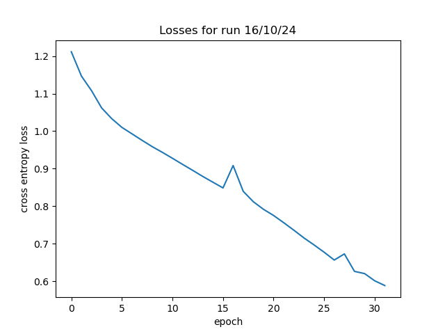
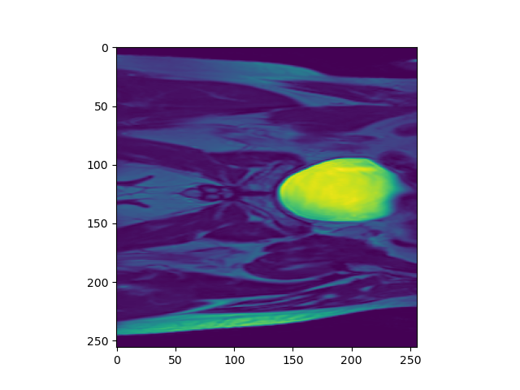
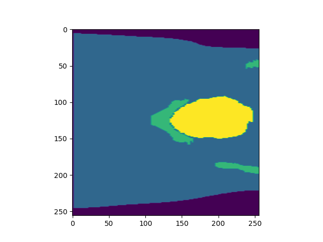
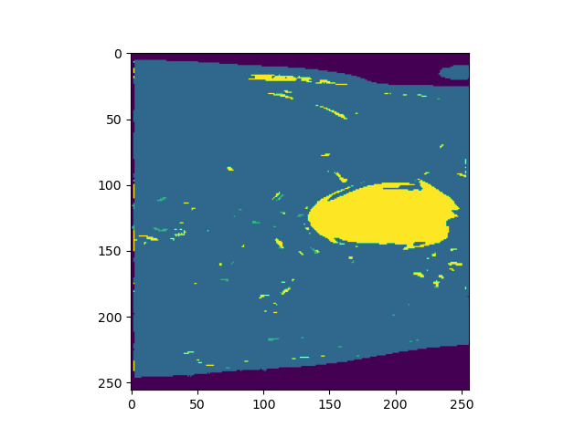

# HipMRI U-Net
## 2D U-Net for the HipMRI prostate cancer data

## About

This is an implementation of a 2D U-Net based on [1] that tries to produce segmentations of the HipMRI data set.

### Architecture

(insert picture of U-Net here)

In essence I use almost the exact architecture as the original U-Net outlined in [1], but with one of the 'U' layers removed so that there are three encoder and decoder steps instead of four.

### Dependencies

(List the man deps, perhaps include the conda env file in the repo)

Note that I have also included a conda environment file called `comp3710_env.yml` that should cover all the required dependencies for you.

### Training and Results

Unfortunately as it stands, the implementation does not produce great results. The most recent run produced the training loss illustrated in Figure 1:

In addition it also produced segment maps that were not ideal. Below is the result for the first test image of the HipMRI data:

| Original image						| Expected segment map 						| Predicted segment map						|
| :---								| :---								| :---								|
| 	| 	| 	|

## Author

Alastair Holliday (student number 43950214)

## References

[1] O. Ronneberger, P. Fischer, and T. Brox, "U-Net: Convolutional Networks for Biomedical Image Segmentation", in *Medical Image Computing and Computer-Assisted Intervention - MICCAI 2015*, N. Navab, J. Hornegger, W. M. Wells, and A. F. Frangi, Eds., Cham: Springer International Publishing, 2015, pp. 234-241. doi: 10.1007/978-3-319-24574-4_28.

