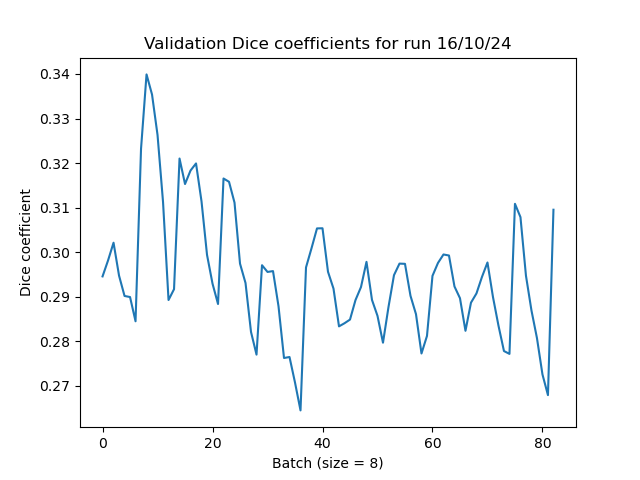

# HipMRI U-Net
## 2D U-Net for the HipMRI prostate cancer data

## About

This is an implementation of a 2D U-Net based on [1] that tries to produce segmentations of the HipMRI data set.

### Architecture and Implementation

![U-Net. Source: \[1\] ](./report_assets/u-net-architecture.png)

(Talk more about the architecture in [1])

The U-Net architecture as described in [1] is as follows. First there is an encoder, or contracting path [1], that consists of blocks of two 3x3 convolutions (unpadded in [1]) with ReLU activation followed by a 2x2 max pooling layer with stride of 2 to downsample, which has the effect of doubling the number of feature channels [1]. Then there is a decoder, or expanding path [1], which does the reverse of the encoder. It also consists of blocks of two 3x3 convolutions (also unpadded in [1]) with ReLU activation, however instead of a max pool these are followed by a 2x2 up-convolution (also with a stride of two, though Ronneberger et. al. [1] do not explicitly mention this). The inputs to the decoder blocks are the output of the previous block concatenated with the output of the corresponding encoder block [1]; these are the "skip connections" and these are necessary to retain spatial information that is otherwise lost in encoding [1]. The final layer is a 1x1 convolution to ouptut the final segment map [1]. 
 
In essence I use almost the exact architecture as the original U-Net outlined in [1], but with one of the 'U' layers removed so that there are three encoder and decoder steps instead of four. This was due to the fact that the sizes of the images used in this problem are too small for the original architecture; it encoded to a tiny latent space of 8x8 pixels.

Another difference between my final model and the original U-Net [1] is that while the original had different input and output sizes (572x572 vs 388x388) my model has a consistent input and output size (an input of 256x256 pixel images, and an output of 256x256 pixel segment maps). This is mainly due to the fact that the original used unpadded convolutions [1] whereas I use a padding size of one. This is more consistent with examples seen in [2], [3], [4]. 

This was not the only U-Net architecture considered. An alternative from [2] was also looked at:

![Alternative U-Net, Source: \[2\]](./report_assets/alt_unet.PNG)

The only real difference between this and [1] is that this has 25% spatial dropout layers and batch normalization. It is currently unknown if this would actually improve performance for the HipMRI task, however.

### Dependencies

The main dependencies for this project are:

- PyTorch 2.4.0 (for Python 3.12 with cuda 11.8 and cudnn9.0)
- pytorch-cuda 11.8
- torchvision 0.19.0
- Numpy 1.26.4
- NiBabel 5.2.1 (in order to read Nifti images)

Note that I have also included a conda environment file called `comp3710_env.yml`, which was used on the lab computers, that should cover all the required dependencies for you, plus some more. I also have included another environment file called `comp3710_reduced_env.yml`, which is my environment on Rangpur, that effectively only includes the bare essentials. To create a conda environment from a file just use
```
conda env create -f <env_file>
```

### Training and Results

(more results pending)

The HipMRI dataset is already arranged into sizeable training, testing, and validation splits, so the data was used as it was for training, with the only preprocessing step being resizing the images to 256x256 pixels.

Although the current code functions and runs, unfortunately it does not produce great results. The most recent run produced the training loss illustrated in Figure 3, eventually producing a final cross-entropy loss value of around 0.58 over 32 epochs:


And the following dice coefficients:



With an average Dice coefficient over all batches of 0.29 and a max of 0.34. Note that that run did not include calculating the Dice similarity coefficient, because the code to calculate it was not written at that time. These results were obtained by running the prediction code on a pre-trained model loaded from the saved weights from that training run.

In addition it also produced segment maps that were not ideal. Below is the result for the first test image of the HipMRI data:

| Original image						| Expected segment map 							| Predicted segment map							|
| :---								| :---									| :---									|
| 	| 	| 	|

(Note that the code does not extract images as that would blow out my Rangpur disk quota; these were extracted manually by loading up pre-trained model parameters on a lab computer and plotting the results)


Perhaps with more time my implementation would produce more accurate segment maps, however due to pressures from other courses (namely STAT3006: Statistical Learning), there was no time to do so.

## Author

Alastair Holliday (student number 43950214)

## References

[1] O. Ronneberger, P. Fischer, and T. Brox, "U-Net: Convolutional Networks for Biomedical Image Segmentation," in *Medical Image Computing and Computer-Assisted Intervention - MICCAI 2015*, N. Navab, J. Hornegger, W. M. Wells, and A. F. Frangi, Eds., Cham: Springer International Publishing, 2015, pp. 234-241. doi: 10.1007/978-3-319-24574-4_28.

[2] B. Sakboonyara and P. Taeprasartsit, "U-Net and Mean-Shift Histogram for Efficient Liver Segmentation from CT Images," in *2019 11th International Conference on Knowledge and Smart Technology (KST)*, Jan. 2019, pp. 51-56. doi: 10.1109/KST.2019.8687816.

[3] "pytorch_misc/unet_demo.py at master · ptrblck/pytorch_misc," GitHub. Accessed: Oct. 15, 2024. [Online]. Available:
https://github.com/ptrblck/pytorch_misc/blob/master/unet_demo.py

[4] "Image Segmentation U-Net." Accessed: Oct. 15, 2024. [Online]. Available: https://kaggle.com/code/bryanb/image-segmentation-u-net
