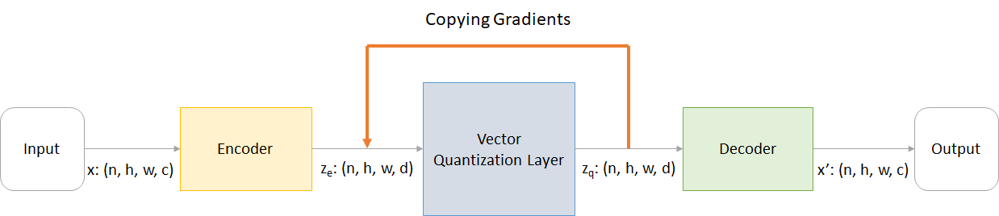
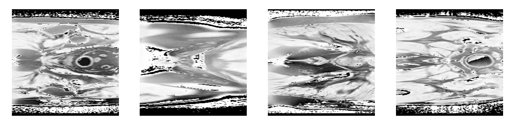
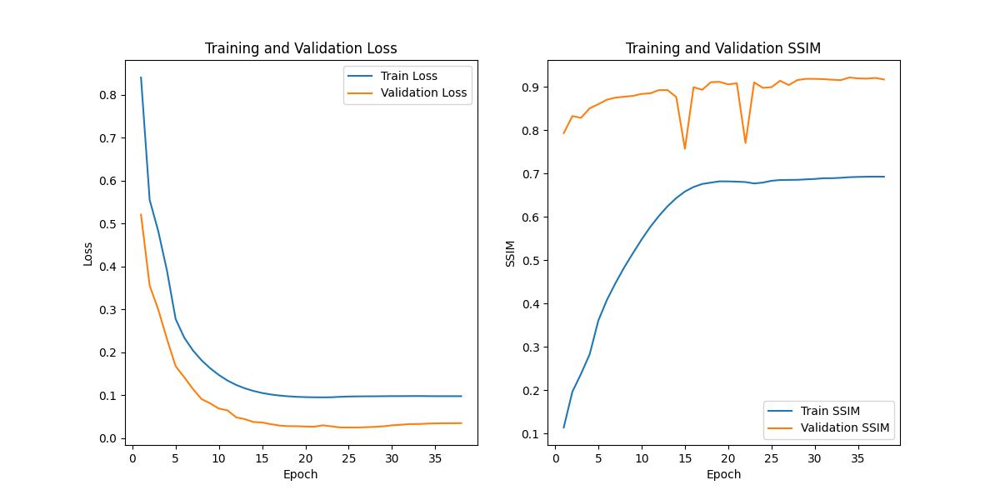
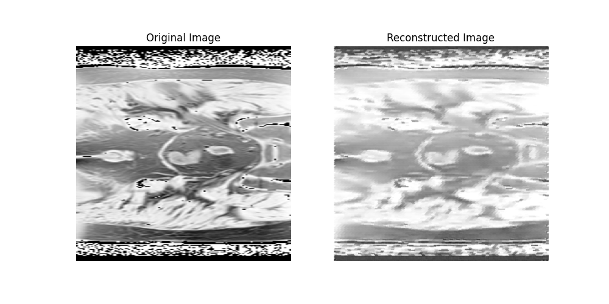
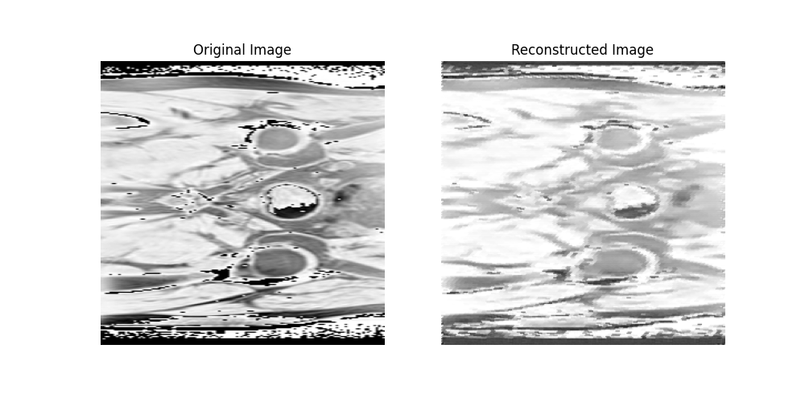
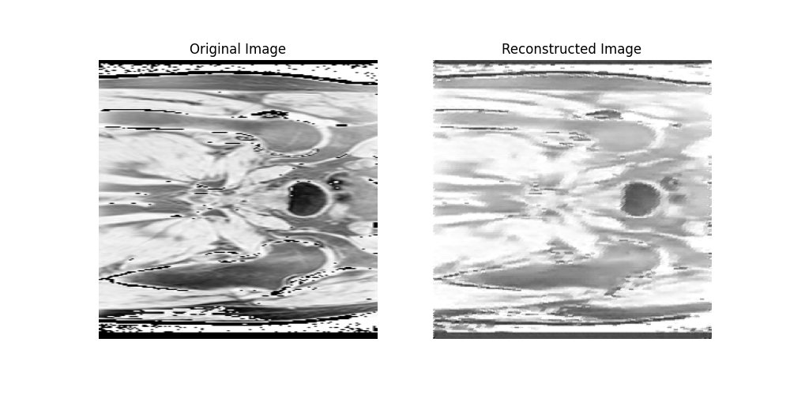
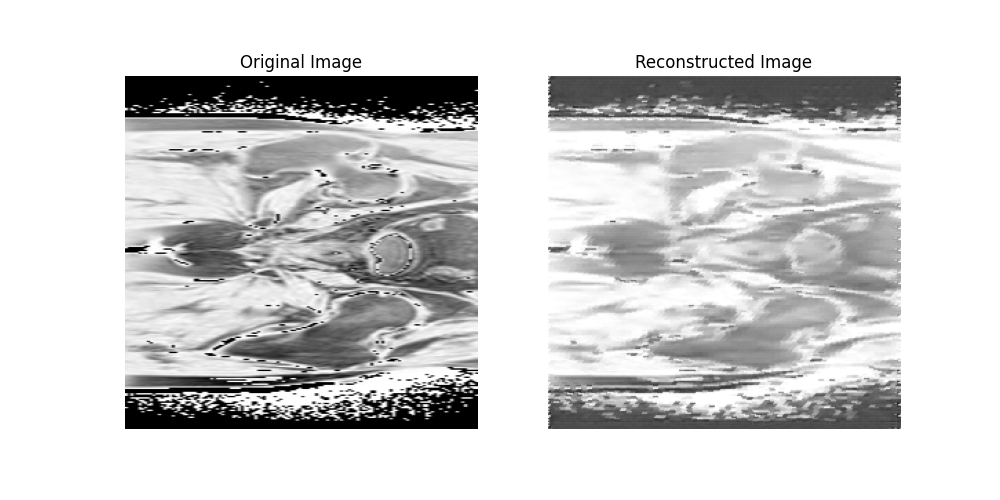

# COMP3710 VQVAE Generative Model for HipMRI Study on Prostate Cancer

## Description

This project implements a generative model based on the Vector Quantised Variational Autoencoder (VQVAE) architecture to synthesize high-quality 2D MRI images from the HipMRI Study on Prostate Cancer. The model is trained on processed 2D slices of MRI images, with the goal of producing images that are visually clear and exhibit a Structured Similarity Index (SSIM) greater than 0.6. This work aims to enhance the understanding of prostate cancer imaging by generating realistic images that could assist in further research and analysis.

## How It Works

The VQVAE architecture consists of an encoder, a quantisation layer, and a decoder. The encoder compresses input images into a lower-dimensional latent space, while the quantisation layer maps the encoded representations to a discrete space of embeddings. The decoder then reconstructs the images from these embeddings. During training, the model optimises the reconstruction loss along with the quantisation loss, ensuring that generated images maintain high fidelity to the original input images.

*Figure: Visualisation of VQVAE steps*

### Dataloader

Before the data is transformed through the module layers, the MRI data is processed to create the DataLoader.
After the device and data directory are defined, the MRI data is transformed. The data is first converted from a numpy array to PIL image, it is then resized to 256x256 image size. This image is then converted to a PyTorch tensor to then be normlised to [-1, 1]. 
This MRI data is then used to create the data loader. In the data loader, the chosen batch size was 32, the chosen number of workers was 4, and the data was shuffled.

*Figure: Visualisation of data batch*

### Encoder

The data loader is then run through the encoder. The encoder is responsible for transforming the input image into a lower-dimensional latent representation, which captures the most important features while discarding unnecessary details. To encode, a few parameters need to be initialised:
- The number of input channels in the images (this is 1 as the image is greyscale)
- The desired number of hidden channels to increase feature representation capacity (128 was chosen)
- The number of channels for the residual layers (32 was chosen)
- The number of residual layers within each ResidualStack (2)
- The factor by which to downscale the input image dimensions (8, 4 and 2) *It must be a power of 2 for compatibility
The model uses a logarithmic function to determine how many convolutional layers will be used to downscale the image dimensions by a chosen factor.

The encoder has three types of layering; downsampling layers, final convolutional layer, and the ResidualStack.
The encoder first builds a sequence of downsampling layers in a loop, where each iteration adds a convolutional layer followed by batch normalisation and a ReLU activation. Each convolutional layer has a kernel size of 4 with stride 2 and padding 1, meaning it reduces the spatial dimensions of the image by half in each step. The number of channels also increases at each step, from the input channels to hidden_channels // 2 for the first layer, and then from there to the full hidden_channels value.
After the downsampling loop, a final convolutional layer with a 3x3 kernel (stride 1, padding 1) is added to further process the compressed feature maps. This layer is followed by a batch normalisation layer to ensure numerical stability and improved convergence.
Finally, the encoder adds a ResidualStack, this is a sequence of residual layers that help preserve detailed information and stabilise training by allowing the model to learn fine-grained features. Residual layers prevent loss of detail, which can occur during downsampling.

### Vector quantiser

After the encoder, the resulting compressed data is run through the vector quantiser module. The module quantises continuous latent representations by mapping them to discrete embeddings. This aids in compressing and reconstructing the input data. The follow parameters are initialised:
- The number of channels in the input (output channels of the encoder)
- The dimensionality of each embedding vector (also the output channel size of this quantiser)
- The total number of embedding entries, determining the size of the embedding space (1024)
- The decay value (0.99)
- The epsilon value (1e-5)
A 1x1 convolutional layer that adjusts input channels to match the embedding dimension is created, followed by buffers that track the embedding vectors, the size of each cluster, and the accumulative average of the beddings.

Once the initialisation steps are finished, the vector quantiser goes through a few quantisation steps.
The input is transformed and reshaped to isolate the embedding dimension. Each embedding vector’s distance to the input vectors is then computed, where smaller distances indicate closer embeddings.
The embedding with the minimum distance to each input vector is selected. The quantised values are then obtained by selecting embeddings based on minimum distances. One-hot encoding then marks which embedding corresponds to each input vector.
The quantiser performs an exponential moving average update to adjust embedding vectors to better represent the input data distribution. This is done through tracking the usage and average values for each embedding vector. Then the updated values are normalised to prevent embedding collapse and ensure effective quantisation.
The quantisation error is measured as the mean squared difference between quantised output and the transormed data. The quantisation error's contribution to the loss is then also measured. The quantised output is then returned with a gradient-stopping operation to keep it differentiable for backpropagation.

The embedding vectors for specific indices is then retrieved. This forms a discrete latent representation.

### Decoder

Finally, the resulting data is run through the decoder. The decoder is responsible for reconstructing the image from the latent representation produced by the encoder. This process involves progressively upsampling the latent feature map to restore it to the original spatial dimensions while ensuring that essential details are preserved. The decoder needs to initilise its parameters, these parameters are opposite to the encoder's parameters as the decoder and encoder have opposing assignments:
- The number of input channels to the decoder (matching the output channel count from the encoder)
- The channel depth for initial transformations in the decoder, allowing flexibility in representation capacity (128)
- The final output channels (1 for grayscale images)
- The number of channels in each residual layer within the ResidualStack (32)
- The number of residual layers within the ResidualStack, used to retain fine-grained features (2)
- The factor by which the spatial dimensions will be increased back to the original image size (8, 4 and 2) *It must be a power of 2 for compatibility

The decoder starts with a 2-dimensional convolutional layer with a 3x3 kernel, stride 1, and padding 1. This layer is responsible for initial feature extraction and converting the input to the channel depth. A ResidualStack is then added to refine the feature map. This stack allows the decoder to learn detailed features necessary for an accurate reconstruction.
Following the residual stack, the decoder progressively increases spatial dimensions. Each layer in this upsampling loop consists of a transposed 2-dimensional convolutional layer with a 4x4 kernel, stride 2, and padding 1, (doubling the spatial dimensions), and the activation of batch normalisation and rectified linear unit to help maintain numerical stability and add non-linearity.
The loop continues for as many steps as required to ensure the spatial dimensions match the original input size.
After upsampling, a final 2-dimensional convolutional layer with a 3x3 kernel refines the output to the final output channels, ensuring the correct format (e.g. grayscale) for the reconstructed image.
Batch normalisation is then used to stabilize the output.

### VQVAE

All the previosu modules are connected within the VQVAE class. The VQVAE leverages multiple encoder-decoder pairs with vector quantisation to create a rich latent representation.
A list of encoder modules is intialised, where each encoder processes the input data at different resolutions, progressively downscaling it based on the provided scaling rates.
Then, a list of vector quantiser modules is initialised, each corresponding to a level in the architecture. They perform vector quantisation on the outputs of the encoders, mapping them to discrete latent representations.
Finally, a list of decoder modules that reconstruct the original input from the quantised representations is initialised. Each decoder operates at a different level, progressively upsampling the latent representation to match the input size.

Following the initialisation, the input tensor is passed through the list of encoders. Each encoder processes the output of the previous one, resulting in a set of feature maps that capture hierarchical representations. 
The method then loops through each level from high to low resolution.
For each level, it retrieves the corresponding codebook and applies vector quantisation. If there are previously computed code outputs, they are resized to match the current encoder output’s spatial dimensions before concatenation. The quantised codes and the differences between the original and quantised outputs are then recorded.
All code outputs are then resized to match the highest resolution to prepare for reconstruction.
The concatenated quantised outputs are then passed through the first decoder, which then reconstructs the input data to be outputted.

### Training

The train_vqvae function is used to train the VQVAE model. It takes several parameters:
- The number of epochs to train for (38)
- The batch size of images to process at once (32)
- The learning rate for updating the model (1e-4)
- The device (GPU acceleration is significantly faster)
The function defines the values for the parameters of each module. It then runs the VQVAE function through the chosen device.

An Adam optimiser is initialized to help adjust the model's parameters during training. The Mean Squared Error (MSE) loss function is also set up, which will be used to measure how well the model reconstructs the input images.
The function constructs paths to the training and validation image directories. It then creates data loaders for both the training and validation datasets. These loaders manage loading and batching the images, making it easier to feed them into the model.

A loop begins to iterate through the specified number of epochs (38). This loop will repeat the training and validation process.
At the start of each epoch, the model is set to training mode, and the variables used to track the total loss and Structural Similarity Index (SSIM) score for that epoch are initialised. Within the epoch loop, another loop goes through the training data in batches. Each batch of images is moved to the device, and any previously computed gradients are then reset. The batch of images is fed into the VQVAE model, which produces reconstructed images based on the input. The loss is computed by comparing the original images with the reconstructed ones using the MSE loss function. This loss indicates how well the model is performing. Additionally, any other differences related to the model's codebook are added to this loss to get the total loss. After calculating the loss, the model's parameters are updated through backpropagation. This involves calculating the gradients and using them to adjust the model's parameters to minimise the loss. The SSIM is calculated for the reconstructed images compared to the original images. SSIM measures the perceptual similarity between the two images, and the score for this batch is added to the total SSIM for the epoch.
Once the training phase for the current epoch is complete, the model is set to evaluation mode to prepare for validating its performance. The model processes validation data in a similar manner as the training data, but without updating the model's parameters. This helps assess how well the model generalizes to new, unseen data. Loss and SSIM scores for the validation data are calculated and accumulated for that epoch.

At the end of each epoch, the average training and validation losses, as well as the SSIM scores, are printed. This provides insight into how the model is performing over time. 
After all epochs are completed, the trained model's weights are saved to a file so that they can be used later for inference or further training. The function then plots the training and validation losses and SSIM scores over the epochs, saving this plot as an image. This helps visualise how the model's performance changes throughout training.

### Prediction

The predict module is used to evaluate the performance of the trained VQVAE model by reconstructing images from the test dataset and calculating a similarity metric between the original and reconstructed images. 

To run the predict module, a VQVAE model is initialised with its specific parameters. The function then loads the weights from a allocated path previously saved by the train module. This allows the model to start in a trained state. The model is then moved to the specified device. Finally, the model is set to evaluation mode using model.eval(), which disables certain layers, like dropout, that are only needed during training.
Data loaders are then called to load images from the image directory into batches of 1 image each without shuffling. The function then checks for the specified output directory and creates it if it doesn’t exist. An empty list is then created to hold SSIM scores for each reconstructed image, which will eventually calculate the average SSIM.
The function then iterates over the test images, stopping only once the specified number of images is reached. Each batch image is moved to the device, and then the model takes the input image and generates a reconstructed version. Both the original and reconstructed images are converted to a NumPy format (required for the SSIM calculation). The function then calculates SSIM and stores the results in the aforementioned list.
Each original and reconstructed image pair is then displayed and saved in the specified output directory. Once all images are processed, the function calculates the average SSIM over the set of images.

## Dependencies

To ensure reproducibility, the project requires the following dependencies:
- Python >= 3.10.11
- torch == 2.4.1
- torchvision == 0.19.1
- nibabel == 5.3.0
- matplotlib == 3.8.4
- scikit-image == 0.24.0
- numpy == 1.26.4

## Results

The final SSIM score for the model was 0.6044.

## Reconstructability

To reproduce the results:
- Alter the repository location of stored data in modules to an accurate alternative.
- Random seeds were fixed across the project by setting TensorFlow's random seed to a 42 using tf.random.set_seed(42).
- You will not be able to run predict.py without having previously run train.py.