# Use of YOLOv11 for Lesion detection in the ISIC2017 dataset 
## 1. Introduction to YOLOv11
The introduction of the You-Only-Look-Once (YOLO) algorithm for image detection was first released in 2016 by Joseph Redmon et al. - since then, numerous other researchers have worked on improving the networks' efficiency and accuracy which eventually led to the release of YOLOv11 by Ultralytics in 2024.

The YOLO architecture is a convolutional neural network that prioritises speed over accuracy by using a single-stage detection process, as opposed to the two-step process utilised by many of the more accurate object detection algorithms.

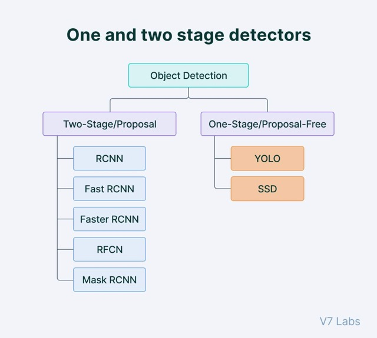
Image source[1].

YOLO's algorithm can be better understood by analysing its architecture:

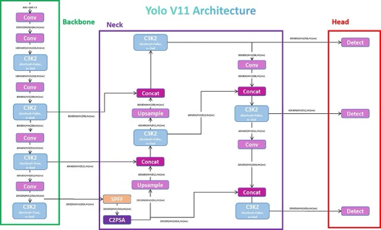
Diagram image source[2].

Essentially, the convolution neural network parses over each pixel in the image and, in one step, tries to fit a bounding box with the pixel as the box's centre. In doing so, the model also outputs a confidence score for the validity of the proposed box. By the end of the single iteration through the image, the model outputs each proposed bounding box with a confidence score above a specific interval (0.25 by default for YOLOv11) as the final detections for the image.

This is in contrast to other two-stage models that split this process into two stages, which generally leads to improved accuracy at the cost of inference and training speed. This makes YOLO (and other one-stage models) ideal for fast-paced environments such as real-time detection or when resources are limited, while the two-stage models are generally preferred when accuracy is priority.

The newest innovation in the YOLO model is Ultralytic's YOLOv11, which is said to perform better and faster than the previous models. Ultralytics is also responsible for the release of every iteration since YOLOv8 in 2023.

## 2. Introduction to lesion segmentation and the ISIC2017 dataset
### 2.1 Lesion segementation
This algorithm aims to provide a fast and accurate form of lesion detection from a single dermoscopic image - in this case, the accuracy of detection and segmentation is paramount, as it would theoretically be used for the medical purposes.

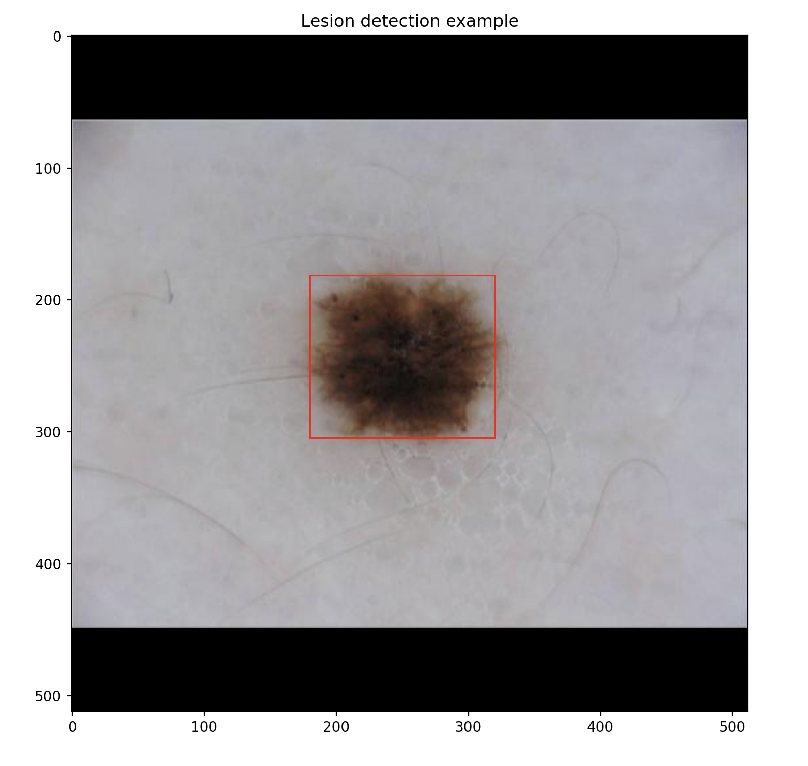

### 2.2 2017 ISIC Challenge
To train the model, a dataset from the 2017 ISIC challenge was used: this includes 
- 2000 training samples
- 200 testing samples
- 150 validation samples
This training validation split was used since it was the one provided by the ISIC challenge, and the approximately 80/10/10 split is seen to be optimal for large scale training. 

Each of the samples contains and image and a ground truth, where the image is a dermoscopic picture in .jpg file of varying sizes, and the ground truth is the corresponding mask in black and white which segments the image. These can be downloaded from the ISIC Challenge datasets website (2017), which is linked in Appendix 1 [3].

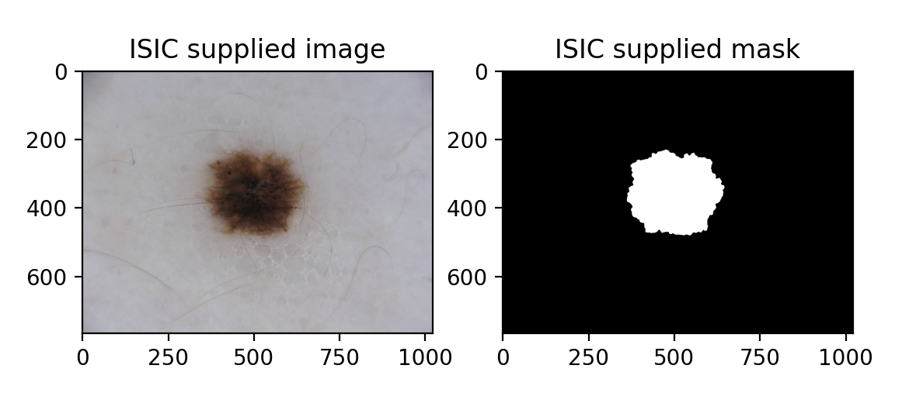

However, these cannot directly be plugged into YOLOv11, as Ultralytics' YOLO models require a specific file format and file structure. Firstly, it requires that all images are of equal and even dimensions. Secondly, all labels must be in the form of a .txt file which contains (for each bounding box identified): its class, centre x-coordinate, centre y-coordinate, width and height.

## 3. Processing dataset for YOLOv11 compatability
### 3.1 Process
As was discussed, the images in the ISIC 2017 dataset are of varying sizes and each have un-even dimensions. To alleviate this problem, each image was extended using a black letter-box on its smaller dimension (between x and y) until the image was a square. This method, while achieving the purpose of even dimensions in the image for YOLOv11 compatibility, ensures no warping occurs (which could hinder the training of the model).

After this point, the image was scaled down to 512x512, which was a picked as it serves as a midpoint between maximising information (larger image=more information=better training) and minimising computation time (larger image=longer training=more resources). This was applied to both the images and the ground truth masks provided by ISIC.

For Ultralytics compatability, the masks also needed their information transferred to a .txt file in the above-mentioned format. This was done by extracting the bounding box around coordinates who's pixel values were not 0 (as lesions are highlighted white and everything else is black in the masks provided). For this task, there is only one class to detect (lesion).

### 3.2 Organisation
This is all implemented in the dataset.py file, but to use this (and Ultralytics' YOLO models), the files must be organised in a specific way:

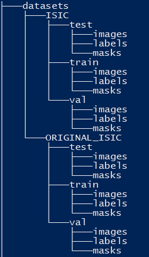

Create folders in the above-specified format in the root directory for the project. From here, save the original ISIC images for the train, test and validation split in their respective **ORIGINAL_ISIC** partition under **images**. Then, save the original ISIC ground truth files into their corresponding **mask** folders (again, in the **ORIGINAL_ISIC** partition). 

### 3.3 dataset.py usage
Simply run the dataset.py to process all images and masks into the required format. The file will re-size all images (from all train/test/val partitions) from the **ORIGINAL_ISIC** folder and save them to the **ISIC** folder, ready for use. It will also create the described .txt files in the **label** folders (for each partition) in the **ISIC** folder. 

Prior to training, create a .yaml file in the **datasets** folder that looks like:

<pre>
# Train/val/test sets as 1) dir: path/to/imgs, 2) file: path/to/imgs.txt, or 3) list: [path/to/imgs1, path/to/imgs2, ..]
path: ./ISIC/ # path to processed dataset from root directory
train: train/images/ # path to training images FROM path
val: val/images/ # path to validation images FROM path
test: test/images/ # path to test images FROM path

# Classes (1 lesion)
nc: 1
names:
    0: lesion
</pre>

modifying any file directories if necessary.

## 4. Training model for lession detection
### 4.1 Running train.py
The train.py file contains three methods: run_train() and run_test(). By default, running the file runs both of them which trains the model (using YOLOv11 as a base) using the supplied data.

The training will create and save the output of the training results (graphs and .csv containing metrics) in a directory named runs/detect/trainX (where X is the train number) in the root directory. The trained model's weights are located within this directory in the weights folder (under best.pt, so runs/detect/trainX/weights/best.pt) - this can then be used to run further inference and testing on the model

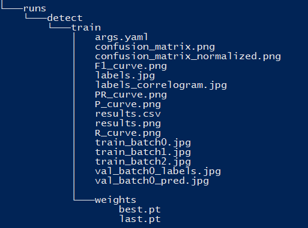

### 4.2 Results from training
The result graphs for training can be seen below:

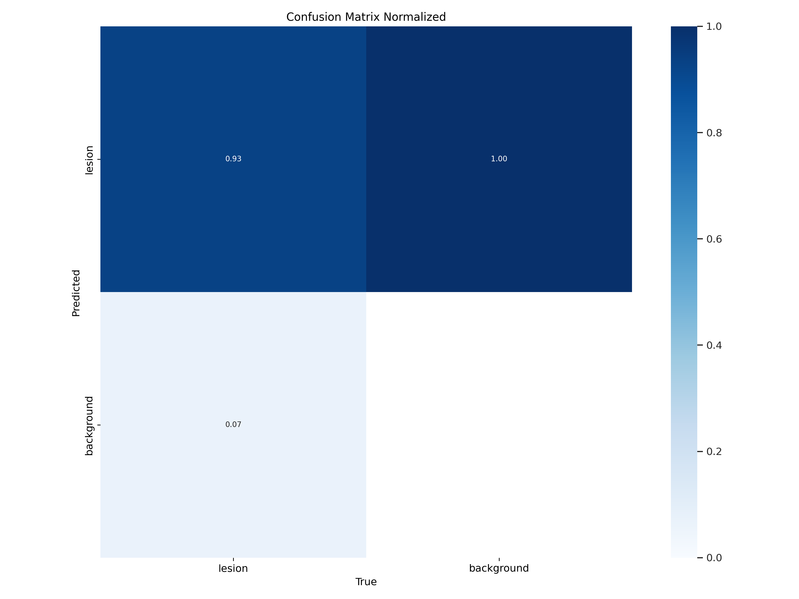
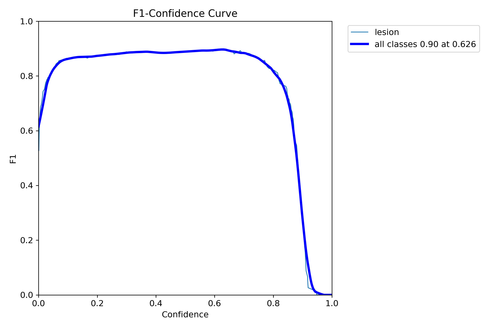
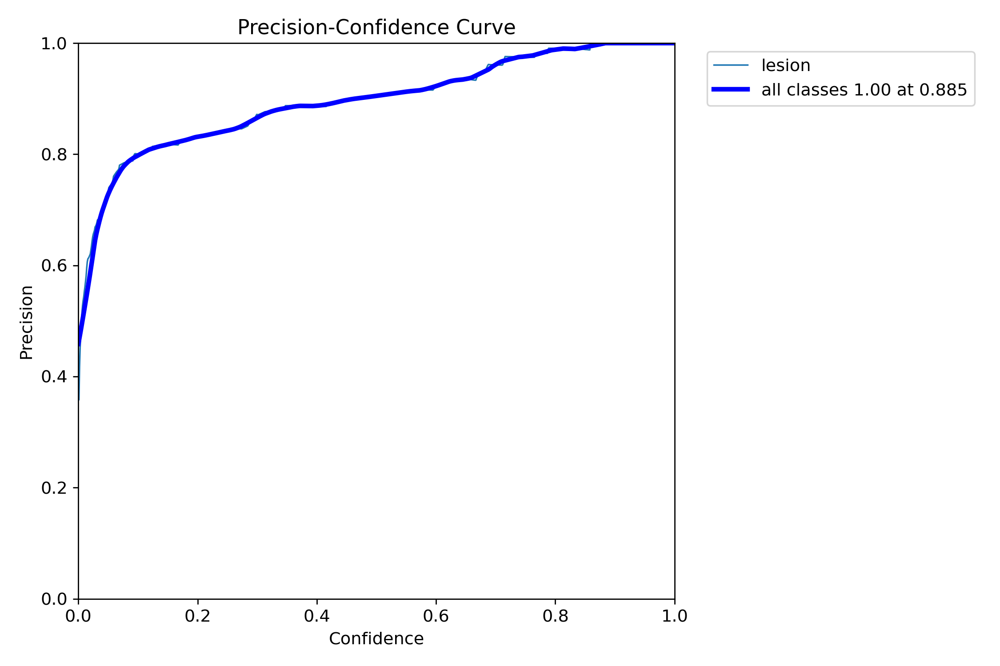
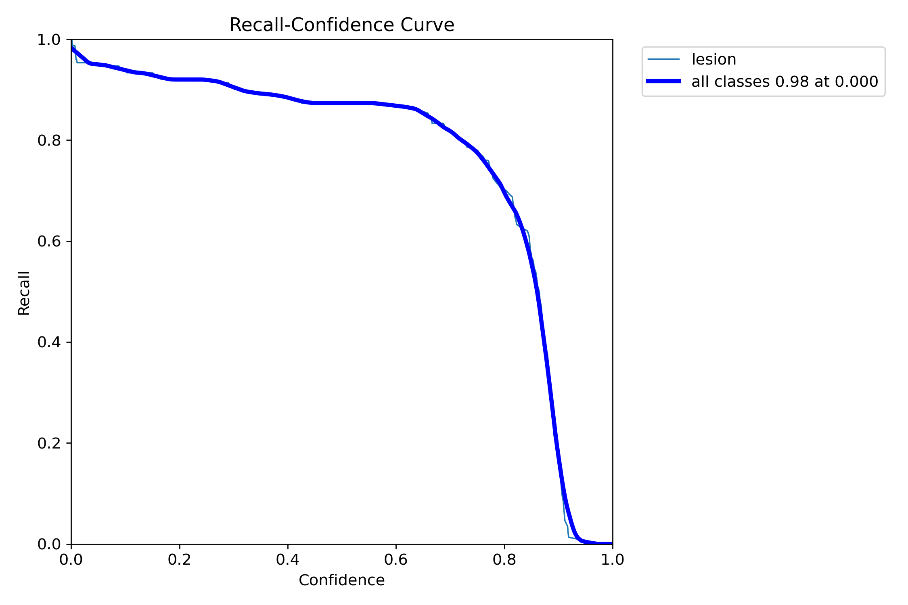
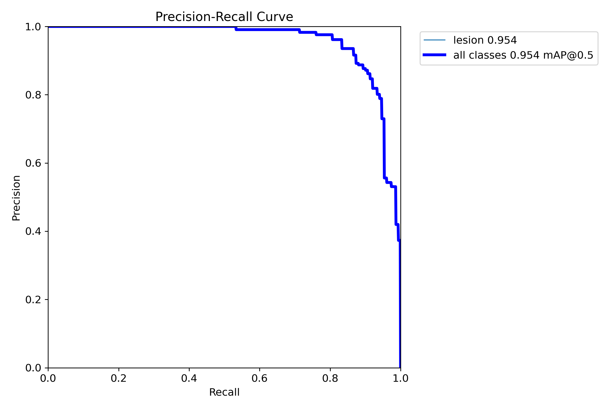
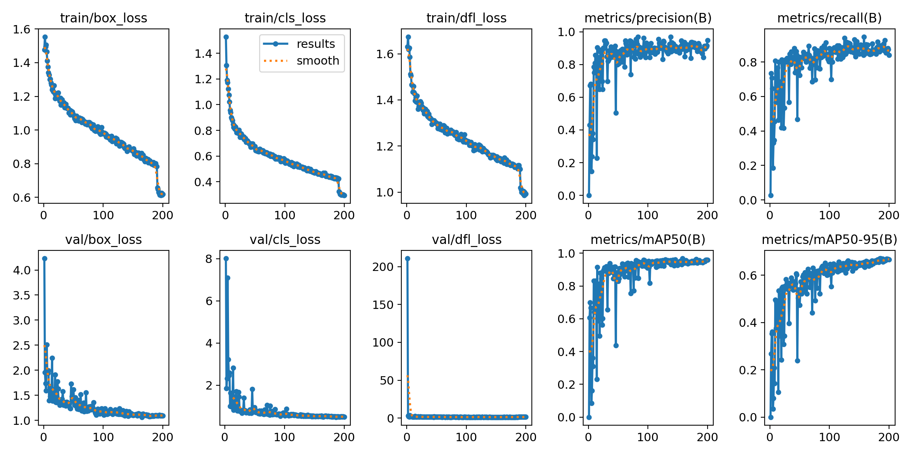

## 5. Testing the trained model
By default, the train.py will train a model and immediately test the newly defined weights. If testing is required on a specific training runs' weights, input the argument run_number=X to test on the X'th training runs weights - if a run_number is not defined, the functionw will take the most recent training run's weights. Also if testing is wanted without training, simply comment out the run_test() function.

By running inference on each image in the dataset, it calculates intersection-over-union score indepenently (metric used to evaluate the allignment of predicted and true bounding boxes) before outputting the average and number of samples with IoU above 0.8.

Using the hyperparameters in the files, the results obtained were:
<pre>
average IoU=0.734695
294 out of 600 samples had IoU>=0.8
</pre>

## 6. Predicting using trained model
predict.py contains a method to visualise inference (example usage) of the trained model. By default, it also runs on the most recent training batch's weights. It plots and displays 9 random samples of the image, the model's predicted lesion and the true lesion from the test set.

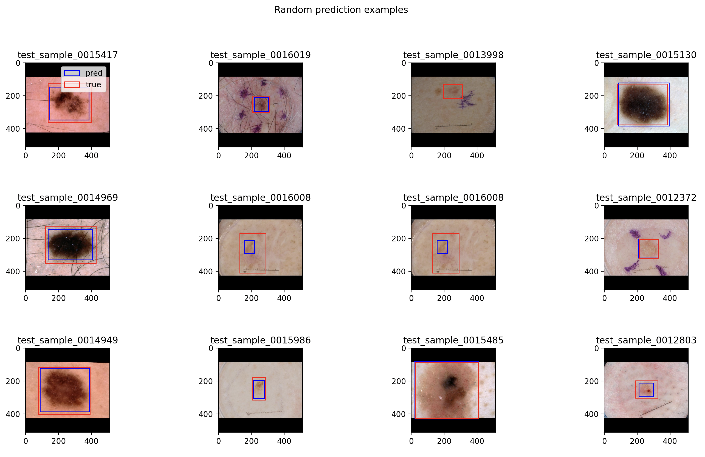

predict.py also has a function to plot a single testcase's image, true lesion bounding box, and resulting bounding box. Below is an example **input** image for the model:
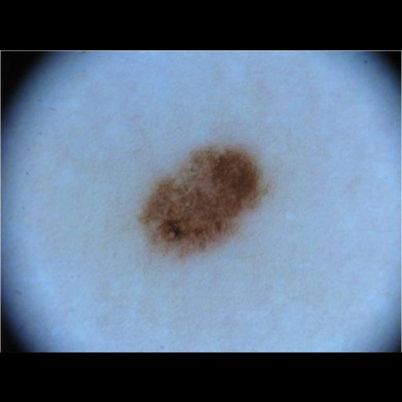

And here is the corresponding example **output** from model prediction:
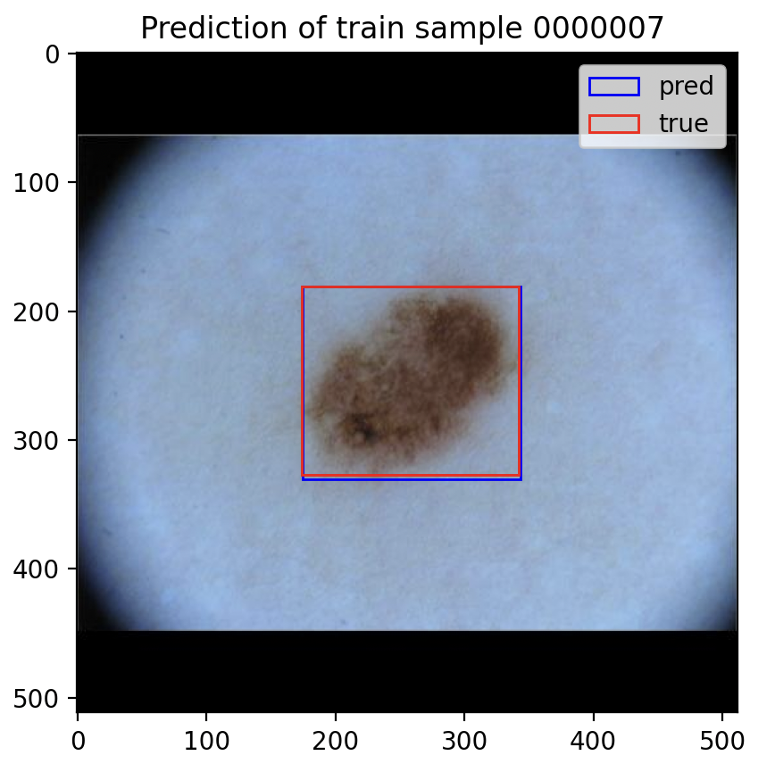

## 8. Appendix
### Appendix 1: ISIC Dataset
[3]: ISIC Challenge dataset (2017), https://challenge.isic-archive.com/data/#2017 

### Appendix 2: Requirements
<pre>
ultralytics==8.3.21
ultralytics-thop==2.0.9
matplotlib==3.7.1
numpy==1.26.4
opencv-python>=4.1.1
pillow==10.4.0
PyYAML==6.0.2
requests==2.32.3
scipy==1.13.1
torch==2.5.0+cu121
torchvision==0.20.0+cu121
tqdm==4.66.5
protobuf==3.20.3
tensorboard==2.17.0
pandas==2.2.2
</pre>

### Appendix 3: References
[1]: YOLO Algorithm for Object Detection Explained, https://www.v7labs.com/blog/yolo-object-detection 
[2]: YOLOv11 Architecture Explained: Next-Level Object Detection with Enhanced Speed and Accuracy, https://medium.com/@nikhil-rao-20/yolov11-explained-next-level-object-detection-with-enhanced-speed-and-accuracy-2dbe2d376f71
