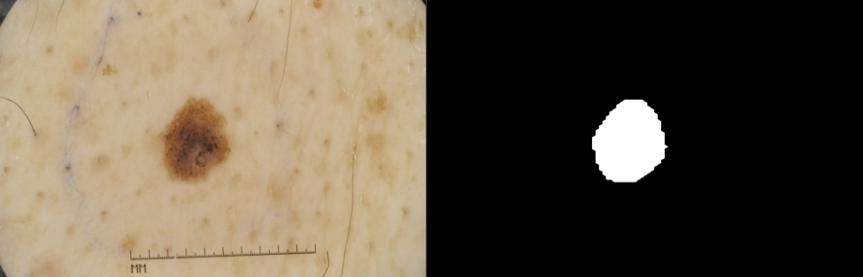
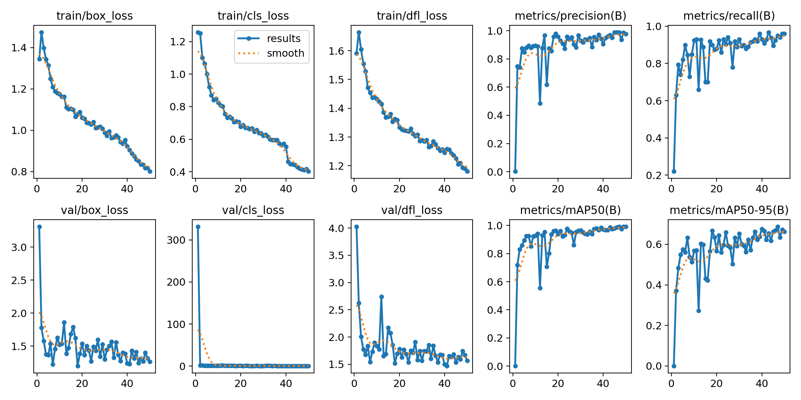
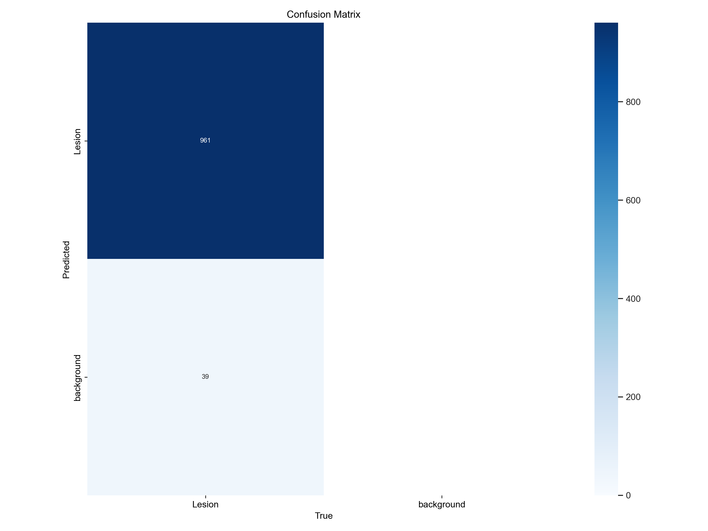
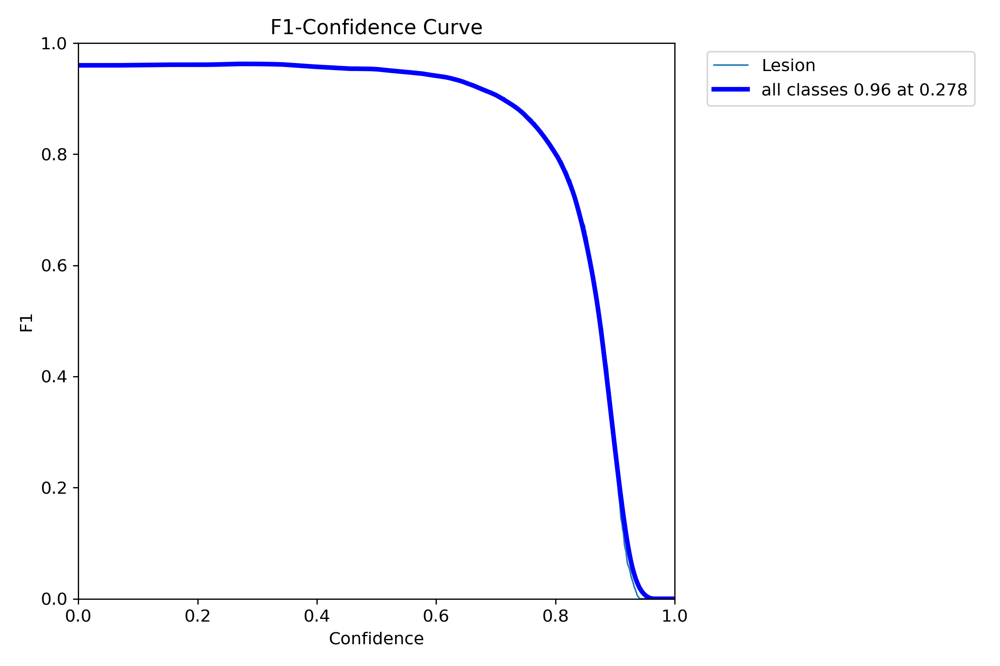
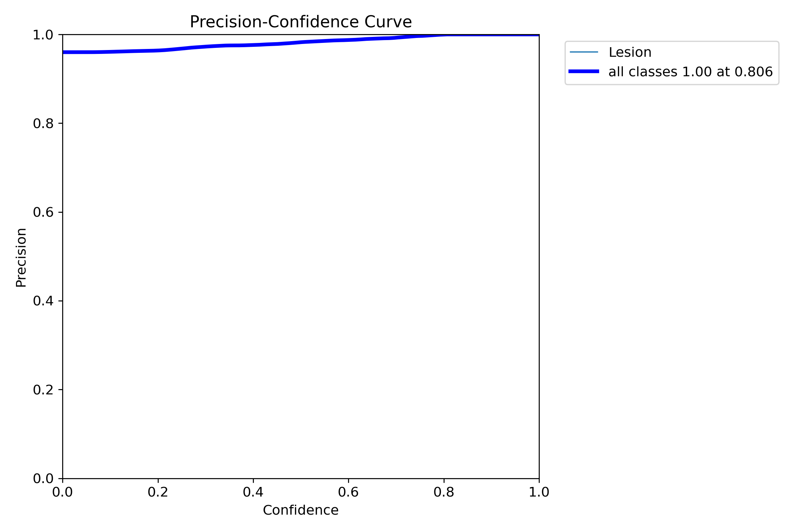
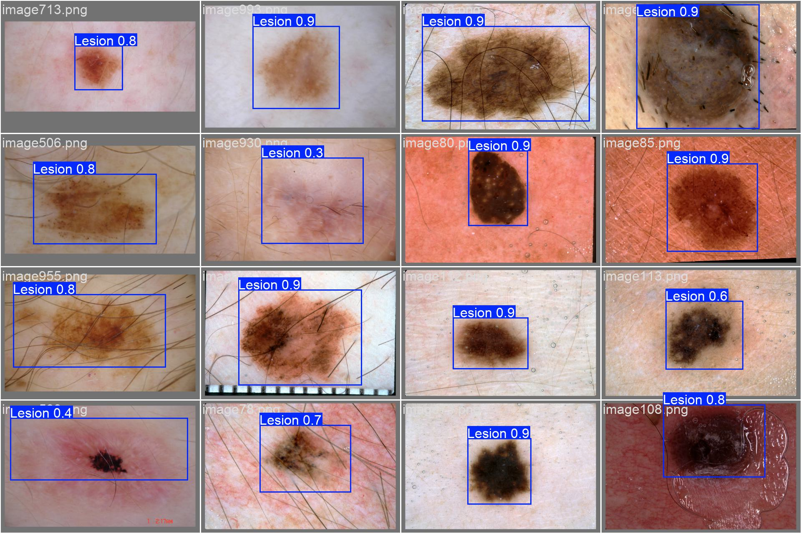
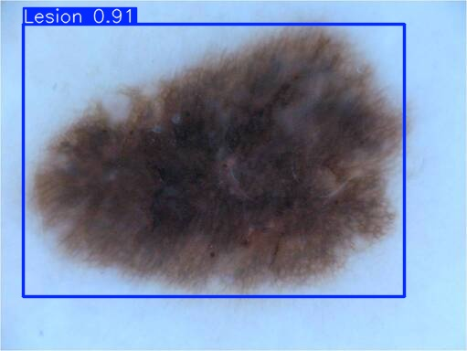

# Lesion Detection in ISIC 2018 using YOLOv11
Student ID: 48022835  
Student Name: Ewan Trafford

## Project Overview
### YOLO Architecture Description and Purpose
The *You-Only-Look-Once* (YOLO) architecture is a real-time object detection algorithm that is known for maximising speed while maintaining accuracy. Unlike traditional object detection methods, YOLO treats object detection as a single regression problem. That is to say, it predicts bounding boxes and class probabilities directly from an entire image in one forward pass through the convolutional neural network.  
Since their emergence in 2015, YOLO models have made massive performance progressions in terms of reliability, accuracy and speed. This has led to their inevitable integration into many modern systems around the world. The problems that YOLO models can solve are wide-ranging, such as real-time object detection for surveillance and autonomous driving.  
The capability of a YOLO model to predict the precise location of multiple objects and classify them across varying environments in ways that few other models can ensures that YOLO models will always serve a purpose and be suited to solve specific problems.

### How YOLO Functions
As briefly discussed above, traditional models employ seperate steps for region proposal and classification, whereas YOLO combines these tasks into a single operation. YOLO mdoel divide any input images into an *n x n* grid where each grid cell is responsible for detecting if any object's centre falls within that cell. For each of these cells, YOLO will predict mutliple bounding boxes, of which only a few will actually be considered based on confidence scores that are also predicted. Alongside these two predictions, YOLO will estimate the probability that the identified object belongs to a certain class.  
The process of filtering predictions is called Non-Maximum Suppression (NMS), which removes low confidence boxes and attempts to suppress redundant boxes that overlap by predicting the same object. YOLO models utilise a loss function that consists of several key components, namely: localisation loss (measures the error in the predicted bounding box compared to the ground truth), confidence loss (measures how certain the model is as a combination of IoU and objectness), and classification loss (measures how accurately the model classifies objects).  
See figures [1] and [2] below that demonstrate the discussed processes and structure.  

[1]  

  

[2]  


### ISIC 2018 Challenge
The Internation skin imaging collaboration (ISIC) challenges are annual competitions aimed at advancing research and development in the field of automated skin lesion analysis using dermoscopic images. The 2018 ISIC Challenge consisted of three distinct challenges, where the first two share a dataset. The first challenge was lesion segmentation, the second was lesion attribute detection, and the third was disease classification. As will be discussed in further detail under the [Project Implementation](#project-implementation) header, the data from this challenge can be utilised, when correctly formatted, and leveraged by a YOLO model.


## Project Implementation
### General
This project aims to use a YOLOv11 network to detect lesions within the 2018 ISIC dataset. The goal is to have a minimum intersection over union of 0.8 on the test set and a suitable classification accuracy. By utilising pre-trained weights, we can train our model very efficiently, fine tuning it to the task of detecting lesions through multiple epochs of standard training.  


  
In order to utilise the scripts in this project, it is essential that all required modules and libraries are installed. The requirements.txt file found in the [appendix](#appendix) outlines required dependencies and their versions.  
Results reproducability may vary. Over several training attempts, the best fined tuned weights all seemed to perform similarly when running inference and comparing metrics. This is indicative that results from training and subsequent predictions or testing should be reliabily synonymous with mine.  
  
To begin implementing my project, ensure all 5 .py files exist in the same directory. The scripts act best under the assumption that all 3 datasets (train, validation, test) are fully installed (raw images and raw ground truth masks).  
Before running anything, you must alter the contents of utils.py to reflect the absolute or relative (from utils.py) file path to each of the 6 data folders (2 for each dataset). Example paths already exist. In the event that you do not want to load all datasets, ensure the directory paths do not exist for the datasets you do not want. Do not give empty folder paths.  
Do note that modules.py does not need to be explicity ran, and is referenced from the other scripts. If wanted, it is recommended that you only run modules.py **after** dataset.py for the sole purpose of installing the small, medium, and large model pre-trained weights.


### Dataset Processing
The data is split into three datasets as above. The training dataset contains 2594 images and segmentation masks, the validation dataset contains 100 of each, and the test dataset contains 1000 of each. The split is structured this way to ensure training is done thoroughly and on the widest range of inputs possible. Validation is a simpler part of the training process and hence requires a smaller dataset. Testing on a large array of samples is required to effectively diagnose the trained model's performance, which accounts for the large test dataset as well.


  
The preprocessing of data for a YOLO model implementation is quite particular. YOLO models require a very specifically formatted data structure to properly train and run inference. The first step is to downscale to 640x640 and normalise the aspect ratio of each image and mask. This ensures quicker training, and image transferring as there are less pixels. The next and most important part is preparing the masks. As we are given segmentation masks for each of the three datasets, but we are training the model for detection, we must process these masks into bounding boxes, then extract from these bounding boxes a 'label' text file which contains the class, centreX, centreY, width, height of each object in the image. Do note that each value is normalised between 0 and 1. See below example where class 0 is indicative of the lesion class (only class to detect):

```
0 0.4146455223880597 0.4691011235955056 0.15951492537313433 0.28651685393258425
```

dataset.py should be the first script to run. It should only be run once the contents of utils.py have been adjusted.
The dataset.py file will create the folder structure and yaml file necessary for the project if they do not already exist. However, feel free to manually create the directories as below:
```
Data ---
    Testing ---
            images ---
            labels ---
    Training ---
            images ---
            labels ---
    Validation ---
            images ---
            labels ---
    lesion_detection.yaml

yolo ---
    (weights)

(scripts)
```
The contents of the lesion_detection.yaml should be as below, and running dataset.py will create a similar one that works for all intents and purposes. It is essential that processed images and labels are correctly delivered to their respective folders for train.py and predict.py to work as intended.
```
# Train/val/test sets as 1) dir: path/to/imgs, 2) file: path/to/imgs.txt, or 3) list: [path/to/imgs1, path/to/imgs2, ..]
path: ../Data # dataset root dir
train: Training/images # train images (relative to 'path')
val: Validation/images # val images (relative to 'path') 
test: Testing/images

# Classes (1 class of lesions)
names:
    0: Lesion
```

To use dataset.py, run on the command line w/ the optional argument -d followed by any up to all of these three: test train val. Any dataset specified after -d will **not** be installed. Example usage:
```
python dataset.py                 # installs all datasets
python dataset.py -d train val    # only installs testing dataset
```
  
The main process of dataset.py is to get the raw images and masks from the specified path in *utils.py*, create all the required directories and files, then transfer the processed images and calculated labels into the created directories they belong. This process can take upwards of 10 minutes depending on the datasets installed and device specifications.


### Training
The process of training, validating, testing and saving a mdoel is all performed in train.py. You can elect to run the whole training process or just evaluate a model, as discussed below. Both Training and Validation datasets are required to run train.py, and to run evaluation in train.py, split = 'test' will have to be changed to split = 'val' if no test set is installed. Once the script has run, regardless of run type, the results, metrics, best weights and validation outcomes will all be saved to a new folder in runs/detect (will be automatically created if it doesn't exist)


To use train.py, run on the command line w/ the required arguments -t followed by either train or eval, and -w followed by the relative path to weights wanted. Example usage:
```
python train.py -t train -w yolo/yolo11m.pt    # recommended if no model is already installed
python train.py -t eval -w yolo/best_tuned.pt  # evaluate and test a trained model
```

The results from training are:





  
A main takeaway here is that the trained model was able to detect the lesion in 961 images out of the test dataset of 1000 images.   
The validation process gave the results (ground truth labels below):
  


(model predictions below)


  

### Predicting
To showcase and further anaylse the performance of a trained model, use predict.py. The option to run inference on the whole test dataset (adjustable in code) to calculate metrics such as average IoU and confidence scores exist, but is particularly resource exhaustive. The option to run inference on a single image which is then subsequently shown and saved also exists, allowing the model to give a prediction on a new image. 

To use predict.py, run on the command line w/ the required arguments -p followed by either testset or image, and -w followed by the relative path to weights wanted. If -p image is given, -img must also be given w/ the path to image. Example usage:
```
python predict.py -p testset -w yolo/best_tuned.pt                                       # run inference on test dataset
python predict.py -p image -img Data/Testing/images/image56.png -w yolo/best_tuned.pt    # run inference on a single image
```

The resultant metrics from predicting on the testset are:
```
Average IoU across all predicted images is: 0.8195305661403173
Average confidence score across all predicted images is: 0.7560070771343854
```
  
Note these metrics are particularly relevant to the task goal.  
An example outcome of running inference on an image is:  


## Appendix
### ISIC Challenge dataset (2018):
https://challenge.isic-archive.com/data/#2018

### Requirements.txt:
```
matplotlib==3.9.2
numpy==1.23.5
opencv_python==4.10.0.84
Pillow==11.0.0
PyYAML==6.0.1
PyYAML==6.0.2
skimage==0.0
torch==2.5.0
torchvision==0.20.0
ultralytics==8.3.18
```

### Ultralytics: 
https://docs.ultralytics.com/models/yolo11/

### Figures and Plots:
image [1]: https://www.dlology.com/blog/gentle-guide-on-how-yolo-object-localization-works-with-keras-part-2/

image [2]: https://medium.com/@nikhil-rao-20/yolov11-explained-next-level-object-detection-with-enhanced-speed-and-accuracy-2dbe2d376f71

