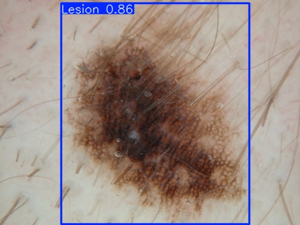

# Lesion Detection in ISIC 2018 using YOLOv11
Student ID: 48022835  
Student Name: Ewan Trafford

## Project Overview
### YOLO Architecture Description and Purpose
The *You-Only-Look-Once* (YOLO) architecture is a real-time object detection algorithm that is known for maximising speed while maintaining accuracy. Unlike traditional object detection methods, YOLO treats object detection as a single regression problem. That is to say, it predicts bounding boxes and class probabilities directly from an entire image in one forward pass through the convolutional neural network.  
Since their emergence in 2015, YOLO models have made massive performance progressions in terms of reliability, accuracy and speed. This has led to their inevitable integration into many modern systems around the world. The problems that YOLO models can solve are wide-ranging, such as real-time object detection for surveillance and autonomous driving.  
The capability of a YOLO model to predict the precise location of multiple objects and classify them across varying environments in ways that few other models can ensures that YOLO models will always serve a purpose and be suited to solve specific problems.

### How YOLO Functions
As briefly discussed above, traditional models employ seperate steps for region proposal and classification, whereas YOLO combines these tasks into a single operation. YOLO mdoel divide any input images into an *n x n* grid where each grid cell is responsible for detecting if any object's centre falls within that cell. For each of these cells, YOLO will predict mutliple bounding boxes, of which only a few will actually be considered based on confidence scores that are also predicted. Alongside these two predictions, YOLO will estimate the probability that the identified object belongs to a certain class.  
The process of filtering predictions is called Non-Maximum Suppression (NMS), which removes low confidence boxes and attempts to suppress redundant boxes that overlap by predicting the same object. YOLO models utilise a loss function that consists of several key components, namely: localisation loss (measures the error in the predicted bounding box compared to the ground truth), confidence loss (measures how certain the model is as a combination of IoU and objectness), and classification loss (measures how accurately the model classifies objects).  
See figures [1] and [2] below that demonstrate the discussed processes and structure.  

[1]  

  

[2]  


### ISIC 2018 Challenge
The Internation skin imaging collaboration (ISIC) challenges are annual competitions aimed at advancing research and development in the field of automated skin lesion analysis using dermoscopic images. The 2018 ISIC Challenge consisted of three distinct challenges, where the first two share a dataset. The first challenge was lesion segmentation, the second was lesion attribute detection, and the third was disease classification. As will be discussed in further detail under the [Project Implementation](#project-implementation) header, the data from this challenge can be utilised, when correctly formatted, and leveraged by a YOLO model.


## Project Implementation
### General
This project aims to use a YOLOv11 network to detect lesions within the 2018 ISIC dataset. The goal is to have a minimum intersection over union of 0.8 on the test set and a suitable classification accuracy. By utilising pre-trained weights, we can train our model very efficiently, fine tuning it to the task of detecting lesions through multiple epochs of standard training.  


  
In order to utilise the scripts in this project, it is essential that all required modules and libraries are installed. The requirements.txt file found in the [appendix](#appendix) outlines required dependencies and their versions.  
Results reproducability may vary. Over several training attempts, the best fined tuned weights all seemed to perform similarly when running inference and comparing metrics. This is indicative that results from training and subsequent predictions or testing should be reliabily synonymous with mine.  
  
To begin implementing my project, ensure all 5 .py files exist in the same directory. The scripts act best under the assumption that all 3 datasets (train, validation, test) are fully installed (raw images and raw ground truth masks).  
Before running anything, you must alter the contents of utils.py to reflect the absolute or relative (from utils.py) file path to each of the 6 data folders (2 for each dataset). Example paths already exist. In the event that you do not want to load all datasets, ensure the directory paths do not exist for the datasets you do not want. Do not give empty folder paths.  
Do note that modules.py does not need to be explicity ran, and is referenced from the other scripts. If wanted, it is recommended that you only run modules.py **after** dataset.py for the sole purpose of installing the small, medium, and large model pre-trained weights.


### Dataset Processing
The
Talk about dataset.py. Talk about preprocessing, talk about data split.

### Training
Talk about train.py. Talk about plots, metrics, results.

### Predicting
Talk about predict.py. Talk about results, inference, etc.

## Appendix
### ISIC Challenge dataset (2018):

### Requirements.txt:
```
matplotlib==3.9.2
numpy==1.23.5
opencv_python==4.10.0.84
Pillow==11.0.0
PyYAML==6.0.1
PyYAML==6.0.2
skimage==0.0
torch==2.5.0
torchvision==0.20.0
ultralytics==8.3.18
```

### Ultralytics: 

### Figures and Plots:
image [1]: https://www.dlology.com/blog/gentle-guide-on-how-yolo-object-localization-works-with-keras-part-2/

image [2]: https://medium.com/@nikhil-rao-20/yolov11-explained-next-level-object-detection-with-enhanced-speed-and-accuracy-2dbe2d376f71

