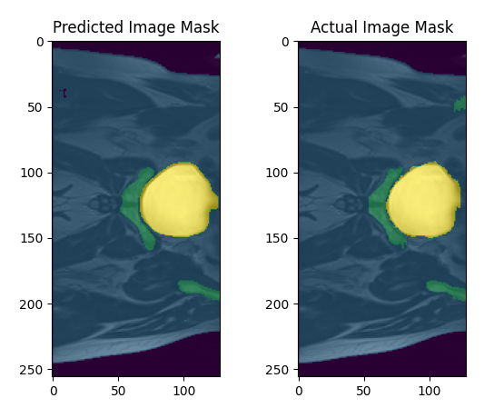

# 2D U-Net Segmentation of Prostate MRI slices
Author: Ryan Maher, s4748421

## 2D U-Net Algorithm
The 2D U-Net algorithm is a convolution neural network that excels in image segmentation. The U-Net architecture consists of a encoder and a decoder. The encode downsamples the input image using max pooling a number of times, with convolutions between each. This results in a set of feature maps in lower resolution to the input image which is then passed through the decoder. The decoder incoorporates skip connections from the encoders layers with matching resolutions to prevent infomation loss. It upsamples the data using transpose convolutions while still performing convolutions at each step. Finally the output layer produces a slice with the same shape as the input for each class each of which contains that classes mask. See figure 1 for the depiction of the architecture below.

### Figure 1:

NOTE: This implementation differs in that it utilises padding in the convolutional layers maintaining the original resolution are removing the need for cropping in the skip connections

## Problem Description
In this instance, the 2D U-Net has been applied to slices of MR Images from the HipMRI Study on Prostate Cancer. This has resulted in a model which can accurately and efficiently segment these MRI slices.

## Components
1. 'modules.py' - Contains the model itself and associated methods for building the U-Net model, loading saved models, fitting the model to data and generating segmentations of inputs
2. 'dataset.py' - Contains functions for loading data into numpy arrays and general data handling (getting file paths, creating batches)
3. 'train.py' - Contains the source code for training, validating, testing and saving the model.
4. 'predict.py' - Provides an example usage of the algorithm by predicting the test set and provides a visualisation of a predicted mask compared to an actual mask, both of which are overlayed on an original image

## Dependencies/Libraries
- Tensorflow (2.16.1)
- numpy (1.23.5)
- nibabel (5.3.0)
- matplotlib (3.7.1)
- tqdm (4.66.5)

## Results and Examples
The model achieved a loss of 0.0224 on the test set after 3 epochs, with dice coefficients for each of the 5 classes being as follows (to 4 significant figures)

|Class | Dice Co |
|------|---------|
| 0    | 4.002e-3|
| 1    | 1.752e-2|
| 2    | 6.699e-2|
| 3    | 3.716e-2|
| 4    | 1.256e-1|

### Example Segmentation

The above is a segmentation of one of the slices in the test set generated by the trained model compared to the manually created ground truth mask. 

# References
Figure 1 :- U-Net Architecture: https://lmb.informatik.uni-freiburg.de/people/ronneber/u-net/ 

Dataset (HipMRI Study on Prostate Cancer): https://data.csiro.au/collection/csiro:51392v2?redirected=true  