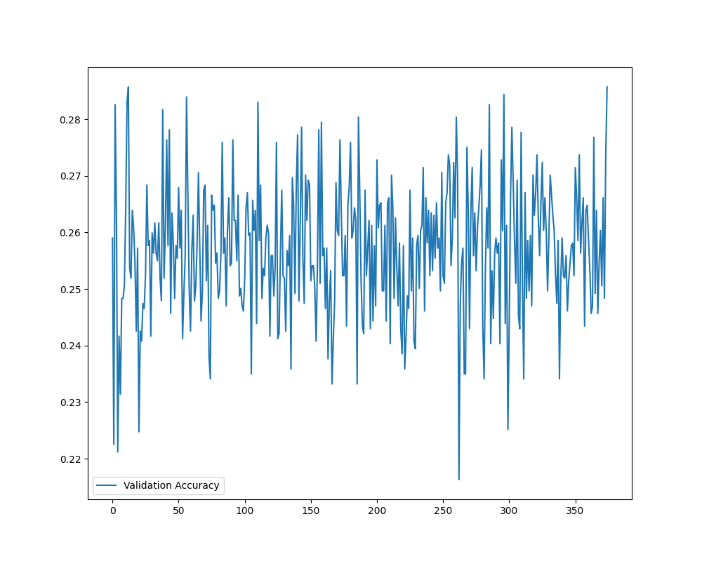
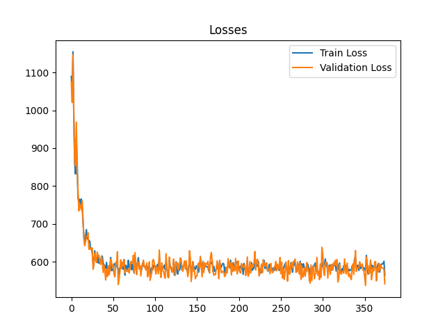
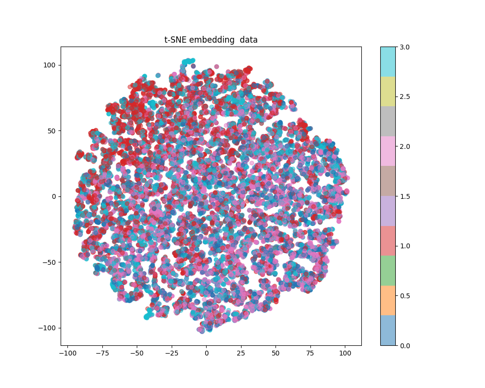
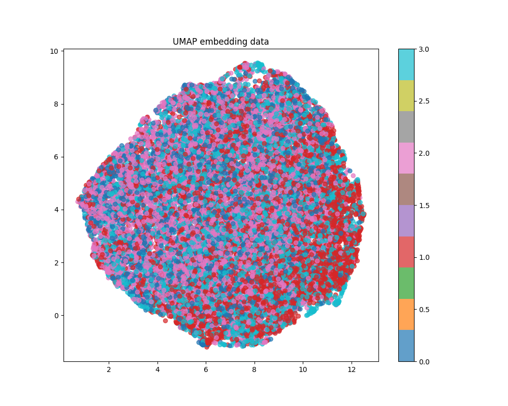
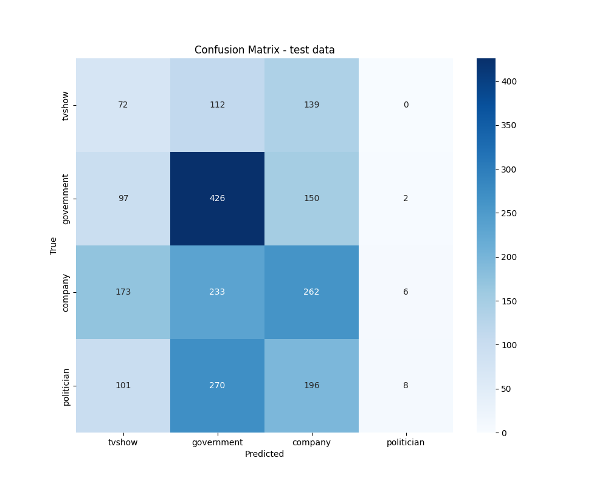

# COMP3710 GNN model for Facebook Graph Data Analysis
This is the advanced GNN model implemented to analyse the Facebook graph data which contains `dataset.py`, `modules.py`, `train.py`, `predict.py` and `gitigonore` for split data, train and test. 

## Algorithm Description
This repo contains a multi-layer advanced GNN model to carry out a semi-supervised multi-class node classification using the Facebook Large Page-Page Network dataset. This model is trained on the given data that takes the node features and edges features(df and index) to train and learn to predict the target outcomes which contain four classes in this dataset. Further training found that the model tends to learn from the easiest class which is the government class in this given dataset while ignoring the harder classes (such as tvshow), hence a class weight was added into the loss function to enhance model performance. Additionally, different hidden layer numbers and hidden layer nodes were tried so the current model version seems to be the optimal among all. Various learning rates, dropout rates, activation functions (ReLu, Leaky ReLu, elu), and loss functions were used, the current optimal option for each was chosen while others were commented out. The model seems to reach the maximum validation accuracy lowest of 0.18 then will oscillate around 0.28-0.2. Hence, this model shows its limitations even with optimal parameter tuning and fine-tuning since it is a black box model. With test accuracy around 0.37 and its own confusion matrix out, it seems the model still learning but not the best one to use here. Further suggestions to construct a new GNN model would be recommended. 

## Algorithm Performance with results 
The basic GNN model was used at first but did not give any optimal result, further modified AdvanceGNNModel and AdvanceGATModel(variation of GNN) were used to find the optimal solution which AdvanceGNNModel has the best performance on the test data among the three models.  

Further fine-tuning was performed in this AdvanceGNNModel for its hidden layer numbers, hidden layer nodes, activation functions(ReLu, Leaky ReLu, elu), residual connection option, dropout rate, learning rate, weight decay, patience counter and various loss functions with a bias for classes since the model seems only learn from the easiest government class initially.

As we can see the model is learning since the loss curve is dropped over time

Note that since both t-SNE and UMAP graphs are displayed in 2D images hence the results seem to overlap with each other. In a higher-dimension graph, those clusters might show in distinct places.

See that in this model sometimes some classes perform better than others, it can be done by modifying the class weights but this weight choice ([3.0, 1.0, 1.8, 1.8]) seems to give the best performance out of all. 

## Getting Started
### Dependencies
This project contains following dependenies:

aiohappyeyeballs==2.4.3

aiohttp==3.10.8

aiosignal==1.3.1

attrs==24.2.0

certifi==2024.8.30

charset-normalizer==3.3.2

colorama==0.4.6

contourpy==1.3.0

cycler==0.12.1

filelock==3.16.1

fonttools==4.54.1

frozenlist==1.4.1

fsspec==2024.9.0

idna==3.10

Jinja2==3.1.4

joblib==1.4.2

kiwisolver==1.4.7

llvmlite==0.43.0

MarkupSafe==2.1.5

matplotlib==3.9.2

mpmath==1.3.0

multidict==6.1.0

networkx==3.3

numba==0.60.0

numpy==2.0.2

packaging==24.1

pandas==2.2.3

pillow==10.4.0

psutil==6.0.0

pynndescent==0.5.13

pyparsing==3.1.4

python-dateutil==2.9.0.post0

pytz==2024.2

requests==2.32.3

scikit-learn==1.5.2

scipy==1.14.1

seaborn==0.13.2

setuptools==75.1.0

six==1.16.0

sympy==1.13.3

threadpoolctl==3.5.0

torch==2.4.1

torch-geometric==2.6.1

tqdm==4.66.5

typing_extensions==4.12.2

tzdata==2024.2

umap-learn==0.5.6

urllib3==2.2.3

yarl==1.13.1

### File Overview
The following file can be found:
- `dataset.py` - data loader for the dataset facebook_large folder, it splits data into 80 per cent training data, 10 per cent validation data, 10 per cent test 
- `modules.py` - contains three GNN models code that were tested within the given dataset, and the best model - AdvancedGNNModel is used for final testing
- `train.py` -  training AdvanceGNNModel with train and validation data group, it also contains the plot function for t-SNE and UMAP embedding for further analysis of the model
- `predict.py` - testing the final model in the test data set and plotting the confusion matrix graph and classification report

### Data Files input
- `musae_facebook_features.json`: Contains node features
- `musae_facebook_edges.csv`: Contains edges between nodes
- `musae_facebook_target.csv`: Contains node labels

### Executing program
To run this model, follow the instructions below:

1. Replace the file path in the _main_ in `dataset.py` to replace your file path for features_path, edges_path and target_path files
2. Run the `dataset.py`
3. Run the `modules.py`
4. Run the `train.py`
4. Run the `test.py` for the final result
