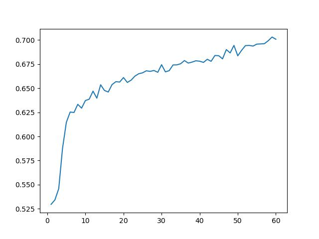
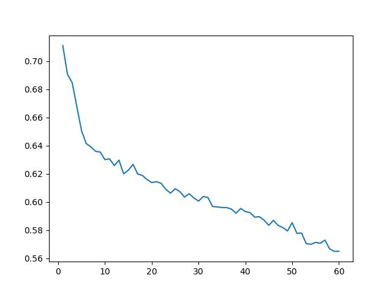
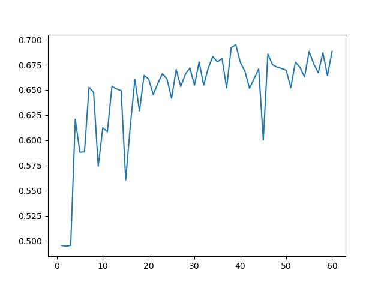
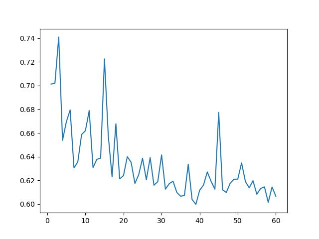

# Vision Transformers for the ADNI Dataset
This repository contains various implementations of modern vision transformers designed to be
applied to the Alzheimer's Disease Neuroimaging Initiative dataset (ADNI for short) [[1]](https://adni.loni.usc.edu/).
The dataset contains MRI scans of various subjects which have Alzheimer's (labeled as AD)
and those who are normal controls (labeled as NC). Each of the algorithms implemented aim to solve a classification
problem between these two classes, and are based of popular modern transformer architectures that have shown
high levels of performance in image based problems.

The standard vision transformer (ViT) model is based off the architecture proposed in the study  "An Image is Worth 16x16 Words: Transformers for Image Recognition at Scale" 
[[2]](https://arxiv.org/abs/2010.11929)

The convolutional vision transformer (CvT) is based off the architecture proposed in the study "CvT: Introducing Convolutions to Vision Transformers"
[[3]](https://arxiv.org/abs/2103.15808)

GFnet - To be implemented if time permits

Each of the non standard vision transformers build upon the original design, introducing new techniques to improve performance. The original 
ViT design stemmed from the standard transformer design, which has branched off to become integrated into may machine learning problems.
The ViT implemented one half of the original transformer architecture, the encoder, to solve imaged based problems. It offers improved
performance from CNN models which were dominating image based problems at the time the initial study was released. This improved performance 
is key to why the ViT model is such an effective solution to the classification problem of the ADNI dataset.

## Algorithms
### Vision Transformer
A visual representation of the ViT model architecture can be seen below.

The ViT algorithm can be broken into some key steps
1. Patch projection using, traditionally using a linear layer. In the implementation of the ViT in this repository a convolutional layer
was used instead as this has bee shown to offer performance gains, this was noted in the paper as a 'Hybrid Architecture'. _Note: simply using a convolutional layer in this step of the ViT does not constitute a CvT as there fundamental differences between the two._
2. Positional encoding is then applied to the linear patch tokens to finalize the patch embedding process. This is done to give the model knowledge of the patches respective position in the original image. There are many methods available to achieve this, sinusoidal encoding was the chosen method for the implementation in this repository as it has shown to be extremely effective and is commonly used in ViT implementations.
Additionally, a learnable class token is applied, this is used to learn the information regarding classes and is extracted in the final
step to make the final classification.

3. The transformer encoder block, the embedded patches are then fed into the encoder block which performs two main actions, 
multi head self attention and standard MLP fully connected layer. This follows the standard transformer encoder architecture implemented in
numerous other models.

4. The final step is using the final values inside the learnable class token to make predictions, to do this these values are put into
a final MLP layer in which the final layer is used to make a classification.

### Convolutional Vision Transformer
A visual depiction of the CvT model architecture can be seen below.

The convolutional vision transformer builds upon the original ViT model by implementing a few major changes.
1. Firstly, the CvT model implements a multi stage downsizing process in which there is token embedding at
multiple points throughout the training process, aiming to progressively downsize the original image through each convolutional
embedding process. This allows for more detail to be retained through each stage when compared to the single embedding process in the ViT
model.
2. When calculating the multi head self attention layer, a forwards convolutional projection is used to calculate the 'query', 'key' and 'value'
values. In this implementation the stride of the convolutional layers of the key and value calculations have a stride of 2, this reduces the
size of the data giving performance gains, with negligible loss of detail as proven in the study proposing this architecture.
3. Another key difference between the CvT and ViT, is the removal of positional encodings, results from the study proposing this model showed
that removing positional encoding offered performance gains with negligible loss of accuracy.
4. The final major change to the ViT model in the CvT model is that the learnable class token is only added in the final stage, this reduces
the computation needed for the model to train while still preserving accuracy.
### GFNet
To be implemented if time permits
## Dependencies
<!-- TODO -->
<!-- TODO -->
TODO
<!-- TODO -->
<!-- TODO -->
## Usage / Examples
Below are details on how to use the implemented models to perform your own testing/train. The steps below replicate the process followed
to achieve the results shown in the Results section of the README, however this is not the only way the code in the repository can be used.

1. Begin by cloning the repository to your device and navigating into the 'alzheimers_47446096' folder
```
git clone https://github.com/Fuller81/PatternAnalysis-2024
cd .\recognition\alzheimers_47446096\
```
2. Then download the ADNI dataset and ensure the file structure is as follows. _Note, text with * next to it must match the values below exactly to ensure the relevant data preprocessing works as intended_
```
/ADNI Data set folder
    --/train *
        |--/AD
            |--/Patientxyz
            |--/Patientxyz
        |--/NC
            |--/Patientxyz
            |--/Patientxyz
    --/test *
        |--/AD
            |--/Patientxyz
            |--/Patientxyz
        |--/NC
            |--/Patientxyz
            |--/Patientxyz
/recognition *
    |--/alzheimers_47446096 *
```
### Data Processing
Before training the data, two major preprocessing steps were taken. Creating a validation using a patient level split to ensure there
is no data leakage between the validation set and test set, and calculate the mean and standard deviation of the training data as this
is used in transforms applied to the data.
1. To 
### Training
### Testing
## Results
When testing with both the 
<p align="center">
  
</p>
<p align="center">
  
</p>
<p align="center">
  
</p>
<p align="center">
  
</p>

## References
[[1]](https://adni.loni.usc.edu/)
[[2]](https://arxiv.org/abs/2010.11929)
[[3]](https://arxiv.org/abs/2103.15808)