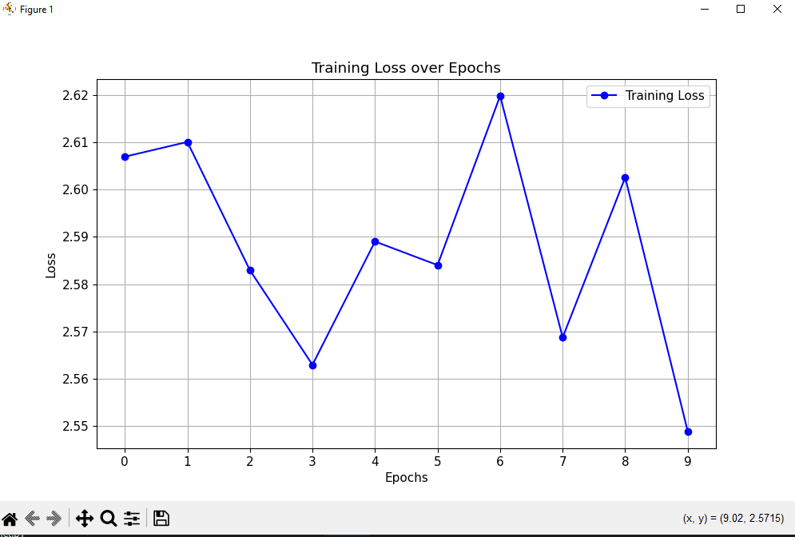

## Classification of lesions

# Problem:
This projects aims to implement an object detection algorithm which uses the dectection network YOLOv7. This algorthim is designed to identify and dectect objects within an images by drawing a box around such object. In this project we are using this algorthim to detect lesions within the ISIC 2018 dataset. This Dataset contains images of lesions on patients skin.

# Datasets:
Two datasets were used training dataset which included pictures of lesions on skin and a ground truth dataset. The ground truth dataset were the same images as the training dataset but was set in black and white. White being the colour of the skin lesion and black being everything else. The labels/ box metrics were able to be calculated from the ground truth as we could see where the lesion was as it was white. 

# How it works:
The algorithm first process and transforms the data as well as created a label dataset from the ground truth data as the model used yolov7 requires each of the training data to have a class ID, Normalized center x, Normalized center y, Normalized width, Normalized height of the lesion with the image. These measurements form a box around the lesion. After the data was transformed and the model was initalised training is started. The loss function is yolov7 loss function which encomposes localisation and objective. After training the data is evaluated with the ground truth dataset. a IOU score is calculated and the loss function average across epochs is graphed. The loss function was also changed slightly in yolov7 thus why it was added in the commit.

# Requirements:
Since YOLOv7 was used all the requirements to run that model are needed these include:
- python 3.11 (As the new version does not support the older version of numpy)
- matplotlib>=3.2.2
- numpy>=1.18.5,<1.24.0
- opencv-python>=4.1.1
- Pillow>=7.1.2
- PyYAML>=5.3.1
- requests>=2.23.0
- scipy>=1.4.1
- torch>=1.7.0,!=1.12.0
- torchvision>=0.8.1,!=0.13.0
- tqdm>=4.41.0
- protobuf<4.21.3
- tensorboard>=2.4.1
- pandas>=1.1.4
- seaborn>=0.11.0
- ipython
- psutil
- thop
I dont know if this is allowed but I have done it. You need to download Yolov7 and place that folder in the recognition folder. Furthermore, I modified the ComputeLoss function in yolov7/utils/loss.py to best suit my problem. Since, I can't commit my verison of yolov7 to the fork I just copied my verision of the class in train.py and used it from there.

# Extra:
NOTE: classfication was not done in this project as no labelled data of the types of lesions in the images. Also, test data was not used as the test data given had no labels and there was no ground truth data to be able to calculate such labels.

# Results:
Average IoU: 0.6997, Accuracy: 12.9630

# Summary:
After training my model, an end average IOU score of 0.6997 was achieved, with 12.9% of the validation data receiving a IOU score over 0.8. Fuuthermore, the training loss function can be seen above.