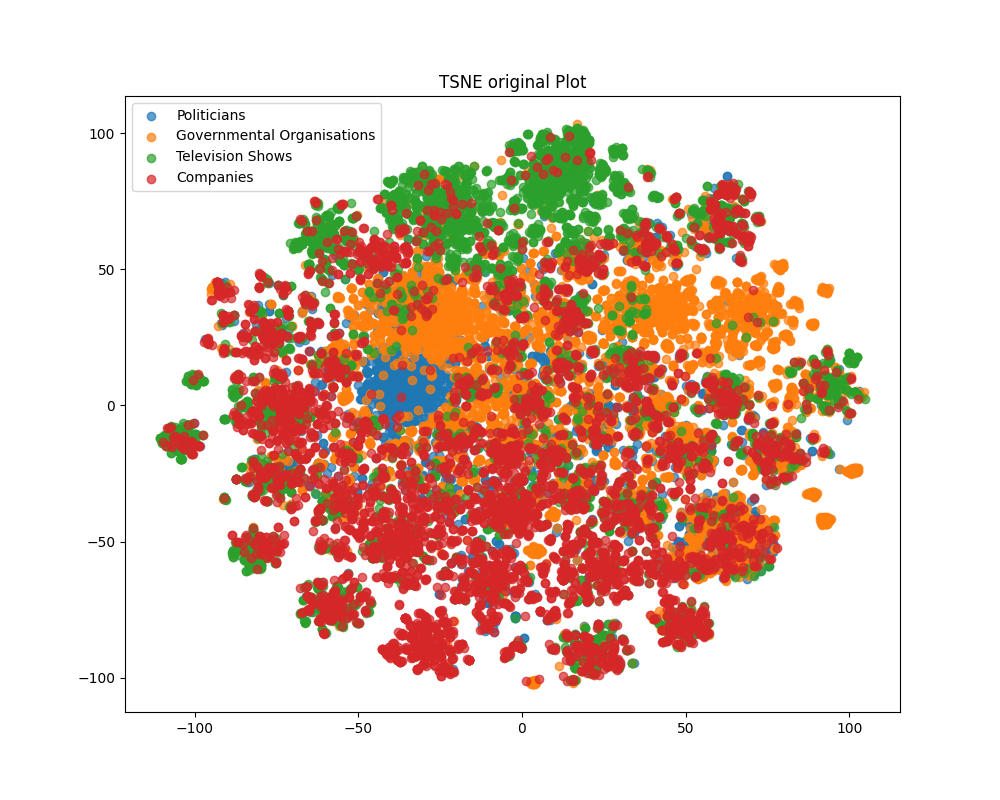

# Title: Multi-layer graph neural network on Facebok Large Page-Page Network dataset

## Task
On Facebok Large Page-Page Network dataset, GNN (Graph Neural Netwrok) model was used to perfrom semi supervised multi-class node classification. 

## Data
The Facebook Large Page-Page Network dataset was preprocessed into the facebook.npz file by UQ, with node features reduced to 128-dimensional vectors. The data consists of 22,470 nodes and 171,002 edges, forming a directed graph with binary-labeled nodes. The graph has a density of 0.001 and a transitivity of 0.232. The dataset defines four node classes: politicians, governmental organizations, television shows, and companies. The dataset (facebook.npz) was loaded using the numpy.load() function, returning three variables: features, edges, and target, all as NumPy arrays.

- Features: Shape of (22,470, 128) representing the node features.
- Edges: Shape of (342,004, 2) representing the edge index of the directed graph.
- Target: Shape of (22,470,) representing the ground truth class labels for each node.

These arrays were converted into tensors for compatibility with the model. To prevent bias and overfitting, the dataset was split into training (70%), validation (20%), and test (10%) sets.

# Model
The GCN model is a type of neural network designed to work with graph-structured data. Like other neural networks, it employs convolution operations, but instead of applying them to grid-based data (e.g. images), it operates on graphs. The key distinction between grid-based models and graph-based models is that grid data relies on aggregating information from fixed-sized regular neighborhoods, whereas graph data aggregates features from dynamically defined neighborhoods based on the graph's structure.

In a GCN, each node updates its feature representation by combining the features of its neighboring nodes. The main idea is that the node can improve its representation by summing up the  information from its neighbors. This aggregation process is similar to the convolution operation in traditional CNNs, where nearby xpixel values are combined to detect patterns.

The GCN algorithm can be summarized as follows:
It requires a feature matrix and an adjacency matrix as inputs. These inputs are passed through predefined convolution layers, which follow the mathematical model of the GCN. After multiple graph convolution layers, each node's feature representation is updated to reflect the information from its surrounding graph structure.

# Architecture
The GCN model is built on the neural network based class model in PytTorch.

Graph Convolution layers: performs Graph convolution which takes input and output channel as parameters. 

Relu activation funciton: activation function which outputs the input directly if positive, 0 otherwise. 

The input goes through 4 graph convolutions layers and relu functions applied after first, second and third convolution layers.
The model requests for 3 parameters which are input, hidden and output channels. Input channel value was 128 which is the feature dimension and output channels is 4 which are number of classes. 

# Hyperparameters and Functions
- Optimizer: Adam optimzer 
- loss: CrossEntropyLoss 
- num_epochs = 350
- hidden_layer = 64
- learning_rate = 5e-4

# Figures and Results 
- TSNE plot (pre - training)
  This TSNE plot illustrates the initial distribution of the data before training. The points from different classes appear scattered chaotically, with no discernible clusters or structure.
  

- TSNE plot (post - training)
  This TSNE plot shows how the data has been classified after 350 epochs of training. 
  It is observed that each class has been clearly seperated into 4 groups after training the model. However, there seems to be minor misslcassification and overlaps occured for each classes. These missclassification were mostly located at the boundary of each classes.
  

- Test, validation accuracy plot 
  The accuracy plot shows that both test and validation accuracies follow a similar trend, which is encouraging. The accuracy remains below 90% until about 50 epochs, after which it rises above 90%. However, a slight gap between test and validation accuracies emerges around 350 epochs, likely due to overfitting.
  

- test, validation loss plot 
  The loss plot describes the loss values of test and validation datasets as the model is trained. The graph shows that both loss values decreases as the model is trained and this shows that model is being trained preperly. However, it there seems to be a gap between each test and validation loss as from around 200 epochs. This is assumed to be caused by overfitting of the model. 
  

Conclusion: The model achieves an average test accuracy of 93.5%, which is reasonable. It performs well in classifying nodes according to their true labels, although there are room for improvement in reducing overfitting. IIn terms of models, dropout layer and  batch normalisation could be applied to the model to reduce overfitting. Also, Early stopping may be effective to overfitting. Overall, the model successfully classifies nodes in the Facebook dataset with high accuracy.

# Files
- modules.py : GCN Model class 
- predict.py : Run the saved model on the dataset 
- train.py : training and testing functions and run them after loading data 
- dataset.py : function for loading data from `facebook.npz`
- utiles.py : functions for plotting 

# Depedencies
- torch
- sklearn
- matplotlib
- numpy

# References
Data: https://snap.stanford.edu/data/facebook-large-page-page-network.html

Model and training inspiration: https://github.com/gayanku/SCGC/blob/main/models.py and Chat GPT

GCN: https://arxiv.org/abs/1609.02907