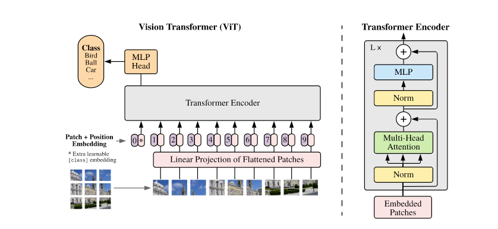
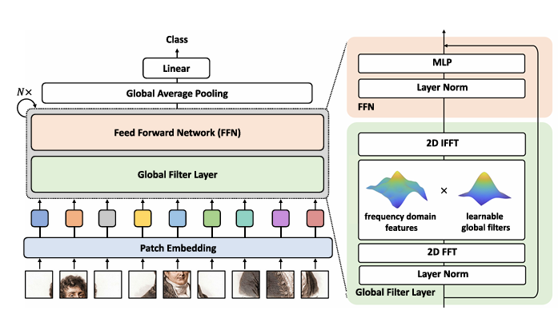
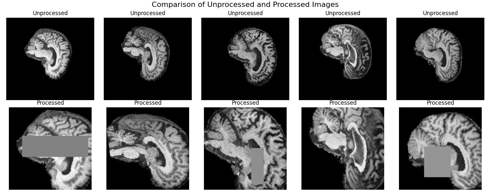
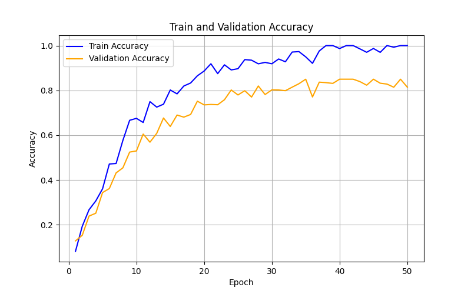
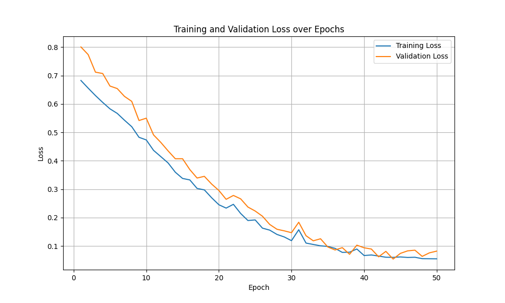

# ADNI Classifier Based on GFNet Transformer
## Introduction
Alzheimer`s disease is a chronic neurodegenerative condition that slowy impairs an afflicted person`s  memory over decades. Modern medicine offers little insight
into this disease and no cure has been discovered. However, their are preventative medications available that can delay early onset of Alzheimers if early
intervention is taken. Not everyone has the luxury to healthcare which makes predictive machine learning classifiers one of the cheapest and fastest ways
to get diagnosed. In this test, a vision transformer (ViT) variety known as Global Filter Neural Network (GFNet) is used to build a classification model
that aims to predict whether a patient has Alzheimer`s with up to 80% accuracy.

Vision transformers are a variety of transformer architecture that were originally used for natural language processing. Instead of using convolutional neural nets
ViT`s divide an image into a sequence of flattened sub-images called patches. Traditionally, each patch is then linearly embedded into a fixed dimensional vector.
Positional embeddings are then added to these patch embeddings to retain spacial information and the resulting sequence is then parsed through the transform encoder
which is then finally processed by a multi-layered perceptron (MLP) which performs the image classification. Figure 1

<p align="center">
  
</p>

<p align="center">
Figure 1: Structure of the Vision Transformer (Karim et al., n.a)
</p>

The implementation used throughout this project required some modifications to the standard ViT to turn it into a GFNet. The multi-head attention concept used in ViT`s is removed
and replaced with a global filter layer as shown in figure 2. As opposed to the attention concept used in ViTs, the global filter layer performs a 2D fast Fourier transform to convert
spatial data into a frequency space, then performs element-wise mmultiplication with all of the learnable filters followed by the inverse Fourier transform to bring everything back
into the spatial domain. Within the context of the task, this process allows GFNet to model global and local dependancies (i.e spatial patterns in the brain such as grey matter decay)
with log linear time complexity compared to ViT`s quadratic time complexity. This allows it to scale farther and is not intractable for ultra high resolution image recognition.

<p align="center">
  
</p>

<p align="center">
Figure 2: The Structure of GFNet (Yongming Rao et al., 2021)
</p>

## Breakdown of Implementation
### Dataset.py -
The original ADNI data was not immediately suitable for usage in a model. The original images were sometimes hard to distinguish from one another and their was significant wasted space.
First, any potential imbalances in the dataset would have to be mitigated to avoide bias in the finished model. The provided dataset was sub-divided into smaller training and testing sets.
These sets were then further sub-divided into both Alzheimers and normal brain scans. There were no class imbalances, so any class balancing preprocessing could be mitigated. Each image
was cropped (as to remove the black background) and then gray scaled. Initially, I avoided using further techniques as I believed random cropping and rotations would make it harder for the model
to gain context. However, I realised this was not the case. random rotations, resizing, and erasing (within bounds) were all then applied to the images in an attempt to improve model generalisation.
Each image was then resized to fit the default format for teh GFNet (224x224), converted to a tensor, and normalised using the mean and standard deviation of the original cropped dataset.

<p align="center">
  
</p>

<p align="center">
Figure 3: Before and After Preprocessing Of Data
</p>

### Modules.py
The inital research paper and some of the source code was written by Yongming Rao, Wenliang Zhao, Zheng Zhu, Jiwen Lu and Jie Zhou in 2021. The code they developed along with the research paper
was used in tandem to create the GFNet model in this instance.
In the Modules file their are 5 classes, each combine to create a functioning instance of the GFNet. The MLP layer (Percept) utilises two linear transformations alongside dropout to classify the
encoding data. In the forward pass, the first linear transform is applied which uses the dimensions of the hidden and output features. This is then fed through an activation (GELU) layer where dropout is then applied.
Another linear transform is applied followed by another dropout. Dropout is applied twice in this instance to perform regularization in an attempt at mitigating overfitting. The use of two linear layers sepparated by
activation functions are also used to add non-linearity into the structure- allowing more complex patterns to be learned in training.


```python
    def forward(self, x):
        # Apply first linear transformation
        x = self.fc1(x)

        # Apply activation
        x = self.act(x)

        # Apply dropout
        x = self.drop(x)

        # Apply second linear transformation
        x = self.fc2(x)

        # Apply dropout again
        x = self.drop(x)

        return x
```

The PatchyEmbedding class is used to breakdown images into patch tokens. The class first defines multiple preset values such as image size, patch size, and the latent space parameters. The number of patches is then
computed with the provided values:

```python
self.num_patches = (img_size[0] // patch_size[0]) * (img_size[1] // patch_size[1])
```
A 2D convolutional layer is then used to project the image patches into the embedding space (latent space). The convolution operates over the image in `patch sized` steps- extracting the patches and emmbedding them

```python
img_size = (img_size, img_size)
patch_size = (patch_size, patch_size)

# Calculating amount of patches
self.num_patches = (img_size[0] // patch_size[0]) * (img_size[1] // patch_size[1])

# Convolutional layer to project each patch into the embedding space
self.proj = nn.Conv2d(in_chans, embed_dim, kernel_size=patch_size, stride=patch_size)
```

After the convolution has been applied, the forward pass (when called) flattens the tensor starting from the second dimension which combines the spatial dimensions into a single dimension. The tensor is then transposed
to align with the expected transformer input.

```python
    def forward(self, x):
        # Apply patch embedding and reshape
        x = self.proj(x).flatten(2).transpose(1, 2)
        return x
```
The GlobalFilter class applies a global filter to an input tensor in the frequency domain using a variation of the FFT.
The initialization defines some parameters and also defines a learnable set of complex weights (initially Gaussian noise). In the forward pass, the tensor is first reshaped to match spatial dimensions.
FFT with conjugate symmetry is then applied to the input where the previously initialized complex weights are used as a filter in the frequency domain. This is the key component in this algorithm as
filtering in the frequency domain is efficient for capturing global information because each frequency component affects a different spatial pattern. When these frequencies are adjusted by the learnable
parameter weights, the model will learn to express specific spatial features across the entire input. The reverse Fourier transform is then applied and the resulting tensor is reshapen.
```python
        x = x.view(B, a, b, C).to(torch.float32)

        # Apply FFT with conjugate symmetry to reduce computation (as per paper)
        x = torch.fft.rfft2(x, dim=(1, 2), norm=`ortho`)

        # Convert complex weight parameter to complex type
        weight = torch.view_as_complex(self.complex_weight)

        # Apply filter in the frequency domain
        x = x * weight

        # Inverse FFT to return to spatial domain
        x = torch.fft.irfft2(x, s=(a, b), dim=(1, 2), norm=`ortho`)

        # Reshape back to original dimensions
        x = x.reshape(B, N, C)

```
The Block class is used to process a sequence of patches by applying a global filtering operation followed by a perceptron layer, with regularization and residual connections.
```python
        self.norm1 = norm_layer(dim)

        # Global filter layer for spatial processing
        self.filter = GlobalFilter(dim, h=h, w=w)

        # Drop path layer for regularization
        self.drop_path = DropPath(drop_path) if drop_path > 0. else nn.Identity()

        # Second normalization layer
        self.norm2 = norm_layer(dim)

        # Define hidden dimension for perceptron layer
        mlp_hidden_dim = int(dim * mlp_ratio)

        # Perceptron layer with dropout
        self.mlp = Percep(in_features=dim, hidden_features=mlp_hidden_dim, act_layer=act_layer, drop=drop)
```
norm1 normalises the data when it is initially input, wheras norm2 normalises the input before it goes through the MLP. The GlobalFilter layer is applied to capture spatial dependencies throughout the data.
It performs a global spatial transformation on the input patches, allowing the model to learn long-range interactions in the spatial structure. DropPath is used as as form of regularization by randomly
dropping residual connections within the network.
```python
    def forward(self, x):
        # Apply normalization and filter, then add residual connection
        x = x + self.drop_path(self.filter(self.norm1(x)))

        # Apply normalization and perceptron, then add residual connection
        x = x + self.drop_path(self.mlp(self.norm2(x)))

        return x
```
The first path applies normalization, then the GlobalFilter, then drop path regularizaion. Whereas the second path routes through the MLP instead. This is done so that each block can capture spatial dependencies
(global information) and feature transforms (introduces local non-linearity) in the data.


The GFNet class combines all previously mentioned classes in Modules together. The initilization of this class initializes alot of variables that are parsed when instantiated. Patch embedding takes place with the input
and a resulting stack of transformer blocks are generated along with learnable weight parameters that are initialized with Gaussian noise. 
```python
    def forward_features(self, x):
        # Extract features from input through patch embedding and Transformer blocks
        x = self.patch_embed(x)
        x = x + self.pos_embed  # Add positional embeddings
        x = self.pos_drop(x)  # Apply dropout to the embeddings

        # Pass through each Transformer block
        for blk in self.blocks:
            x = blk(x)

        # Normalize the final output
        x = self.norm(x)

        # Global average pooling
        x = x.mean(dim=1)

        return x
```
The forward features handles feature extraction taking the input image tensor through a sequence of transformations designed to capture spatial and feature-level information. Patch embed splits the input image into patches
and transforms each patch into a higher dimensional feature vector. This effectively tokenizes the patches which allows the patches to be processed sequentially. The next line adds positional embedding to each patch embedding
to retain spatial information. self.pos_embed is a learnable tensor that adds some unique spatial information to each patch which enables the model to keep order of the patches. Dropout is then applied to reduce overfitting.
After this processing, the patch emmbeddings are sent though an array of transformer blocks. As each block can distinguish patterns, the stacking of transformer blocks enables the model to progressively refine the patch
representations. Normalization and average pooling is then applied to stabalize and reduce the dimensionality of the output.
```python
    def forward(self, x):
        # Forward pass through feature extractor and classification head
        x = self.forward_features(x)
        x = self.head(x)

        return x
```self.head layer is a linear layer that takes embed_dim input features and produces num_classes outputs, representing the logits for each class. In this case, a linear layer is fine as the previous layers are complicated enough.

### Train.py
The training process begins with splitting the training dataset, assigning 80% for training and 20% for validation. This is a standard split as it balances the need for training data with the certainty of validation. 
The model is optimised using the AdamW optimiser (Adam optimiser with weight decay) with a custom learning rate scheduler that has a linear warmup over the first few epochs to stabalize training followed by cosine decay.
Cosine decay gradually reduces the learning rate to maintain training stability and to avoid overshooting the mminima within the feature space.
```python
    def lr_lambda(current_step):
        # During the warm-up phase, linearly increase the learning rate
        if current_step < warmup_steps:
            return float(current_step) / float(max(1, warmup_steps))

        # After warm-up, apply cosine decay to the learning rate
        # Cosine decay starts at the highest learning rate (1.0) and gradually decreases
        # until it reaches 0.5 * (1 + cos(pi)) = 0 at the end of training
        return max(
            0.0, 0.5 * (1.0 + np.cos(np.pi * (current_step - warmup_steps) / (total_steps - warmup_steps)))
        )
   scheduler = torch.optim.lr_scheduler.LambdaLR(optimizer, lr_lambda)
```
In each epoch, the model iterates over training batches, where it performs forward passes
and computes cross-entropy loss, the preferred loss function for multi-class classification. Backpropagation and gradient-based updates refine the weights to minimize loss, and the learning rate is adjusted at each step based on the scheduler.
Validation is conducted at the end of each epoch using torch.no_grad() to disable gradients, which conserves memory and speeds up evaluation. These steps combined give a clear view of how the model is performing during training
whilst allowing for adjustments like early stopping if performance plateaus or degrades.

### Predict.py
Predict.py provides a pipeline for training, saving, loading, and evaluating the GFNet model. It first initializes the model with default hyperparameters and trains it. The path is then saved to a state dictionary which is then immediately
reused for model evaluation. The test dataset is processed using a DataLoader and is transformed via cropping, grey-scale conversion, resizing, and normalization. During evaluation the model`s accuracy is calculated by comparing predictions to
true labels without gradient updates. This pipeline allows for seamless transitions from training to testing while supporting reusability, modularity, and evaluation on unseen test data.


### Dependencies
matplotlib==3.8.0
numpy==2.1.2
timm==1.0.11
torch==2.1.0+cu121
torchvision==0.16.0+cu121

USE REMAINDER OF GRAPPHS LIST DEPENDENCIES DISCUSS RESULTS 68% ACCURACY

<table>
  <tr>
    <td align="center">
      
      <p>Figure 4: Train and Validation Accuracy</p>
    </td>
    <td align="center">
      
      <p>Figure 5: Train and Validation Loss</p>
    </td>
  </tr>
</table>


