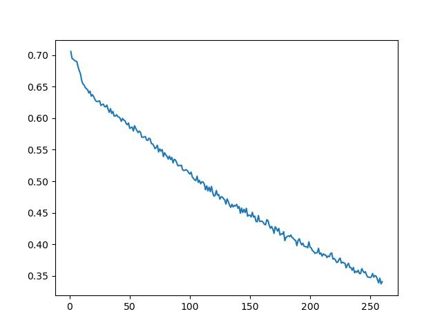

# Vision Transformers for the ADNI Dataset
This repository contains various implementations of modern vision transformer architectures designed to be
applied to the Alzheimer's Disease Neuroimaging Initiative dataset (ADNI for short) [[1]](https://adni.loni.usc.edu/).
The dataset contains MRI scans of various subjects which have Alzheimer's (labeled as AD)
and those who are normal controls (labeled as NC). Each of the algorithms implemented aim to solve a classification
problem between these two classes, and have been chosen as they have shown
high levels of performance in other image based problems.

The standard vision transformer (ViT) model is based off the architecture proposed in the study  "An Image is Worth 16x16 Words: Transformers for Image Recognition at Scale" 
[[2]](https://arxiv.org/abs/2010.11929)

The convolutional vision transformer (CvT) is based off the architecture proposed in the study "CvT: Introducing Convolutions to Vision Transformers"
[[3]](https://arxiv.org/abs/2103.15808)

GFnet - To be implemented if time permits

Each of the non standard vision transformers build upon the original design, introducing new techniques to improve performance. The original 
ViT design stemmed from the standard transformer design, which has branched off to become integrated into may machine learning problems.
The ViT implemented one half of the original transformer architecture, the encoder, to solve imaged based problems. It offers improved
performance from CNN models which were dominating image based problems at the time the initial study was released. This improved performance 
is key to why the ViT model is such an effective solution to the classification problem of the ADNI dataset.

## Algorithms
### Vision Transformer
A visual representation of the ViT model architecture can be seen below.

The ViT algorithm can be broken into four key steps
1. Patch projection using, traditionally using a linear layer. In the implementation of the ViT in this repository a convolutional layer
was used instead as this has bee shown to offer performance gains, this was noted in the paper as a 'Hybrid Architecture'. _Note: simply using a convolutional layer in this step of the ViT does not constitute a CvT as there fundamental differences between the two._
2. Positional encoding is then applied to the linear patch tokens to finalize the patch embedding process. This is done to give the model knowledge of the patches respective position in the original image. There are many methods available to achieve this, sinusoidal encoding was the chosen method for the implementation in this repository. As it has shown to be extremely effective and is commonly used in ViT implementations.
Additionally, a learnable class token is applied during this stage. This is used to learn the information regarding classes and is extracted in the final
step to make the final classification.

3. Next is the transformer encoder block. The embedded patches are then fed into the encoder block which performs two main actions, 
multi head self attention and standard MLP fully connected layer. This follows the standard transformer encoder architecture implemented in
numerous other models.

4. The final step is using the final values inside the learnable class token to make predictions, to do this these values are put into
a final MLP layer which is used to make a classification.

### Convolutional Vision Transformer
A visual depiction of the CvT model architecture can be seen below.

The convolutional vision transformer builds upon the original ViT model by implementing a few major changes.
1. Firstly, the CvT model implements a multi stage downsizing process in which there is token embedding at
multiple points throughout the training process, aiming to progressively downsize the original image through each convolutional
embedding process. This allows for more detail to be retained through each stage when compared to the single embedding process in the ViT
model.
2. When calculating the multi head self attention layer, a forwards convolutional projection is used to calculate the 'query', 'key' and 'value'
values. In this implementation the stride of the convolutional layers of the key and value calculations have a stride of 2, this reduces the
size of the data giving performance gains, with negligible loss of detail as proven in the study proposing this architecture.
3. Another key difference between the CvT and ViT, is the removal of positional encodings inside of the CvT, results from the study proposing this model showed
that removing positional encoding offered performance gains with negligible loss of accuracy.
4. The final major change to the ViT model in the CvT model is that the learnable class token is only added in the final stage, this reduces
the computation needed for the model to train while still preserving accuracy.
### GFNet
To be implemented if time permits
## Dependencies
<!-- TODO -->
<!-- TODO -->
- python >= 3.12.4
- matplotlib >= 3.8.4
- numpy >= 1.26.4
- pytorch >= 2.4.0
- pytorch-cuda >= 12.4 if using GPU
- torchsummary >= 1.5.1
- torchvision >= 0.19.0
- scikit-learn >= 1.5.1
- einops >= 0.8.0

<!-- TODO -->
<!-- TODO -->
## Usage / Examples
Below are details on how to use the implemented models to perform your own testing/train. The steps below replicate the process followed
to achieve the results shown in the 'Results' section of the README, however this is not the only way the code in the repository can be used.

1. Begin by cloning the repository to your device
```
git clone https://github.com/Fuller81/PatternAnalysis-2024
```
2. Then download the ADNI dataset and ensure the file structure is as follows. _Note, text with * next to it must match the values below exactly to ensure the relevant data preprocessing works as intended_
```
/ADNI Data set folder
    --/train *
        |--/AD
            |--/Patientxyz
            |--/Patientxyz
        |--/NC
            |--/Patientxyz
            |--/Patientxyz
    --/test *
        |--/AD
            |--/Patientxyz
            |--/Patientxyz
        |--/NC
            |--/Patientxyz
            |--/Patientxyz
/recognition *
    |--/alzheimers_47446096 *
```
### Data Pre Processing
#### 'Manual' Steps
Before training the data, two major 'manual' preprocessing steps were taken. Creating a validation using a patient level split to ensure there
is no data leakage between the validation set and test set, and calculate the mean and standard deviation of the training data as this
is used in transforms applied to the data.
1. The first data preprocessing step was to create the validation set as follows. The functions in this repository for the train/val/test split are designed to perform a 70/15/15 split. This is a common split ratio for smaller datasets. Due to the fact that the entire ADNI
dataset only contains around 30000 files total, it can be classified as a smaller dataset and therefor it is suitable for this split.
    
    1.1 Ensure that the folder structure matches the pattern specified above

    1.2 Execute the 'formatByPatient' function which is located in the 'dataset.py' file. An example of this can be seen below.
    _Note, ROOT\_PATH and NEW\_ROOT\_PATH are relative paths from inside recognition\alzheimers\_47446096\\_
    ```
        > cd .\recognition\alzheimers_47446096\ 
        > python
        >>> from dataset import *
        >>> formatByPatient(path = ROOT_PATH, newPath = NEW_ROOT_PATH)
    ```
2. Calculate the mean and standard deviation of the training set.
    
    2.1 This is done by running the 'meanStdCalc' function which is also located in the 'dataset.py' file
    _Note, PATH is the relative path from inside recognition\alzheimers\_47446096\ to the train folder_
    ```
        > cd .\recognition\alzheimers_47446096\ 
        > python
        >>> from dataset import *
        >>> meanStdCalc(path = PATH)
    ```
    This will return the mean and standard deviation of each of the 3 channels in the original RGB images, however they should
    all be the same as the MRI photos are grey-scale already. To ensure that these values are being used for the normalisation
    transforms when the data is being loaded, change the global variables 'MEAN' and 'STD' in 'dataset.py'.

#### Transformations on Data Loading
When the data is loaded using the defined methods for getting dataLoaders for each data split, several transforms are applied
in a effort to increase the performance of the models. The transforms applied are as follows

Transforms on training data (_All methods are pytorch transforms from torchvision.transforms_)
1. A random crop on the image of the predefined IMG_SIZE is performed using RandomResizedCrop((IMG_SIZE, IMG_SIZE)),
2. 3 random augmentations to the image using RandAugment() (A list of the included augmentations can be found [here](https://pytorch.org/vision/main/_modules/torchvision/transforms/autoaugment.html#RandAugment))
3. Convert the image into a single channel grey-scale format using Grayscale()
4. Convert the image into a torch tensor using ToTensor()
5. Normalize the images using the mean and standard deviation calculated above using Normalize(mean = MEAN, std = STD)

Transforms on test/val data (_All methods are pytorch transforms from torchvision.transforms_)
1. A center crop on the image of the predefined IMG_SIZE is performed using CenterCrop((IMG_SIZE, IMG_SIZE)),
3. Convert the image into a single channel grey-scale format using Grayscale()
4. Convert the image into a torch tensor using ToTensor()
5. Normalize the images using the mean and standard deviation calculated above using Normalize(mean = MEAN, std = STD)

These transform were chosen in an attempt to increase the performance of the model in various ways. The normalization, 
random crop and random augmentations were added in an attempt to create more variation in the dataset, thus giving 
the model 'more' samples to learn from, and hopefully give a more general solution to the problem due to the added 'noise'
. This gave a notable performance/accuracy increase compared to initial 
testing of the model without any transforms implemented. Additionally the decision to convert to grey-scale was made
for optimization purposes as since the image is inherently grey-scale and all RGB values are the same, it allows for
reduced computation without loss of detail. 

### Training
Once the data processing steps listed above are completed, the model is then ready to be trained. To train the model first 
ensure that the correct model/hyperparameters are defined at the beginning of the 'train' function in 'train.py'. An exert from
'train.py' can be seen below highlighting where the model is defined. If desired other modifications to the optimiser, loss function,
mixed precision, etc. can also be changed within this file.
```python
def train(device: str = "cpu"):
    NUM_EPOCH = 1000
    LEARNING_RATE = 0.00003
    BATCH_SIZE = 64
    WEIGHT_DECAY = 0.02
    TRAIN_WORKERS = 4

    #* Define Model Here ------------------------------------
    model = ConvolutionalVisionTransformer(device).to(device)
```
The file can then by run to begin training the model. _Note ensure you have navigated to the same directory where you relative paths for 'dataset.py' are based from. Otherwise getting the dataLoaders will error._

```
> cd .\recognition\alzheimers_47446096\ 
> cd python .\train.py
```
An example of the first few lines of output can be seen below
```
Beginning Training
Epoch 1/1000: Training Loss = 0.6941055584732079, Training Accuracy = 0.5199349442379182
Validation Loss = 0.6975890823772976, Validation Accuracy = 50.73660714285714 %
Epoch 2/1000: Training Loss = 0.6923188280634781, Training Accuracy = 0.5276486988847584
Validation Loss = 0.6800375240189689, Validation Accuracy = 60.04464285714286 %
```
### Testing / Predicting
To test a saved model, the 'predict.py' is used. First set the path inside the file under the
variable MODEL_PATH. _Note insure this is the relative path from the dictionary you are executing the file in._

The file can then be run as follows

```
> cd .\recognition\alzheimers_47446096\ 
> cd python .\predict.py
```

The 'predict' function inside 'predict.py' calculates the average accuracy, the F1 score and a confusion matrix. An example output of each models best saved file (based on highest validation accuracy) can be seen below.

#### ViT Best Results
```
Test Accuracy = 73.49557522123894 %
F1 Score: 0.7711993888464477
Confusion Matrix:
 [[1303  937]
 [ 261 2019]]
```

#### CvT Best Results
```
Beginning testing
Test Accuracy = 71.46017699115043 %
F1 Score: 0.7121820615796519
Confusion Matrix:
 [[1634  606]
 [ 684 1596]]
```

## Results
Both the models showed promise with the ViT and CvT achieving 73.50% and 71.46% on the test set respectively. The best trained
implementations of each model were chosen based on a highest validation accuracy, with validation loss also taken into account.

### ViT Results

The ViT model was trained with the following parameters.
```python
NUM_EPOCH = 1000
LEARNING_RATE = 0.0001
BATCH_SIZE = 128
WEIGHT_DECAY = 0.0
TRAIN_WORKERS = 2
model = VisionTransformer(12, 14, (1, 224, 224), 128, 8, 4, device)
```
The training/validation accuracy and loss plots for this models training process can be seen below. The model was
set to run for 1000 epochs but was stopped at 260 due to time constraints on the project and a perceived lack
of further performance gains. The checkpoint from epoch 241 was taken as it was the latest validation accuracy peak,
achieving 76.40625% validation accuracy. 
<p align="center">
  
</p>
<p align="center">
    <em>ViT Training Accuracy vs Epoch</em>
</p>

<p align="center">
  
</p>
<p align="center">
    <em>ViT Training Loss vs Epoch</em>
</p>
<p align="center">
  
</p>
<p align="center">
    <em>ViT Validation Accuracy vs Epoch</em>
</p>
<p align="center">
  
</p>
<p align="center">
    <em>ViT Validation Loss vs Epoch</em>
</p>

This model was able to achieve 73.5% accuracy on the test set as seen by the prediction outputs for this model below
```
Test Accuracy = 73.49557522123894 %
F1 Score: 0.7711993888464477
Confusion Matrix:
 [[1303  937]
 [ 261 2019]]
```
From the results above, it can be seen that the model did a solid job predicting between the two classes, however leans
towards predicting NC quite frequently. It is also likely that when taking this epoch based off its peak validation that
there is some slight over fitting to this solution as the validation loss does begin to increase slowly towards the tail
end of this training process. This would explain the difference of roughly 3% between the validation and test accuracy scores.

There is definitely room for improvement in tuning this model as most of the hyperparameter combinations tested consisted of
quite small models due the time and resource constraints faced in this project. Thus I believe that with slightly larger models
it is possible to achieve much greater accuracy. Another area where this model could aim to improve is the high rate of false
negatives, as this would hypothetically leave many patients undiagnosed and a more balanced or higher level of false positives
may be preferred depending on the specifics of treatment solutions available at the time.

### CvT Results

The CvT model was trained with the following parameters.
```python
NUM_EPOCH = 60
LEARNING_RATE = 0.0002
BATCH_SIZE = 64
WEIGHT_DECAY = 0.003
TRAIN_WORKERS = 4
model = ConvolutionalVisionTransformer(device)
```
The training/validation accuracy and loss plots for this models training process can be seen below. The model was
set to run for 60 epochs due to time constraints towards the end of the project. The checkpoint from epoch 39 was taken as it was the latest validation accuracy peak, achieving 68.33% validation accuracy. This was much lower than the ViT, however this is mostly due to the 
fact a significantly less time was spent tuning this model and model depth/width were also quite small.
<p align="center">
  
</p>
<p align="center">
    <em>CvT Training Accuracy vs Epoch</em>
</p>

<p align="center">
  
</p>
<p align="center">
    <em>CvT Training Loss vs Epoch</em>
</p>
<p align="center">
  
</p>
<p align="center">
    <em>CvT Validation Accuracy vs Epoch</em>
</p>
<p align="center">
  
</p>
<p align="center">
    <em>CvT Validation Loss vs Epoch</em>
</p>


This model was able to achieve 71.46% accuracy on the test set as seen by the prediction outputs for this model below
```
Test Accuracy = 71.46017699115043 %
F1 Score: 0.7121820615796519
Confusion Matrix:
 [[1634  606]
 [ 684 1596]]
```

From the results it can be seen that the CvT model also performed relatively well at this problem, however in the limited time
tuning this model I was not able to get it to perform better than the ViT, this does not represent general reported performance
when comparing these two architectures. Therefor it is likely that the hyperparameters used are not very optimal and are hindering
the performance of the model.

Despite this the model had a much more balanced confusion matrix compared to ViT. This could be attributed to the steady decline seen 
in the validation loss which likely signifies that the model was generating an appropriately general solution to this problem, subsequently reducing over-fitting in the solution.

## References

[1] “ADNI | Alzheimer’s Disease Neuroimaging Initiative,” ADNI. Available: [https://adni.loni.usc.edu/](https://adni.loni.usc.edu/)

[2] A. Dosovitskiy et al., “An Image is Worth 16x16 Words: Transformers for Image Recognition at Scale,” arXiv:2010.11929 [cs], Oct. 2020, Available: [https://arxiv.org/abs/2010.11929](https://arxiv.org/abs/2010.11929)

[3] H. Wu et al., “CvT: Introducing Convolutions to Vision Transformers,” arXiv:2103.15808 [cs], Mar. 2021, Available: [https://arxiv.org/abs/2103.15808](https://arxiv.org/abs/2103.15808)
