# Stable Diffusion for ADNI (Alzheimer's Disease Neuroimaging Initiative)

#### COMP3710 - Pattern Analysis 2024
**Task 8** - Generative model of the ADNI brain dataset using Stable Diffusion.<br>
**Author:** Liam O'Sullivan (46964173)

## Project Overview

This project implements a Stable Diffusion model for generating brain MRI images, specifically trained on the ADNI dataset. 
The goal of this project is to create a generative model capable of producing realistic, reasonably clear brain MRI images.
These could potentially be used for data research or as a tool for studying Alzheimer's Disease progression.

## Table of Contents

1. [Project Structure](#project-structure)
2. [Dependencies](#dependencies)
3. [Installation](#installation)
4. [Data Preparation](#data-preparation)
5. [Usage](#usage)
6. [Model Architecture](#model-architecture)
7. [Training Process](#training-process)
8. [Inference](#inference)
9. [Visualisations](#visualisations)
10. [Performance Metrics](#performance-metrics)
11. [References](#references)

## Project Structure

The project consists of several key files:

- [`train.py`](train.py): Main training script for the Stable Diffusion model
- [`pre_train.py`](pre_train.py): Script for pre-training the VAE model
- [`predict.py`](predict.py): Script for generating new images using the trained model
- [`vae.py`](vae.py): Implementation of the Variational Autoencoder
- [`modules.py`](modules.py): Contains various model components and utilities
- [`utils.py`](utils.py): Utility functions for data loading, visualization, etc.
- [`dataset.py`](dataset.py): Custom dataset class for ADNI data
- [`tsne.py`](tsne.py): Script for t-SNE visualization of the latent space

## Dependencies
```
- OpenCV >= 4.10
- Torch >= 2.1.2
- Torchmetrics >= 1.4.2
- Torchvision >= 0.16.1
- tqdm >= 4.66.5
- wandb >= 0.12.4
- matplotlib >= 3.9.2
- numpy >= 1.26.2
- scikit-learn >= 1.5.1
- CUDA = 12.4
```

## Installation

To set up the project, follow these steps:

1. Clone the repository
2. Install the required packages:

```bash
pip install -r requirements.txt
```

## Data Preparation

The ADNI dataset should be organised in the following structure:

```
data/
    train/
        AD/
        NC/
    val/
        AD/
        NC/
```

Where AD represents Alzheimer's Disease samples and NC represents Normal Control samples. 
The training data has been split with 20% for validation and 80% for training to ensure the Unet does not overfit.

## Usage

### Training

1. To run the training of the model, the data will need to be imported acording the the above structure. 
2. Update [this](train.py#L44) line to match the file name of the pretrained model. 
3. Run [pre_train.py](pre_train.py#L171) with appropriate settings to pretrain the autoencoder
4. In [train.py](train.py#L40) you can edit the class name to generate either AD or NC in the model. 
5. [wandb](https://wandb.ai/) will also need to be installed, logged in and a project initialised to store the results in. The entity and project name can be edited [here](utils.py#L153) 
to match up with wandb.  
6. Once any other settings are updated in [train.py](train.py) you can run the file to start training

### Image Generation
1. Download either the [AD](https://drive.google.com/file/d/1eVkB2aPTVc8dtPLJkcCfOaJs6yEOkYS9/view?usp=sharing) or [NC](https://drive.google.com/file/d/1rxdQhUixX2N9tbVXLW_jyyg-jt7HbYWh/view?usp=sharing) checkpoint file and add it to /checkpoints/Diffusion
2. Update [the model path](predict.py#L22) to match the path of the downloaded checkpoint
3. Set the number of image generations and image size and run [predict.py](predict.py)

## Model Architecture

The Stable Diffusion model consists of three main components:

1. **Variational Autoencoder (VAE)**: Compresses input images into a latent space and reconstructs images from this latent representation.
2. **U-Net**: Predicts noise at each timestep of the diffusion process.
3. **Noise Scheduler**: Manages the noise schedule for the diffusion process.

The below is an overview of the model architecture. In this implementation there is no conditioning component, only a time embedding.
This also means that the KV cross attention blocks are replaced with Self Attention blocks. 

<a href="https://jalammar.github.io/illustrated-stable-diffusion/" target="_blank">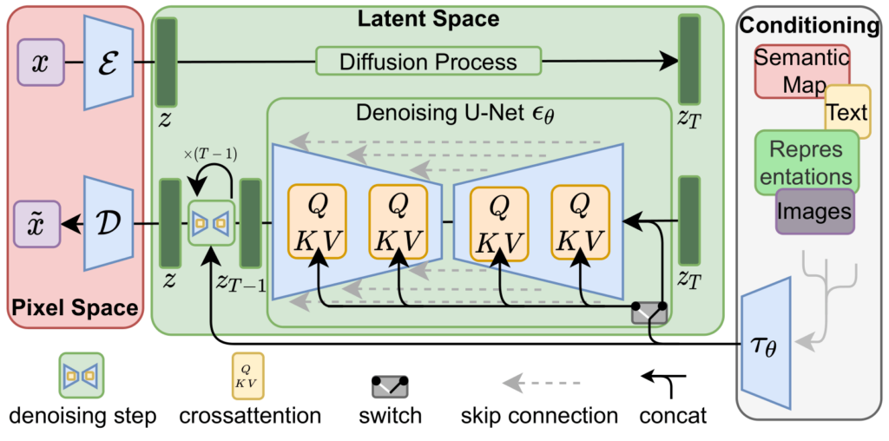</a>

### Variational Autoencoder (VAE)

The VAE is implemented in [`vae.py`](vae.py) and consists of an encoder and decoder:

- **Encoder**: Compresses the input image to a latent representation of a predefined dimension.
- **Decoder**: Reconstructs the image from the latent representation.

The VAE uses residual blocks and attention mechanisms to improve performance.

<a href="https://www.researchgate.net/figure/The-basic-architecture-of-variational-autoencoder-VAE_fig3_359471754" target="_blank">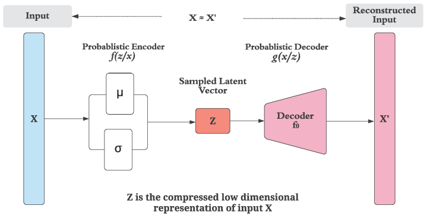</a>

### U-Net

The U-Net is implemented in [`modules.py`](modules.py) and is responsible for predicting the noise present in an image at a given timestep. 

<a href="https://towardsdatascience.com/you-cant-spell-diffusion-without-u-60635f569579" target="_blank"></a>

### Noise Scheduler

The noise scheduler ([`NoiseScheduler_Fast_DDPM`](modules.py#L444)) is based on the [Fast-DDPM paper](https://arxiv.org/pdf/2405.14802), which allows for improved performance with fewer iterations compared to the original DDPM. This method is especially effective for medical imaging so suits this application very well.

The forward and backward process of diffusion are also shwon below. 

<a href="https://link.springer.com/article/10.1007/s00259-023-06417-8" target="_blank">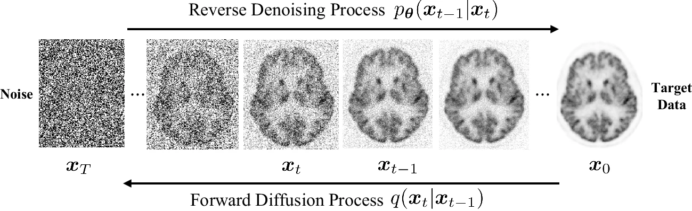</a>

<a href="https://arxiv.org/pdf/2405.14802" target="_blank">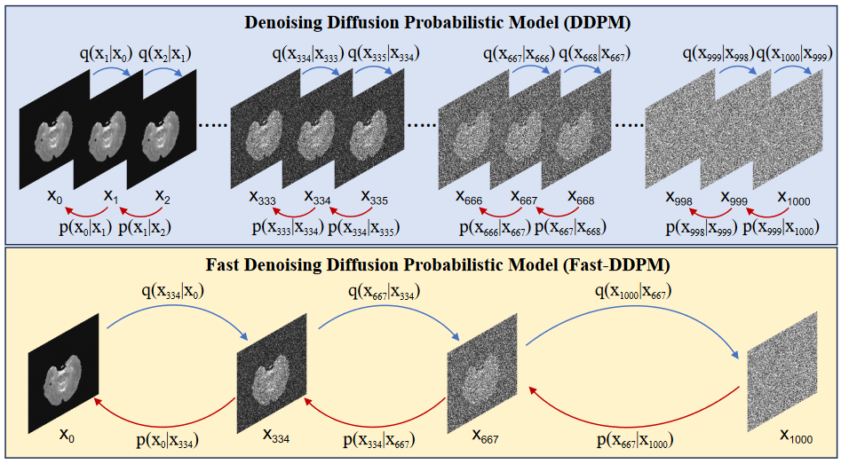</a>

## Training Process

The training process is divided into two main stages:

1. **VAE Pre-training**: The VAE is pre-trained separately to ensure good reconstruction quality. This is done using [`pre_train.py`](pre_train.py).

    To help with convergence and reconstruction quality, a combination of MSE loss and [KLD](https://en.wikipedia.org/wiki/Kullback%E2%80%93Leibler_divergence) loss were used.
    The AdamW optimiser was used with weight decay for fast convergence. The ReduceLROnPlateau scheduler was used to ensure the reconstructions continued to improve in later training. 
    <p>The pre-training was run for 100 epochs when an acceptable reconstruction quality was obtained. The final reconstruction quality is shown below.

     <br>
    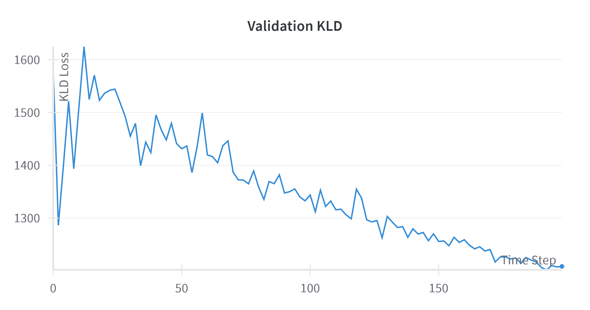
    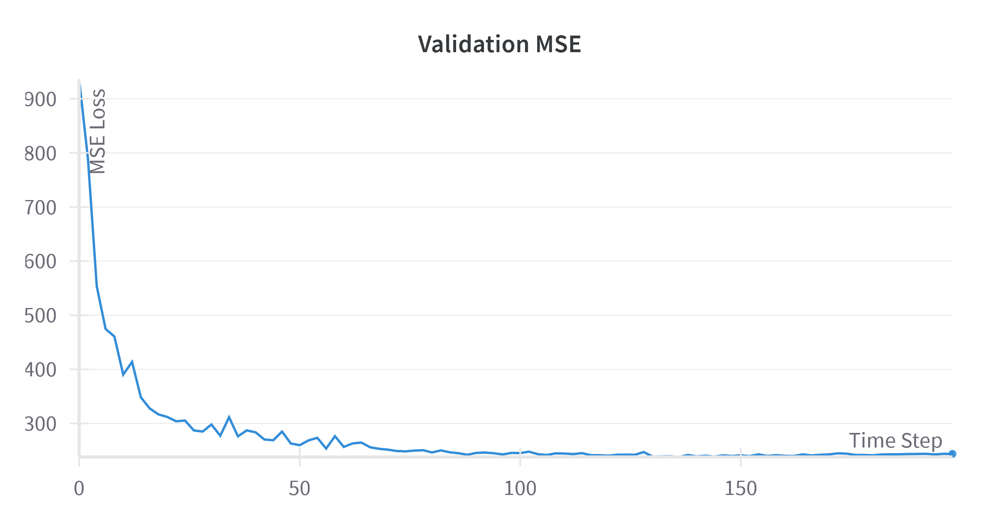


2. **Stable Diffusion Training**: The full Stable Diffusion model is trained using [`train.py`](train.py). This process involves:
   - Encoding images to the latent space
   - Adding noise according to the noise schedule
   - Training the U-Net to predict this noise
   - Periodically generating samples by gradually removing the predicted noise. 

   The model was trained with the below parameters.
    - batch size: 16
    - epochs: 500
    - image size: 256x256
    - Learning Rate (Max): 0.0001
    - Loss: MSELoss
    - Optimizer: AdamW
    - Scaler: Gradscaler
    - Scheduler: CosineAnnealingWarmupScheduler

    #### Results

    <p> Peak Signal to Noise Ratio (PSNR) and Structural Similarity Index Measure (SSIM) were the two primary metrics used to assess the quality of the image generations.

    - PSNR is a metric used to measure the quality of reconstructed or generated images compared to a reference image. It is expressed in decibels (dB) and is commonly used to assess how much noise or distortion has been introduced during the image generation or compression process. This will help to determine how much of original nois eis still present in the output image. At the end of training the PSNR was 15.707. This is considered a low PSNR and implies a poor reconstruction quality, so there is still room for improvement in the model. 
    
    - SSIM is a method for predicting the perceived quality of digital television and cinematic pictures, as well as other kinds of digital images. At the end of training the model produced a value of 0.702 from a possible range of 0 to 1, with 1 meaning the reference and sample are identical. This is considered moderate to good for a generatedd image, considerring we do not want the generated sample to be identical to the reference image.

    ### Alzheimer's Disease (AD)
    

    #### Metrics and Stats
    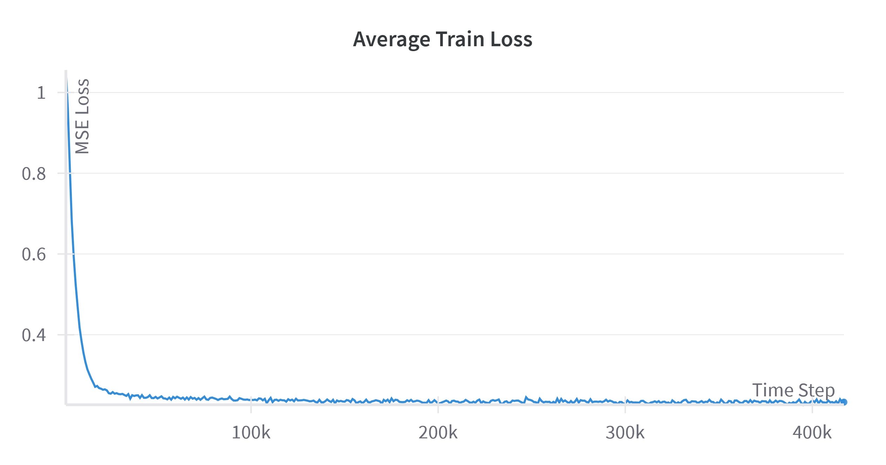
    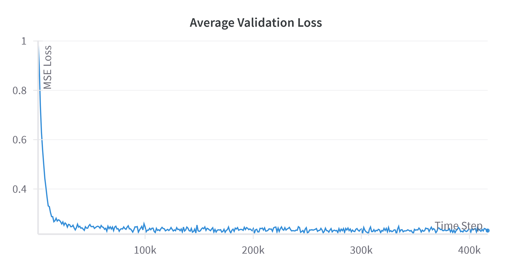<br>
    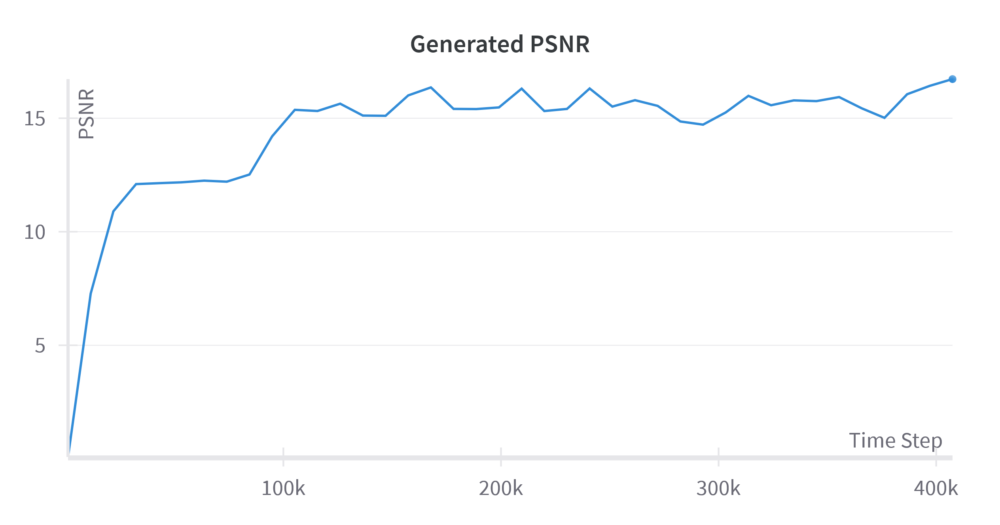
    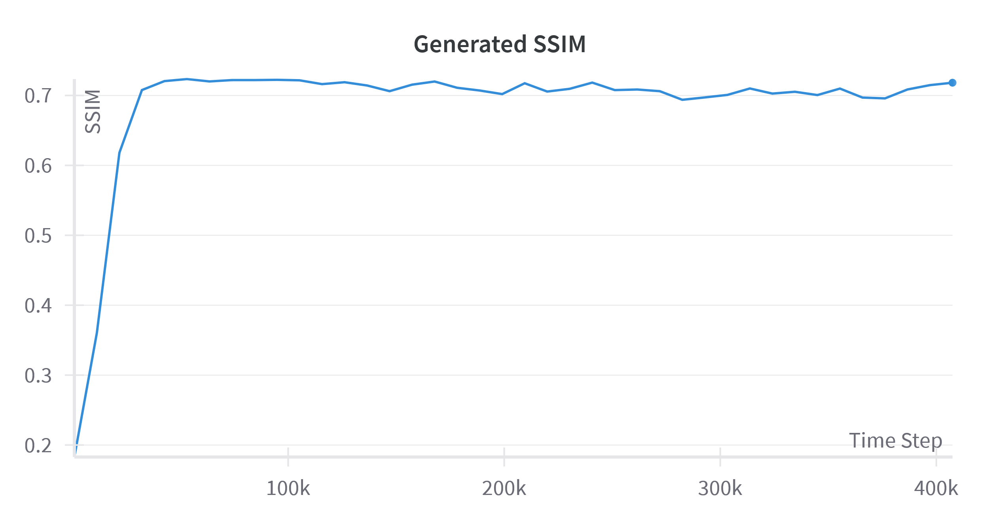

    ### Normal Control (NC)
    

    #### Metrics and Stats
    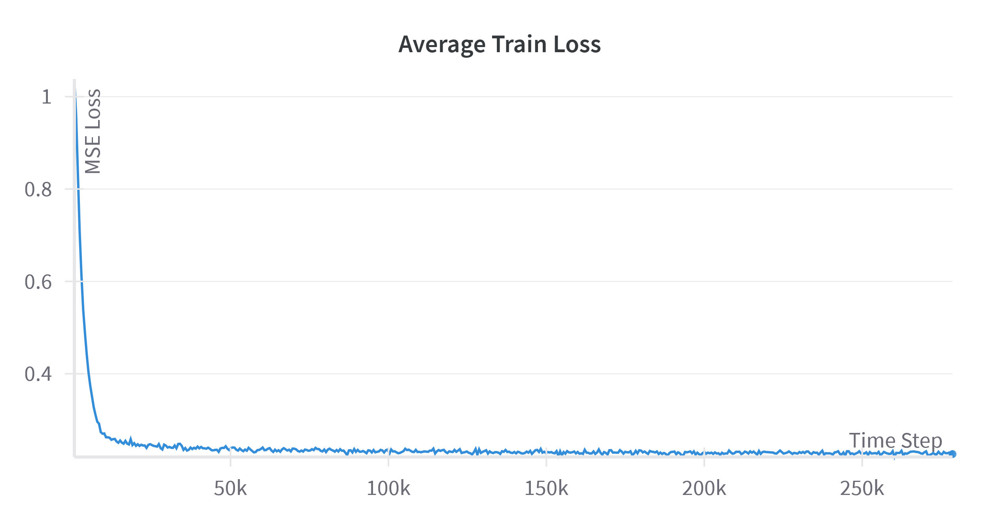
    <br>
    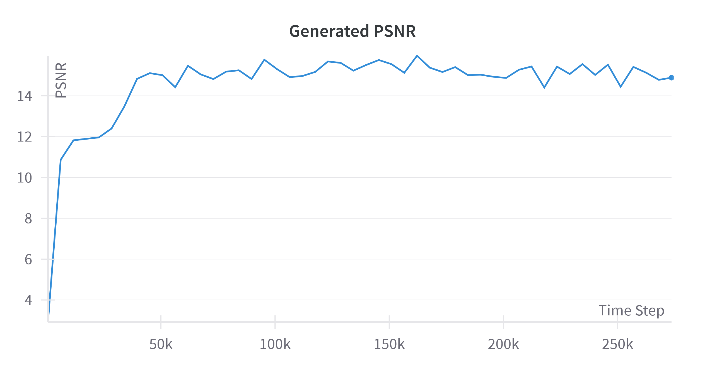
    

### Optimisation Choices

- **AdamW Optimizer**: I used AdamW instead of standard Adam. AdamW provides automatic weight decay regularisation, which can help prevent overfitting, especially important for medical imaging tasks.

- **Learning Rate Scheduler**: A custom [`CosineAnnealingWarmupScheduler`](modules.py#L414) has been implemented. This provides:
  - A warm-up phase to gradually increase the learning rate, helping with training stability. (Set to 10% of epochs)
  - A cosine annealing schedule to gradually decrease the learning rate, allowing for better convergence.

- **Gradient Clipping**: I used gradient clipping to prevent exploding gradients, which is crucial for training stability in deep networks. Image generation commonly results to gray boxes when gradients explode. 

- **Automatic Mixed Precision (AMP)**: I utilised AMP to speed up training and reduce memory usage without sacrificing model accuracy.

## Inference

To generate new images using the trained model, use the [`predict.py`](predict.py) script. This script loads the trained model and generates a specified number of images.
The pretrained Diffusion model checkpoint can be downloaded from [here](https://drive.google.com/drive/folders/1HLdgQLyyB5rquIyT4vmJ4iRNRL_JUafG?usp=sharing).

There are two sampling methods which have been implemented. 

<h3>Normal Sampling</h3>
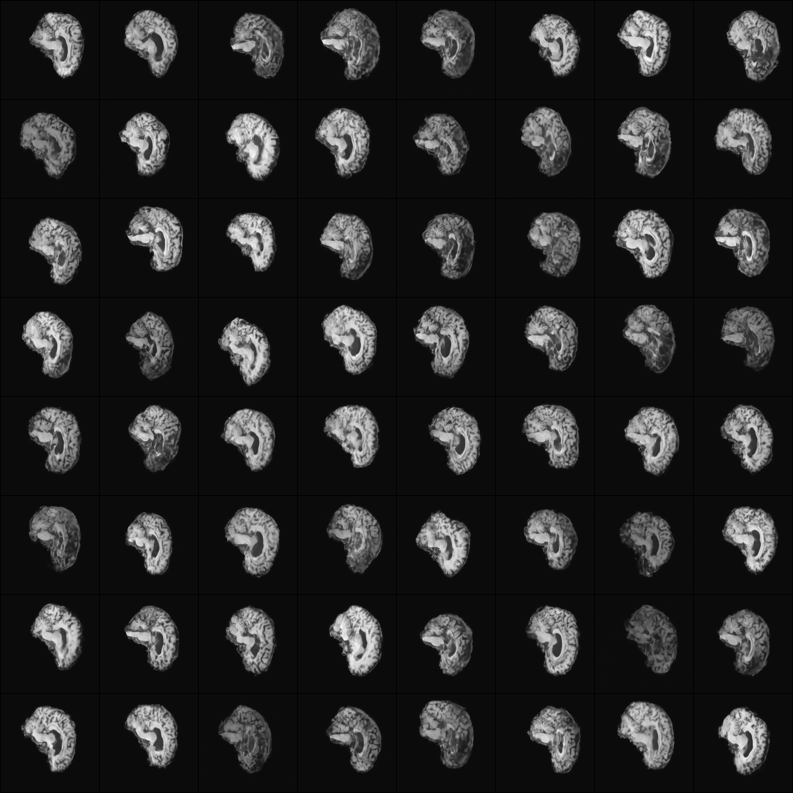
<p> Total time taken for sampling: 4.45 seconds (89.87it/s)

<h3>Fast Sampling</h3>
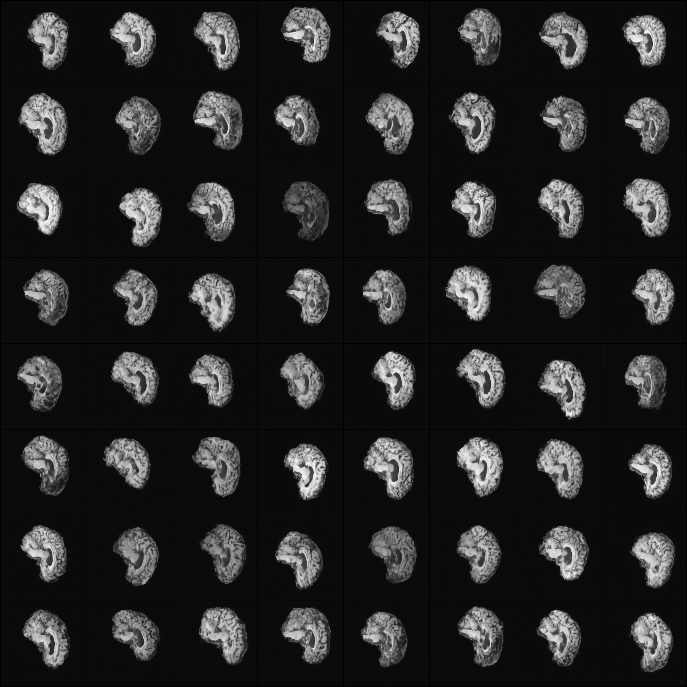
<p> Total time taken for fast sampling: 2.62 seconds (118.91it/s)

## Visualisations

- **t-SNE**: The [`tsne.py`](tsne.py) script provides t-SNE visualisation of the VAE's latent space, helping to understand the distribution of AD and NC samples in this space.

    

    <p> This representation generated from 10,000 samples from each class seems to show a large degree of overlap between the two classes particularly in the centre. 
    However, we can note that there are concentrated clusters of each class in different areas of the centre mass. We can also note that the NC samples are more sparsely 
    spread around the edges of the plot, suggestings they could have an overall wider distribution. While there is no clear separation between the two classes, these differences
    in the distribtuion do indicate some underlying differences in the representations of each class.  

- **Denoising Process**: The [`visualise_denoising_process`](utils.py#L9) function allows for visualisation of the image generation process, showing intermediate steps.

- **Training Process**: The training process automatically logs samples form the model to wandb every 10 epochs. The gif of this process is shown above in the training section. 

## Performance Metrics

I used several metrics to evaluate model performance:

- **Mean Squared Error (MSE)**: For VAE reconstruction and noise prediction accuracy.
- **Peak Signal-to-Noise Ratio (PSNR)**: To assess the quality of generated images.
- **Structural Similarity Index Measure (SSIM)**: To evaluate the structural similarity between generated and real images.

These metrics are logged using Weights & Biases (wandb) for easy tracking and visualisation.


## References

- Alammar, J (2018). The Illustrated Transformer [Blog post]. https://jalammar.github.io/illustrated-transformer/
- Gong, K., Johnson, K., El Fakhri, G. et al. PET image denoising based on denoising diffusion probabilistic model. Eur J Nucl Med Mol Imaging 51, 358–368 (2024). https://doi.org/10.1007/s00259-023-06417-8
- hkproj. (March 2024). pytorch-stable-diffusion. GitHub. https://github.com/hkproj/pytorch-stable-diffusion
- Jiang, H., Imran, M., Ma, L., Zhang, T., Zhou, Y., Liang, M., Gong, K., & Shao, W. (2024). Fast-DDPM: Fast Denoising Diffusion Probabilistic Models for Medical Image-to-Image Generation. arXiv preprint arXiv:2405.14802. https://arxiv.org/abs/2405.14802
- Joshi, Manoj & Pant, Dibakar & Karn, Rupesh & Heikkonen, Jukka & Kanth, Rajeev. (2022). Meta-Learning, Fast Adaptation, and Latent Representation for Head Pose Estimation. Proceedings of the XXth Conference of Open Innovations Association FRUCT. 31. 10.23919/FRUCT54823.2022.9770932. 
- Rombach, R., Blattmann, A., Lorenz, D., Esser, P., & Ommer, B. (2022). High-Resolution Image Synthesis with Latent Diffusion Models. In Proceedings of the IEEE/CVF Conference on Computer Vision and Pattern Recognition (pp. 10684-10695). https://arxiv.org/abs/2112.10752
- Ronneberger, O., Fischer, P., & Brox, T. (2015). U-Net: Convolutional Networks for Biomedical Image Segmentation. arXiv preprint arXiv:1505.04597. https://arxiv.org/abs/1505.04597
- Wikipedia contributors. (2024, March 8). Kullback–Leibler divergence. In Wikipedia, The Free Encyclopedia. https://en.wikipedia.org/wiki/Kullback%E2%80%93Leibler_divergence

