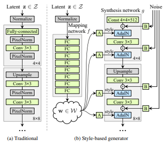
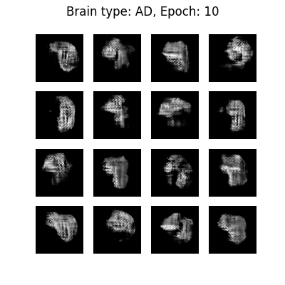
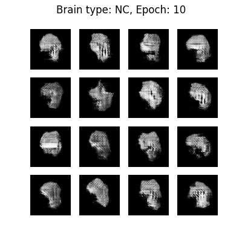
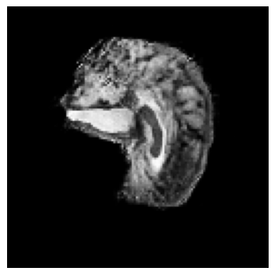
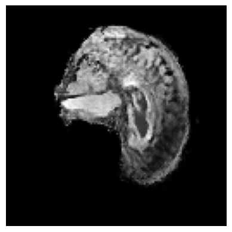

# StyleGAN for ADNI Brain Dataset

This project implements a StyleGAN model to generate synthetic brain images using the ADNI (Alzheimer's Disease Neuroimaging Initiative) dataset. The model is designed to learn the distribution of brain images and generate new samples that resemble the training data. The model has been trained on both the AD and NC classes within the dataset to generate images of brains with "Alzheimer's Disease" and images of brains considered "Normal Cognition" respectively.

## Table of Contents

- [Installation](#installation)
- [Dataset](#dataset)
- [Usage](#usage)
- [Model Architecture](#model-architecture)
- [Results](#results)
- [License](#license)
- [Acknowledgments](#acknowledgments)


## Installation
- pip
- tensorflow - 2.11.0
- matplotlib - 3.9.2
- scikit-learn - 1.5.2
- numpy - 1.23.5

## Dataset

The model uses the ADNI dataset, which can be downloaded from the [ADNI website](http://adni.loni.usc.edu/). The dataset should be organized in the following directory structure: <br/>
└── ADNI <br/>
│&emsp;&emsp;├── AD_NC/ <br/>
│&emsp;&emsp;&emsp;&emsp;├── train/ <br/>
│&emsp;&emsp;&emsp;&emsp;│&emsp;&emsp;├── AD/ <br/>
│&emsp;&emsp;&emsp;&emsp;│&emsp;&emsp;└── NC/ <br/>
│&emsp;&emsp;&emsp;&emsp;└── test/ <br/>
│&emsp;&emsp;&emsp;&emsp;&emsp;&emsp;&nbsp;├── AD/ <br/>
│&emsp;&emsp;&emsp;&emsp;&emsp;&emsp;&nbsp;└── NC/ <br/>
└── dataset.py <br/>
└── modules.py <br/>
└── predict.py <br/>
└── train.py <br/>


Make sure to place the ADNI folder in the same directory as the python files.

## Usage

1. **Training the Model**: To train the StyleGAN model, run the `train.py` script. This will load the dataset, train the model, and generate sample images.

```
python train.py
```

2. **Generating Images**: After training, you can generate new images using the trained model. Run the `predict.py` script. If you wish to generate images of a brain with Alzheimers Disease run.

```
python predict.py AD
```
<br/>
  If you wish to generate images of a brain considered Normal Cognitive, run.

```
python predict.py NC
```

  5 images of the brain of the type you want to see will be saved as png files.
<br/>
<br/>

3. **t-SNE Visualization**: After training, the script will generate a t-SNE visualization of the real and generated images, saved as `t-SNE_visualization.png`.
<br/>
Alzheimer's Disease Brains:
<br/>
.
<br/>
<br/>
Normal Cognition Brains:
<br/>

<br/>
<br/>


## Model Architecture

The StyleGAN model consists of the following components:

- **Generator**: Generates synthetic images from random latent vectors.
- **Discriminator**: Evaluates the authenticity of the generated images.
- **AdaIN Layer**: Adaptive Instance Normalization layer used in the generator to control the style of the generated images.

Figure 1: GAN Model Compared to StyleGAN Model
<br/>

<br/>
Figure 1 shows the differences between the model architecture of a basic Generative Adversarial Network (GAN) compared with a StyleGAN.

The model is built using TensorFlow and Keras, and the architecture is defined in the `modules.py` file.

## Results

After training, the model generates synthetic brain images that resemble the training data. The quality of the generated images can be evaluated visually and through the discriminator's output.

Images during training produced the following results

Alzheimer's Disease Brains:
<br/>

<br/>
<br/>
Normal Cognition Brains:
<br/>

<br/>
<br/>

Images generated from the final models produced the following results 
Alzheimer's Disease Brains:
<br/>

<br/>
<br/>
Normal Cognition Brains:
<br/>

<br/>
<br/>


## License

--------------------------------

## Acknowledgments

- [ADNI](http://adni.loni.usc.edu/) for providing the dataset.
- [TensorFlow](https://www.tensorflow.org/) and [Keras](https://keras.io/) for the deep learning framework.
- [Scikit-learn](https://scikit-learn.org/stable/) for the t-SNE implementation.
- [StyleGAN Architecture](https://arxiv.org/abs/1812.04948) for helping construct a StyleGAN
