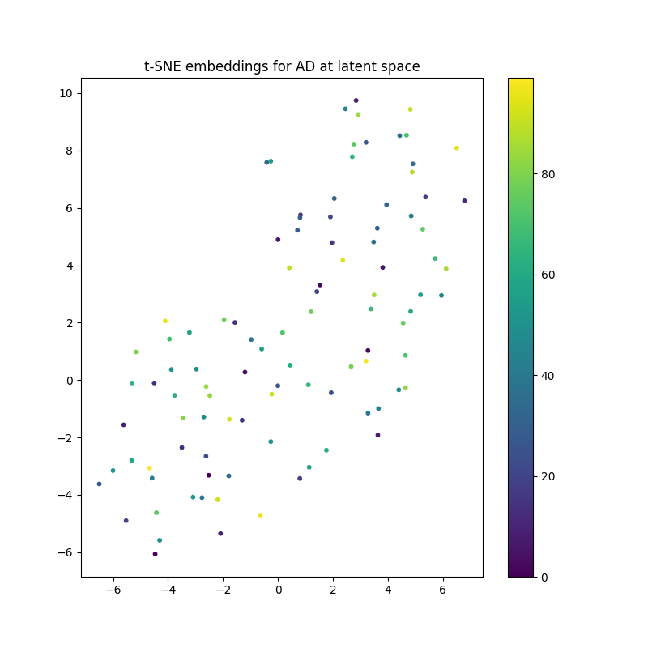

# StyleGAN for ADNI Brain Dataset

This project implements a StyleGAN model to generate synthetic brain images using the ADNI (Alzheimer's Disease Neuroimaging Initiative) dataset. The model is designed to learn the distribution of brain images and generate new samples that resemble the training data. The model has been trained on both the AD and NC classes within the dataset to generate images of brains with "Alzheimer's Disease" and images of brains considered "Normal Cognition" respectively.

## Table of Contents

- [Dependencies](#dependencies)
- [Dataset](#dataset)
- [Usage](#usage)
- [Model Architecture](#model-architecture)
- [Training](#training)
- [Results](#results)
- [License](#license)
- [Acknowledgments](#acknowledgments)
- [References](#references)


## Dependencies
- tensorflow - 2.11.0
- matplotlib - 3.9.2
- scikit-learn - 1.5.2
- numpy - 1.23.5


## Dataset

The model uses the ADNI dataset, which can be downloaded from the [ADNI website](http://adni.loni.usc.edu/). The dataset should be organized in the following directory structure: <br/>
└── ADNI <br/>
│&emsp;&emsp;├── AD_NC/ <br/>
│&emsp;&emsp;&emsp;&emsp;├── train/ <br/>
│&emsp;&emsp;&emsp;&emsp;│&emsp;&emsp;├── AD/ <br/>
│&emsp;&emsp;&emsp;&emsp;│&emsp;&emsp;└── NC/ <br/>
│&emsp;&emsp;&emsp;&emsp;└── test/ <br/>
│&emsp;&emsp;&emsp;&emsp;&emsp;&emsp;&nbsp;├── AD/ <br/>
│&emsp;&emsp;&emsp;&emsp;&emsp;&emsp;&nbsp;└── NC/ <br/>
└── dataset.py <br/>
└── modules.py <br/>
└── predict.py <br/>
└── train.py <br/>


Make sure to place the ADNI folder in the same directory as the python files.

## Usage

1. **Training the Model**: To train the StyleGAN model, run the `train.py` script. This will load the dataset, train the model, and generate sample images.

```
python train.py
```

2. **Generating Images**: After training, you can generate new images using the trained model. Run the `predict.py` script. If you wish to generate images of a brain with Alzheimers Disease run.

```
python predict.py AD
```
<br/>
  If you wish to generate images of a brain considered Normal Cognitive, run.

```
python predict.py NC
```

  5 images of the brain of the type you want to see will be saved as png files.
<br/>
<br/>

3. **t-SNE Visualization**: After training, the script will generate a t-SNE visualization of the real and generated images, saved as `t-SNE_visualization.png`.
<br/>
Alzheimer's Disease Brains:
<br/>

<br/>
<br/>
Normal Cognition Brains:
<br/>

<br/>
<br/>


## Model Architecture
### Generative Adversarial Network (GAN)
A GAN is a deep learning architecture that trains two neural networks to compete against each other and generate new data based on a given dataset. In a GAN, one network is called the discriminator, which tries to distinguish between real images from the dataset and images generated by the other network, the generator (What Is a GAN? - Generative Adversarial Networks Explained - AWS, 2023).

### StyleGAN
The StyleGAN model is an improvement on the basic GAN model. The StyleGAN incorporates an extra layer in the model. The Adaptive Instance Normalisation Layer (AdaIN). This layer aligns the mean and variance of the content features with those of the style features (Tsang, 2023). The Style GAN contains the following networks:


- **Generator**: Generates synthetic images from random latent vectors.
- **Discriminator**: Evaluates the authenticity of the generated images.
- **AdaIN Layer**: Adaptive Instance Normalization layer used in the generator to control the style of the generated images.

Figure 1: GAN Model Compared to StyleGAN Model
<br/>

<br/>
Figure 1 shows the differences between the model architecture of a basic Generative Adversarial Network (GAN) compared with a StyleGAN.

The model is built using TensorFlow and Keras, and the architecture is defined in the `modules.py` file.
<br/>


## Training
During training both the discriminator and generator networks are learning what an image of a brain looks like. The changes in the output of the models can be seen in the following training outputs:
<br/>
Alzheimer's Disease Brains:
<br/>

<br/>
<br/>
Normal Cognition Brains:
<br/>

<br/>
<br/>

### Training Hyperparameters:
Epochs: 100
Batch Size: 16
Image Size: (128,128)
Generator Learning Rate: 0.0002, increasing very slowly
Discriminator Learning Rate: 0.0001, decreasing very slowly

### Disriminator and Generator Losses


<br/>


<br/>
## Results

After training, the model generates synthetic brain images that resemble the training data. Images generated from the final models produced the following results:
<br/>
Alzheimer's Disease Brains:
<br/>

<br/>
<br/>
Normal Cognition Brains:
<br/>

<br/>
<br/>


## License

--------------------------------

## Acknowledgments

- [ADNI](http://adni.loni.usc.edu/) for providing the dataset.
- [TensorFlow](https://www.tensorflow.org/) and [Keras](https://keras.io/) for the deep learning framework.
- [Scikit-learn](https://scikit-learn.org/stable/) for the t-SNE implementation.
- [StyleGAN Architecture](https://arxiv.org/abs/1812.04948) for helping construct a StyleGAN

## References
- Tsang, S.-H. (2023, September 8). Brief Review — AdaIN: Arbitrary Style Transfer in Real-time with Adaptive Instance Normalization. Medium. https://sh-tsang.medium.com/brief-review-adain-arbitrary-style-transfer-in-real-time-with-adaptive-instance-normalization-70d30cf95ef7
- What is a GAN? - Generative Adversarial Networks Explained - AWS. (2023). Amazon Web Services, Inc. https://aws.amazon.com/what-is/gan/

‌

‌
