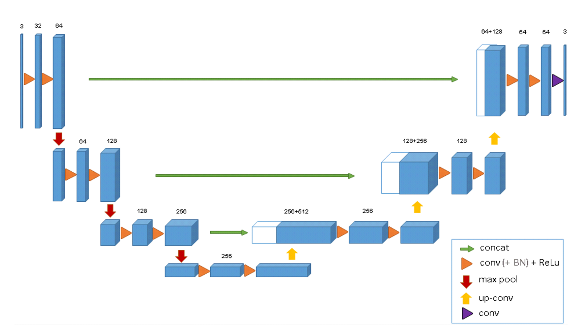
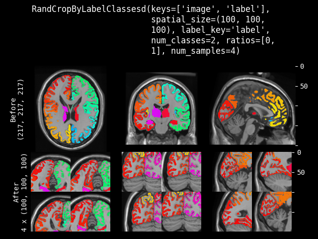
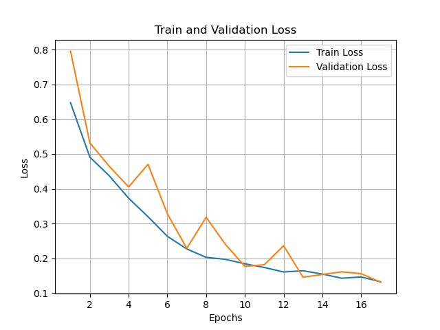
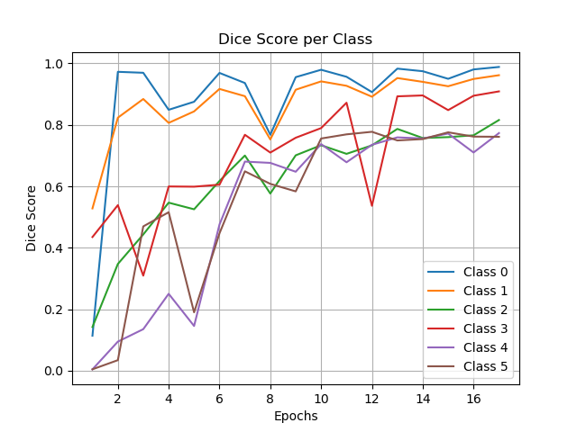
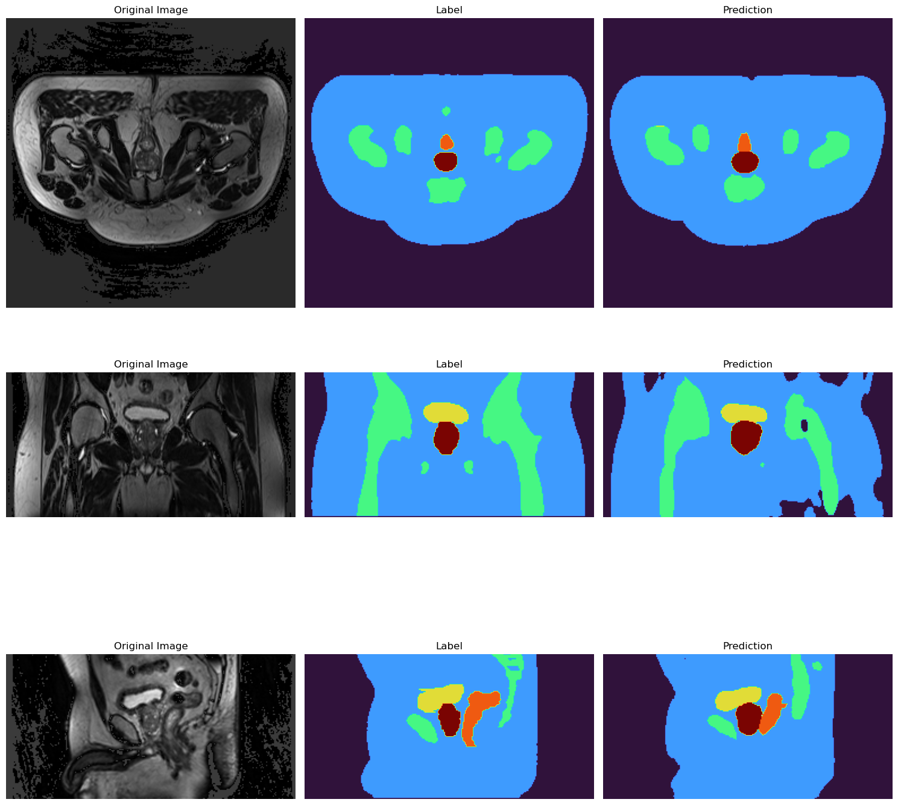
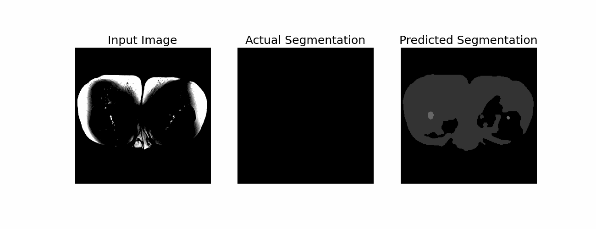

# Using a 3D UNet to segment MR images of the male pelvis
The task is to segment the down-sampled Prostate 3D dataset (Dowling & Greer, 2021) using a 3D U-Net model based on the architecture detailed by Çiçek et al. (2016) in the paper *3D U-Net: Learning Dense Volumetric Segmentation from Sparse Annotation*. The objective is to achieve a minimum Dice similarity coefficient of 0.7 for all labels on the test set. There are a total of 6 labels: (1) Background, (2) Body, (3) Bones, (4) Bladder, (5) Rectum and (6) Prostate. Below is an example of the 3D MRI segmentation prediction from the U-Net, specifically showing the Bones, Bladder, Rectum and Prostate classes:


<div align="center">
  <div style="display: inline-block; text-align: center;">
    
    <div>Label</div>
  </div>
  <div style="display: inline-block; text-align: center;">
    
    <div>Prediction</div>
  </div>
</div>

---
## Usage
**Dependencies**
- Monai 1.4.0 (for transformations)
- Pytorch 2.3.0
- Mathplotlib 3.9.2
- nibabel 5.3.2

After the imports in utils.py, you will find several user-defined parameters that can be adjusted as needed:
```python
# user defined parameters
IMAGE_DIR="/home/groups/comp3710/HipMRI_Study_open/semantic_MRs"
MASK_DIR="/home/groups/comp3710/HipMRI_Study_open/semantic_labels_only"
MODEL_PATH = "/home/Student/s4648123/MRI/best_unet.pth"
VISUALISE_RESULTS=True
RANDOM_SEED = 42
```
- _IMAGE_DIR_: This parameter specifies the path to the directory containing the images.
- _MASK_DIR_: This parameter indicates the path to the directory containing the corresponding label files.
- _MODEL_PATH_: This parameter combines the path and filename of the trained model. During training, the best model will be saved here, and during testing, this model will be used for evaluation.
- _VISUALISE_RESULTS_: If set to True, plots visualising the training process or the segmented data will be produced at the end of training or testing and saved to the running directory. Examples of these plots can be seen in the README file.
- _RANDOM_SEED_: This parameter sets the seed for random number generation, ensuring reproducibility in experiments.

#### Train

```
python train.py
```

#### Test
```
python predict.py
```
## The  model
As described above, the model implemented in this project is based on the 3D U-Net Architecture described by Çiçek et al. (2016), which is outlined below in the diagram.

<div align="center">
  
  <p style="margin-top: 1px; margin-bottom: 0;">Source: Çiçek et al., 2016</p>
</div>

The 3D U-Net model implemented in this project adheres to the conventional U-Net architecture, characterized by an encoding (analysis) path that reduces spatial dimensions while increasing the number of feature channels. The decoding (synthesis) path subsequently restores spatial resolution through up-sampling and concatenation with features from corresponding encoding layers.

In the encoding blocks, the implemented model follows Çiçek et al.'s architecture by utilizing two 3D convolutional layers, each followed by batch normalization and ReLU activation, along with max pooling for effective down-sampling. In the decoding path, it employs up-convolutions to double the spatial resolution, while concatenating with encoding features enriches the spatial context available for the segmentation task.

While the model outlined in the paper begins with 64 channels in its first layer and aggressively doubles the channels through the encoding path to reach a maximum of 512 channels at the deepest layer, the implemented model starts with 32 channels and peaks at 256 channels. This results in a lighter model compared to the one depicted, potentially impacting the depth of feature extraction. However, having a lighter model can help prevent over-fitting by having fewer parameters, which reduces its ability to memorize training data. Additionally, it improves the training time of the model.

### Pre-processing
#### Train-validation-test split
The Prostate 3D dataset (Dowling & Greer, 2021) has 211 sample, which is relatively small for training a UNet model on. As such, the data was split into training, validation, and testing sets with an 8:1:1 ratio, resulting in 169 samples for training, and 21 samples each for validation and testing. This distribution allows for substantial training data (approximately 80%), enhancing the model's learning capacity. The validation set, constituting 10% of the samples, is used to assess the model's generalization performance, to determine which model is saved. The testing set, also 10% of the data, is reserved for final evaluation, ensuring an unbiased assessment of the model's robustness and applicability to unseen data.

#### Data Augmentation

Monai's pytorch-based library was leveraged to perform the transformations on dataset. Here's a brief description and justification for each transformation performed on the training set:
1. **RandFlipd**: This random flipping along each spatial axis (x, y, z) with a probability of 0.5 for each axis introduces rotational variations in the data, which helps the model become invariant to orientation changes.
2. **NormalizeIntensityd**: Intensity normalization scales the pixel values of the images between 0-1, ensuring consistency in intensity distribution across images.
3. **RandCropByLabelClassesd**: This function crops random, fixed-sized regions from the image, centering each crop on a specific class. I used this function to create six sub-samples, each cropped to a size of (96, 96, 48), which is 37.5% of the original sample. Below is an example of how it works, where their sub-samples focus on only 1 class:
<div align="center">
  
  <p style="margin-top: 1px; margin-bottom: 0;">Source: MONAI Consortium, 2024</p>
</div>

For validation, NormalizeIntensityd is also applied to maintain consistency in intensity scaling. Resized ensures that all validation images are in a standardized shape of (256, 256, 128), which aligns with the input dimensions the model expects, and ensures that tensor arithmatic can occur without error. 

---
## Training Performance
### Training/Validation Loss vs Epoch
<div align="center">
  
</div>

This plot displays the train and validation loss over the epochs. Both losses steadily decrease, with training loss showing a smoother, more gradual decline and validation loss presenting more fluctuation, which is to be expected given that the small number of samples used in the validation set. By the final epochs, the loss curves converge to low values around 0.15, indicating that the model has achieved good generalization without significant over-fitting. 

### Validation Dice Scores per Class vs Epoch
<div align="center">
  
</div>

This plot highlights the Dice scores for six different classes. The Dice score trends generally upward as epochs increase, indicating that the model is learning to better segment each class over time. Classes 0 and 1 achieved the highest Dice scores, consistently reaching over 0.9 by the later epochs. This was expected as these are the background and body class and as such, they dominate the image. However, Classes 4 and 5 show lower scores, indicating more difficulty in segmenting these classes, likely as combined, they make up around 2.3% of the pixels in the images. However, using the transformation _RandCropByLabelClassesd_ on the training set did have a significant impact in improving the results of these classes.

On the unseen test set the following results were achieved:
- Dice Coefficients for each class: \[0.98, 0.96, 0.80, 0.81, 0.71, 0.77\]
- Overall Dice Loss: 0.16

## Segmentation Results
The following image shows the centre slice along all 3 planes of the 3D image, with the corresponding label and prediction segmentation produced by the U-Net. 
<div align="center">
  
</div>

However, this is just a snippet of the 3D image. We can also view the whole segmentation by comparing all frames 
along the x-y plane:
<div align="center">
  
</div>