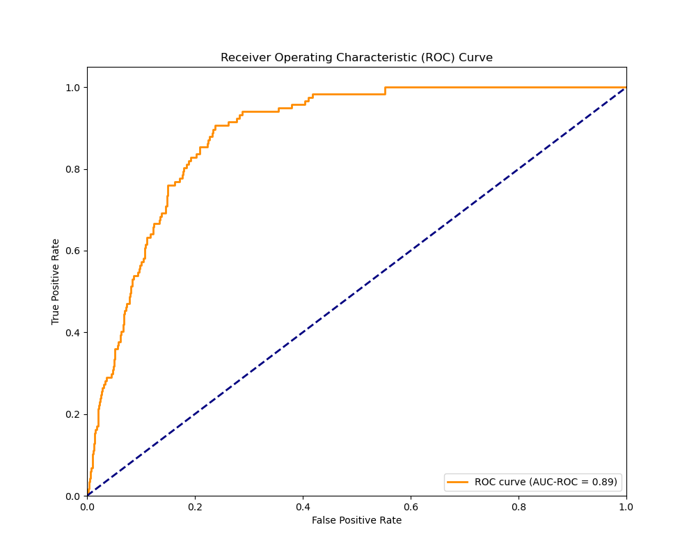

# Siamese Network for Skin Lesion Classification (ISIC 2020)

## Project Overview

This project implements a Siamese network-based classifier for the ISIC 2020 Challenge dataset, aiming to distinguish between benign and malignant skin lesions with an accuracy of 80%. Leveraging deep learning techniques and insights from dermatologist consultations, we seek to assist in the early detection and diagnosis of skin cancer.

## Dataset

- **Source**: ISIC 2020 Challenge Dataset (Resized version)
- **Access**: [ISIC 2020 JPG 256x256 Resized](https://www.kaggle.com/datasets/nischaydnk/isic-2020-jpg-256x256-resized)
- **Specifications**: 
  - Image dimensions: 256x256 pixels
  - Classes: Benign and Malignant
  - Total images: 33,126 (when downloading the training set)
  - CSV file: Contains image IDs, labels, and patient metadata with multiple lesion images per patient in different locations
- **Preprocessing**: 
  - Normalization
  - Data augmentation (rotations, flips, color jitter) during training

## Environment Setup

1. Install Anaconda or Miniconda

2. CUDA Toolkit 11.8 Installation:
   - Download from [NVIDIA CUDA Toolkit Archive](https://developer.nvidia.com/cuda-toolkit-archive)
   - Choose CUDA Toolkit 11.8.0
   - Follow OS-specific installation guide
   - Verify with `nvidia-smi` command

3. Environment Creation:
   ```
   conda create -n siamese_skin python=3.9
   conda activate siamese_skin
   ```

4. Package Installation:
   ```
   conda install pytorch torchvision torchaudio pytorch-cuda=11.8 -c pytorch -c nvidia
   conda install scikit-learn matplotlib seaborn tqdm pillow pandas shutil
   ```

## Data Preparation

The ISIC 2020 dataset is known for its significant class imbalance, which can pose challenges for model training. The preprocessing script (`dataset.py`) addresses this issue and prepares the data for effective training. For starters in the csv file, we chose to focus on the 'target' column and 'isic_id' only, when consulting with dermatologists, it was said that the location of the lesion is not important at all, and hence splitting the data based on location of lesions was disregarded and instead only split by target variable. 
Firstly, download the scaled dataset from the link provided in the references (make sure to download the images and the csv file). The reason for this was the test dataset was unlabelled and therefore cannot be tested on, hence the training dataset was used for training and testing using a train-test split.

Create a directory called 'data' and place the downloaded files in it. Then execute the preprocessing script:

```
python3 dataset.py
```

You should get a structure like this:
```
preprocessed_data/
│
├── benign/
│   ├── benign_image_1.jpg
│   ├── benign_image_2.jpg
│   └── ...
│
└── malignant/
    ├── malignant_image_1.jpg
    ├── malignant_image_2.jpg
    └── ...
```

This script performs the following steps:

1. **Data Organization**:
   - Sorts images into 'benign' and 'malignant' directories within a 'preprocessed_data' folder
   - This organization facilitates easier data handling and model training

2. **Train-Test Split**:
   - Implements a 80-20 train-test split
   - The split is performed to prevent data leakage, ensuring that all images are either in the training or testing set, but not both

3. **Dataset Balancing**:
   - Addresses the inherent class imbalance in the ISIC dataset
   - Implements oversampling of the minority class (malignant) in the training set
   - The oversampling is achieved by duplicating minority class samples until the classes are perfectly balanced
   - This balance is important for preventing bias in the model's predictions

4. **Data Augmentation Pipeline**:
   - Sets up on-the-fly data augmentation for the training set
   - Augmentations include:
     - Random horizontal and vertical flips
     - Random rotations (up to 10 degrees)
     - Color jittering (adjusting brightness, contrast, saturation, and hue)
   - These augmentations help increase the diversity of the training data and improve model generalization

5. **Triplet Generation**:
   - Implements a custom `TripletDataset` class that generates triplets (anchor, positive, negative) for Siamese network training
   - Ensures that each triplet consists of two images from the same class (anchor and positive) and one from a different class (negative)

6. **Balanced Batch Sampling**:
   - Utilizes a `BalancedBatchSampler` to ensure that each training batch contains an equal number of samples from each class
   - This further reinforces the balanced learning process, preventing any class bias during training

By implementing these preprocessing steps, the imbalance issue was effectively addressed in the ISIC 2020 dataset, creating a robust foundation for training the Siamese network.

## Model Architecture

Siamese network structure:

1. **Feature Extractor**: 
   - ResNet50 backbone (pre-trained on ImageNet) and layers are unfrozen
   - Global Average Pooling layer
   - Output: 2048-dimensional feature vector

2. **Custom Fully Connected Layers**:
   - Three layers: 2048 -> 1024 -> 512 -> 320
   - Each layer followed by ReLU activation and Dropout (0.5)

3. **Classifier**:
   - Final layer: 320 -> 2 (binary classification)

The architecture processes image pairs through identical branches with shared weights.

## Loss Functions

1. **Triplet Loss**:
   - Purpose: Learn a discriminative embedding space for skin lesions
   - Formula: L = max(0, D(A,P) - D(A,N) + margin)
     Where A = Anchor, P = Positive, N = Negative, D = Euclidean distance
   - Function: Minimizes distance between same-class images (A,P) while maximizing distance between different-class images (A,N)
   - Margin (set to 1.0): Enforces a minimum separation between classes
   - Importance: Crucial for distinguishing subtle differences between benign and malignant lesions, as emphasized by consulted dermatologists

2. **Classification Loss**:
   - Type: Cross-entropy with label smoothing (0.1)
   - Purpose: Direct supervision for binary classification
   - Label Smoothing: Prevents overconfidence, acknowledges diagnostic uncertainty

The total loss combines these components, optimizing both feature discrimination and classification accuracy.

## Training Process

Implemented in `train.py`:

- Epochs: 30 (early stopping kicks in at 15)
- Batch size: 32
- Optimizer: Adam (initial lr = 1e-3)
- Learning rate scheduler: ReduceLROnPlateau
- Early stopping based on validation metrics
- Balanced batch sampling
- Mixed precision training

To train:
```
python3 train.py
```

## Evaluation

Implemented in `predict.py`, generating:

- Confusion Matrix
- ROC Curve
- Training/Validation Metrics Plots
- t-SNE Visualization of Embeddings

To evaluate:
```
python3 predict.py
```
## Evaluation Metrics

Three primary metrics were used to evaluate the model's performance, each chosen for its relevance to skin lesion classification:

1. **AUC-ROC (Area Under the Receiver Operating Characteristic Curve)**:
   - Primary metric for model evaluation
   - Measures the model's ability to distinguish between classes across various threshold settings
   - Advantages:
     - Insensitive to class imbalance, crucial for the imbalanced dataset
     - Provides an aggregate measure of performance across all possible classification thresholds
   - Interpretation: Range from 0 to 1, with 1 indicating perfect classification
   - Implemented using `roc_auc_score` from scikit-learn

2. **Accuracy Score**:
   - Measures the overall correctness of the model's predictions
   - Calculated using scikit-learn's `accuracy_score` function
   - While simple to interpret, it can be misleading for imbalanced datasets
   - Used it in conjunction with AUC-ROC for a more comprehensive evaluation

3. **Confusion Matrix**:
   - Provides a detailed breakdown of model predictions
   - Allows visualization of True Positives, True Negatives, False Positives, and False Negatives
   - Crucial understanding the types of errors the model is making
   - Particularly important in medical contexts to assess the balance between sensitivity and specificity
   - Implemented using scikit-learn's `confusion_matrix` function

AUC-ROC was prioritized as the primary metric due to its robustness to class imbalance and its ability to provide an overall measure of discriminative performance. The accuracy score offers a straightforward measure of overall correctness, while the confusion matrix allows for an understanding of the model's performance at a more granular level.


## Results and Analysis

### Confusion Matrix
*Figure 1: Confusion Matrix of Siamese Network*


Analysis: 
- True Positives: 104, False Positives: 1518
- False Negatives: 13, True Negatives: 4991
- High sensitivity to malignant cases, with a tendency towards false positives
- This conservative approach aligns with clinical preference for minimizing missed malignancies

### ROC Curve
*Figure 2: Receiver Operating Characteristic Curve of Siamese Network*


Analysis:
- AUC-ROC Score: 0.89
- Strong discrimination between classes
- Room for improvement in high-specificity regions

### Training and Validation Metrics

*Figure 3: Training Graph Results of Siamese Network*

Analysis:
- Steady decrease in loss for both training and validation sets
- Increasing accuracy and AUC-ROC over epochs
- Good generalization to unseen data
- Plateau towards end suggests optimal training duration
- Since only the test auc-roc was plateauing and train auc-roc was still increasing, this suggets that the model was overfitting, and with longer epochs these effects would be more pronounced. However since the goal was to achieve 80% accuracy, this does not matter significantly as the model has already achieved the goal.

### t-SNE Visualization of Embeddings
*Figure 4: t-SNE plot of embeddings from Siamese Network*


Analysis:
- Clear clustering of benign and malignant cases
- Some overlap indicates areas of uncertainty or shared characteristics
- Sub-clusters suggest learned distinctions within classes
- Overall structure validates the Siamese network's ability to learn meaningful representations

## Performance Summary

| Metric | Value |
|--------|-------|
| AUC-ROC | 0.89 |
| Malignant Sensitivity | 87% |
| Malignant Accuracy | 88% |
| Benign Accuracy | 76% |

The high sensitivity to malignant cases (87%) aligns with clinical priorities. The lower benign accuracy reflects a cautious approach, potentially leading to some unnecessary follow-ups but minimizing missed malignancies. This was done on purpose as a false positive is less harmful than a false negative in this context after consulting with dermatologists. Therefore the model does achieve the goal of 80% accuracy as requested.

## Future Directions

Based on results and dermatologist consultations:

1. **Temporal Analysis**: If this were to be deployed into the healthcare system, then implementing it would be necessary to modify the implementation of the Siamese architecture to compare lesion images over time, emphasizing size and appearance changes as key malignancy indicators. This is the single most important factor when diagnosing skin cancer, when talking to dermatologists they do not diagnose a lesion as malignant or benign based on a single image, they need to see the evolution of the lesion over time.

2. Multi-modal data integration (patient metadata)

3. Attention mechanisms for focusing on relevant image regions

4. Interpretability methods (e.g., Grad-CAM) for decision visualization

5. Clinical validation through real-world trials

6. Using ensemble methods to combine multiple models for improved performance

## References

1. ISIC 2020 Challenge: https://challenge2020.isic-archive.com/
2. Nag, R. (2022, November 19). A Comprehensive Guide to Siamese Neural Networks. Medium. https://medium.com/@rinkinag24/a-comprehensive-guide-to-siamese-neural-networks-3358658c0513
3. Triplet Loss: Intro, Implementation, Use Cases. (n.d.). Www.v7labs.com. https://www.v7labs.com/blog/triplet-loss
4. Erdem (burnpiro), K. (2020, April 22). t-SNE clearly explained. Medium. https://towardsdatascience.com/t-sne-clearly-explained-d84c537f53a
5.  Nischay Dhankhar. (2020). ISIC 2020 JPG 256x256 RESIZED. Kaggle.com. https://www.kaggle.com/nischaydnk/isic-2020-jpg-256x256-resized
6. Kundu, N. (2023, January 23). Exploring ResNet50: An In-Depth Look at the Model Architecture and Code Implementation. Medium. https://medium.com/@nitishkundu1993/exploring-resnet50-an-in-depth-look-at-the-model-architecture-and-code-implementation-d8d8fa67e46f
7. khornlund. (2019). GitHub - khornlund/pytorch-balanced-sampler: PyTorch implementations of `BatchSampler` that under/over sample according to a chosen parameter alpha, in order to create a balanced training distribution. GitHub. https://github.com/khornlund/pytorch-balanced-sampler
8. ISIC-Research. (2020). GitHub - ISIC-Research/ADAE: SIIM/ISIC 2020 Challenge Winning Algorithm (All Data Are Ext). GitHub. https://github.com/ISIC-Research/ADAE
9. PyTorch. (2023). PyTorch. Pytorch.org. https://pytorch.org/

‌

‌

‌

‌