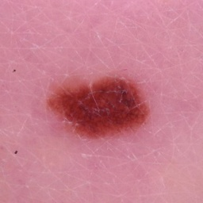
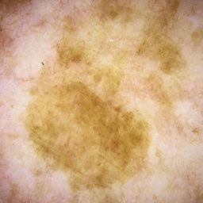
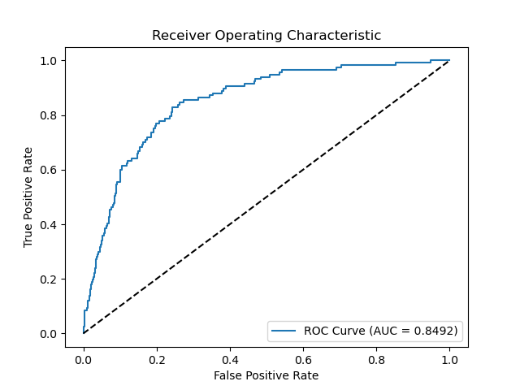
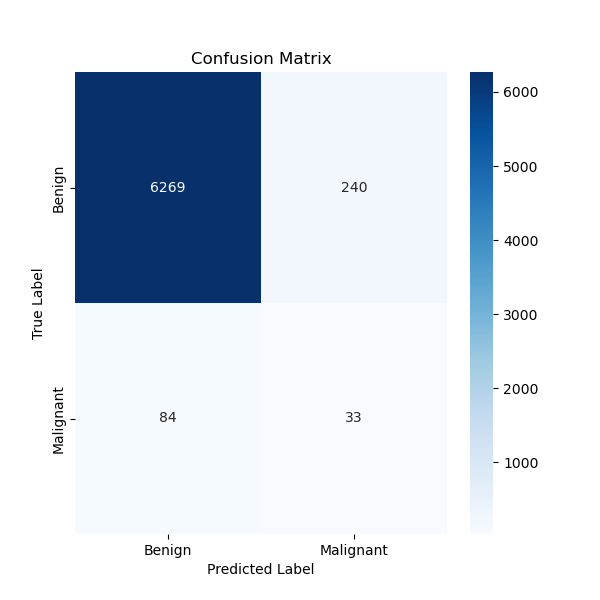

# Siamese Network Classifier for Melanoma Detection in Skin Lesion Images

## Introduction

This project implements a Siamese Network-based classifier to detect melanoma in skin lesion images from the ISIC 2020 Kaggle Challenge dataset. The goal is to classify images as benign or malignant with high accuracy to aid in early detection of melanoma.

## Problem Description

Skin cancer is one of the most common cancers worldwide, with melanoma being the most aggressive form. Early detection is crucial for effective treatment and improved survival rates. The ISIC 2020 dataset presents a binary classification challenge to distinguish between benign and malignant skin lesion images, which is complicated by class imbalance and subtle visual differences.

## Algorithm Description

### Working Principles

A Siamese Network is employed to learn meaningful embeddings that capture the similarity between images. The network is trained using contrastive loss on pairs of images. After training, the embedding network is used as a feature extractor for a classifier that predicts the probability of a lesion being malignant.

#### How It Works

1. **Siamese Network Training**:
   - The network consists of two identical CNN branches (embedding network) sharing weights.
   - Image pairs (similar and dissimilar) are fed into the network.
   - Contrastive loss minimises the distance between embeddings of similar pairs and maximises it for dissimilar pairs within a margin.

2. **Classifier Training**:
   - The trained embedding network is used to extract features from images.
   - A fully connected layer is added on top of the embeddings to perform binary classification.
   - The classifier is trained using binary cross-entropy loss.

### Network Architecture

- **Embedding Network**:
  - Convolutional layers with increasing filters (32, 64, 128, 256).
  - Batch normalisation and ReLU activation.
  - Max pooling layers to reduce spatial dimensions.
  - Adaptive average pooling to produce a fixed-size embedding vector (256-dimensional).

- **Classifier Head**:
  - Fully connected layer with 128 units and ReLU activation.
  - Dropout layer with 0.5 dropout rate.
  - Output layer with a single unit (logit output).

## Dependencies
This code was written with the following modules:
- **Python** 
- **PyTorch**
- **pandas**
- **numpy**
- **scikit-learn**
- **matplotlib**
- **seaborn**
- **Pillow**

## Data Preprocessing

- **Normalisation**: Images are normalised using the mean and standard deviation of ImageNet.
- **Resizing**: Images are resized to 256x256 pixels.
- **Data Augmentation**:
  - Random horizontal flips
  - Random rotations (up to 30 degrees)
  - Random resized crops
  - Color jitter (brightness, contrast, saturation)

### Training, Validation, and Testing Splits

- **Training Set**: 70% of the data
- **Validation Set**: 10% of the data
- **Test Set**: 20% of the data
- **Stratification**: Ensures class distribution is maintained across splits.
- **Class Imbalance Handling**: Oversampling of the minority class (malignant) in the training set to balance the class distribution.

## Usage

### Dataset Preparation

1. **Download the Dataset**:
   - [ISIC 2020 Kaggle Challenge Dataset](https://www.kaggle.com/c/siim-isic-melanoma-classification/data)

2. **Directory Structure**:
   Organise the dataset as follows:


3. **Metadata File**:
Ensure `train-metadata.csv` contains columns:
- `isic_id`: Image filenames without extension
- `target`: Labels (`0` for benign, `1` for malignant)

### Training the Model

Run the following command to train the Siamese Network and the classifier:

```bash
python train.py
```
### Making Predictions

To predict the class of a new image using the trained classifier:

```bash
python predict.py --image_path path/to/image.jpg --model_path results/your_results_dir/best_classifier_model.pth
```
## Example Inputs and Outputs

### Inputs
Example input for Benign case:



```bash
python predict.py --image_path images/example_benign.jpg --model_path results/your_results_dir/best_classifier_model.pth
```

### Outputs

```bash
Predicted Class: Benign
Probability of being Malignant: 0.0114
```

Example input for Malignant case:



```bash
python predict.py --image_path images/example_malignant.jpg --model_path results/your_results_dir/best_classifier_model.pth
```

### Outputs

```bash
Predicted Class: Malignant
Probability of being Malignant: 0.6622
```

## Results and Visualisations

### ROC Curve
*Figure 1: Receiver Operating Characteristic Curve*


### Confusion Matrix
*Figure 2: Confusion Matrix*


## Results

### Test Performance

- **Test Loss**: `0.0470`
- **Test Accuracy**: `95.11%`
- **AUC-ROC**: `0.8492`
- **AUC-PR**: `0.1134`

### Classification Report
```
              precision    recall  f1-score   support

      Benign       0.99      0.96      0.97      6509
   Malignant       0.12      0.28      0.17       117

    accuracy                           0.95      6626
   macro avg       0.55      0.62      0.57      6626
weighted avg       0.97      0.95      0.96      6626
```

## References
ChatGPT o1 was used in the construction of this report including help with the software and documentation. It was prompted with my original solutions/ ideas and asked to guide/improve them.

ISIC 2020: Skin Lesion Analysis Towards Melanoma Detection 256x256 RESIZED data: https://www.kaggle.com/datasets/nischaydnk/isic-2020-jpg-256x256-resized


## Contact Information
Harrison Martin-
s46972691
