# Classification Siamese Network Model for ISIC 2020

**Author:** Sebastian Dobson, 47447860

## Project Overview

This project had the goal of classifying images in the ISIC2020 dataset [3] as being either malignant or benign, using a Siamese Network. Training was performed on the network to help distinguish between the two classes' feature vectors that come from the feature extractor.

Siamese Networks are used to classify images, and can have a range of architectural designs that vary slightly depending on the task at hand. However, the main components of the network include a feature extractor and a classifier. The feature extractor is a typical Convolution Network, who's goal it is to vectorize any images it receives by extracting important features that are learned via the training process. One option to training the feature extractor is to use one of two Siamese Loss Functions, either Contrastive Loss or Triplet Loss [5]. This approach is recommended for multi-class classification, because the primary goal is to train the feature extractor to generate similar feature vectors for items of the same class, making the classification step easier. Contrastive Loss as shown below, works by giving the same Feature Extractor Network two images, then taking their feature vectors and performing the loss function.

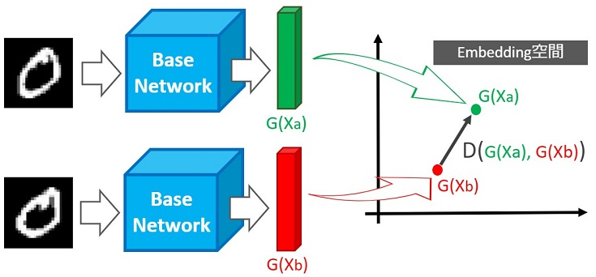

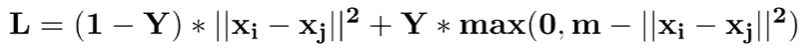

If the two images are of the same class, Y = 0, therefore the Loss Function aims to minimize the distance between the two images' feature vectors. If the images are of different classes, Y = 1 and the Loss Function aims to maximise the distance between the feature vectors, keeping them within some margin of each other, this margin is used to restrict the distance between classes' vectors for when there are multiple classes [6].

The second Siamese Loss Function is Triple Loss, which works similarly to Contrastive Loss, however rather than taking two images as input, triple loss takes three images. There is an 'anchor' image, a positive image (image of the same class as anchor), and a negative image (image of a different class as anchor). All three images are passed through the Feature Extractor Network to generate a feature vector for each. These feature vectors are then used in the triple loss as seen below.

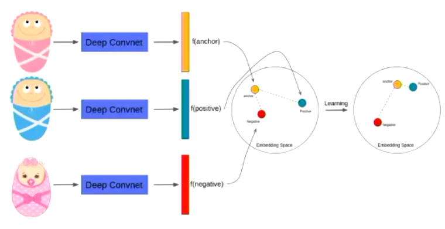


The goal of the triplet loss function is to minimise the distance d() from the anchor (a) and positive (p) image, while simultaneously maximising the distance from the anchor and the negative (n) image, with m telling us how far the negative point must be from the anchor. This loss method is preferred when there are a low number of data samples, due to its ability to learn faster due to its parallel learning nature [7].

Once this feature extractor has been trained via either method, the feature vectors are then passed to a classifier. The classifier is usually a simple Multi-Layer Perceptron Network (MLP), that takes in the feature maps and uses a final softmax layer to generate the probabilities of the image being part of each class. This MLP can be trained using a simple loss function such as Cross-Entropy Loss, however this is always done after the feature extractor training.

This Siamese Network design method maximises the utilization of the data, as it allows for the repeated use of the same images, while still providing new information to the network. This type of approach allows Siamese Networks to do things like one-shot learning. An additional implementation technique is to use semi-hard or hard mining, which involves determining which triplets/pairs the feature extractor has difficulties distinguishing between, and focussing the learning on these triplets/pairs.

The other main Siamese Network design, which was chosen for this project, is a simpler approach that is primarily used for Binary Classification. This method also contains a feature extractor and a classifier network, however trains both networks at the same time using Binary Cross-Entropy Loss. This can be done due to the back propagation step propagating all the way through both the MLP Classifier and the Convolution Network Feature Extractor. The reason this method is suggested only for binary classification is due to the loss function's goal of simply getting the similarity of images using a final sigmoid layer, rather than trying to localise feature vectors of the same class. This architecture shown below shows that similarly to Contrastive Loss, two images are passed thorugh the feature extractor and the resulting feature vectors are passed to the MLP classifier. The MLP then calculates the 'similarity' between the two images, with the target for images of the same class being 1, and of different classes being 0. The loss calculated from the target and actual similarity score is what is used for the learning step.

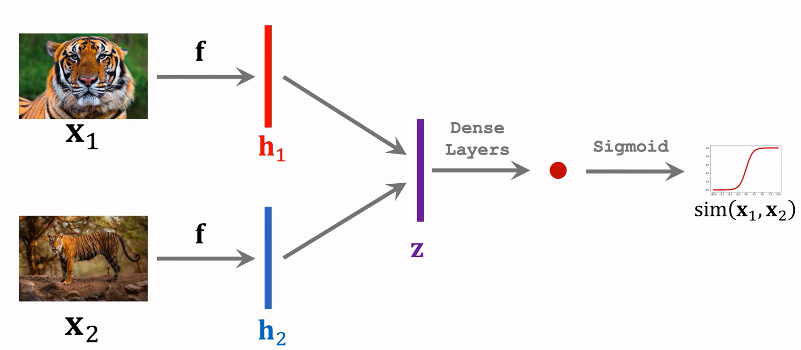

For this project, a pre-trained Resnet18 network was used as a starting point for the feature extractor network. This is primarily due to its reputation of being very effective at extracting important features. The Resnet18 network is a Convolution Network with 18 layers, as seen below. This network was only a starting point, because its weights were still updated during the training process to optimise it for the ISIC2020 images [9].

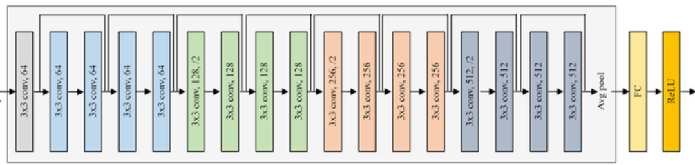

### Deep Learning Pipeline

1. Data Pre-Processing
2. Model Architecture
3. Training Process
4. Testing Process

## 1. Data Pre-Processing

The original dataset contains a set of RGB 256x256 images, containing 33,126 dermoscopic training images of unique benign and malignant skin lesions from over 2,000 patients. The data is extremely unbalanced with 32,542 of these images being benign, and 584 of them being malignant. To prepare the data for use in the dataset.py module, the data was split into training, validation and test data, each being allocated their own sub-directory. The split consisted of 70% training, 15% validation and 15% test, where these percentages were taken independently for each class, guaranteeing the split's accuracy given the inbalance. This splitting process was performed manually but could also be done via a script.


| Dataset    | Benign | Malignant |
| ---------- | ------ | --------- |
| Training   | 22,780 | 408       |
| Validation | 4,881  | 88        |
| Testing    | 4,881  | 88        |

In dataset.py, it can be seen that the images are paired randomly before being given to the networks, this is to make the training process easier as the network requires pairs of images and a target similarity score. This is done in the create_pairs() method where each image in the dataset is allocated a random target (1 or 0), if the target is 1 then a random image from the same class is allocated as its 'pair', and if the target is 0, then a random image from the other class is allocated as its pair. Due to the high frequency of benign data and the low frequency of malignant data, this method results in a high number of re-used maligant images across all pairs. To help reduce the over-training this would cause, and to combat the significant imbalance in the data, all images are augmented before being used by the network. By augmenting the benign images as well, this allowed for more augmentation techniques to be used on the malignant images without the network being able to cheat in its classification (such as rotation and shearring that result in visually different looking compared to the original data).

This augmentation was coupled with normalisation to ensure consistent input data distribution, converting the images to tensors so that the training can be performed on the GPU, and reshaping to the 224x224 optimal dimension for the Resnet18 Feature Extractor. The target classes of each image and target similarity were also all converted to tensors to allow for optimised GPU performance.

## 2. Model Architecture

The architecture of the Simaese Network can be seen in the modules.py file.

The Feature Extractor network uses a Resnet18 model due to its renowned effectiveness in extracting features from images, with architecture discussed above. The two feature vectors from this model then had to be given to the classifier section of the network. Some methods of doing this include the dot product (to provide distance between the vectors), element-wise multiplication, or concatentation [2]. The chosen method for the project was to provide the MLP with both feature vectors, and their element-wise multiplication. These three vectors were concatenated together and given to the classifier part of the network.

The design of the Classifying MLP Network is

```
self.cls_head = nn.Sequential(
            nn.Linear(3 * out_features, 64),
            nn.BatchNorm1d(64, momentum=0.25),
            nn.LeakyReLU(),
            nn.AlphaDropout(p=0.5),
            nn.Linear(64, 1),
            nn.Sigmoid(),
        )
```

It takes a 1D feature vector of size `3 * out_features` (where `out_features` is the size of the feature extractor's output, which is 1x1000). The network first reduces the feature vector to 64 dimensions, applies batch normalization, and introduces non-linearity using Leaky ReLU. Dropout is applied to regularize the model and prevent overfitting. It then outputs a single probability, after applying the sigmoid function, representing the likelihood that the two images belong to the same class.

## 3. Training Process

The training process can be seen in train.py, where the DataLoaders are created, and the model parameters including the Loss Function and Optimizer is defined.

##### Model Parameters

* Training Batch Size = 128
* Validation Batch Size = 16
* Test Batch Size = 1
* Epochs = 20

##### Loss Function

* Binary Cross Entropy Loss

##### Optimizer

* Adam Optimiser
* Learning Rate = 0.00001
* Weight Decay = 0.00001

##### Training Method

The process of training the Siamese Network consisted of a training step and validation step for each epoch. In the training step, all the data in the training_data_loader is iterated through to train the network. Each of these iterations takes a batch of 128 pairs of images as described above, and passes them through the Siamese Model to get a resulting *similarity* between the two images, a score from 0<=similarity<=1. This similarity score is passed to the Binary Cross Entropy Loss Function along with the *target* similarity score. This *loss* is then used with the Adam Optimizer to back propogate through both the MLP and the ResNet18 Networks to update the weights. To determine is a classification is correct, the similarity score is rounded to the nearest class and compared with the target to see if there is a match. This is how the accuracy for each Epoch is calculated, and plotted along with the loss for that Epoch. The graphs below shows a visual depiction of the training process.

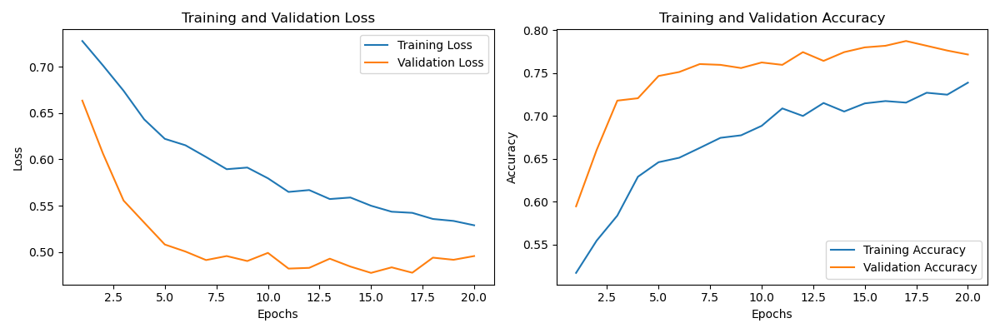

Note: This training data was restricted to contain only 4,000 benign images, and validation data to contain 1,000 so that it could be run on a 3080 within reasonable time limits.

The epoch number was stopped at 20 for *early-stopping* purposes, due to the validation accuracy decreasing from this point onwards although the training accuracy continued to increase. It can be seen that the validation loss stopped decreasing after about 12-15 epoch, and the validation accuracy peaked at around 17 epoch, this shows that the model had learned the featured relatively fast but not perfectly. Additionally, the levels of loss are quite high, indicating that the model has little confidence in classifying the images even after further training, showing that the model isn't neccisarily learning *similarities* between same class images, but is rather aiming for good classification accuracy. This proves there was some limitation of the model for learning generalised features of the images, as the model began to overfit to the training data after this. This issue was addressed by increasing the dropout rate of the model, using regularization techniques in the optimizer, simplifying the Classification part of the Siamese Network, using Batch Normalisation and augmenting the data, however the model still began to overfit training data after some time. It is believed that this is due to the complexity of the ResNet18 model, which may cause the feature extraction to not extract general enough features and actually begin to learn the limited number of malignant images. Therefore, this model could be further improved by using more malignant data, or potentially by implementing Triplet Loss functionality along with Semi-Hard Mining, which is known to be effective for limited data quantities.

## 4. Testing Process

The testing process can be seen within the predict.py module, which has a similar process as the validation step during training. A new Siamese Network is initialised, with the *best* weights saved from the training process, the model is then put into evaluation mode, and the testing begins.

Similarly to training, pairs of images from the completely unseen test_data_loader are given to the model, where the rounded similarity is compared to the target to calculate the accuracy of the model. Every 100 images, the image pair is saved with their similarity score and their corresponding classes, this was done to potentially visually identify how the model was differentiating between images. Some of these image pairs can be seen below, along with the overall accuracy and loss scores of the Siamese Network.

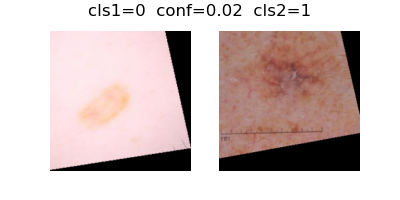

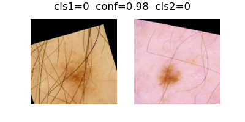

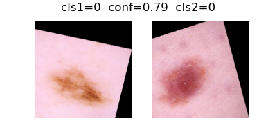

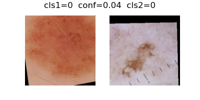

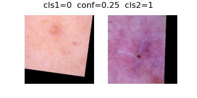

```
Test Accuracy = 0.78
Test Loss = 0.50
```

Note: This test data was restricted to contain only 1,000 benign images so that it could be run on a 3080 within reasonable time limits.

As seen in the item pairs above, the Siamese Network has trouble identifying images are in the same class when they visually look quite different, as seen in pair 4 which are of the same class but have an extremely low similarity score of 0.04.

Overall, the Siamese Network binary-classification accuracy is pretty good, although it reached around 80% which was required of the task, it appears that the model may have been overfitted to the training data, thus resulting in innacuracies in the validation and test data. The Test Loss is also not the best, indicating the same thing discussed in the training section that the model seems to have lack of confidence, or that it has significant loss for its incorrect classifications. It is believed that better results may be possible with either training a Resnet model from scracth (which would require substantially more data), or implementing a simpler feature extractor network and training it using Triplet Loss and Semi-Hard Mining. The model did achieve the desired accuracy, however it has potential to do better.

## Project Structure

### Files

The python scripts for the project are:


| **Module**                                   | **Description**                                                                                                                                                                                                         |
| -------------------------------------------- | ----------------------------------------------------------------------------------------------------------------------------------------------------------------------------------------------------------------------- |
| [dataset.py](dataset.py)                     | Loads the data, preprocesses it, and pairs images to be used by the model.                                                                                                                                              |
| [modules.py](modules.py)                     | Main Siamese Network model components including the ResNet18 Backbone Feature Extractor, and the MLP Classifier.                                                                                                       |
| [predict.py](predict.py)                     | The testing process that tests the similarity between unseen images to determine the effectiveness of the model.                                                                                                        |
| [README.md](README.md)                       | What you are reading.                                                                                                                                                                                                   |
| [train.py](train.py)                         | The training process for the model which includes both a training and validation step for each epoch,<br />as well as saving the best model's weights, and plotting the accuracy and loss of two steps for each epoch. |
| [to_subdirectories.py](to_subdirectories.py) | A helper module to split the imported data into a subdirectory for each class (before manual splitting).                                                                                                                |

### Dependencies

This python project was run using Python 3.12.4, Anaconda was used for package and dependency management. The dependencies (and their version numbers) required for running this project are as follows:


| **Dependency** | **Version** |
| -------------- | ----------- |
| torch          | 2.4.0       |
| torchvision    | 0.19.0      |
| numpy          | 1.26.4      |
| matplotlib     | 3.8.4       |

The `.yaml` file [environment.yml](environment.yml) contains the conda environment used for this project. To create the environment `conda-torch`, run the following command:

```bash
conda env create -f environment.yml
```

### Running training and testing

The entrypoint to the project is [train.py](train.py). This assumes you are in the PatternAnalysis-2024 root directory. To train and test the model, run the following command:

```bash
python3 recognition/SiameseNet_47447860/train.py --project <path to output location> --data <path to data>
```

The data used for the project was a resolution reduced version of the original ISIC2020 dataset. The data can be found on Kaggle at the link [ISIC 2020 JPG 256x256 RESIZED](https://www.kaggle.com/datasets/nischaydnk/isic-2020-jpg-256x256-resized/data?select=train-metadata.csv), it was downloaded then split into subdirectories for Malignant and Benign images before being manually split into training, validation and test subdirectories.

The data path given to the command above should be the absolute path to a directory that contains a sub-directory for each of the training, validation, and test data, each containing their own sub-directories for each class of image, this structure can be seen below:
/absolute_data_path/
├── train_data/
│   ├── 0/
│   │   ├── image_1.jpg
│   │   ├── image_2.jpg
│   │   └── ...
│   └─── 1/
│       ├── image_1.jpg
│       ├── image_2.jpg
│       └── ...
│
├── validation_data/
│   ├── 0/
│   │   ├── image_1.jpg
│   │   ├── image_2.jpg
│   │   └── ...
│   └─── 1/
│       ├── image_1.jpg
│       ├── image_2.jpg
│       └── ...
│
├── test_data/
│   ├── 0/
│   │   ├── image_1.jpg
│   │   ├── image_2.jpg
│   │   └── ...
│   └─── 1/
│       ├── image_1.jpg
│       ├── image_2.jpg
│       └── ...

By running the above train.py command, data loaders will be created based on the data you allocate within the subdirectories. Two new subdirectories will be created within the *project* path given, including *outputs* and *results*, where results will store the saved image pairs during the testing process as discussed above, and the output directory will store the training metrics plot as well as the best model's state. Std-out will also display the training process, printing both the training and validation accuracy and loss for each epoch, as well as the progression, accuracy and loss for the testing process that automatically runs after the model is trained.

### Other notes

Within the train.py module, there is an option to limit the amount of benign data that is included in each of the DataSets, this can be helpful to reduce training times however does limit the effectiveness of the model if too low. An example of this functionality is:

```
train_data = Dataset(train_data_path, dataset_size=4000)
```

## References

The following sources were referenced in the development of this project:

* [1] Siamese Network Visualisations: [Siamese Neural Networks](https://youtu.be/T9yKyZfxUJg?si=ZdBJamY5RRTQnDTA)
* [2] Siamese Network Visualisations: [Few-Shot Learning (2/3): Siamese Networks](https://youtu.be/4S-XDefSjTM?si=YTEcCOdFa2P3Pudr)
* [3] ISIC2020 Official Dataset: [The ISIC 2020 Challenge Dataset | ISIC 2020 Challenge Dataset](https://challenge2020.isic-archive.com/)
* [4] ISIC2020 Reduces Dataset: [ISIC 2020 JPG 256x256 RESIZED](https://www.kaggle.com/datasets/nischaydnk/isic-2020-jpg-256x256-resized/data?select=train-metadata.csv)
* [5] Siamese Network: [Siamese Networks Introduction and Implementation | by Aditya Dutt | Towards Data Science](https://towardsdatascience.com/siamese-networks-introduction-and-implementation-2140e3443dee)
* [6] Siamese Network Contrastive Loss: [Exploring Siamese Networks for Image Similarity using Contrastive Loss | by Srikaran | Medium](https://medium.com/@hayagriva99999/exploring-siamese-networks-for-image-similarity-using-contrastive-loss-f5d5ae5a0cc6#:~:text=Contrastive%20loss%20is%20a%20loss%20function%20commonly%20used,space%2C%20while%20dissimilar%20inputs%20are%20pushed%20further%20apart.)
* [7] Siamese Network Triplet Loss: [Understanding Siamese Networks and Triplet Loss: A Comprehensive Guide | by Jashmina Thangarajah | Medium](https://medium.com/@jashmi2507/understanding-siamese-networks-and-triplet-loss-a-comprehensive-guide-0fe7dfeaf9f2#:~:text=Triplet%20Loss%20is%20a%20loss%20function%20used%20in,samples%20%28anchor%20and%20negative%29%20by%20a%20specified%20margin.)
* [8] Guidance Siamese Network: [sohaib023/siamese-pytorch: A PyTorch implementation of siamese networks using backbone from torchvision.models, with support for TensorRT inference.](https://github.com/sohaib023/siamese-pytorch)
* [9] ResNet18 Model: [What Is Resnet18 - Fine-tuning | Restackio](https://www.restack.io/p/resnet18-knowledge-what-is-resnet18-cat-ai)
