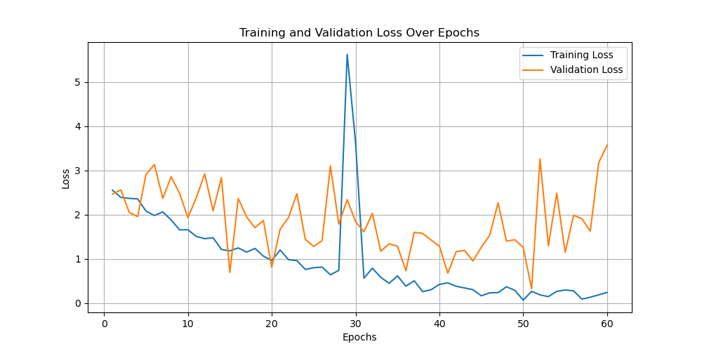

# **Tumor Classification using Siamese Networks**

**Author**: Gurushey Deo  
**Student ID**: s4742562

## The Model - Siamese Net + Classifier

### **Algorithm Description and Problem it Solves:**
This project involves classifying tumors using a Siamese Network combined with a classifier. The Siamese Network is used to generate feature embeddings, which are then compared to predict whether an image depicts a tumor or not. The classifier uses a reference set of embeddings from known samples to make predictions.

The Siamese Network is well-suited for scenarios involving similarity comparison tasks. In this case, it is used for medical image analysis to determine whether new tumor images are similar to previously classified examples, thus facilitating binary classification into 'benign' or 'malignant' categories.

  

  

### **Dataset Overview**
The dataset is divided into training, validation, and test sets, and it is summarized in the table below:

| Dataset Split  | Size  | Class 0 Count | Class 1 Count |
|----------------|-------|---------------|---------------|
| Train          | 23,186| 11,593        | 11,593        |
| Validation     | 3,313 | 3,255         | 58            |
| Test           | 6,626 | 6,509         | 117           |

The dataset is highly imbalanced, with significantly fewer positive cases in 
the validation and test sets. The dataset is from the 2020 ISIC Challenge on Skin Lesion Analysis Towards Melanoma Detection.

### **How it Works:**
The Siamese Network generates embeddings for input tumor images, and these embeddings are used with a margin-based classifier to predict the label. During training, contrastive loss is used to ensure that the embeddings for similar images are close together, while embeddings for different images are far apart.

#### **Contrastive Loss**
Contrastive Loss is the primary method used to train the Siamese Network. It helps in learning the distance metrics for pairs of images, bringing similar images closer while pushing dissimilar ones apart.

  

#### **Embeddings Visualization**
The visualization of embeddings generated by the Siamese Network helps to understand the learned features better. Below is a PCA + t-SNE plot of the embeddings:

  

## **Results**
The alogrithm achieved an overall test accuracy of 90.55%
`Test Accuracy: 90.55%`

The training and validation losses over 60 epochs are depicted in the following plot. The model's performance shows the expected trend, with the training loss decreasing steadily. The validation loss is relatively higher and stays stable due to the imbalanced dataset and limited examples of Class 1:

**Loss Plot**

  

**Confusion Matrix**
The confusion matrix below summarizes the performance of the classifier on the test set. The imbalance between true positives and true negatives is clearly visible, indicating the challenges presented by the highly imbalanced dataset:

  

## **Summary**
The project demonstrates the use of Siamese Networks for tumor classification with medical images. Despite the challenges posed by the imbalanced dataset, the model is able to achieve good separation between positive and negative classes using a contrastive loss approach. The results show promising performance, but further tuning and balancing techniques could be used to improve the classifier's ability to generalize, especially for rare positive cases.

The use of visualization techniques like t-SNE also provides insights into the model's ability to learn useful features, and the plots generated during training and evaluation offer a comprehensive view of the model's performance.

