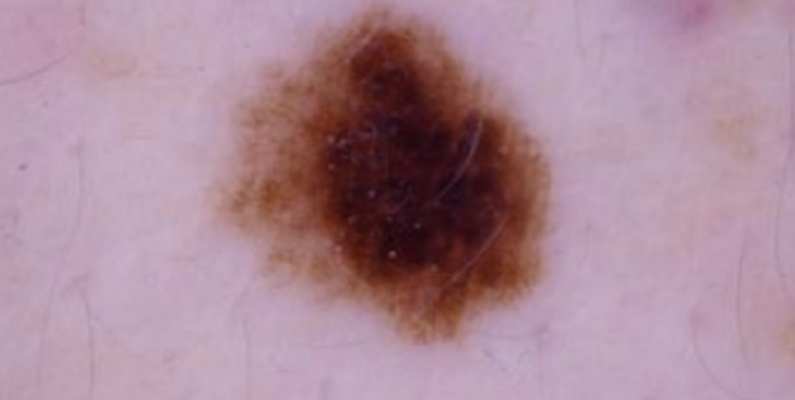
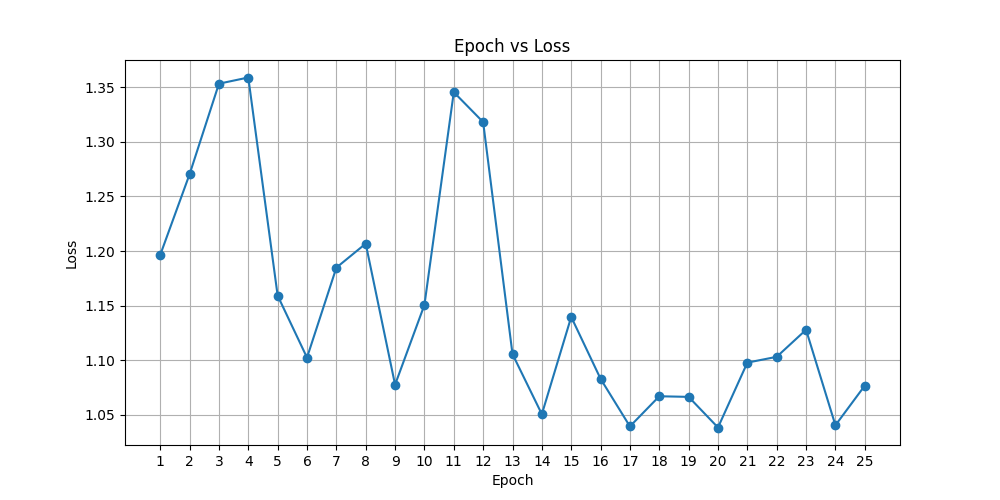

# Siamese Network Classifier for ISIC 2020 Dataset

This project implements a **Siamese neural network** to classify skin lesion images from the **ISIC 2020 Kaggle Challenge dataset**, aiming to differentiate between normal skin and melanoma.

## Problem

Melanoma is a serious form of skin cancer, and early detection is critical for effective treatment. In this project, we create a Siamese network-based classifier to distinguish between images of normal skin and melanoma using the ISIC 2020 dataset. The goal of this model is to achieve an accuracy of 80% on the test set. The model addresses the problem of binary classification for medical images, specifically to detect malignant melanoma in dermoscopic images.

## Algorithm Description

This algorithm leverages a Siamese network architecture to classify skin lesion images from the ISIC 2020 dataset. The network takes pairs of images as input, learning to determine if the images belong to the same class (benign or malignant) or not. The model employs a Convolutional Neural Network (CNN) as a feature extractor, which processes each image in the pair to extract relevant features. These features are then compared using a contrastive loss function, which penalizes dissimilar pairs and rewards similar pairs. The goal is to learn a feature space where images from the same class are close together, and those from different classes are far apart. By learning these relationships, the network becomes capable of accurately classifying unseen data, even with limited labeled examples.

## Inputs

The inputs to the siamese network are 256x256 images of benign and malignant melanoma. Here is an example of this input:



## Outputs

The output of this network is a value that classifies whether an image shows benign or malignant melanoma. For example if the output is 1, the image shows malignant melanoma and vice-versa for benign cases.

## Dataset

The images from the ISIC dataset were imported with an 80/20 training/testing split. This is typically best practise when it comes to classification tasks. There was no validation set chosen for hyperparameter tuning as the adam optimiser did a good job achieving the desired accuracy, and there was no need for further optimisation. The labels were matched to the images using a csv file that contains the image name and the corresponding label.

The data was then used to create pairs of two images with their associated similarity (if they are both the same type, they will have a label of 0, and if they are different they have a label of 1). Since pairs were created, the dataset could be used to create different combinations, and for this reason, 50,000 pairs could be generated with ~35,000 images. Note that no seed is set for matching the pairs, the only requirement is that there is an even split of similar and odd pairs (50/50). The training and testing will vary in accuracy very slightly between runs (approximately 2%).

## Preprocessing

Preprocessing includes resizing the images to 256x256 pixels and converting them to tensors. Malignant images undergo data augmentation with random rotations, flips, and color jittering to generate five additional samples per malignant image. This helps the model generalize better and counteract the imbalance of benign vs. malignant cases in the dataset. The augmentation is only applied to the malignant cases. 

## Implementation and Hyperparameters

This model is trained on a batch size of 16, and is designed to be run on a GPU with cuda support such as the NVIDIA A100. In this implementation, an epoch size of 25 was chosen, since this was the point of diminishing returns and the model seemed to begin overfitting. Furthermore the adam optimiser was used, with a learning rate of 0.001.

The CNN used was chosen to have 3 convolution layers with a ReLu activation layer, with a MaxPool layer in between the convolution layers.

| Layer        | Type               | Parameters                  | Output Shape        |
| ------------ | ------------------ | --------------------------- | ------------------- |
| **Conv1**    | Conv2d (3 → 64)    | `kernel_size=9`, `stride=3` | `(64, H/3, W/3)`    |
| **ReLU1**    | ReLU               | `inplace=True`              | `(64, H/3, W/3)`    |
| **MaxPool1** | MaxPool2d          | `kernel_size=3`, `stride=2` | `(64, H/6, W/6)`    |
| **Conv2**    | Conv2d (64 → 128)  | `kernel_size=4`, `stride=1` | `(128, H/6, W/6)`   |
| **ReLU2**    | ReLU               | `inplace=True`              | `(128, H/6, W/6)`   |
| **MaxPool2** | MaxPool2d          | `kernel_size=2`, `stride=2` | `(128, H/12, W/12)` |
| **Conv3**    | Conv2d (128 → 256) | `kernel_size=3`, `stride=1` | `(256, H/12, W/12)` |
| **ReLU3**    | ReLU               | `inplace=True`              | `(256, H/12, W/12)` |

After these layers, the feature maps are flattened, and used followed by fully connected layers. The fully connected layer architecture consists of three linear layers with ReLU activations in between. The architecture is as follows:

| Layer     | Type   | Parameters                                                        | Output Shape     |
| --------- | ------ | ----------------------------------------------------------------- | ---------------- |
| **FC1**   | Linear | `input_size=self._get_conv_output_size(shape)`, `output_size=512` | `(512,)`         |
| **ReLU1** | ReLU   | `inplace=True`                                                    | `(512,)`         |
| **FC2**   | Linear | `input_size=512`, `output_size=128`                               | `(128,)`         |
| **ReLU2** | ReLU   | `inplace=True`                                                    | `(128,)`         |
| **FC3**   | Linear | `input_size=128`, `output_size=num_classes`                       | `(num_classes,)` |

Furthermore, the constrastive loss function was chosen to have a margin of 2, which worked very well.

## Loss

The constrastive loss function was chosen for this model, as it was simpler to implement than the triplet loss function. As the contrastive loss is minimised, the siamese network gets better at classification, as well as mapping the features to different. This model did take a while to train and minimise this loss function, but as seen below on a run with only 25 epochs, the loss does decrease over time. It was also found that marginal decreases in the loss would still dramatically improve the CNN that is used to classify the images.



## Dependencies

-   Python 3.12
-   torch==2.0.1
-   torchvision==0.15.2
-   pandas==2.1.1
-   PIL==10.0.0
-   kagglehub==0.3.0

Ensure that the required libraries are installed using:

```bash
pip install torch torchvision pandas kagglehub pillow
```

## Reproducibility

These results are reproducible by running the `python train.py`, which saves the model to the working directory as 'model.pth'. By running `python predict.py` in the same directory, the accuracy of the saved model will be evaluated.

## Results

The results show that the CNN that was trained by the siamese network can achieve an accuracy of 83.62% after training for 25 epochs with 50,000 image pairs, using 80% of the ISIC dataset. This achieves our goal of >80% accuracy in classifying images of melanoma.

### Confusion Matrix

| Actual / Predicted | Predicted 0 | Predicted 1 |
| ------------------ | ----------- | ----------- |
| Actual 0           | 5901        | 611         |
| Actual 1           | 568         | 116         |
