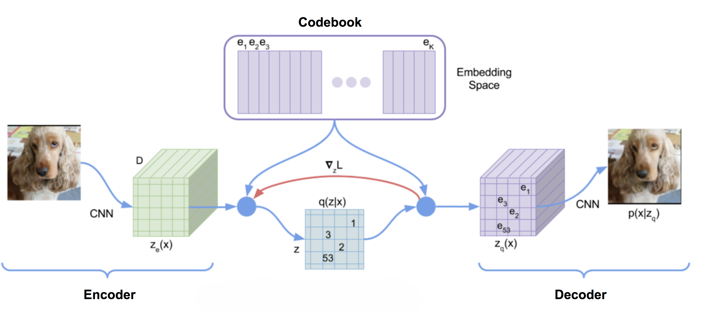
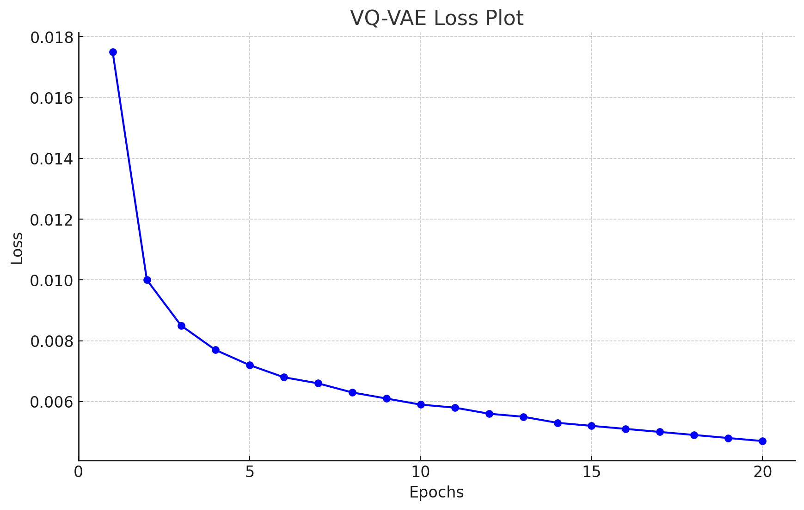
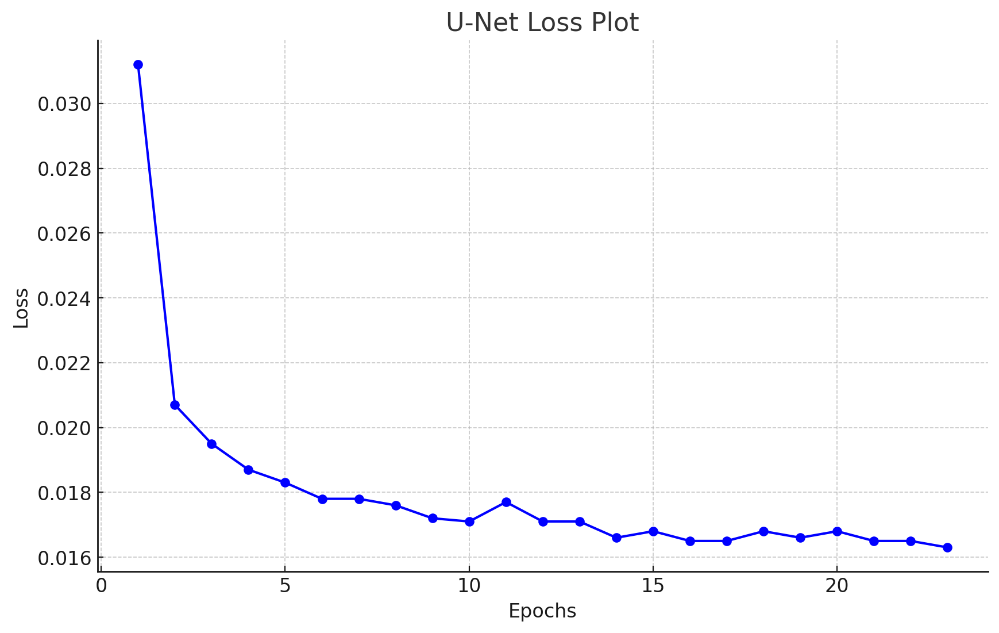

# Stable Diffusion Model on the ADNI Brain Dataset

## Overview

The purpose of this project is to use a Stable Diffusion model to generate images which resemble the dataset it was trained on.

## Data Preprocessing

The data consists of brain images which either have Alzheimer's or don't. The training and test sets were concatenated. For transformations, the data was rescaled to be exactly 256x256, turned into pytorch tensors, and then normalized. The rescaling didn't change the quality of the image because the initial size was very close (240x256). 

```python
transform = transforms.Compose([
    transforms.Resize((256, 256)),
    transforms.ToTensor(),
    transforms.Normalize((0.5, 0.5, 0.5), (0.5, 0.5, 0.5)),
])

train_dataset = dset.ImageFolder(root= data_Train, transform=transform)
test_dataset = dset.ImageFolder(root= data_Test, transform=transform)
combined_dataset = data.ConcatDataset([train_dataset, test_dataset])
```

## The Stable Diffusion Model

The main idea behind stable diffusion is to make all calculations in the latent space; this is mainly done to improve the efficiency of the model. The diffusion model itself works by predicting and subtracting noise from an image, adding some noise back, and then repeating the process until the result is recognizable and clear. The model in this project is unconditional, meaning no text or any similar input is required to generate images; therefore, the model randomly generates images which resemble the ones it was trained on. 

### Architecture 

The architecture of a conditional stable diffusion model is very similar to the unconditional one (the only difference being the extra embedding and attention), hence why the conditional (and more general) version of the model is shown below [1]: 


A VQ-VAE (vector quantized variational autoencoders) was used to turn the images from pixel space to latent space. Based on general reading on the topic of Stable Diffusion, having a VQ-VAE over a vanilla VAE doesn't ultimately matter in the results of the overall model. However, having a simple autoencoder drastically worsens the generated images; when starting the project, I used a basic autoencoder for stable diffusion model, and because noise addition/removal is highly senstitive during image generation , the decoder wasn't able to translate that process well to pixel space. Below is an example of the generated images I obtained with the simple autoencoder:


As a result, I resorted to a VQ-VAE, which encodes images to normal distributions in the latent space and then quantizes them to discrete vectors. The latent space in the model I used was 32x32 and had 4 channels. Below is the main architecture I used for the VQ-VAE [2]:



The U-Net was initially inspired from "U-Net: Convolutional Networks for Biomedical
Image Segmentation", and some modifications have been made for it to fit general structure of the stable diffusion model (for example, I modified the input and output dimensions so that it works in the latent space). The U-Net contained four encoder blocks and four decoder blocks with a resnet block as the bottleneck. The timestep (a number which indicates the level of noise) was embedded in each block. Below is the diagram the U-Net is inspired from [3]:


## Training

The VQ-VAE and the Unet were trained separately. This was done because it was more efficient and it was easier to maximize the potential of each of them. MSE was used to calculate the reconstruction loss of the VQ-VAE (commitment and codebook losses were also added), and smooth l1 loss was used for the UNET. Below are their individual loss plots:





## Results and Discussion

Below is a gif showing the image generation process:


There were 1000 timesteps in the noise scheduler of this model. During the image generation, noise removal and addition occurred incrementally at every timestep starting from 1000. With other Stable Diffusion models, the image resembling the dataset it was trained on begins to show early on in the noise addition/removal process; however, with this model, it only clearly begins to show at the very end (so at very low timesteps). As a result, the images don't fully resemble the ones from the original dataset. I mitigated this by having the last 30 timesteps repeated 5 times after all timesteps have been iterated; this gave the model a better chance of generating a clear image. In addition, in those repeated timesteps, I inserted an extra layer of noise removal for each frame of the gif to give more clarity (this layer of noise removal is a simpler version of the one used when generating the images). The main issue, however, still persisted, and it is that the final images don't fully resemble the original data (the generated images capture the general shape and texture of the brain, but miss out on the interior details and sometimes get the shape wrong). To identify the root cause of this, I separately tested the VQ-VAE and the Unet, but both were working properly. My main guess is that the problem lies within the image generation process itself; it is possible that the the amount of noise removed and the amount added isn't balanced in the correct way (I attempted to fix this by scaling some values by certain constants, and it did indeed make the results slightly better but the issue still largely remained). Due to time constraints, I haven't been able to resolve the issue, but I believe it should be one of the main things to be tackled for future development. 

Due the generated images not fully resembling the brains in the original dataset, I did not plot a UMAP. The purpose of the UMAP would have been to make sure the generated images are separated into two classes (with Alzheimer's and without) as that would ensure the model is generating the images correctly. Therefore, I leave this for future development. 

## Dependencies


```python
python
torch
torchvision
numpy
PIL
math
```


## File Structure

- StableDiffusion-47015746
  - resources
    - generation_with_simple_AE.gif
    - results2.gif
    - stablediffusion_overview.jpg
    - u-net-architecture.png
    - unet_loss.png
    - VQ-VAE-arch.png
    - vqvae_loss.png
  - README.md
  - dataset.py
  - modules.py
  - train.py
  - predict.py
  - driver.py

## Usage

A driver file was made to facilitate the use of this model. The file trains the VQ-VAE and the Unet if they haven't been trained before, then it uses the final stable diffusion model to generate images. The generated images are showcased in a gif that will be saved in the repository folder (this can be changed in predict.py if necessary). All that needs to be done is simply run driver.py. Before doing so, however, make sure:

- In driver.py, paths to test and train folders of the dataset are set up properly (batch size can additionally be changed as well):

```python
    batch_size = 4 #Change if necessary
    data_train = "/home/groups/comp3710/ADNI/AD_NC/train" #Change if necessary
    data_test = "/home/groups/comp3710/ADNI/AD_NC/test" #Change if necessary
```

- In driver.py, change "vqvae_trained" and "diffusion_model_trained" to True or False depending on whether the models are already trained or not. If it's the first time running the code and the models aren't trained, simply set them to False. The state dictionaries of the models will be saved in the repository folder, but that can be modified in train.py if necessary. 

```python
    vqvae_trained = False #Change if you already have trained model
    diffusion_model_trained = False #Change if you already have trained model
```

Hyperparameters such as number of epochs and learning rate can be modified in driver.py. Currently, the VQ-VAE has 20 epochs and a learning rate of 0.00001, and the U-Net has 23 epochs and a learning rate of 0.0001.

## References

1. High-Resolution Image Synthesis with Latent Diffusion Models: https://arxiv.org/abs/2112.10752
2. Neural Discrete Representation Learning: https://arxiv.org/abs/1711.00937
3. U-Net: Convolutional Networks for Biomedical
Image Segmentation: https://arxiv.org/pdf/1505.04597

