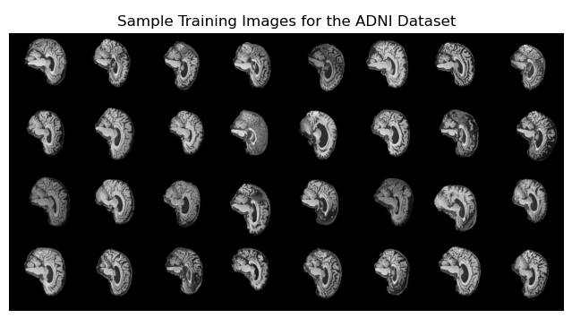
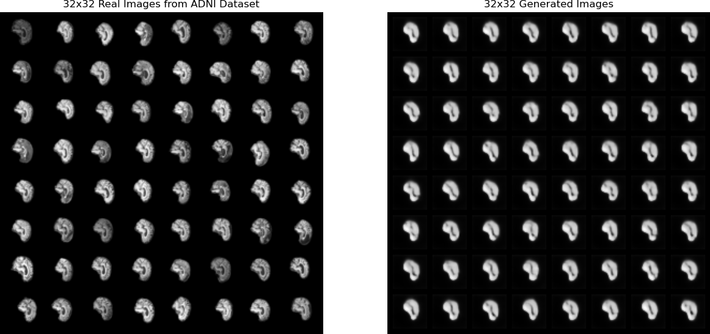
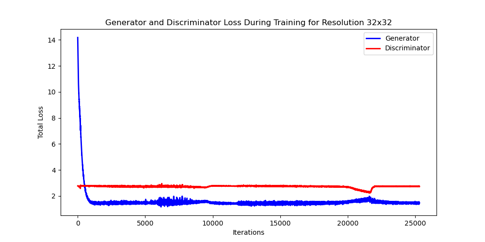
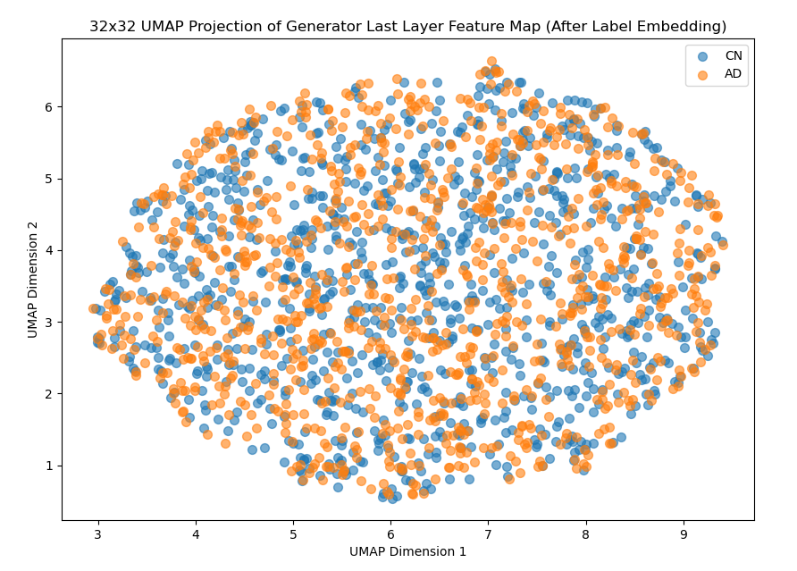
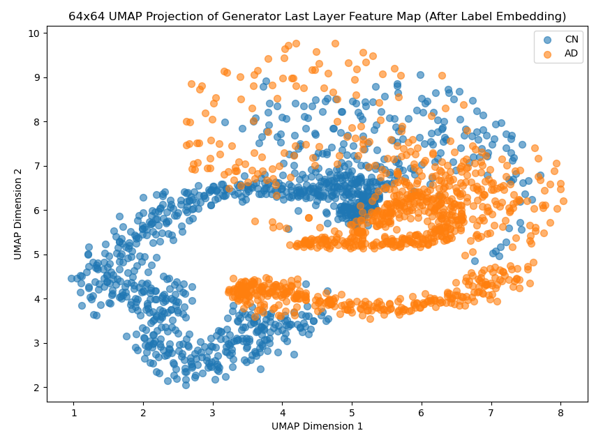
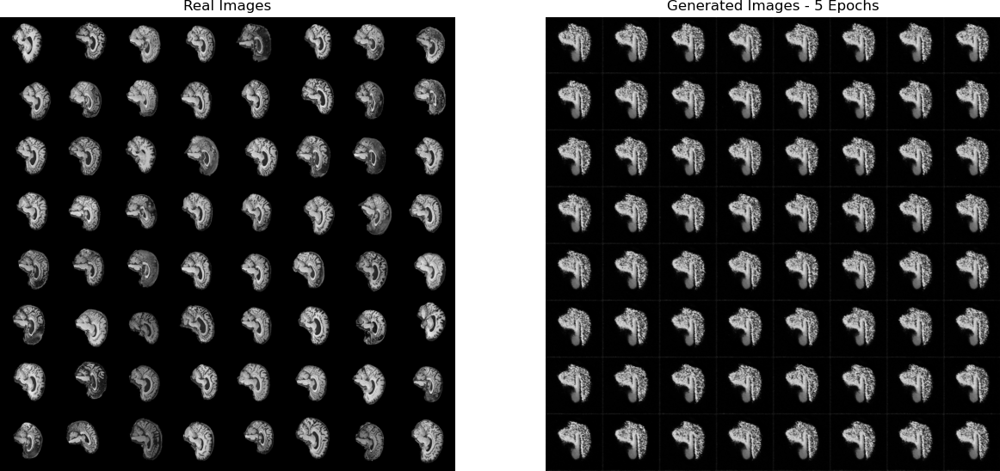
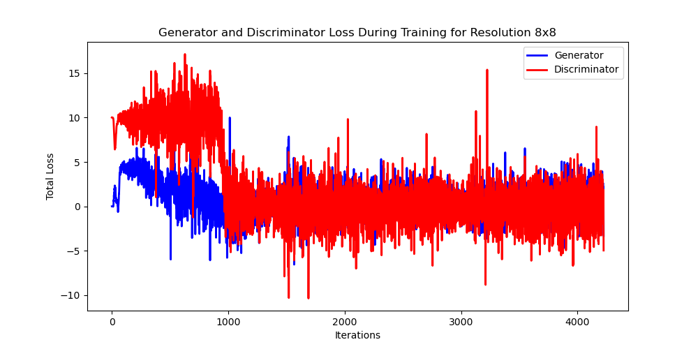

# COMP3710 StyleGAN ADNI Brain Image Generation

An implementation of StyleGAN that is used to generate brain images from the [ADNI [1]](#references--acknowledgements) dataset, while also trying to classify whether the brain images fall under Cognitive Normal (CN) or Alzheimer's Disease (AD).

**Institution**: The University of Queensland </br>
**Created by**: Matthew Lockett [46988133]

## Table of Contents

* [Code Structure](#code-structure)
* [The Problem](#the-problem)
* [The GAN Architecture](#the-gan-architecture)
* [The StyleGAN Architecture](#the-stylegan-architecture)
  * [The Generator](#the-generator)
  * [The Discriminator](#the-discriminator)
* [This Implementation of StyleGAN](#this-implementation-of-stylegan)
* [Dataset Structure](#dataset-structure)
  * [Pre-Processing](#pre-processing)
* [Results](#results)
  * [Image Generation](#image-generation)
  * [UMAP Embeddings](#umap-embeddings)
* [How To Run](#how-to-run)
  * [1. Setup Dataset](#1-setup-dataset)
  * [2. Clone this Repository](#2-clone-this-repository)
  * [3. Install Required Dependencies](#3-install-required-dependencies)
  * [4. Specify Dataset Location and Seed](#4-specify-dataset-location-and-seed)
  * [5. Perform Training of the StyleGAN](#5-perform-training-of-the-stylegan)
  * [6. Validate the Training](#6-validate-the-training)
* [Future Improvements](#future-improvements)
  * [1. No ProGAN Architecture](#1-no-progan-architecture)
  * [2. WGAN-GP Implementation and Wasserstein Loss](#2-wgan-gp-implementation-and-wasserstein-loss)
* [References & Acknowledgements](#references--acknowledgements)

## Code Structure

Here is a summary of each item contained within this repository.

* `Assets\`: Used to store all figures and images required for the README.md.
* `dataset.py`: Used to load the ADNI dataset.
* `environment.yml`: Contains the definitions for the Conda environment used to run this program.
* `hyperparameters.py`: Contains all hyperparameters and configuration constants used to train and visualise the StyleGAN model.
* `modules.py`: Contains the source code implementation of the StyleGAN model and other training functions.
* `README.md`: This document, which contains all necessary information to understand this repository.
* `predict.py`: Loads the saved StyleGAN models and  from them creates a visualisation of the UMAP.
* `train.py`: Implements the main training loop for the StyleGAN and saves them.
* `utils.py`: Contains helper functions used in various places.

## The Problem

The Alzheimer's Disease Neuroimaging Initiative ([ADNI [1]](#references--acknowledgements)), is a scientifically funded study to track the progression of Alzheimer's disease using various biological markers. One of these biological markers is simply the observed changes in the brain, detected through the use of MRI or PET scans. Now as the development of deep neural networks have increasingly become more effective and reliable in the last decade or so, they have reached a point where they can now start to detect these biological markers themselves, without the need of human intervention. Therefore, the goal of this project was to utilise the StyleGAN deep neural network architecture, to both distinguish between Cognitive Normal (CN) and Alzheimer's Disease (AD) ridden brains, and also to produce generated images of them.

## The GAN Architecture

To first understand the StyleGAN architecture, it is imperative that the predecessor to it's creation, the Generative Adversarial Network ([GAN [2]](#references--acknowledgements)), is briefly described, see [Figure 1](#figure-1---the-gan-architecture-3) for a depiction of it's architecture. The GAN consists of two convolutional deep neural networks, the Generator and the Discriminator, that are actively at odds with each other (hence Adversarial). The Generator's objective is to take an input latent space vector, $z$, filled with random noise, and through multiple convolutions and fully connected layers, convert it into an image that resembles the dataset it was trained on. It's opponent, the Discriminator, is purely focused on image classification, wherein it has to decide if the image it has received is either real, from the dataset, or fake, created by the Generator. Therefore, to effectively train these two networks together they must both be of equal strength, or else the min-max game that they play will be one-sided.

#### *Figure 1 - The GAN Architecture [[3](#references--acknowledgements)]*


## The StyleGAN Architecture

The Style Generative Adversarial Network, or [StyleGAN [4]](https://arxiv.org/abs/1812.04948), builds upon the GAN model, specifically the Generator, with an emphasis on being able to dictate the style of it's image generation. This model first came about in 2018, when researches at NVIDIA realised the important role the latent vector space, $z$, played in image generation, and learnt how to filter it's noise to control various features of an image [[5](#references--acknowledgements)]. It should also be mentioned that the baseline model for the StyleGAN is actually the Progressive Growing GAN ([ProGAN [6]](#references--acknowledgements)), which instead of training the GAN on a single image size, like $64 \times 64$, the ProGAN architecture implements training on smaller resolutions first, like $4 \times 4$, and incrementally increases the size until the full resolution is trained on. This forms the base of the StyleGAN as it provides greater stability with training to larger image sizes, when compared to the original GAN. However, the underlying architecture of ProGAN is very much the GAN, and so the GAN still holds great influence over the StyleGAN.

### The Generator

The breakthrough component of StyleGAN is certainly it's improvement over the original Generator architecture as used in GAN, see [Figure 2](#figure-2---the-stylegan-generator-architecture-6). StyleGAN's Generator splits the traditional Generator into two sequential networks, the Mapping Network and the Synthesis Network. The Mapping Network takes a randomised latent space vector, $z$, and passes it through a series of eight fully connected layers to create a new intermediate space, called the style vector $w$ [[5](#references--acknowledgements)]. In the original paper for StyleGAN, both $z$ and $w$ had dimensions of 512, with each of the dimensions in $w$ meant to represent a tunable feature of an image [[5](#references--acknowledgements)]. Essentially, the eight fully connected layers of the Mapping Network are utlised to extract the underlying features hidden within the noise of the latent space vector $z$.

The Synthesis Network does not have a direct input, it instead utilises a constant $4\times4\times512$ learnable feature map to start it's underlying process. The feature map is then combined with a noise injection, B, which based on the original paper, is utilised throughout all blocks of the Synthesis Network to improve the finer details of the output image. After the noise injection is applied, the style vector from the Mapping Network is utilised and combined with an Adaptive Instance Normalisation (AdaIN) layer, with which the output of the feature map is standardised to a Gaussian distribution, and the style vector is incorporated as a scaling and shifting term. Lastly, the resultant feature map is passed through a simple $3\times 3$ convolution. These series of actions all contribute to one layer of the Synthesis Network, with two layers making an entire block. Within the StyleGAN paper, they utilised a total of nine blocks to go from the constant feature map size of $4\times 4$ to a $1024 \times 1024$ image. And through the use of the ProGAN architecture, not all blocks were used immediately, blocks were instead added with increasing image sizes.

#### *Figure 2 - The StyleGAN Generator Architecture [[7](#references--acknowledgements)]*


### The Discriminator

StyleGAN made no changes to the original ProGAN implementation of the Discriminator [[4](#references--acknowledgements)], which can essentially be explained through the use of the GAN Discriminator, as seen in [Figure 1](#figure-1---the-gan-architecture-3). The StyleGAN Discriminator is comprised of a single network and takes as an input an image either from the dataset or created by the Generator. It then applies a series of convolutions to that image to form a feature map, and then downscales the feature map within each layer. The final output of the Discriminator is thus a probability on if the given input image is real or fake. Each block within the Discriminator corresponds to a given input feature map size, and thus the ProGAN implementation adds increasingly more blocks, for each increase in image size.

## This Implementation of StyleGAN
Most of the high level architecture of the StyleGAN discussed above is implemented within this project's version, and thus the original [paper[4]](#references--acknowledgements) for the StyleGAN was a big inspiration for this project's development. Another considerable resource is this [DigitalOcean PyTorch tutorial[8]](#references--acknowledgements), which was instrumental in understanding how to implement the ProGAN architecture. One major difference, however, to the StyleGAN and ProGAN implementations, is this projects use of [Conditional GAN [9]](#references--acknowledgements), to embed the AD and CN labels from within the dataset, into the image generation of the Generator and classification of the Discriminator. This was added in an effort to be able to generate images based on what labels were passed into the Generator, and help with UMAP visualisation of the two classes. It should also be mentioned that ChatGPT-4o and ChatGPT-o1-preview have also been used within development of this project, and any prompts utilised can be found within the code's documentation.

## Dataset Structure
All COMP3710 students were given access to an already preprocessed version of the ADNI dataset, which had a training set and validation set already prepared. Of these two sets, each had two classes each of brain images, AD and CN. The amount of images for the training set and validation set, were however altered, placing a higher importance on the training set having the most images of the two. With the training set containing around 86% of the total images, and the validation set only containing around 14%. This split was made to ensure that the StyleGAN had the most amount of data possible during training, to ensure that the chances of overfitting occurring were lower and so that training could be better stabilised. The validation set does not need as many images, as it will only be used as comparisons to images generated by the Generator, or for some simple image classification by the Discriminator, once the model is trained.

The diagram below illustrates how the dataset was structured, along with the individual breakdown for how many images were in each folder. This structure was based on what was necessary for the torchvision [ImageFolder[10]](#references--acknowledgements) class, which was used to load the dataset into the program.

```text
ADNI_DATASET/
    |--- Training Set/ 
    |          | --- AD/ (12,815 Images)
    |          |      |--- img1.png
    |          |      |--- img2.png
    |          |      |--- img3.png
    |          | --- CN/ (13, 430 Images)
    |                 |--- img1.png
    |                 |--- img2.png
    |                 |--- img3.png
    |--- Validate Set/ 
    |          | --- AD/ (2,045 Images)
    |          |      |--- img1.png
    |          |      |--- img2.png
    |          |      |--- img3.png
    |          | --- CN/ (2,230 Images)
    |                 |--- img1.png
    |                 |--- img2.png
    |                 |--- img3.png
```

### Pre-Processing

The only pre-processing that was performed on the ADNI dataset, outside of what was provided, was performed within the `dataset.py` file. A simple torchvision transform was applied to each image, to ensure they were cropped to the desired image resolution, normalised and contained one channel to be represented as a grayscale image.

## Results

Once the appropriate [dataset structure](#dataset-structure) has been followed, the ADNI dataset images will be able to be loaded into the training loop. The full resolution of these brain scan images are 256x256 pixels, with a sample of them displayed within [Figure 3](#figure-3---sample-256x256-adni-brain-scan-images-7).

#### *Figure 3 - Sample 256x256 ADNI Brain Scan Images*



### Image Generation
In-terms of image generation this StyleGAN implementation was not able to fully progress through the chain of ProGAN image sizes, being 8x8, 32x32, 64x64, 128x128 and lastly 256x256. Instead the furthest this implementation was able to achieve was the 64x64 image size, however, even at this level the image generation was not of great quality (it did however provide great class distinctions as seen in [UMAP Embedding](#umap-embedding)) . Therefore, only the 32x32 image size will be presented with results for the image generation component of this section, see [Figure 4](#figure-4---32x32-image-generation-results). Please see the [Future Improvements](#future-improvements) section for a discussion of why this model was not able to achieve the full desired response, and what could be improved. Lastly, all images presented within this section were created using the `predict.py` file.

#### *Figure 4 - 32x32 Image Generation Results*



As presented within [Figure 4](#figure-4---32x32-image-generation-results), these are the results of training the StyleGAN model through images sizes of 8x8, 16x16 and finally up to 32x32. It showcases that the Generator is able to effectively mold it's latent space vector into a similar shape as the brain scan images. However, the finer details of the image generation is lacking, with key brain features such as ridges missing. There is also a lack of diversity in the Generator's output, which shows some level of overfitting or mode collapse has occurred. This StyleGAN implementation did suffer from the jumps between the different resolutions, and the Generator sometimes became unstable after ending the fade-in period. It is most likely the result of the Discriminator being more stable around the jumps in resolution, that allowed it to over power the Generator and make it conform to these types of outputs.

Another result to consider from the training is the loss plot, which can be seen in [Figure 5](#figure-5---32x32-image-generation-loss-plot). The Generator starts off with a large loss, then after a while plateaus to a more stable level at around 1.7. Whereas the Discriminator basically stays stable at around 2.3 for most of the training, even from the beginning. There are clear points of interest in this plot, such as just after the 5000 iteration mark, there is an increase in the variability of the Generator's loss. This point marks where the image size increases from 8x8 to 16x16 and highlights that the Generator struggles a bit more than the Discriminator, with the change in resolution. However, it is capable of correcting this behaviour and soon goes back to a more stable level. The last peak of around 22,000 is where the 32x32 image resolution's alpha fade-in period ends, and this is where the Generator struggled the most. But once again, it was able to persevere and remain stable. This stability enabled the output as seen in [Figure 4](#figure-4---32x32-image-generation-results).

#### *Figure 5 - 32x32 Image Generation Loss Plot*



### UMAP Embeddings

As [this Implementation of StyleGAN](#this-implementation-of-stylegan) uses label embeddings, it enforces learnable vector information into both the Discriminator's and Generator's feature maps. This is done in the hope that they start to learn how to distinguish and output images relating to the two ADNI classes, AD and CN. The UMAP embedding plots that will be presented within this section are produced within the `predict.py` file. They are created by passing a class label, such as 0 for CN and 1 for AD, into the Generator and extracting the Generator's last feature map layer to inspect if the feature map was molded with respect to the style/class of the label.

Now in terms of the resolutions of 8x8, 16x16 and 32x32, all UMAP Embedding plots looked like the one displayed in [Figure 6](#figure-6---32x32-umap-embedding-plot), with this figure specifically for the 32x32 resolution. There is evidently no difference between the two classes, AD and CN, which indicates that the Generator at this resolution, and resolutions before, has not learnt how to produce images based on the label/style given. Now this is acceptable to a degree, as with lower resolutions such as the ones mentioned there is less discernable features between the two classes, which makes it a considerably harder task for the Generator to complete. 

#### *Figure 6 - 32x32 UMAP Embedding Plot*



This is however, a different story when the UMAP Embedding plot for the 64x64 resolution is observed, see [Figure 7](#figure-7---64x64-umap-embedding-plot). There is a clear disentanglement between the two classes, when compared to [Figure 6](#figure-6---32x32-umap-embedding-plot), which indicates that the resolution of 64x64 provided enough disceranble features between the two classes that the Generator was able to pick up on them. However, this is still not a full classification of the two classes, as it is expected to have both classes UMAP be completely separate from each other, with this only displaying them marginally separated. It is possible that with an improved StyleGAN model, higher resolutions will provide the necessary information to derive such a figure.

#### *Figure 7 - 64x64 UMAP Embedding Plot*



## How to Run

This section will outline how all the required dependencies can be installed and what actions are required to start image generation with this StyleGAN model.

### 1. Setup Dataset

To download the required dataset go to the following website [ADNI [1]](#references--acknowledgements), wherein you can apply to gain access. Then download and organise the dataset into the same structure as referenced in [Dataset Structure](#dataset-structure), making sure to have the same folder names.

### 2. Clone this Repository

Use `git clone` on this repository, and place it within a desired location. Then `cd` or change directory into the repository and then switch to the `topic-recognition` branch. Now `cd` again into the `recognition/StyleGAN-46988133` folder, which should contain all files as outlined within the [Code Structure](#code-structure).

### 3. Install Required Dependencies

This project was contained within an [Anaconda[11]](#references--acknowledgements) environment and was run with the following program versions:

* Python 3.12.3
* PyTorch 2.4.0
* Torchvision 2.4.0
* CUDA 12.4
* Matplotlib 3.9.2
* NumPy 1.26.4
* Umap-Learn 0.5.6

To make installation of these packages easier, an `environment.yml` file has been provided within this project so that the required conda environment can be installed all at once. Ensure that [Step 2](#2-clone-this-repository) has been followed and the current terminal is running Anaconda, then simply run the following command to create a conda environment called `StyleGAN-Env` with all the required dependencies:

```python
conda env create -f environment.yml
```

This environment can then be activated using:

```python
conda activate StyleGAN-Env
```

### 4. Specify Dataset Location and Seed

Within the `hyperparameters.py` file, there is a constant called `ROOT`, it will need to be changed to wherever the dataset from [Step 1](#1-setup-dataset) was placed. There is also a `RANDOM_SEED` constant that is used to generate the same random noise input into the Generator during different runs of training, all [results](#results) were generated from a seed of 999, and can be matched if desired.

### 5. Perform Training of the StyleGAN

Now within the same `StyleGAN-Env` setup within [Step 3](#3-install-required-dependencies) run the following command to train the StyleGAN model:

```python
python train.py
```

This training process will try to train through multiple resolutions of the ADNI dataset, going through the following resolutions: 8x8, 16x16, 32x32, 64x64, 128x128 and then finally 256x256. Throughout training there are also statistics printed to the terminal every 100 steps, or batch iterations. Below is a summary of what each statistic represents:

* **Loss_D**: The total loss of the Discriminator during one iteration.
* **Loss_G**: The total los the the Generator during one iteration.
* **Real Pred**: The Discriminator's accuracy in identifying if an image from the dataset is real. This should hover around 0.5 during training, as it means the Generator is actively producing images that the Discriminator is having trouble discerning from real.
* **Real Class Acc**: The Discriminator's accuracy in identifying what class a real image belongs to, either CN or AD.
* **Alpha**: The current alpha value used within [ProGAN[8]](#references--acknowledgements) to fade-in between different resolutions.
* **Disc Gradient**: The gradient output of the Discriminator.
* **Gen Gradient**: The gradient output of the Generator.
* **Disc Learning Rate**: The current learning rate of the Discriminator.
* **Gen Learning Rate**: The current learning rate of the Generator.

There should also be a new folder called `saved_output` that appears within the file directory. This folder will be used to store all plots generated by `train.py` during the training of the dataset. After each resolution is finished training, a loss plot and the final output of the Generator at that resolution will be saved. Both the Generator and Discriminator model weights will also be stored, which can be utlised later in `predict.py`.

### 6. Validate the Training

After training has been completed, all model weights for the Discriminator and Generator will be saved to the `saved_output` folder, with a suffix ending in `.pth`. Each model weight file will be transcribed with the resolution it was trained up to, and whether it is the Discriminator or Generator. To utilise these saved models and validate the training, got to the `predict.py` file. Simply edit the `IMAGE_SIZE` constant to the model resolution that is desired such as 8, 16, 32, 64, 128 or 256 (depending on how much training was completed). Then edit the `SAMPLES_PER_LABEL` constant to alter the amount of samples per class that will be plotted within the UMAP Embedding plot, the default value of 1000 should be sufficient too. Then run the following command to validate the training:

```python
python predict.py
```

This will generate two plots and save them to the `saved_output` folder. The first plot will be the UMAP Embedding plot distinguishing between the two classes, AD and CN. And the second plot is a comparison of real images from the dataset to images created via the Generator.

## Future Improvements

As briefly discussed in the [results](#results) section, this StyleGAN implementation was not able to produce image's at the full resolution of 256x256, and even suffered training up to smaller resolutions such as 64x64 and 128x128. Now a lot of time and effort went into trying to get the StyleGAN fully functional, but due to the unpredictability in training GAN models and a still developing knowledge of the overall deep neural network ecosystem, it could not happen within the time frame given. It is entirely possible that this StyleGAN model could be tweaked ever so slightly by varying the hyperparameters, to achieve the full resolution result, as the underlying architecture is mostly based on reputable resources such as the [original StyleGAN paper[4]](#references--acknowledgements) and this [StyleGAN PyTorch Tutorial[8]](#references--acknowledgements). The only main difference with those models, and [this implementation of StyleGAN](#this-implementation-of-stylegan) is the addition of label embedding to try and make the StyleGAN conditional. Now see below for some possible recommendations and improvements that could be made to improve this StyleGAN implementation.

### 1. No ProGAN Architecture

During creation of this StyleGAN model various different architectures were developed to test their effectiveness, one such model was a StyleGAN made without the ProGAN architecture, and was fully developed to train entirely on the full 256x256 resolution. This model may be found by traversing the commit logs of this repository and finding the commit labelled "Implements basic mixing ..." with SHA number `2b8239a86c34adc27c039f42ffbbf79e3c9693ee` developed on Oct 7, 2024. At this stage in development, the Generator was actually producing the best images out of all that have been produced. However, it suffered greatly from mode collapse and was not able to be trained for long epochs. The output of training this model only after 5 epochs is displayed in [Figure 8](#figure-8---no-progan-architecture-results-full-256x256-resolution), which showcases a greater level of detail than was possible within [Figure 4](#figure-4---32x32-image-generation-results), and it trained in substantially less time to get a better result. Therefore, a recommendation would be to go back to this type of architecture and develop it further.

#### *Figure 8 - No ProGAN Architecture Results Full 256x256 Resolution*



### 2. WGAN-GP Implementation and Wasserstein Loss

The [StyleGAN PyTorch Tutorial[8]](#references--acknowledgements) that was instrumental in developing this implementation of StyleGAN utislied  Wasserstein loss from the WGAN-GP paper. This type of loss directly calculated the differences between the feature maps of real and fake images, in an attempt to make the Discriminator more effectively learn the difference between the two of them. Which in effect would help the Generator improve it's ability to produce better images. Within the development of this StyleGAN, this type of loss was attempted and even functions such as `calculate_gradient_penalty()` that can still be found in `modules.py`, were utilised. It did however, not work out during training as the images produced were of lower quality than the images seen in [Figure 4](#figure-4---32x32-image-generation-results). Although, the loss plot did provide more adversarial action between the Discriminator and Generator as seen in [Figure 9](#figure-9---training-loss-plot-using-wasserstein-loss), when compared to [Figure 5](#figure-5---32x32-image-generation-loss-plot), which meant the training had the potential to be a more balanced fight. Therefore, a recommendation would be to attempt to use Wasserstein loss again, and try to stabalise the training further to hopefully see better results.

#### *Figure 9 - Training Loss Plot Using Wasserstein Loss*



## References & Acknowledgements

[1] - ADNI: <https://adni.loni.usc.edu/about/> </br>
[2] - Original GAN Paper: <https://arxiv.org/abs/1406.2661> </br>
[3] - GAN Architecture Image: <https://www.researchgate.net/figure/Network-architecture-generator-top-discriminator-bottom-The-GAN-is-composed-by_fig1_335341342> </br>
[4] - StyleGAN Paper: <https://arxiv.org/abs/1812.04948> </br>
[5] - StyleGAN Overview: <https://medium.com/@arijzouaoui/stylegan-explained-3297b4bb813a> </br>
[6] - ProGAN Paper: <https://arxiv.org/abs/1710.10196> </br>
[7] - StyleGAN Generator Image: <https://www.researchgate.net/figure/Comparison-between-a-traditional-GAN-StyleGAN-and-StyleGAN2-generator-15-16_fig5_352096439> </br>
[8] - StyleGAN PyTorch Guide: <https://blog.paperspace.com/implementation-stylegan-from-scratch/> </br>
[9] - Conditional GAN: <https://www.geeksforgeeks.org/conditional-generative-adversarial-network/> </br>
[10] - PyTorch ImageFolder: <https://pytorch.org/vision/main/generated/torchvision.datasets.ImageFolder.html> </br>
[11] - MiniConda Install: <https://docs.anaconda.com/miniconda/> </br>
