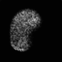
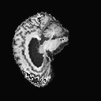
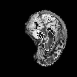
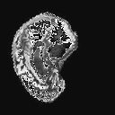
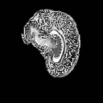
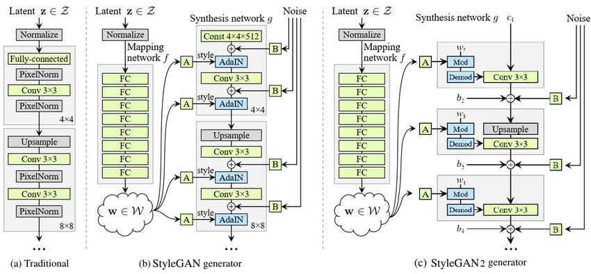
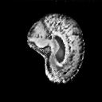

# StyleGAN2 on AD_NC Brain Dataset


## Overview

This StyleGAN2's application is to generate realistic like brain scans using the ADNI dataset for Alzheimer's disease. The primary goal is to provide a model that is able to generate "reasobably clear images". Using StyleGAN2 ability to generate high-resolution images, I will be attept to tackle this problem.
StyleGAN2 can help reasearchers by providing  disease simulation, data augmentation, and privacy-preserving research.

This project leverages StyleGAN2 to generate synthetic MRI scan images that closely resemble authentic ones. The model is trained on the subset of the OASIS brain dataset.

<p align="center">
  
  
</p>

## Table of Contents

- [StyleGAN2 on AD\_NC Brain Dataset](#stylegan2-on-ad_nc-brain-dataset)
  - [Overview](#overview)
  - [Table of Contents](#table-of-contents)
  - [File Structure](#file-structure)
  - [Installation](#installation)
  - [Requirements](#requirements)
  - [Usage](#usage)
  - [Dataset](#dataset)
  - [Data Augmentation](#data-augmentation)
  - [StyleGAN](#stylegan)
  - [StyleGAN2](#stylegan2)
  - [Model Architecture](#model-architecture)
    - [Mapping Network](#mapping-network)
    - [Adaptive Instance Normalization (AdaIN) Replacement](#adaptive-instance-normalization-adain-replacement)
    - [Progressive Growing](#progressive-growing)
    - [Noise Injection](#noise-injection)
    - [Discriminator Network](#discriminator-network)
    - [Path Length Regularization](#path-length-regularization)
  - [Training Configuration](#training-configuration)
    - [Learning Rate](#learning-rate)
    - [Batch Size](#batch-size)
  - [Results](#results)
  - [Conclusion](#conclusion)
  - [References](#references)

## File Structure

Folder contains the following files:

- config.py: Contains the configuration settings for the project
- dataset.py: Contains the data loader for the AD_NC dataset
- modules.py: Contains the StyleGAN2 model
- predict.py: Contains the prediction function for the StyleGAN2 model
- utils.py: Contains utility functions for the project
- train.py: Contains the training loop for the StyleGAN2 model

## Installation
1. Download [ADNI dataset for Alzheimer’s disease](https://filesender.aarnet.edu.au/?s=download&token=a2baeb2d-4b19-45cc-b0fb-ab8df33a1a24).
2. Set paths of dataset in config.py
3. Check neccessary [requirements](#requirements) are met

## Requirements

- Anaconda3 was used for it's intra-library compatibility and ease of use. The following packages are required to run the project:

| Package | Version |
| --- | --- |
|pytorch | 2.0.1 |
|torchvision | 0.15.2 |
|tqdm | 4.66.5 |
|numpy | 1.25.2 |
|matplotlib | 3.8.0 |
|pillow | 9.4.0 |

- Note: An NVIDIA GPU is required to train the model.The model was trained on a NVIDIA A100 GPU with 40GB of memory and 64GB of RAM.

## Usage

Network is trained from scratch, no pretrained model is used. To train the model, run the following command:

```
> python train.py


```

Training mode change TRAIN = True and EPOCHS to your desired training length.

Figures is saved after end of epoch in folder,
Plots for both generator and discriminator loss are saved in the folder after training is complete.

## Dataset
The ADNI dataset for Alzheimer's disease is hosted on the [ADNI website](https://adni.loni.usc.edu/) for download. ADNI stands for Alzheimer's Disease Neuroimaging Initiative (ADNI) and is a longitudinal, multi-center, observational study.

In this project I used the preprocessed dataset from this [website](https://filesender.aarnet.edu.au/?s=download&token=a2baeb2d-4b19-45cc-b0fb-ab8df33a1a24). The dataset is split into two classes: AD (Alzheimer's disease) and NC (normal control). Each class contains 15660 brain scans.

The dataset specification is as follows:

| Attribute | Values |
| --- | --- |
| Class | AD, NC |
| Number of samples each | 15660 |
| training set each |11200 |
| testing set each | 4460 |
| Image size | 256x240 |
| Image format | .jpg |
| Number of channels | 1 |

Below is a sample of the dataset:


## Data Augmentation
- **Resize**: Images are resized to lower resolution to reduce computational cost.
- **Grayscale**: Images are Greyscaled but in case converted to grayscale.
- **Random Rotation**: Images are randomly rotated to introduce variability.
- **Color Jitter**: Randomly adjust brightness, contrast, saturation, and hue.
- **Random Horizontal Flip**: Images are flipped horizontally to introduce variability.
- **Normalize**: Images are normalized to have a mean of 0.5 and a standard deviation of 0.5.

Few examples after augmentation:


## StyleGAN

Style Generative Adversarial Network or StyleGAN is the next generation of generative model for synthesizing high-resoultion images with striking realism. Developed by NVIDIA in 2018, StyleGAN advances the capabilities of generative adversarial networks (GANs) through its unique “style-based” architecture, which allows for detailed control over image attributes such as facial structure, textures, and backgrounds. This model achieves fine-grained manipulation by leveraging a multi-level latent space, where individual layers influence specific visual characteristics, enabling seamless transitions between styles. Using a progressive training technique, StyleGAN gradually refines image resolution, while noise inputs introduce authentic variability. A discriminator network further enhances image quality by guiding the model to improve authenticity at each step.

## StyleGAN2

StyleGAM2  is an improvement over the original styleGAN model, introduced by NVIDIA in 2019. StyleGAN2 builds upon StyleGAN2 and introduces several key enhancements. The primary improvements inclues tackling "blob artifacts"
and enchances overall image quality. The model achieves this by introducing a new regularization techniques, such as weight demodulation to prevent visual artifacts. StyleGAN2 also introduces a new data augmentation technique called "adaptive discriminator augmentation" (ADA), which improves the model's generalization capabilities. The model also maintaince StyleGANs ability to control specific image feature and styles, enabling for fine-grained manipulation of generated images. With a higher resolution and improved image quality, StyleGAN2 is able to generate more realistic images with greater detail and fidelity thus setting a new benchmark for generative models.

## Model Architecture



### Mapping Network
Similar to StyleGAN, StyleGAN2 uses a mapping netwokr to transform the latent space $z$ from a simple Gaussian distribution to a more complex distribution, the intermediate latent space $w$.  The mapping network consists of 8 fully connected layers that equalize the learning rate and apply leaky ReLU activation functions.

### Adaptive Instance Normalization (AdaIN) Replacement
In StyleGAN, AdaIN layers were introduce to inject style information into each layer of the generator. Later replaced with Weight Demodulation, which eliminated "Blob" artifacts caused by AdaIN. This provided better control over visuals and realistic images. Weight Demodulation adjusts the style weights per layer without disrupting the generator's output.

### Progressive Growing
Different from StyleGAN where it each layer is introduce one at a time starting from low-resolution images and gradually increase the resoulution as during training. StyleGAN2 uses fixed-resolution architecture with all layers active from the start. This stabilizes training and simplifies the overall process, as the network learns at a consistent resolution.
### Noise Injection
As is in StyleGAN, adds random noise to each layer to introduce variability in texture and fine-grainded details in generated images.

### Discriminator Network
Updated from previous generation to better handle complex features and improve image realism.  Discriminator role is to distinguish real from synthetic images and guides the generator to produce more authentic-looking outputs over time.

### Path Length Regularization
Enforces a consistent relationship between the latent space and the generated image. This helps reduce artifacts and enhances the model's ability to interpolate smoothly between different styles.

## Training Configuration

### Learning Rate
The model was trained for 11 epoch, using learning rate of 0.0002.
<p align="center">
    
    
    <br>
    Image generated using lr=0.0002 (left) and lr=0.001 (right)
</p>
The generator produced a similar shape of the brain but didn't capture the internal structure of it. The model trained with a lr= 0.001 produced a better image quality with more details and structure of the brain.
Learning rate of 0.001 was used for the final training.

### Batch Size

The model was trained on a batch size of 16. A larger batch size could be used to improve the model's performance, but this would require more computational resources.

## Results

<p align="center">
    
    
    <br>
    Loss over iteration for Discriminator (left) and Generator o(Right)
</p>

The plot shows the loss over iteration for the discriminator and generator. The plot can be smoothed out by increasing the batch size or by tracking the loss over epochs instead of iterations.
The plot shows a typical loss curve for a GAN model, engaging in a zero sum game where the generator and discriminator are in competition. The generator's loss decreases as it learns to generate more realistic images, while the discriminator's loss increases as it learns to distinguish between real and synthetic images.
Although the loss curve is not smooth, the model is "Stable and Coverging" with no sign of mode collapse or instability.

After the 11 epoch, the model generator fine tunes the images and produces a more realistic image of the brain.

<p align="center">
    
    <br>
    Generated images with epoch interval of 2
</p>

The StyleGAN2 was able to produce reasonably good images after 30 epouch.

## Conclusion

StyleGAN2 represents a significant advancement in generative modeling,with it's strengths in generating high-resolution images and addressing the predecessor's issue of image artifacts and stability issues. With it's new tool kit of fixed-resolution architecture, weight demodulation, and path length regularization, StyleGAN2 is able to
achieve superior image quality and realism.

After >10 epochs of training, the model was able to generate "reasonably clear images" of the ADNI brain dataset. The model was able to capture the key features of the brain scans, such as the shape of the brain, and somewhat structue of it inside.
Further improvements could be made to enhance the model's ability to generate more realistic images, such as larger dataset, longer training time, and fine-tuning the model's hyperparameters.
Hyperparameters such as learning rate, batch size, gradient penalty, and noise regularization could be adjusted to improve the model's performance.

## References

NVIDIA. (2018). StyleGAN: Official TensorFlow implementation. GitHub repository. https://github.com/NVlabs/stylegan

NVIDIA Corporation. (2020). StyleGAN2-ADA-PyTorch [Computer software]. GitHub. https://github.com/NVlabs/stylegan2-ada-pytorch

Paperspace. (2020, February 19). Implementing StyleGAN2 from scratch. Paperspace Blog. https://blog.paperspace.com/implementation-stylegan2-from-scratch/

Shakes76. (2023). StyleGAN2-OASIS_45711110. GitHub repository. https://github.com/shakes76/PatternAnalysis-2023/tree/topic-recognition/recognition/StyleGAN2-OASIS_45711110
