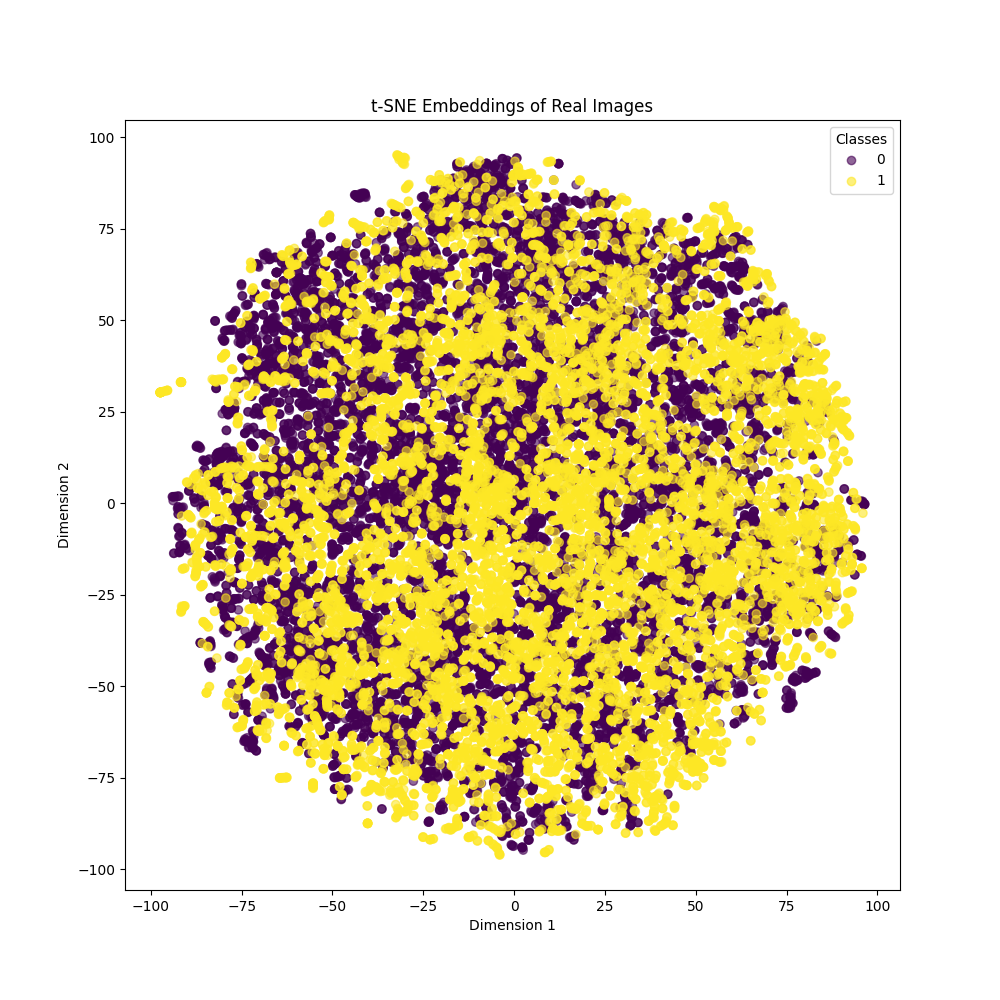
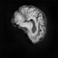

# COMP3710 Project: StlyeGAN Classifier for ADNI Dataset
**Student Number:** 47462153

**Name:** Ojas Ahuja

**Description:** This project involves building a generative model for synthesizing brain MRI images from the ADNI dataset using StyleGAN. The study is interested in generating realistic visuals 

which could potentially make brain scans of patients with AD and those with NC status. The latent space examination was performed using t-SNE embeddings.

## Table of Contents
1. [Introduction](#1-introduction)
2. [Project structure](#2-project-structure)
3. [Reproducibility](#3-reproducibility)
4. [Dependencies](#4-dependencies)
5. [StyleGAN](#5-StyleGAN)
6. [StyleGAN Architecture](#6-StyleGAN-architecture)
7. [Dataset](#7-dataset)
8. [Model Training](#8-model-training)
9. [Model Testing](#9-model-testing)
10. [Performance Summary](#10-performance-summary)
11. [Future Improvements](#11-future-improvements)
12. [References](#12-references)

## 1. Introduction
The main objective of this work is to apply deep learning methods in order to build a generative model, capable of synthesizing realistic brain MRI images and thus support Alzheimer's Disease research through mock medical imaging. 

A unique visual pattern that will match the real brain scans from the ADNI dataset is looked for, using StyleGAN in this respect, as it previously showed great efficiency in high-resolution picture production tasks. 

These synthesized images can then be put to a variety of uses such as medical studies, diagnostic mocks, or even synthetic data for training and testing models in clinical settings.

StyleGAN generates images progressively, relying on a style-based generator that amplifies the clarity of an image by means of adaptive normalizing and noise injection. It is further expected to classify AD and NC images based on latent representations that will be visualized using t-SNE plots to demonstrate separability for the generated classes.

## 2. Project structure
1. ```modules.py``` Includes the main elements of a basic StyleGAN architecture, comprising of the generator, discriminator, mapping network, and other layers such as noise injection or AdaIN.
The components will be developed in a modular way to guarantee that this model is flexible and extensible.

2. ```dataset.py``` Develops a custom dataloader specifically for the ADNI dataset. 
It handles data loading, scaling, normalizing, and grayscale converting for the assurance that the data can work with the StyleGAN model. 
It reads data from organized directories and imports data to the 'DataLoader' objects.

3. ```train.py``` It provides implementation of training logic: training loop, validation and model checkpointing.
It makes use of generator and discriminator from modules.py and data loader from dataset.py.
Also plots the training loss both for generator and discriminator.

4. ```predict.py``` Demonstrates how to use a trained StyleGAN model for generating images and visualizing the latent space using t-SNE plots.
The code also handles any errors that may arise to ensure the model starts training from scratch in case a saved model is not available, therefore allowing seamless evaluation on generated images over a test dataset.

5. ```README.md``` Offers an extensive overview of the project, comprising the configuration, data management, training methodology, evaluation, and performance assessment.

## 3. Reproducibility
The code establishes reproducibility by setting up a random seed at the beginning with the command ```torch.manual_seed(42)```. Other than that, the training loop and other operations leverage deterministic algorithms wherever possible. This implementation of a folder structure with a pre-decided split ensures uniform divisions in training and testing multiple runs.

## 4. Dependencies

- Python 3.10.12: Primary programming language for model implementation.

- PyTorch 2.0.1: Deep learning framework used for building the StyleGAN model.

- Torchvision 0.15.2: Used for handling image transformations and dataset loading.

- Matplotlib 3.7.1: Used for plotting training and loss curves.

- Pillow 9.4.0: For image processing tasks, such as resizing and grayscale conversion.

## 5. Model Description

### **StyleGAN Overview**  
StyleGAN is a generative adversarial network (GAN) architecture specifically designed for high-resolution image synthesis. It operates with two main components:

- **Generator**: Produces images from random noise vectors.
- **Discriminator**: Evaluates the authenticity of the generated images.

StyleGAN incorporates various new features such as **weight demodulation**, **adaptive instance normalization (AdaIN)**, and **progressive growing** in the model. These extensions enhance the training stability and quality of the images that previous GANs could not match. These extensions enable more colorful and detailed images than previously possible with GANs. A mapping network in the generator transforms the input noise vectors into latent-space vectors to ensure visual outputs are more stable and varied.

### **Model Architecture**  
The StyleGAN model is based on a style-based generator that includes a mapping network and a synthesis network to iteratively generate images. This model starts generating images from a low resolution, like 4 × 4, then progressively increases them to higher resolutions using the synthesis network while developing the details in the images at each stage, keeping them clear as shown below.

- **Mapping Network** transforms the input latent vector to an intermediate latent space representation, denoted as (`w`) in order to control the synthesis network. Fully connected layers are followed by normalization to compute the style vectors that control picture synthesis.
- The **Synthesis Network** starts with a low-resolution tensor fixed at 4 × 4 and undergoes a series of convolutional layers combined with **adaptive instance normalization (AdaIN)** and noise injection in order to progressively generate high-resolution images. It sends style vectors into the mapping network in order for each convolution block in the synthesis network to modify features of the generated image.
- The architecture leverages **upsampling layers** that build up image resolution gradually with the addition of noise injection and AdaIN at each step to ensure variability and detail in the generation of images.

The work was dedicated to the preliminary modification of the StyleGAN model, training it on the ADNI dataset in order to synthesize realistic grayscale MRI brain scans. The style-based synthesis methodology of the model allows effective and detailed manipulation of the characteristics of an image, which makes this model proficient at generating high-resolution MRI images with diverse details.


## 6. Dataset  
The used dataset in this work was obtained from the publicly available ADNI dataset, comprising MRI images classified into two classes, namely: Alzheimer's Disease (AD) and Normal Controls (NC). A total of approximately 4,424 MRI images are used, labeled in separate folders for training and testing. The number of scans in the training dataset is 2,315 for Alzheimer's Disease (AD) and 2,109 for Normal Control (NC).

### **Example Images**  
- **AD Image:**  
  
  
- **NC Image:**  
  

## 7. Data Preparation and Segmentation  
Data preprocessing comprises image resizing into 64x64 pixels, converting them to grayscale, and normalizing the pixel values in the range of [-1, 1]. This makes the images compatible with the StyleGAN model.

### **Data Segmentation**  
The data is segregated into separate train and test files:

- The **train/** directory is the root directory of all images from the training dataset. These images are used for training both the generator and discriminator models.
- The **test/** directory contains images that are utilized to assess model performance on previously unseen data.

### **Justification:**  
This pre-defined split ensures a clear distinction between training and testing data, which is crucial for accurate model evaluation and performance measurement. The structured data setup promotes consistent and reproducible results across multiple studies.

## **8. Model Training**  
In this model, the Adam optimizer used a learning rate of 0.001 for the generator and 0.0005 for the discriminator. The training process included a loop running up to 30 epochs, with continuous observation of the generator and discriminator losses. The following plot illustrates the training loss over the epochs:


## **9. Model Evaluation**  
Evaluation included the generation of synthetic MRI images using the trained generator. The generated images were compared with the original dataset to assess quality. The model’s ability to retain the distinctive features of the two classes, AD and NC, was also evaluated.

### **t-SNE Representations**  
Finally, a t-SNE plot was generated to display the embeddings of authentic images, allowing for an easy assessment of how well AD and NC images cluster (classes 0, 1 respectively):



## **10. Overview of Performance**  
With the StyleGAN model, there was a distinctive capability in generating synthetic MRI images that were relatively similar to real MRI images from the ADNI dataset. The generated images retained identifiable anatomic features representative of both Alzheimer's Disease (AD) and Normal Control (NC) classes. A comparison is shown below, where the generated image on the right has fairly maintained the structural information of the real MRI image on the left from the test set but is noisier with less resolution.

- **Qualitative performance** of the model further demonstrated its ability to saliently capture distinctive features of AD and NC brain images, while producing clear representations even at high resolutions. The quality of the generated picture preserved vital features such as the sharp separation of the brain tissues and structure. This means that the generator properly uses the latent vectors to affect the generating process of an image.
- While promising, these results could therefore be complemented with extra quantitative assessment methods to gain further validation of the performances. Other metrics, such as SSIM or FID, could be used in future work as a means of quantifying coherence and diversity of the generated images compared to real images.

The results obtained so far underline the ability of the model to generate visually plausible images, a good basis to pursue in the lines of further development and testing.

### **Comparison of AD Images**  
Real AD Image from Test Set:  
  

Generated AD Image:  
  

### **Comparison of NC Images**  
Real NC Image from Test Set:  
  

Generated NC Image:  
  

## 11. Future Improvements 

- Data Augmentation: More methods of data augmentation can be incorporated to better diversify the images for training.

- Advanced Metrics: To better evaluate the quality of the generated images, more advanced metrics are used, including SSIM or FID.

- Higher Image Dimensions: Higher image sizes increase the model capability for greater detail.

## 12. References

1. **Karras, T., Laine, S., & Aila, T. (2019).** A Style-Based Generator Architecture for Generative Adversarial Networks. *IEEE/CVF Conference on Computer Vision and Pattern Recognition (CVPR)*. Available at: [https://arxiv.org/abs/1812.04948](https://arxiv.org/abs/1812.04948)

2. **Karras, T., Aittala, M., Hellsten, J., Laine, S., Lehtinen, J., & Aila, T. (2020).** Analyzing and Improving the Image Quality of StyleGAN. *IEEE/CVF Conference on Computer Vision and Pattern Recognition (CVPR)*. Available at: [https://arxiv.org/abs/1912.04958](https://arxiv.org/abs/1912.04958)

3. **ChatGPT O1 Mini Session - StyleGAN Implementation Discussion.** Available at: [https://chatgpt.com/c/672251bf-2fd8-8008-9a01-586ed0690e24](https://chatgpt.com/c/672251bf-2fd8-8008-9a01-586ed0690e24)

4. **ADNI (Alzheimer's Disease Neuroimaging Initiative) Dataset.** Available at: [https://adni.loni.usc.edu/](https://adni.loni.usc.edu/)

5. **ResearchGate.** (2024). Standard StyleGAN Architecture. Available at: [https://www.researchgate.net/figure/Standard-StyleGAN-architecture-In-this-figure-FC-stands-for-fully-connected-layer-A_fig2_359518316](https://www.researchgate.net/figure/Standard-StyleGAN-architecture-In-this-figure-FC-stands-for-fully-connected-layer-A_fig2_359518316)


