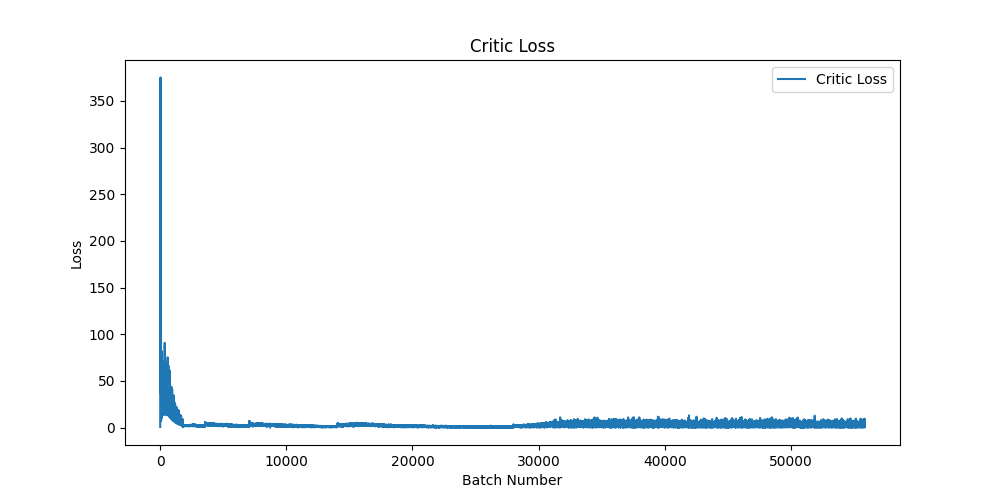
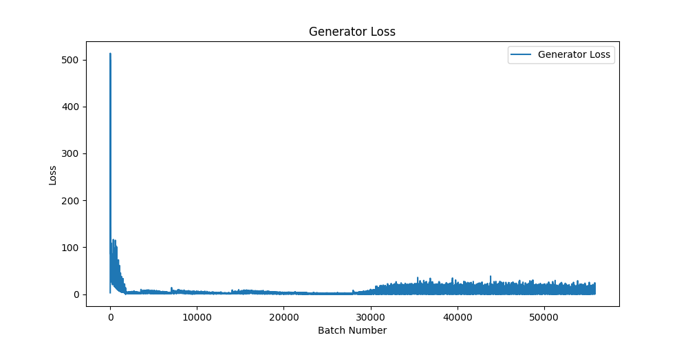
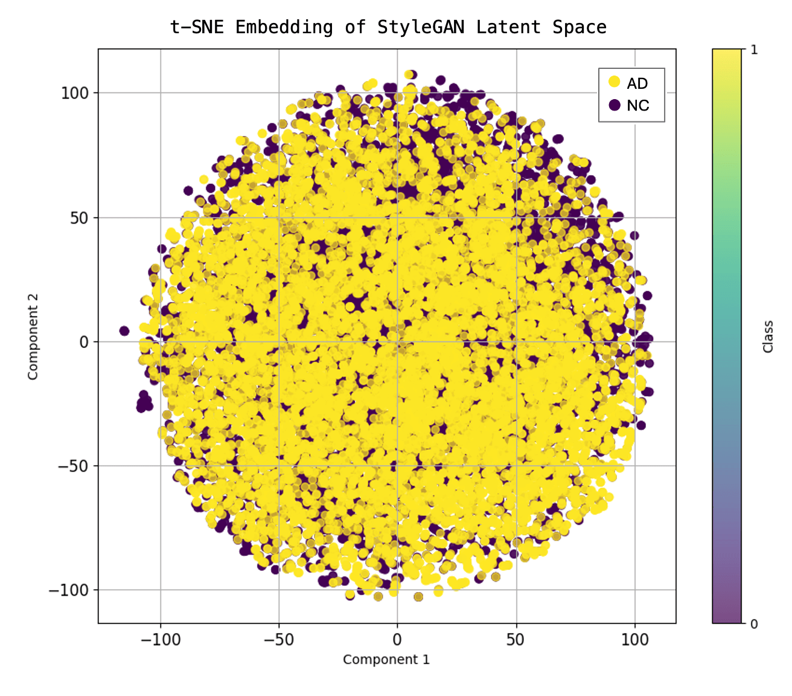
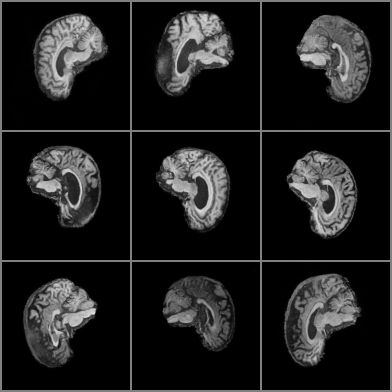

# Generative Model for Brain Image Synthesis using StyleGAN

## Description
This project implements a generative adversarial network (GAN) architecture, specifically a modified version of StyleGAN, to synthesize high-quality brain images from the Alzheimer’s Disease Neuroimaging Initiative (ADNI) dataset. The model employs various innovative layers such as Pixel Normalization, Adaptive Instance Normalization, and Weighted Sum Linear layers to effectively generate images that mimic real brain scans.

## Problem Statement
Generating realistic brain images is critical for advancing research in neuroimaging and Alzheimer's disease. This project addresses the challenge of creating high-fidelity synthetic images that can supplement existing datasets, aiding researchers in understanding disease progression and identifying biomarkers.

## How It Works
The architecture consists of a Generator and a Discriminator, operating in an adversarial manner. The Generator creates images from latent vectors, while the Discriminator evaluates their authenticity. 

## Input and Output
- **Input**: Latent vectors sampled from a normal distribution.
- **Output**: Generated brain images in the specified output directory.

## Pre-processing Steps
- **Resize**: Images are resized to a specified size.
- **To Tensor**: Converted to PyTorch tensors, normalizing pixel values to [0, 1].
- **Random Horizontal Flip:**: Applied with a 50% chance to augment the dataset.
- **Normalization:**: Images are normalized to have a mean and standard deviation of 0.5 for each channel.

### Generator

The Generator takes latent vectors sampled from a normal distribution and transforms them into high-resolution brain images. It employs a Mapping Network to convert the latent vectors into style vectors, which are then processed through multiple progressive blocks that incorporate Adaptive Instance Normalization (AdaIN) and noise injection. The generation process uses a fade-in technique to smoothly transition between resolutions, enhancing the realism of the synthesized images. Key components include:

- **Mapping Network**: Transforms latent vectors (noise) into a style space using a series of weighted sum linear layers and pixel normalization.
  
- **Adaptive Instance Normalization (AdaIN)**: Adjusts the mean and variance of the generated images based on style vectors, allowing for fine control over the generated output.

- **Noise Injection**: Introduces random noise into the generation process to enhance diversity and realism.

- **Progressive Blocks**: A series of generator blocks that build the final image progressively, each consisting of weighted sum convolutional layers, AdaIN, and leaky ReLU activations.

- **Fade-In Technique**: Smoothly transitions between different resolutions during the image generation process to avoid artifacts.


### Discriminator

The Discriminator evaluates the authenticity of both real and generated images. It uses a series of convolutional blocks to progressively process the input images, employing techniques like minibatch standard deviation to capture variations across batches. The Discriminator also utilizes a fade-in technique to effectively combine outputs at different resolutions, helping it distinguish between real and synthetic images more accurately. Key components include:

- **Convolutional Blocks**: Consists of weighted sum convolutional layers and leaky ReLU activations, progressively processing the input images.

- **Minibatch Standard Deviation**: Calculates the standard deviation of feature maps across a batch, enhancing the model's ability to detect variations in generated images.

- **Fade-In Technique**: Similar to the generator, this technique is used to combine outputs from different resolutions.


## File Structure
```
/project-directory
│
├── modules.py        # Model components: Generator and Discriminator
├── dataset.py        # Data loading and preprocessing
├── train.py          # Training, validation, and saving the model
├── predict.py        # Usage example for generating images
├── embedding.py      # Script for t-SNE embedding visualization
└── README.md         # Project documentation
```

## Dependencies
- Python >= 3.7
- PyTorch >= 1.8
- NumPy >= 1.19
- torchvision >= 0.9
- Matplotlib >= 3.3
- scikit-learn >= 0.24  # For t-SNE visualization

## Training Process
- The training involves loading the dataset and progressively increasing the image size.
- The losses for both the Generator and Critic are recorded, and visualizations are generated post-training.
- The trained models are saved for future inference.

## Visualizations
### Loss Metrics
- Loss metrics for both the Generator and Discriminator are plotted during training to monitor convergence. These plots provide insights into the training dynamics and help assess model performance.

<div style="text-align: center;">
  
  <p>Figure 1: AD critic (discriminator) loss.</p>
</div>

<div style="text-align: center;">
  
  <p>Figure 2: AD generator loss.</p>
</div>

<div style="text-align: center;">
  
  <p>Figure 3: NC critic (discriminator) loss.</p>
</div>

<div style="text-align: center;">
  
  <p>Figure 4: NC generator loss.</p>
</div>

### t-SNE Embedding
- A t-SNE embedding visualization is generated to analyze the distribution of latent space representations. This helps in understanding how well the model captures the diversity of the training data.

<div style="text-align: center;">
  
  <p>Figure 5: TSNE Embedding Plot for Generated Images.</p>
</div>


### Generated Image Grids
- A 9x9 grid of generated images is created for both Alzheimer's Disease (AD) and Normal Control (NC) classes. This provides a visual assessment of the quality and variety of the synthesized images, showcasing the model's ability to generate realistic brain scans.

<div style="text-align: center;">
  
  <p>Figure 6: Generated AD images.</p>
</div>

<div style="text-align: center;">
  
  <p>Figure 7: Generated NC images.</p>
</div>

## Conclusion
This project demonstrates the capabilities of GANs in generating realistic brain images, providing a valuable tool for researchers in the field of neuroimaging. Future work may include fine-tuning the model and exploring additional image generation techniques.