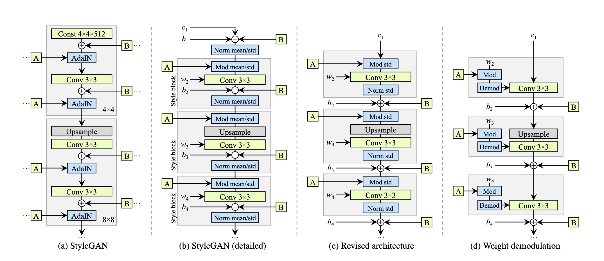
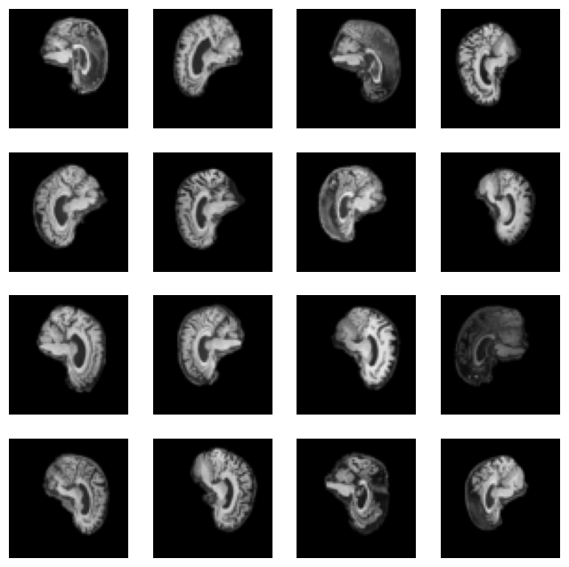
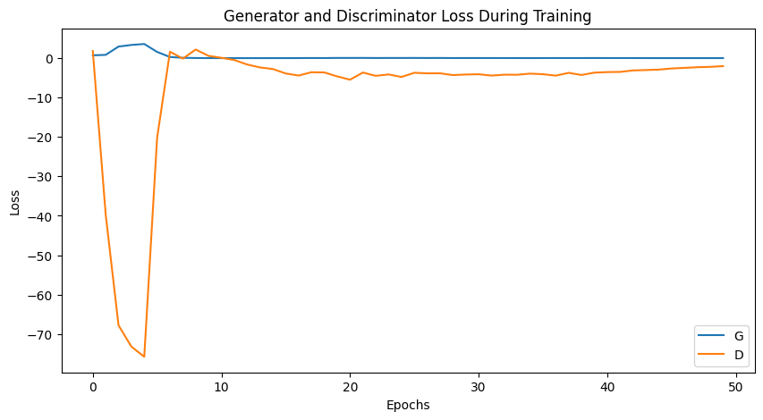
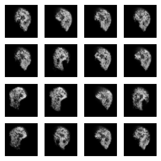
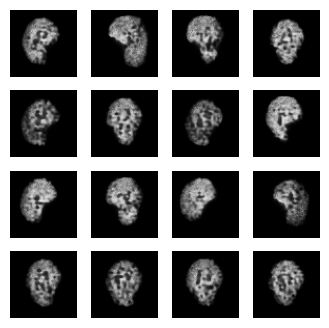
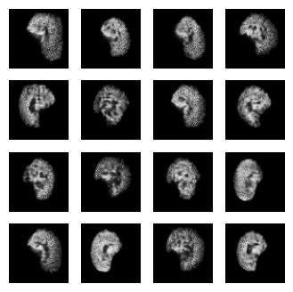

# Generating Synthetic Brain Scans with StyleGAN (COMP3710)

This project implements StyleGAN (Generative Adversarial Network) to create high-quality, synthetic
brain scan images. Developed as part of the COMP3710 course, this implementation aims to demonstrate
the potential of deep learning in medical imaging synthesis.

## Objective

Our project harnesses StyleGAN technology to generate high-quality, synthetic brain scan images, addressing several critical
challenges in biomedical research and healthcare AI applications. The medical imaging field often struggles with data scarcity,
which limits the development and validation of AI algorithms. By generating synthetic brain scans, we can augment existing
datasets, providing researchers with a broader range of imaging data for their work.

These synthetic images serve multiple purposes beyond just expanding datasets. They can be instrumental in training and testing
AI models designed for various neurological applications, including disease detection, progression tracking, and treatment
response prediction. Additionally, our approach helps address the underrepresentation of rare neurological conditions in existing
datasets by generating synthetic examples of these uncommon cases. The generated images also serve as valuable educational
resources for medical students and professionals, offering diverse brain imaging examples without requiring actual patient scans.

## GAN Architecture

Generative Adversarial Networks (GANs) represent a sophisticated class of deep learning models designed for generative tasks. At
their core, GANs consist of two primary networks working in opposition: a Generator that creates synthetic data from random noise,
and a Discriminator that works to distinguish between real and generated images. These components engage in a complex minimax
game during training, where the Generator continuously improves its ability to create realistic images while the Discriminator
becomes increasingly adept at detecting synthetic ones. This adversarial process results in progressively higher quality
synthetic images.

### Feature Entanglement in GANs

One of the challenges in traditional GAN architectures is feature entanglement. This refers to the
phenomenon where different features or attributes of the generated images are not clearly separated in
the latent space. Feature entanglement can manifest in several ways:

- **Lack of Control**: When features are entangled, it becomes difficult to manipulate specific attributes
of the generated images independently. Changing one aspect of the image often affects others
unintentionally.

- **Limited Diversity**: Entanglement can limit the diversity of generated samples, as the model struggles
to combine features in novel ways.

Addressing feature entanglement is crucial for improving the quality and utility of generated images,
especially in sensitive applications like medical imaging. This is where advanced architectures like
StyleGAN and StyleGAN2 come into play.

## StyleGAN

StyleGAN, introduced by NVIDIA in 2020, represents a significant advancement in GAN architecture, designed to generate
high-quality, controllable images. The architecture introduces several innovative components that work together to improve both
the quality and controllability of generated images.

<p align="center">

</p>

Key components and innovations of the StyleGAN architecture include:

1. **Mapping Network**: This network transforms the input latent code z into an intermediate latent code w.
The mapping network allows for better disentanglement of features and more control over the generated
images' styles. It consists of multiple fully connected layers.

2. **Synthesis Network**: This is the main part of the generator that actually produces the image.
It's structured as a series of convolutional layers, each operating at a different resolution.

3. **Adaptive Instance Normalization (AdaIN)**: This technique applies the style at different resolutions,
enabling fine-grained control over image features. AdaIN layers are inserted after each convolutional
layer in the synthesis network.

4. **Noise Injection**: Random noise is added at each layer of the synthesis network, introducing stochastic
variation and improving the realism of generated images, especially in terms of fine details.

5. **Progressive Growing**: StyleGAN starts training on low-resolution images and progressively increases the
resolution during training, allowing for stable training of high-resolution images.

6. **Style Mixing**: During training, styles from two latent codes are randomly mixed, improving the network's
ability to separate different aspects of the generated images.

The StyleGAN family has undergone several iterations, with StyleGAN2 being a significant improvement over
the original.

## StyleGAN2

In this project, we implemented the StyleGAN2 architecture, which addresses several shortcomings of
the original StyleGAN. Key features of StyleGAN2 include:

<p align="center">

</p>

1. **Modulation-demodulation**: At its core, StyleGAN2 replaces the AdaIN operations with a new modulation-demodulation mechanism.
This approach effectively eliminates the characteristic "blob" artifacts that were sometimes visible in images generated by the
original StyleGAN, resulting in smoother, more natural-looking outputs.

2. **Weight Demodulation**: Weight demodulation serves as another crucial innovation, replacing the instance normalization used
in the original architecture. This technique normalizes feature maps more effectively, leading to better overall image quality
and more stable training. The result is more consistent image generation with improved fine detail preservation, which is
particularly important for medical imaging applications where accuracy is paramount.

3. **Path Length Regularization**: This new regularization technique ensures smoother transitions in the latent space, leading to
more consistent image generation and better interpolation between different styles.

These improvements collectively make StyleGAN2 a more robust and reliable architecture for generating synthetic brain scans,
providing better control over the generation process while maintaining high image fidelity and anatomical accuracy.

## Dataset

Our implementation utilizes the Alzheimer's Disease Neuroimaging Initiative (ADNI) dataset, a comprehensive collection of brain
MRI scans that has become a cornerstone resource in neurological research. The dataset encompasses both Alzheimer's Disease (AD)
patients and healthy control subjects, providing a robust foundation for training our StyleGAN2 model.

### Data Access and Structure

Access to the ADNI dataset requires proper authorization through the Image and Data Archive (IDA) platform. For researchers and
students at The University of Queensland, the dataset is readily accessible through the Ranpur computing cluster. The dataset has
the following structure:

```
ADNI/
└── AD_NC/
    ├── train/
    │   ├── AD/    # Alzheimer's Disease training scans
    │   └── NC/    # Normal Control training scans
    │
    └── test/
        ├── AD/    # Alzheimer's Disease test scans
        └── NC/    # Normal Control test scans
```

The dataset is organized into a hierarchical structure with separate directories for training and test sets. Each set contains
two subfolders:

- `AD/`: Contains brain scans of patients with Alzheimer's Disease

- `NC/`: Contains brain scans of Normal Control subjects (healthy individuals)

### Transformation and Augmentation

Our data pipeline implements several preprocessing steps and augmentations to ensure optimal model training and generalization.
These transformations are applied using PyTorch's transformation pipeline to standardize and enhance our training data.

The first step involves resizing all images to a consistent `ADNI_IMG_SIZE x ADNI_IMG_SIZE` dimension, ensuring uniform input
size for network processing. We then implement horizontal flipping as a key augmentation technique, where images are randomly
flipped with a 50% probability. This effectively doubles our dataset diversity and helps prevent overfitting, while maintaining
anatomical validity for brain scans.

Finally, all images undergo normalization, where pixel values are scaled to the range [-1, 1] using mean (0.5) and standard
deviation (0.5) for each channel. This normalization step is crucial for training stability, ensuring consistent input
distributions and proper gradient flow throughout the network.

## Codebase Structure

```
StyleGAN_arjun/
├── dataset.py      # Dataset loading and preprocessing pipeline
├── modules.py      # StyleGAN2 architecture implementation (Generator, Discriminator, Mapping)
├── train.py        # Training loop and optimization logic
├── predict.py      # Inference code for generating synthetic scans
├── config.py       # Configuration parameters and hyperparameters
├── models/         # Directory for storing trained model checkpoints
└── assets/         # README images and documentation resources
```

### Key Components

- **dataset.py**: Implements data loading and preprocessing functionality, including the transformation pipeline and dataset
handling for both ADNI and CIFAR10 datasets.

- **modules.py**: Contains the core architectural components of StyleGAN2, including:
  - Generator with mapping network
  - Discriminator architecture
  - Style-based generation modules
  - Custom layers and normalization techniques

- **train.py**: Manages the training process, implementing:
  - Training loop logic
  - Loss calculations
  - Gradient penalty
  - Progress tracking
  - Model checkpointing

- **predict.py**: Handles model inference, providing functionality to:
  - Load trained models
  - Generate synthetic brain scans
  - Perform style mixing
  - Visualize results

- **config.py**: Centralizes all configuration parameters:
  - Model hyperparameters
  - Training settings
  - Data paths
  - Image dimensions

## Current Implementation

Our current implementation of StyleGAN2 includes several practical considerations and modifications to accommodate computational
constraints while maintaining effective training:

### Image Resolution and Processing

We currently resize ADNI brain scan images to 64x64 pixels, a decision driven by computational resource limitations. While this
resolution is lower than optimal for medical imaging applications, it allows for faster training iterations and proof-of-concept
development. Below are examples of the processed training images:

<p align="center">

</p>

### Training Configuration

The training process is structured into multiple phases:

- Model components (Generator, Mapping Network, and Discriminator) are trained for 50-epoch intervals

- Total training spans 150 epochs, divided into:

  - Initial 100 epochs: Learning rate of 1e-4

  - Final 50 epochs: Reduced learning rate of 1e-5 for fine-tuning

- Batch size of 64 is used throughout training to optimize GPU memory usage and training stability.

### Architectural Specifications

The network architecture uses standard StyleGAN2 dimensions:

- Latent space dimension (z): 512

- Intermediate latent space dimension (w): 512

### Simplifications

To streamline the implementation, we've made several pragmatic choices:

- Path length penalty is currently not implemented, focusing instead on core StyleGAN2 functionality

- Training is conducted in discrete epochs rather than using progressive growing

- Batch sizes and other hyperparameters are optimized for available GPU memory

These implementation choices represent a balance between architectural sophistication and practical constraints, allowing us to
demonstrate the potential of StyleGAN2 for medical image synthesis while maintaining feasible training times and resource
requirements.

## Training

The training process of our StyleGAN2 implementation follows an adversarial training scheme using WGAN-GP (Wasserstein GAN with
Gradient Penalty) loss. The process involves several key components:

### Training Strategy

- **Phased Learning**: Training is divided into two phases with different learning rates:

  - Phase 1 (Epochs 1-100): Learning rate of 1e-4 for initial feature learning

  - Phase 2 (Epochs 101-150): Learning rate of 1e-5 for fine-tuning

- **Batch Processing**: Batch size of 64 is maintained throughout training

- **Data Handling**: Images are processed at 64x64 resolution with standardized transformations

### Loss Components

- **Generator Loss**: Wasserstein loss formulated as `-torch.mean(D(G(z)))`

- **Discriminator Loss**: Combination of:
  - Wasserstein distance: `-(torch.mean(D(real)) - torch.mean(D(fake)))`
  - Gradient penalty: Applied with weight λ=10
  - R1 regularization: Small penalty (0.001) on real gradients

- **Optimization**: Adam optimizer used for all networks (Generator, Discriminator, and Mapping Network)

### Initial Training Progress

The following plot shows the progression of Generator and Discriminator losses over the first 50 epochs:

<p align="center">

</p>

The loss curves for the initial 50 epochs demonstrate the characteristic adversarial dynamic between the Generator and
Discriminator. The relatively stable convergence pattern suggests effective training dynamics, though this represents only
a third of the total training process.

## Results

Our StyleGAN2 implementation demonstrates progressive improvement in the quality of generated brain scan images throughout the
training process. Below are samples of generated images at different training milestones:

<p align="center">
<figure style="display: inline-block; margin: 0 10px;">
    
    
    
    <figcaption align="center">Left to right: Generated images at 50, 100, and 150 epochs</figcaption>
</figure>
</p>

The progression shows clear improvement in image quality across training phases:

- **50 Epochs**: Initial learning phase where the model begins to capture basic structural features of brain scans, though with
visible noise and artifacts

- **100 Epochs**: With the initial learning rate of 1e-4, the generated images show improved definition and clearer brain
structures

- **150 Epochs**: After reducing the learning rate to 1e-5, the model produces more refined images with better structural
consistency and fewer artifacts

While the generated images cannot be considered clear or ideal, we can clearly observe the model learning the fundamental
structure of the brain along with some anatomical details. Given the constrained resolution of 64x64 pixels and the relatively
modest number of training epochs, these results align with our expectations. The model demonstrates promising capability in
capturing the essential characteristics of brain scans, even with these limitations.

These results demonstrate the progressive improvement in image quality and structural coherence throughout the training process,
showing the effectiveness of our StyleGAN2 implementation despite the resolution constraints.

## Future Improvements

Several potential enhancements could improve the performance and utility of our StyleGAN2 implementation:

- **Higher Resolution Training**: Increase image resolution from 64x64 to 128x128 or 256x256 to capture finer anatomical details

- **Extended Training**: Increase the number of training epochs to allow for better convergence

- **Learning Rate Schedule**: Implement a more sophisticated learning rate schedule with warmup and decay phases

- **Advanced Augmentation**: Introduce additional data augmentation techniques specific to medical imaging

- **Conditional Generation**: Extend the model to support conditional generation based on specific brain features or conditions

These improvements would help create a more robust and practical tool for medical image synthesis, potentially making it more
suitable for real-world applications in healthcare and research.

## Usage

Follow these steps to set up and run the StyleGAN2 implementation:

### Setup

1. Clone the repository:

```bash
git clone https://github.com/yourusername/StyleGAN_arjun.git
cd StyleGAN_arjun
```

2. Install dependencies:

```bash
pip install -r requirements.txt
```

3. Prepare the ADNI dataset:

   - Request access through IDA platform

   - For UQ students: Access via Ranpur cluster

   - Organize data according to the specified structure in the Dataset section

### Configuration

Modify hyperparameters in `config.py` to customize the training:

```python
# Model parameters
z_dim = 512          # Latent space dimension
w_dim = 512          # Intermediate latent space dimension
ADNI_IMG_SIZE = 64   # Image resolution

# Training parameters
num_epochs = 150     # Total training epochs
lr = 1e-4           # Initial learning rate
batch_size = 64      # Batch size
```

### Training

To train the model from scratch:

```bash
python train.py
```
The script will:
  - Load and process the dataset
  - Initialize StyleGAN2 components
  - Train for specified number of epochs
  - Save model checkpoints in the `models/` directory

### Generating Images

To generate synthetic brain scans using a trained model:
```bash
python predict.py
```

Generated images will be saved in the `stylegan_outputs/` directory.

## References

### Research Papers

- **StyleGAN**: "A Style-Based Generator Architecture for Generative Adversarial Networks"
  - Authors: Tero Karras, Samuli Laine, Timo Aila
  - [arXiv:1812.04948](https://arxiv.org/abs/1812.04948)

- **StyleGAN2**: "Analyzing and Improving the Image Quality of StyleGAN"
  - Authors: Tero Karras, Samuli Laine, Miika Aittala, Janne Hellsten, Jaakko Lehtinen, Timo Aila
  - [arXiv:1912.04958](https://arxiv.org/abs/1912.04958)

### Implementation Resources

- **StyleGAN2 Implementation Guide**
  - "Implementation of StyleGAN2 from Scratch"
  - [Paperspace Blog](https://blog.paperspace.com/implementation-stylegan2-from-scratch/#models-implementation)

- **Reference Implementation**
  - StyleGAN2 implementation by aburo8
  - [GitHub Repository](https://github.com/aburo8/PatternAnalysis-2023/tree/topic-recognition/recognition/46990480_StyleGAN2)
