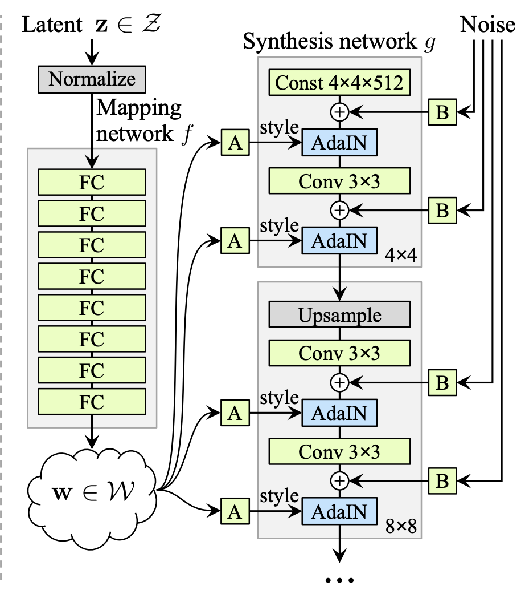

# Generating Synthetic Brain Scans with StyleGAN (COMP3710)

This project implements StyleGAN (Generative Adversarial Network) to create high-quality, synthetic
brain scan images. Developed as part of the COMP3710 course, this implementation aims to demonstrate
the potential of deep learning in medical imaging synthesis.

## Objective

The primary objective of this project is to leverage StyleGAN technology to generate high-quality,
synthetic brain scan images. This endeavor addresses several critical needs in the field of biomedical
research and AI applications in healthcare:

1. **Data Scarcity**: The development and validation of AI algorithms in medical imaging are often hindered
by the limited availability of large, diverse datasets. By generating synthetic brain scans, we aim to
augment existing datasets, providing researchers with a broader range of imaging data to work with.

2. **AI Model Training and Testing**: The generated images can be used to train and test AI models designed
for various neurological applications, such as disease detection, progression tracking, and treatment
response prediction.

3. **Rare Condition Representation**: Synthetic data generation can help in creating images representing
rare neurological conditions, which are often underrepresented in real-world datasets due to their
infrequent occurrence.

4. **Educational Resources**: These synthetic images can serve as valuable educational tools for medical
students and professionals, offering a diverse range of brain imaging examples without the need for
actual patient scans.

Through this project, we aim to demonstrate the potential of deep learning in medical imaging
synthesis.

## GAN Architecture

Generative Adversarial Networks (GANs) are a class of deep learning models designed for generative tasks.
The GAN architecture consists of two main components:

1. Generator (G): This network takes random noise as input and generates synthetic data
(in our case, brain scan images).

2. Discriminator (D): This network tries to distinguish between real data from the training set
and fake data produced by the Generator.

The training process involves a minimax game between G and D:
- G tries to produce increasingly realistic images to fool D.
- D improves its ability to differentiate between real and fake images.

As training progresses, both networks improve, resulting in a Generator that can produce high-quality
synthetic images.

### Feature Entanglement in GANs

One of the challenges in traditional GAN architectures is feature entanglement. This refers to the
phenomenon where different features or attributes of the generated images are not clearly separated in
the latent space. Feature entanglement can manifest in several ways:

- Lack of Control: When features are entangled, it becomes difficult to manipulate specific attributes
of the generated images independently. Changing one aspect of the image often affects others
unintentionally.

- Limited Diversity: Entanglement can limit the diversity of generated samples, as the model struggles
to combine features in novel ways.

Addressing feature entanglement is crucial for improving the quality and utility of generated images,
especially in sensitive applications like medical imaging. This is where advanced architectures like
StyleGAN and StyleGAN2 come into play,

## StyleGAN

StyleGAN is an advanced GAN architecture introduced by NVIDIA in 2020, designed to generate high-quality,
controllable images. It introduced several innovations to improve the quality and controllability of
generated images.

Key components and innovations of the StyleGAN architecture include:

1. Mapping Network: This network transforms the input latent code z into an intermediate latent code w.
The mapping network allows for better disentanglement of features and more control over the generated
images' styles. It consists of multiple fully connected layers.

2. Synthesis Network: This is the main part of the generator that actually produces the image.
It's structured as a series of convolutional layers, each operating at a different resolution.

3. Adaptive Instance Normalization (AdaIN): This technique applies the style at different resolutions,
enabling fine-grained control over image features. AdaIN layers are inserted after each convolutional
layer in the synthesis network.

4. Noise Injection: Random noise is added at each layer of the synthesis network, introducing stochastic
variation and improving the realism of generated images, especially in terms of fine details.

5. Progressive Growing: StyleGAN starts training on low-resolution images and progressively increases the
resolution during training, allowing for stable training of high-resolution images.

6. Style Mixing: During training, styles from two latent codes are randomly mixed, improving the network's
ability to separate different aspects of the generated images.

The StyleGAN family has undergone several iterations, with StyleGAN2 being a significant improvement over
the original.

### StyleGAN2

In this project, we implemented the StyleGAN2 architecture, which addresses several shortcomings of
the original StyleGAN. Key features of StyleGAN2 include:

1. Modulation-demodulation: Replaces AdaIN used in the original StyleGAN. This new approach helps
eliminate "blob" artifacts and improves image quality.

2. Weight Demodulation: A technique that normalizes the feature maps, replacing instance normalization
and improving overall image quality.
