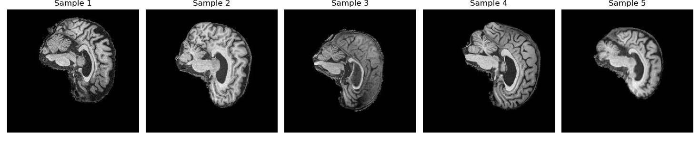
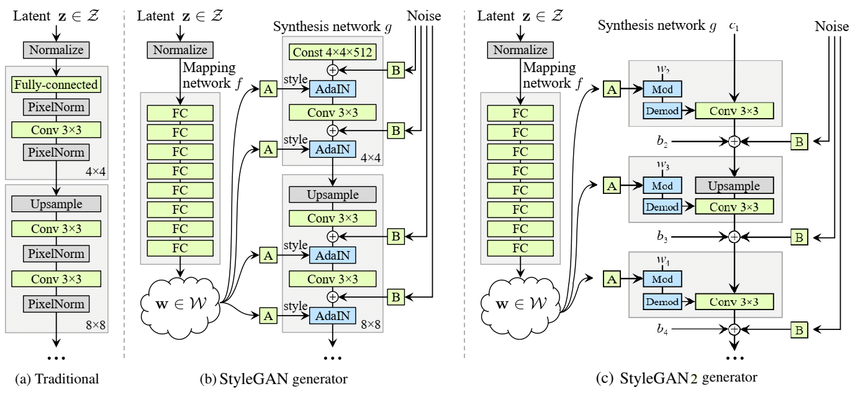

# StyleGAN2 on AD_NC Brain Dataset

## Overview

This StyleGAN2's application is to generate realistic like brain scans using the ADNI dataset for Alzheimer's disease. The primary goal is to provide a model that is able to generate "reasobably clear images". Using StyleGAN2 ability to

## Table of Contents

- [StyleGAN2 on AD\_NC Brain Dataset](#stylegan2-on-ad_nc-brain-dataset)
  - [Overview](#overview)
  - [Table of Contents](#table-of-contents)
  - [File Structure](#file-structure)
  - [Installation](#installation)
  - [Requirements](#requirements)
  - [Dataset](#dataset)
  - [Data Augmentation](#data-augmentation)
  - [StyleGAN](#stylegan)
  - [StyleGAN2](#stylegan2)
  - [Model Architecture](#model-architecture)
    - [Mapping Network](#mapping-network)
    - [Adaptive Instance Normalization (AdaIN) Replacement](#adaptive-instance-normalization-adain-replacement)
    - [Progressive Growing](#progressive-growing)
    - [Noise Injection](#noise-injection)
    - [Discriminator Network](#discriminator-network)
    - [Path Length Regularization](#path-length-regularization)
  - [Training Configuration](#training-configuration)
  - [Results](#results)
  - [Conclusion](#conclusion)
  - [References](#references)

## File Structure

Folder contains the following files:

config.py: Contains the configuration settings for the project
dataset.py: Contains the data loader for the AD_NC dataset
modules.py: Contains the StyleGAN2 model
predict.py: Contains the prediction function for the StyleGAN2 model
utils.py: Contains utility functions for the project
train.py: Contains the training loop for the StyleGAN2 model

## Installation
1. Download [ADNI dataset for Alzheimer’s disease](https://filesender.aarnet.edu.au/?s=download&token=a2baeb2d-4b19-45cc-b0fb-ab8df33a1a24).
2. Set paths of dataset in config.py
3. Check neccessary [requirements](#requirements) are met

## Requirements

| Package | Version |
| --- | --- |
|torch | 2.5.0.dev20240904 |
|torchvision | 0.20.0.dev20240904 |
|tqdm | 4.66.5 |
|numpy | 1.26.4 |
|pandas | 2.2.2 |
|matplotlib | 3.9.2 |
|seaborn | 0.13.2 |
|scikit-learn | 1.5.1 |
|scipy | 1.13.1 |
|pillow | 10.4.0 |


## Dataset
The ADNI dataset for Alzheimer's disease is hosted on the [ADNI website](https://adni.loni.usc.edu/) for download. ADNI stands for Alzheimer's Disease Neuroimaging Initiative (ADNI) and is a longitudinal, multi-center, observational study.

In this project I used the preprocessed dataset from this [website](https://filesender.aarnet.edu.au/?s=download&token=a2baeb2d-4b19-45cc-b0fb-ab8df33a1a24). The dataset is split into two classes: AD (Alzheimer's disease) and NC (normal control). Each class contains 15660 brain scans.

The dataset specification is as follows:

| Attribute | Values |
| --- | --- |
| Class | AD, NC |
| Number of samples each | 15660 |
| training set each |11200 |
| testing set each | 4460 |
| Image size | 256x240 |
| Image format | .jpg |
| Number of channels | 1 |

Below is a sample of the dataset:


## Data Augmentation


## StyleGAN

Style Generative Adversarial Network or StyleGAN is the next generation of generative model for synthesizing high-resoultion images with striking realism. Developed by NVIDIA in 2018, StyleGAN advances the capabilities of generative adversarial networks (GANs) through its unique “style-based” architecture, which allows for detailed control over image attributes such as facial structure, textures, and backgrounds. This model achieves fine-grained manipulation by leveraging a multi-level latent space, where individual layers influence specific visual characteristics, enabling seamless transitions between styles. Using a progressive training technique, StyleGAN gradually refines image resolution, while noise inputs introduce authentic variability. A discriminator network further enhances image quality by guiding the model to improve authenticity at each step.

## StyleGAN2

StyleGAM2  is an improvement over the original styleGAN model, introduced by NVIDIA in 2019. StyleGAN2 builds upon StyleGAN2 and introduces several key enhancements. The primary improvements inclues tackling "blob artifacts"
and enchances overall image quality. The model achieves this by introducing a new regularization techniques, such as weight demodulation to prevent visual artifacts. StyleGAN2 also introduces a new data augmentation technique called "adaptive discriminator augmentation" (ADA), which improves the model's generalization capabilities. The model also maintaince StyleGANs ability to control specific image feature and styles, enabling for fine-grained manipulation of generated images. With a higher resolution and improved image quality, StyleGAN2 is able to generate more realistic images with greater detail and fidelity thus setting a new benchmark for generative models.

## Model Architecture



### Mapping Network
Similar to StyleGAN, StyleGAN2 uses a mapping netwokr to transform the latent space $z$ from a simple Gaussian distribution to a more complex distribution, the intermediate latent space $w$.  The mapping network consists of 8 fully connected layers that equalize the learning rate and apply leaky ReLU activation functions.

### Adaptive Instance Normalization (AdaIN) Replacement
In StyleGAN, AdaIN layers were introduce to inject style information into each layer of the generator. Later replaced with Weight Demodulation, which eliminated "Blob" artifacts caused by AdaIN. This provided better control over visuals and realistic images. Weight Demodulation adjusts the style weights per layer without disrupting the generator's output.

### Progressive Growing
Different from StyleGAN where it each layer is introduce one at a time starting from low-resolution images and gradually increase the resoulution as during training. StyleGAN2 uses fixed-resolution architecture with all layers active from the start. This stabilizes training and simplifies the overall process, as the network learns at a consistent resolution.
### Noise Injection
As is in StyleGAN, adds random noise to each layer to introduce variability in texture and fine-grainded details in generated images.

### Discriminator Network
Updated from previous generation to better handle complex features and improve image realism.  Discriminator role is to distinguish real from synthetic images and guides the generator to produce more authentic-looking outputs over time.

### Path Length Regularization
Enforces a consistent relationship between the latent space and the generated image. This helps reduce artifacts and enhances the model's ability to interpolate smoothly between different styles.

## Training Configuration

## Results

## Conclusion

## References

NVIDIA. (2018). StyleGAN: Official TensorFlow implementation. GitHub repository. https://github.com/NVlabs/stylegan

NVIDIA Corporation. (2020). StyleGAN2-ADA-PyTorch [Computer software]. GitHub. https://github.com/NVlabs/stylegan2-ada-pytorch

Paperspace. (2020, February 19). Implementing StyleGAN2 from scratch. Paperspace Blog. https://blog.paperspace.com/implementation-stylegan2-from-scratch/

Task 8:
```Create a generative model of one of the ADNI brain data set (see Appendix for links) using either a variant of StyleGAN [10]/StyleGAN2 [11] or Stable Diffusion [12] that has a “reasonably clear image”. You should also include a TSNE or UMAP embeddings plot with ground truth in colors and provide a brief interpretation/discussion. See recent UQ work for hints of how to incorporate labels in style [13]. [Hard Difficulty]```
