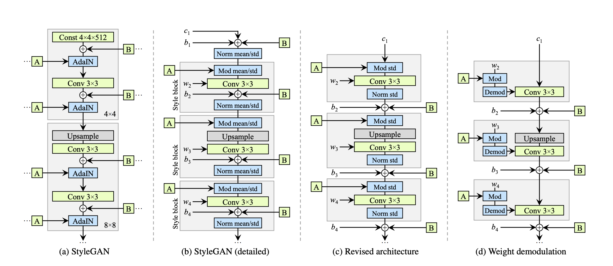

# StyleGAN2 Based Image Generation Network on ANDI Brain Dataset
## Project Aim
The aim of the model is to create a Image generation network of the ANDI dataset based on StyleGAN2.

## Dependencies

    |  Libaries       |Version            |
    |-----------------|-------------------|
    |  python         |3.11.9             |
    |  torch          |2.5.0              |
    |  torchvision    |0.20.0             |
    |  pytorch-cuda   |11.8               |
    |  cudatoolkit    |10.1               |
    |  numpy          |1.23.5             |
    |  matplotlib     |3.9.2              |
    |  tqdm           |4.66.5             |
    |  umap-learn     |0.5.4              |
    |  pyqt           |5.15.10            |

## StyleGAN2 architecture

This project implements StyleGAN2. StyleGAN2 is an improvement from StyleGAN, which is based off of Generative Adversarial Networks (GANs). A GAN is composed 
of two main components: a generator and discriminator. Generator will generate fake images given an input noise, and the
discriminator is a classifier that classifies whether the given input image is real or fake.

StyleGAN improves GAN by using the following:
- Instead of a traditional latent input, generator takes a learned constant. 
- Using a standalone mapping network and AdaIN for style transfer.
  - The mapping network is a neural network composed of 8 fully connected layers. It takes a randomly sampled point from
  the latent space and generates a style vector. The style vector is then transformed and incorporated to each block of
  generator via adaptive instance normalization (AdaIN). 
- Addition of noise to each layer.
  - The noise is used to generate style-level variation.
- Mixing regularization
  - Since the Style generation uses intermediate vector at each level of synthesis, the network may learn the 
  correlation between the levels. Mixing regularization is introduced to reduce the correlation between levels.

StyleGAN2 improves StyleGAN by addressing the shortcoming of StyleGAN, namely, the droplet effect and the preference of 
features over a certain position. Weight modulation and demodulation is used, and got rid of progressive growing

## Algorithm
The architecture have 3 main components: Discriminator, Generator, and Noise Mapping Network.
These three components are defined in module.py as classes. 

The Generator is made up of multiple generator blocks and a 
StyleBlock. The GeneratorBlock is made up of two connected StyleBlock and followed by a ToRGB block.

The Discriminator is a simple classification neural network with Adam optimizer.

Adam was used as the optimizer for generator, discriminator and the mapping network.
Hyperparameter used include batch_size = 32, learning rate = 1e-3, LAMBDA_GP (for Adam optimizer) = 10. The model 
generates images with resolution 256x256. This is chosen as it is closest to the original image resolution, which is 
240x256.

## Preprocessing
The images are cropped to 256x256, and then random horizontal flip was applied.

## Training result
### Epoch 0

## Reference 
https://arxiv.org/pdf/1406.2661 
https://machinelearningmastery.com/introduction-to-style-generative-adversarial-network-stylegan/
[1]https://www.whichfaceisreal.com/learn.html?ref=blog.paperspace.com
https://blog.paperspace.com/understanding-stylegan2/