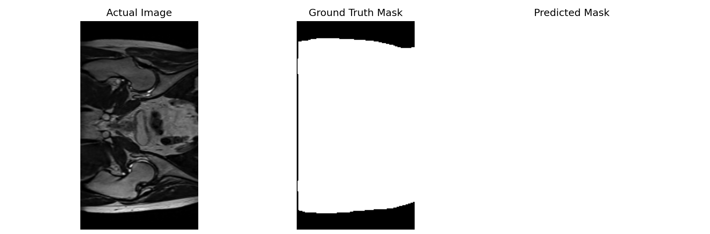

# Medical Image Segmentation with UNet

This repository implements a **medical image segmentation** pipeline using the **UNet architecture** in PyTorch. Medical image segmentation plays a critical role in diagnosing, planning, and treatment in medical imaging tasks by helping isolate regions of interest, such as organs or abnormalities, from medical images. This model is designed to solve segmentation problems on processed 2D slices stored as NIFTI files, specifically for the HIPMRI study on Prostate Cancer, using the Dice coefficient as the main evaluation metric. 

## Algorithm Description

This algorithm takes input from the HIPMRI dataset, and passes through the *encoder* block of the UNet architecture. An example of which can be seen below:

This architecture is comprised of 2D convolutional layers (with 3x3 kernel size and ReLU activation), followed by a 2x2 max pooling layer to downsample the input; extract features and patterns from the input image, while max pooling layers reduce spatial dimensions, allowing the network to focus on higher-level features. After reaching the latent layer, the output is passed through the *decoder* block; consists of two 2D convolutional layers (with 3x3 kernel size and ReLU activation), followed by a 2D transpose convolution layer (ConvTranspose2D) to upsample the feature map. *Concatenation* is used to combine upsampled features with their corresponding encoder features, enabling the retention of spatial details from previous layers. This process helps the network recover fine-grained information while ensuring gradients flow smoothly through the network during backpropagation, facilitating better learning and improved segmentation accuracy.

## How It Works

The code first takes the data found in the HIPMRI folders (specifically the training data), processing them into a dataset to be used by the UNet model. The model is then trained on this dataset; with the goal of minimizing **Dice Loss**. The Dice coefficient is calculated to assess overlap between the predicted segmentations and ground truth labels. The model is then trained, ensuring the model is able to maintain/reach the Dice similarity coefficient of 0.75. An example of training output can be seen as below:

Here is an example of training output with the loss scores and Dice Similarity Coefficient during trianing:
```bash
Epoch 1/10
1433/1433 [==============================] - 651s 451ms/step - loss: 0.3108 - dice_coefficient: 0.6892
Epoch 2/10
1433/1433 [==============================] - 631s 440ms/step - loss: 0.3011 - dice_coefficient: 0.6989
Epoch 3/10
1433/1433 [==============================] - 633s 442ms/step - loss: 0.2987 - dice_coefficient: 0.7013
```
After training, a plot of actual images vs. model output is produced to visualize model accuracy; the trained model is saved

## Project Dependencies

The code requires the following dependencies:
- **Python**: 3.8+
- **NumPy**: 1.21.0+
- **Matplotlib**: 3.4.3+
- **TensorFlow**: 2.10.0+
- **TensorBoard**: 2.10.1+
- **Nibabel**: 3.2.1 (for handling NIFTI files)

- [Processed 2D Image Data from the HIPMRI Study](https://filesender.aarnet.edu.au/?s=download&token=76f406fd-f55d-497a-a2ae-48767c8acea2)

The required dependencies can be installed by doing the following (this contributes to model-output reproduction):
1. Install conda/miniconda (pip can be used if desired but the steps are different)
2. Create a environment via:
   ```bash
   conda create <environment_name>
   ```
3. Activate the environment via:
   ```bash
   conda activate <environment_name>
   ```
4. Install the following dependencies:
   ```bash
   conda install numpy matplotlib tensorflow 
   ```
   ```bash
   conda install conda-forge::tensorboard
   ```
   ```bash
   conda install conda-forge::nibabel
   ```
5. Ensure all installed dependencies are running compatible versions:
   ```bash
   conda update --all
   ```

# Example Visualizations
	
## Model Usage
The model can be used by running the included test driver script via 
```bash
python test_driver_script.py
```
This creates and trains the model; runs the model on the validation dataset after testing. The script allows optional custom paths to the dataset via updating `data_directory`, `train_image_directory`, `train_mask_directory`, and `validate_image_directory`, `validate_mask_directory`

## Figures and Visualizations
An example of the model's predictions alongside the original MRI image and the ground truth mask is shown below:
(To reproduce the example graphs obtained, use the following parameters when training the model:
```bash
# Initialize learning rate scheduler
    decay_steps = 1000
    initial_learning_rate = 0.001
    lr_schedule = tf.keras.optimizers.schedules.CosineDecay(
        initial_learning_rate, decay_steps)

    # Adam Optimizer
    optimizer = tf.keras.optimizers.SGD(learning_rate=lr_schedule, clipvalue=1.0, clipnorm=1.0)
...
model.fit(
        dataset, 
        epochs=25, 
        steps_per_epoch=len(dataset),
        callbacks=[tensorboard_callback],
        verbose=1
    )
```
)


To help better visualize the model's accuracy, here is an example of the plot of an actual image, the ground truth and a model's prediction put side-by-side to better present the model's accuracy after training


An example of model training metrics is shown above; more in-depth metrics can also be obtained by taking the directory of the log files generated from training & running (in your conda environment):
```bash
tensorboard --logdir <directory to logs>
```
Example:
```bash
tensorboard --logdir "C:\Users\Documents\UNet-HIPMRI\logs\fit\20241021-235527"
```
and holding *CTRL* and clicking on the `http://localhost:6006/` link generated
