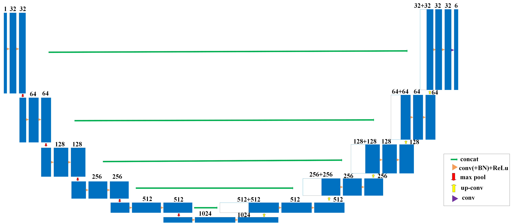

# 3D U-Net for Prostate MRI Segmentation
###### YA HONG s4764092
This project uses **UNet-3D** to train the Prostate 3D dataset for medical volumetric image segmentation, evaluated by the **Dice similarity coefficient**. The dataset has significant **class imbalance** (e.g., background: 1,068,883,043 pixels, prostate: 1,771,500 pixels). The prostate is difficult to segment accurately due to its small volume, blurred boundaries, and the complexity of anatomical structures. To address these challenges, I applied data augmentation strategies, adjusted the model’s initial feature size (`init_features`), and experimented with various loss functions (such as **Dice loss**, weighted cross-entropy, and their combinations) to improve segmentation performance for minority classes.

## About the Data

The dataset used for training consists of 3D MRI volumes and corresponding label maps for prostate segmentation. These MRI volumes are preprocessed to ensure consistency and efficiency during the training process. Below is a description of the preprocessing steps applied to the data.

### Preprocessing The Data

- **Resizing**:  
   All MRI and label volumes are resized to a uniform shape of **(96, 96, 96)** using linear interpolation. This standardization ensures consistency in input dimensions during training and improves training speed without compromising segmentation accuracy.

- **Normalization**:  
   The MRI volumes are normalized by adjusting their pixel intensity values to have **zero mean and unit variance**. This normalization is essential to stabilize the training process, prevent numerical issues, and improve the model's convergence.

### Data Splitting

- **Training set**: 90% of the data is used for training the model.
- **Validation set**: 5% of the data is reserved for evaluating model selection, testing different loss functions, and determining whether data augmentation should be applied. It helps ensure the model does not overfit.
- **Testing set**: 5% of the data is used to evaluate the model's performance on unseen data, providing a final measure of generalization.

### Data Agument
In this project, I attempted to use **data augmentation** to mitigate the issue of class imbalance. Due to the small volume and blurry boundaries of the prostate region in MRI images, which makes it occupy a small portion of the dataset, data augmentation theoretically helps generate more diverse training samples and improves the model's performance on minority class segmentation.

I used **RandomFlip** from the **torchio** library to perform random flipping on the images, with a 50% probability along the x, y, and z axes. This method was intended to increase the diversity of training data without altering the core structural information of the images.
All experiments were conducted under the **same conditions** (model architecture, hyperparameters, and data splits), except for the inclusion of data augmentation, to ensure that the effects observed were solely due to the augmentation process.

However, in practice, I found that data augmentation did not yield the expected results. The model performed better without data augmentation, as shown in the table below:

| **Average** | **Class 0** | **Class 1** | **Class 2** | **Class 3** | **Class 4** | **Class 5** |
|-------------|-------------|-------------|-------------|-------------|-------------|-------------|
| 0.7859      | 0.9555      | 0.8988      | 0.7913      | 0.7797      | 0.5687      | 0.7212      |

After applying data augmentation, the segmentation performance for some classes, particularly **Class 4** and **Class 5**, deteriorated significantly, as shown in the table below:

| **Average** | **Class 0** | **Class 1** | **Class 2** | **Class 3** | **Class 4** | **Class 5** |
|-------------|-------------|-------------|-------------|-------------|-------------|-------------|
| 0.6947      | 0.9539      | 0.8663      | 0.7010      | 0.6841      | 0.3701      | 0.5927      |

Although data augmentation can, in theory, increase data diversity, for my model and the characteristics of the existing data, using augmentation strategies (even the basic flipping operation) may have altered some key spatial information, which resulted in a decrease in segmentation performance. Therefore, in subsequent experiments, I chose not to use data augmentation to preserve the integrity of the original image features.

## About the Model
UNet3D is a three-dimensional extension of the 2D U-Net, specifically designed to handle 3D data. This model operates directly on entire volumetric data through 3D convolutions, capturing richer spatial contextual information that is crucial for understanding complex 3D structures. Unlike the 2D U-Net, which processes images slice by slice, UNet3D maintains spatial continuity of images, preventing the loss of cross-slice information during processing—this is extremely important in medical imaging analysis. Additionally, by integrating multi-scale features and skip connections between the encoder and decoder, UNet3D significantly enhances segmentation precision, especially for small-volume and complex-shaped structures. These features make UNet3D highly effective in 3D medical imaging segmentation tasks, particularly suited for handling complex images such as prostate MRI.

### Architecture
The model consists of the following components:

- **Encoder**: Composed of 5 convolutional blocks, each consisting of two 3D convolution layers. After each convolution, Batch Normalization is applied to standardize the feature maps, followed by a ReLU activation function for non-linearity. Downsampling is performed using 3D MaxPooling layers, gradually extracting multi-scale features from the input data.

- **Bottleneck**: Positioned between the encoder and decoder, this layer further extracts deep features. Its structure is similar to the convolutional blocks, consisting of two 3D convolution layers, BatchNorm, and ReLU, designed to capture high-level features.

- **Decoder**: The decoder restores the spatial resolution of the feature maps through 3D transpose convolutions (ConvTranspose3d). After each upsampling step, skip connections are used to concatenate corresponding encoder and decoder features, ensuring high-resolution details are preserved.

- **Skip Connections**: Each decoder level is connected to the corresponding encoder level, combining feature maps to ensure critical details are not lost during upsampling, enhancing segmentation accuracy.

- **Final Convolution Layer**: A 1x1x1 convolution layer is used to generate the final segmentation output, followed by a Softmax activation function for multi-class segmentation prediction.

### Initial Feature Selection

For this model, the choice of **initial features (`init_features`)** significantly impacts the segmentation performance. The selection was based on evaluating the model’s performance on the validation set using the **Dice similarity coefficient** across different feature sizes (16, 32, 64). Below is a comparison of the results:

| Initial Feature | Average | Class 0 | Class 1 | Class 2 | Class 3 | Class 4 | Class 5 |
|-----------------|---------|---------|---------|---------|---------|---------|---------|
| 16              | 0.7067  | 0.9048  | 0.8179  | 0.7774  | 0.6318  | 0.5154  | 0.5928  |
| 32              | 0.7859  | 0.9555  | 0.8988  | 0.7913  | 0.7797  | 0.5687  | 0.7212  |
| 64              | 0.7873  | 0.9584  | 0.8991  | 0.7990  | 0.7828  | 0.5102  | 0.7744  |

Based on these results, I selected an **initial feature size of 32**, as it provides the best balance between performance and computational efficiency. Although the model with 64 initial features offered a slight improvement in certain classes, it did not sufficiently address the imbalance issue in **Class 4**. Furthermore, it increased computational cost and posed a higher risk of overfitting. Therefore, **init_features = 32** was chosen as the optimal configuration to continue training.

The process is illustrated in the following figure:

## About the Loss Functions 

In this project, to address the issue of class imbalance and improve segmentation performance, I compared four different loss functions: **Cross-Entropy Loss**, **Weighted Cross-Entropy Loss**, **Dice Loss**, and the **Combined Loss** of weighted cross-entropy and Dice loss.

**Weighted Cross-Entropy Loss**:  
To tackle the class imbalance problem, I assigned weights to each class based on its pixel proportion. First, I calculated the number of pixels for each class, and then computed the total number of pixels. The weight for each class was calculated using the formula:  
**total number of pixels / (number of classes × number of pixels in that class)**.  
This gave smaller classes (e.g., prostate) larger weights, while larger classes (e.g., background) received smaller weights. These weights were applied to the weighted cross-entropy loss, making the model pay more attention to minority classes during training.

**Dice Loss**:  
Dice loss is calculated as **1 - Dice coefficient**, where the Dice coefficient measures the overlap between the predicted and the ground truth labels. The closer the Dice loss is to 0, the better the model performs. Dice loss is especially effective for small-volume targets, such as the prostate, as it optimizes segmentation performance by focusing on the overlap between the predictions and the ground truth.

**Combined Loss**:  
The combined loss incorporates both weighted cross-entropy and Dice loss. The formula is:  
**α × Weighted Cross-Entropy + β × log(Dice Loss)** (the log function is used to scale the Dice Loss to the same order of magnitude as the cross-entropy loss).  
I chose **α=0.5** and **β=0.5**. The goal of this combination is to address class imbalance while also optimizing segmentation accuracy. The results are shown in the table below:

| Loss Function         | Average Dice Score | Class 0 | Class 1 | Class 2 | Class 3 | Class 4 | Class 5 |
|-----------------------|--------------------|---------|---------|---------|---------|---------|---------|
| Cross-Entropy Loss    | 0.3074             | 0.9649  | 0.8796  | 0.0000  | 0.0000  | 0.0000  | 0.0000  |
| Weighted Cross-Entropy  | 0.7859         | 0.9555  | 0.8988  | 0.7913  | 0.7797  | 0.5687  | 0.7212  |
| Dice Loss             | 0.8093             | 0.9585  | 0.9093  | 0.8084  | 0.8168  | 0.6062  | 0.7282  |
| Combined Loss         | 0.7568             | 0.9603  | 0.8953  | 0.7667  | 0.7095  | 0.5298  | 0.6793  |

As the results show, **Dice Loss** performs best in addressing class imbalance, particularly for improving segmentation in small-volume classes. Compared to weighted cross-entropy loss and the combined loss, Dice Loss better captures the characteristics of small-volume targets such as the prostate. This is mainly because Dice Loss focuses on the overlap between predictions and ground truth, making it particularly suitable for segmenting small, blurry-edged targets. Unlike weighted cross-entropy, which relies on pixel counts, Dice Loss directly optimizes the overlap region, reducing the impact of class imbalance and better handling the segmentation of small-volume classes.

## About the Training Hyperparameters and Functions

As mentioned earlier, I selected the model that performed the best during validation for the final training and testing. I chose the **UNet3D model with an initial feature size of 32 (init_features = 32)** and **without data augmentation**, and I used **Dice Loss** as the loss function. For training, the optimizer used is **Adam**, and I employed gradient scaling, gradient accumulation, and automatic mixed precision to optimize memory usage and improve efficiency.

### Training Hyperparameters:
- **Number of epochs**: 100  
- **Learning rate**: 1e-3
- **Accumulation Steps**: 4

## Result

## Dependencies

This project requires the following Python libraries:

- **numpy**
- **nibabel**
- **tqdm**
- **scipy**
- **matplotlib**
- **torch**
- **torchio**

## Files and Usage

### Files:

- **dataset.py**: Handles the loading, preprocessing, and splitting of 3D MRI data into training, validation, and test sets.

- **modules.py**: Contains the implementation of the **UNet3D** model for 3D medical image segmentation.

- **loss.py**: Defines custom loss functions, including **DiceLoss**, **Weighted Cross-Entropy Loss**, and **Combined Loss**.

- **train.py**: The main script for training the model. Records training and validation loss, as well as Dice scores across multiple epochs. Saves the best-trained model weights to **final.pth**.

- **final.pth**: Contains the weights of the best-trained model, based on the highest validation performance during training. This model is used in the testing and evaluation phases.

- **predict.py**: Contains the script for testing and evaluating the trained model using the weights from **final.pth**. It computes per-class and overall Dice scores, and visualizes the best and worst segmentation predictions for each class, saving these as PNG files.

### Usage:

To train and test the model, run `train.py`. To test an already trained model, run `predict.py`.

By default, `dataset.py` loads 3D MRI data from the specified directories. Make sure to adjust the paths in `dataset.py` to point to your data. Additionally, if you want to use an existing `final.pth` for predictions, you need to modify the path to `final.pth` in `predict.py` according to your working directory to ensure it loads correctly.

For reproducibility, please note that the test set is **randomly split** each time the script is run, which may result in slight variations in the results between runs.

