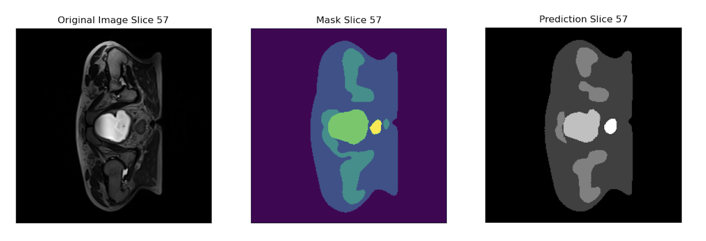

# 3D U-Net for MRI Segmentation
## Description
This repository contains a PyTorch implementation of a 3D U-Net model for semantic segmentation of MRI images. The algorithm is designed to accurately segment medical images by predicting pixel-level masks. The problem solved by this algorithm is vital in medical image analysis, where precise segmentation helps in diagnosing conditions, planning treatment, and evaluating therapy outcomes. Specifically, this implementation focuses on the semantic segmentation of MRI scans from the HipMRI Study dataset.


## How It Works
The 3D U-Net architecture, as implemented in the code, is a convolutional neural network designed to process 3D input volumes. It is particularly effective for segmenting volumetric medical data such as MRI scans. The model utilizes an encoder-decoder structure. The encoder (contracting path) uses ResNet blocks to compress the input into a lower-dimensional latent space, while the decoder (expanding path) reconstructs the segmentation mask. Skip connections between the encoder and decoder layers preserve essential spatial information by concatenating the corresponding feature maps, ensuring that fine details lost during downsampling are recovered.

In this implementation, the encoder uses 3D convolutions and max pooling for downsampling, while the decoder employs upsampling with transposed convolutions to produce segmentation predictions. Each 3D pixel in the output is assigned a class label representing a structure, like an organ or lesion.

The code includes ResNet-style blocks in the encoder and bottleneck layers. These blocks enhance the model's feature extraction by incorporating residual connections, which help to stabilize training. The connections enable the network to effectively capture complex structures in the input volumes, resulting in more accurate segmentation.

The implementation leverages the Adam optimizer with a learning 
rate of 1e-3, training for 16 epochs. Due to CUDA memory 
constraints, the batch size is set to 2. The model is trained 
using cross-entropy as the loss function, which is well-suited 
for multi-class segmentation tasks. Additionally, the Dice 
similarity score is computed to evaluate the model's segmentation 
performance, as it provides a more nuanced assessment of overlap 
between predicted and true regions, beneficial for 
imbalanced class distributions.

The diagram below illustrates an example 3D U-Net architecture, 
showing 
how the model processes input volumes and generates segmentation 
masks:


### Visualization
Below is a visualization of the segmentation process by the model for a given slice from an MRI scan:
- **Left**: Original MRI slice
- **Center**: Ground truth segmentation mask
- **Right**: Model prediction




## Dependencies
To run the code, you need the following dependencies:
* Python 3.12
* PyTorch 2.0.0
* Torchvision 0.15.0
* Matplotlib 3.8.0
* Nibabel 5.2.0
Make sure to install these using `pip` or `conda`. For example:

```bash
pip install torch torchvision matplotlib nibabel
```

## Reproducibility
All random seeds are set explicitly 
within the training script to ensure reproducibility. If you want to reproduce the results exactly, ensure the same dataset splits, 
hyperparameters, and model initialization are used. The model 
weights are stored and can be reloaded from `model/new_model.pth`. 
The code relies on personalised paths to data. For personal use, 
download the data here: https://doi.org/10.25919/45t8-p065 and 
change the file paths in `train.py` and `predict.py`.


## Example Inputs and Outputs

### Input
The input to the model is a batch of MRI images in NIfTI 
format, typically with dimensions `(depth, height, width)`. 
These are loaded using the `nibabel` library and processed as 
3D arrays.

**Example Input:**
- MRI Volume: `Case_040_Week5_SEMANTIC_LFOV.nii.gz`

### Output
The model outputs a 3D segmentation mask, where each voxel is 
assigned a class label corresponding to the target structure.

**Example Output:**
- Segmentation mask: A 3D array of dimensions `(depth, height, width)` with integer values representing class labels.

Below is a sample input MRI slice and mask with the corresponding 
segmentation output.


## Pre-processing
Before training, the MRI volumes were normalized to ensure 
consistent intensity distribution across the dataset. 
Additionally, each MRI scan was resized to a fixed resolution 
to match the input dimensions required by the 3D U-Net. Data 
augmentation techniques such as random rotations, flipping, 
and cropping were applied to increase the diversity of the 
training data.

## Data Splitting
The dataset was split into **training (80%)**, 
**validation (10%)**, and **testing (10%)** subsets. 
This split was chosen to ensure sufficient data 
for training while reserving enough data for accurate 
evaluation. 

Data was also augmented to improve the performance during training. Augmentation techniques such as random rotations, flips, and intensity shifts were applied to introduce variability and make the model more robust to changes in the data. This helps prevent overfitting, especially when working with smaller datasets, and enhances the model's ability to generalize to unseen cases, improving its segmentation accuracy on real-world data.

## Results
The 3D U-Net model was trained for 16 epochs, with early 
stopping applied after **Epoch 12**. Below is a summary of 
the key results from the training process:

 - Epoch [1/16], Loss: 0.7396
   - Class-specific Dice Scores: [0.98168078 0.91843471 0.05575329 0.44867237 0.00546562 0.1901122 ]
 - Epoch [2/16], Loss: 0.4922
   - Class-specific Dice Scores: [0.98146727 0.77852851 0.3306287  0.07353068 0.00168459 0.01371561]
- Epoch [3/16], Loss: 0.3613 
  - Class-specific Dice Scores: [0.98314504 0.9352279  0.46974399 0.49166848 0.38004141 0.12213351]
- Epoch [4/16], Loss: 0.2760
  - Class-specific Dice Scores: [0.98131116 0.94516828 0.74051519 0.41558598 0.49725519 0.47306966]
- Epoch [5/16], Loss: 0.2228
  - Class-specific Dice Scores: [0.98536606 0.95066454 0.75680236 0.5930551  0.43019679 0.41207429]
- Epoch [6/16], Loss: 0.1871
  - Class-specific Dice Scores: [0.98399602 0.94690789 0.67935657 0.46950318 0.65837656 0.62739768]
- Epoch [7/16], Loss: 0.1678
  - Class-specific Dice Scores: [0.98218483 0.95115498 0.77507274 0.65916569 0.6241418  0.57728968]
- Epoch [8/16], Loss: 0.1433
  - Class-specific Dice Scores: [0.98212918 0.950911   0.78564328 0.67374016 0.68587627 0.40712179]
- Epoch [9/16], Loss: 0.1291
  - Class-specific Dice Scores: [0.9842072  0.95312278 0.78852241 0.62817013 0.59529447 0.50053505]
- Epoch [10/16], Loss: 0.1204
  - Class-specific Dice Scores: [0.98578121 0.95990683 0.81827442 0.73743585 0.68902261 0.5927277 ]
- Epoch [11/16], Loss: 0.1071
  - Class-specific Dice Scores: [0.97903265 0.95000044 0.82465145 0.79983808 0.71879922 0.68511068]
- Epoch [12/16], Loss: 0.1043
  - Class-specific Dice Scores: [0.98194693 0.95313792 0.76935486 0.77318901 0.72986509 0.75210351]
- Early stopping at epoch 12, all classes have Dice scores ≥ 0.7
  - Test Loss: 0.1276
  - Test Class-specific Dice Scores: [0.98341535 0.95497757 0.78998656 0.79622618 0.72969815 0.76118778]


 As seen above, the model attains a dice similarity score of >0.7 for each class. Initially, the performance of the last two classes was subpar because of smaller and more complex regions. To address this issue, weighting was implemented to ensure that the model effectively learns smaller, potentially clinically significant structures.

## Reflections and Future Work
I faced a challenging task that demanded effective time management over a 4-week period to complete. The topic of segmenting MRI imaging was fascinating, and I felt a great sense of fulfillment once the code was finalized. In future work, I aim to enhance the prediction output colors as I didn't have the opportunity to rerun the code to ensure the image mask and prediction are in the same color. It would be intriguing to observe how the performance improves with an increased number of epochs. I plan to eliminate the early stopping and train the model for 32 epochs to observe how performance changes. I am also curious to see how the model performs with more sample data. Acquiring additional MRI images and testing their performance through the model would be highly beneficial.

## References
- F. Isensee, P. Kickingereder, W. Wick, M. Bendszus, and K. H. Maier-Hein, "Brain Tumor Segmentation
and Radiomics Survival Prediction: Contribution to the BRATS 2017 Challenge," Feb. 2018. [Online].
Available: https://arxiv.org/abs/1802.10508v1- 
- Dowling, Jason; & Greer, Peter (2021): Labelled weekly MR images of the male pelvis. v2. CSIRO. Data Collection. https://doi.org/10.25919/45t8-p065
- Soleimani, P. and Farezi, N.
Soleimani, P., & Farezi, N. (2023). Utilizing deep learning via the 3D U-net neural network for the delineation of brain stroke lesions in MRI image. Retrieved from https://www.nature.com/articles/s41598-023-47107-7
- Wolny. (n.d.). wolny/pytorch-3dunet: 3D U-Net model for volumetric semantic segmentation written in pytorch. Retrieved from https://github.com/wolny/pytorch-3dunet
- This work was corrected using Grammarly (https://grammarly.com/)  on 24th  of October 2024
