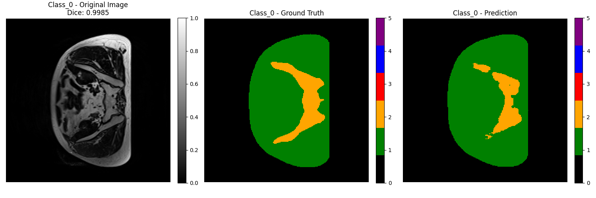

# 3D Improved UNet for Prostate Segmentation

## Task description:
This project implements a 3D Improved UNet model to segment prostate regions from downsampled MRI scans. 
The goal is to achieve a minimum Dice similarity coefficient of 0.7 on the test set for all labels.
One of the datasets used was from the HipMRI study and contained prostate 3D MRI data from 38 patients (for the 3D task), totalling 211 3D MRI volumes. I need to segment six categories, which are background, body contour, bone, bladder, rectum and prostate region.
## Model Description
The 3D UNet used in this project is an extension of the standard 2D UNet architecture, designed to handle 3D volumetric data. The network consists of an encoder and a decoder. The encoder extracts features from the entire input image through four resolution steps, where each step includes two 3×3×3 convolution operations followed by a rectified linear unit (ReLU) and a 2×2×2 max pooling operation, which reduces the feature map size.

The decoder reconstructs the full-resolution segmentation output using 2×2×2 upsampling operations, each followed by two 3×3×3 convolutions and ReLU activation. To retain spatial information, the decoder incorporates skip connections from corresponding encoder layers, thereby combining high-resolution features from the encoder to assist in reconstructing details. The primary modification to the standard 2D UNet is the replacement of all 2D operations (such as convolutions and pooling) with their 3D counterparts, enabling effective 3D volume segmentation using fewer annotated slices.

The symmetric encoder-decoder structure and skip connections between corresponding layers help to maintain high-resolution details as the spatial resolution is gradually recovered. This design aims to preserve more spatial detail, which is crucial for the accurate segmentation of medical images.

<div align="center"> 
 
</div> 

**Note** : The figure above is adapted from the original 3D UNet[1].

### Improvements to the 3D UNet
#### Residual Connections

I have improved upon the standard 3D UNet by adding residual connections to the convolutional layers in the DoubleConv module. Residual connections are beneficial for deep learning models as they help to prevent the gradient vanishing problem, making the training of deep networks more efficient. By adding shortcuts between the input and output of each block, they also facilitate the training process.

```
class DoubleConv(nn.Module):
    """Two consecutive convolutional layers with residual connection"""

    def __init__(self, in_channels, out_channels):
        super(DoubleConv, self).__init__()
        self.conv = nn.Sequential(
            nn.Conv3d(in_channels, out_channels, kernel_size=3, padding=1, bias=False),
            nn.GroupNorm(8, out_channels),
            nn.LeakyReLU(inplace=True),
            nn.Conv3d(out_channels, out_channels, kernel_size=3, padding=1, bias=False),
            nn.GroupNorm(8, out_channels),
        )
        self.relu = nn.LeakyReLU(inplace=True)

        if in_channels != out_channels:
            self.residual_conv = nn.Conv3d(in_channels, out_channels, kernel_size=1, bias=False)
        else:
            self.residual_conv = nn.Identity()

    def forward(self, x):
        residual = self.residual_conv(x)
        out = self.conv(x)
        out += residual
        out = self.relu(out)
        return out
```

#### Attention Mechanism
In addition, I integrated an attention mechanism based on skip connections. Soft attention helps to actively suppress activations in irrelevant regions, which reduces redundant features from being propagated to subsequent layers. This mechanism effectively minimizes unnecessary background interference and enhances the model's focus on target regions, such as the prostate, bladder, and bone (Towards Data Science, 2020).
```
class AttentionBlock(nn.Module):
    """Attention gate"""

    def __init__(self, F_g, F_l, F_int):
        super(AttentionBlock, self).__init__()
        self.W_g = nn.Sequential(
            nn.Conv3d(F_g, F_int, kernel_size=1, stride=1, padding=0, bias=True),
            nn.GroupNorm(8, F_int)
        )

        self.W_x = nn.Sequential(
            nn.Conv3d(F_l, F_int, kernel_size=1, stride=1, padding=0, bias=True),
            nn.GroupNorm(8, F_int)
        )

        self.psi = nn.Sequential(
            nn.Conv3d(F_int, 1, kernel_size=1, stride=1, padding=0, bias=True),
            nn.GroupNorm(1, 1),
            nn.Sigmoid()
        )

        self.relu = nn.LeakyReLU(inplace=True)

    def forward(self, g, x):
        g1 = self.W_g(g)
        x1 = self.W_x(x)
        psi = self.relu(g1 + x1)
        psi = self.psi(psi)
        out = x * psi
        return out
```
#### Normalization and Activation Functions
Instead of using the traditional Batch Normalization, Group Normalization (GroupNorm) is utilized after the convolutional layers. Group Normalization performs better with smaller batch sizes, which is particularly suitable for 3D medical imaging tasks with limited GPU memory.
```
nn.GroupNorm(8, out_channels)
```
Additionally, I replaced the standard ReLU activation function with LeakyReLU, which helps mitigate the "dead neuron" problem often caused by ReLU in deeper networks.
```
nn.LeakyReLU(inplace=True)
```

## Project Structure
- `modules.py`: Contains the implementation of the 3D Improved UNet model.
- `dataset.py`: Loads and preprocesses the downsampled prostate MRI dataset.
- `train.py`: Scripts for training, validation, testing, and saving the model.
- `predict.py`: Provides inference examples and visualization of segmented regions.
- `README.md`: This file, documenting the project.

## Dependencies
- Python==3.11
- torch==2.0.1
- monai==1.3.2
- numpy==1.26.4
- matplotlib==3.9.2
- nibabel==5.3.0
- scikit-learn==1.5.1

Use the following command to create the conda environment
```
conda env create -f environment.yml
```
activate environment
```
conda activate pytorch-2.0.1
```
## Usage
### Data Preprocessing
In this project, the MRI data is normalised to a range of pixel values normalised to [0, 1] to enhance the training effect. The data is divided into training, validation and test sets with a ratio of 6:2:2 to ensure the generalisation ability of the model.

In the data preprocessing stage, we employ the following data enhancement techniques to expand the dataset and improve the generalisation ability of the model:
- **Random 3D Elastic Transformation**: Simulates the deformation of tissues and improves the robustness of the model to deformation. 
- **Random Spatial Cropping**: Randomly crop regions to improve the generalisation of the model. 
- **Random Flip**: Randomly flips the image on different axes to prevent overfitting. 
- **Random Rotation**: Apply random rotation operation to improve model invariance to image rotation. 
- **Resampling**: Resizes all images to a uniform size to fit the model input.

### Training, validation and testing
1. **Train**
- The training process uses the Adam optimiser and a combination of cross-entropy loss and Dice loss to deal with category imbalance.
- Mixed-precision training ( autocast and GradScaler ) is used to improve training efficiency and reduce memory usage.
- A progressive early stopping mechanism was utilized to halt the training process early, effectively preventing overfitting when the model's performance ceased improving within a set patience threshold (Bai et al., 2021)​(early stop)
- The batch size is set to 1 because 3D medical image data usually has a large memory footprint, so training in small batches is done to process the full 3D body data with limited GPU memory
- Unbalanced data distributions are handled using class weights, which are calculated based on the proportion of pixels in each class in the overall dataset to ensure that the model is not biased in favour of the majority of classes
- The dataset is divided according to the ratio of 6:2:2, where the training set is used for the training of the model, the validation set is used for tuning and evaluating the performance of the model to avoid overfitting, and the test set is used for the final evaluation of the generalisation ability of the model. The 6:2:2 ratio was chosen to ensure sufficient training data volume while allowing for effective validation and evaluation of the model. The relatively small ratio of validation and test sets ensures that sufficient data is available for training to improve the performance of the model.
2. **Training Metrics**

The following figure shows the change in loss and the change in Dice coefficient for each category as the model is trained:

<div align="center">
  
</div>

The graph above shows the trend of training loss and validation loss. - It can be seen that as the number of epochs increases, both the training loss (blue) and the validation loss (red) decrease gradually, indicating that the model is gradually learning and improving its performance. - The validation loss tends to be stable and slightly higher than the training loss, indicating that the model is gradually converging and not overfitting.

The graphs below show how the Dice coefficients for each category change during training and validation. - The dashed line shows the Dice coefficient of the validation set and the solid line shows the Dice coefficient of the training set. - It can be seen that the Dice coefficients of each category gradually increase during the training process and basically reach a Dice coefficient of 0.7 or above at the end of training

3. **Best Dice Scores Per Class**

The table below shows the best validated Dice scores for the model on each category:

| Class    | Best Dice Score |
|----------|----------------|
| Class_0  | 0.85           |
| Class_1  | 0.78           |
| Class_2  | 0.72           |
| Class_3  | 0.80           |
| Class_4  | 0.88           |
| Class_5  | 0.76           |

There are differences in the Best Dice Score (BDS) for each category. For example, Class_4 has the highest Dice Score of 0.88, while Class_2 has a lower score of 0.72. This indicates that the model performs differently when dealing with different classes.
For categories with lower scores, such as Class_2 and Class_5, consider adding data augmentation or adjusting the weights of the loss function so that these categories receive more attention in the training

### Running Methods
The hyperparameters used during model training were: learning rate (lr) of 0.001, number of training rounds (epoch) of 40, device cuda, and loss function combined (combining cross-entropy and Dice loss).
```
python train.py --lr 0.001 --epoch 40 --device cuda --loss combined --dataset_root /path/to/your/dataset
```
Run the prediction file
```
python predict.py --model_path /path/to/your/best_model.pth --dataset_root /path/to/your/dataset --device cuda
```
## Result

Below are the best segmentation results for each category, including the original image, Ground Truth labels and model predictions
<div align="center">
  <table>
    <tr>
      <td align="center">
        
        <br>Class 0
      </td>
      <td align="center">
        
        <br>Class 1
      </td>
      <td align="center">
        
        <br>Class 2
      </td>
    </tr>
    <tr>
      <td align="center">
        
        <br>Class 3
      </td>
      <td align="center">
        
        <br>Class 4
      </td>
      <td align="center">
        
        <br>Class 5
      </td>
    </tr>
  </table>
</div>

- **Class 0**: 0.9907
- **Class 1**: 0.9621
- **Class 2**: 0.8502
- **Class 3**: 0.9348
- **Class 4**: 0.8053
- **Class 5**: 0.9012
- **Overall average Dice coefficient**: 0.9074

## References
**[1]** Özgün Çiçek, Ahmed Abdulkadir, Soeren S. Lienkamp, Thomas Brox, & Olaf Ronneberger. (2016). 3D U-Net: Learning Dense Volumetric Segmentation from Sparse Annotation. Lecture Notes in Computer Science. University of Freiburg.
**[2]** Towards Data Science. (2020, May 4). A detailed explanation of the Attention U-Net. Towards Data Science. https://towardsdatascience.com/a-detailed-explanation-of-the-attention-u-net-b371a5590831
**[3]** Bai, Y., Yang, E., Han, B., Yang, Y., Li, J., Mao, Y., Niu, G., & Liu, T. (2021). Understanding and Improving Early Stopping for Learning with Noisy Labels. Proceedings of the 35th Conference on Neural Information Processing Systems (NeurIPS 2021). Retrieved from https://github.com/tmllab/PES