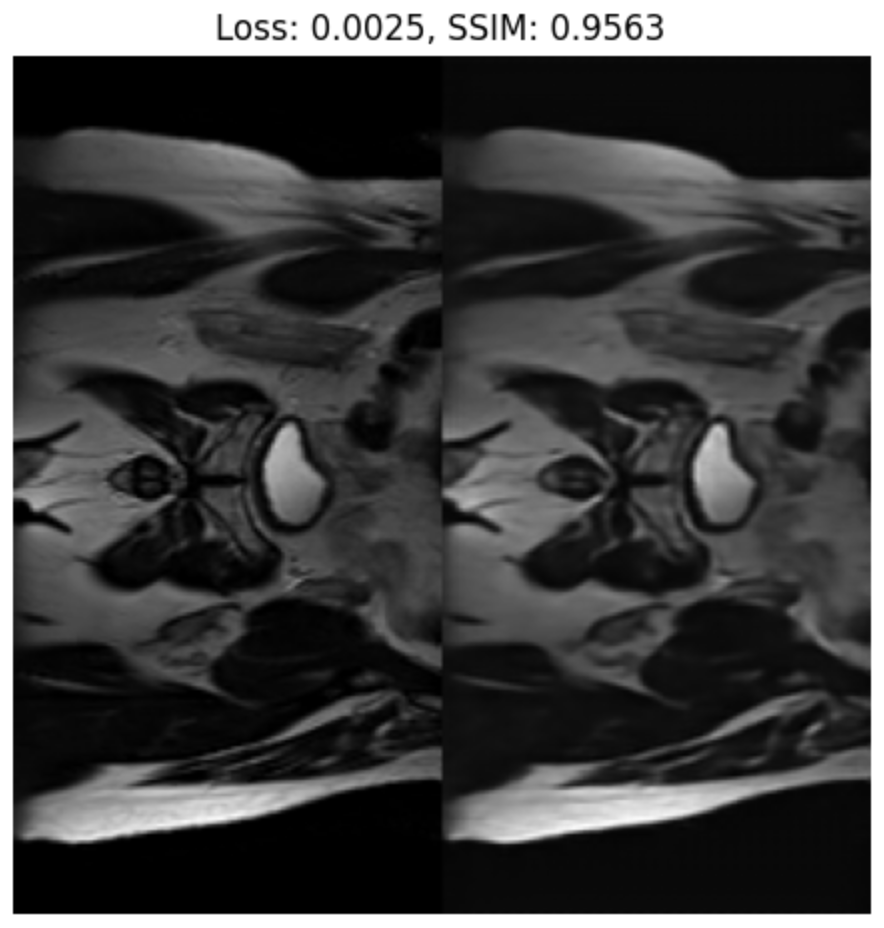

# Introduction
This project aims to create a generative VQVAE model for [HipMRI Study on Prostate Cancer](https://doi.org/10.25919/45t8-p065) using the [processed 2D slices (2D images)](https://filesender.aarnet.edu.au/?s=download&token=76f406fd-f55d-497a-a2ae-48767c8acea2). I achieved over 0.9 Structural Similarity Index Measure on 4 times downscaled image in 35 minutes of training on a single GPU. 

## Model
VQVAE is a generative model that integrates the concepts of Variational Autoencoders and vector quantisation. It incorporates a vector quantisation layer to discretise the continuous latent space. The model consists of three main components: an encoder, a quantiser, and a decoder. To enhance training stability, my model uses residual blocks and batch normalisation layers. The encoder and decoder are trained using reconstruction and commitment losses, while the quantiser is optimised with an exponential moving average method. I referenced the code from [vvvm23/vqvae-2](https://github.com/vvvm23/vqvae-2/blob/main/vqvae.py). However, since the original code was designed for VQVAE2, I modified its structure and simplified the implementation to adapt it for this specific project.

**ResidualBlock**: A residual block consists of two convolutional layers, each followed by batch normalisation and ReLU activation. The output of the second convolution is scaled by a learnable parameter, alpha, which is initialised to zero. A residual connection adds the original input to the scaled output, which enables the model to combine the transformed features with the input. The residual connection significantly improves the training by mitigating the vanishing gradient problem during backpropagation and facilitates better gradient flow in earlier layers.

**Residual Stack**: A series of ResidualBlock instances stacked together to create a deeper residual network.

**Encoder**: The encoder maps the input image to a continuous latent space by downsampling the image using convolutional layers and batch normalisation. After series of downsampling layers, the feature maps are passed to residual blocks to refine the feature maps. 

**VectorQuantizer**: A layer takes the continuous feature vectors from the encoder, maps them to their nearest discrete embedding vectors using Euclidean distance, and transforms the feature vectors into their corresponding quantised vectors. The commitment loss is calculated based on the difference between the feature vectors and their corresponding embedding vectors, penalising deviations from the embeddings. During training, the embeddings are updated to more accurately represent the feature maps. This update process uses an exponential moving average, which stabilises training by smoothing the embedding changes, ensuring that previous values still contribute to the new embeddings and preventing sudden shifts.

**Decoder**: The decoder regenerates the original image from the quantised vectors by progressively upsampling them using transposed convolutional layers and batch normalisation. The quantised vectors are first passed to residual blocks, which helps refine the features and maintain important details. Then, the decoder performs multiple upsamplings until the original image size is reached.

## Dataset
The data is in nii.gz format, therefore 'nibabel' library is used to convert the data into numpy arrays. The data is then converted to PIL Image format as the torchvision transforms require the input to be in PIL Image format or Tensor. Augmentations are applied to the data to increase the diversity of the data. In every training I conducted, cropping the image to 256x128 because the raw data consists images with 256x128 and 256x144. The data is then transformed to Tensor and normalised to have a mean of 0.5 and a standard deviation of 0.5.

## Training
`train.py` is the main script for training the VQVAE model. The script begins by reading a configuration file and then initialises the model, training and validation dataloaders, and the Adam optimizer. The training process runs for a specified number of epochs. In each epoch, the model is trained on the training data and evaluated on the validation data.

During training, the reconstruction loss is calculated as the mean squared error (MSE) between the original and reconstructed images. The total loss is the sum of the reconstruction loss and the commitment loss returned by the model. The model's parameters are updated via backpropagation, and the optimiser adjusts the weights accordingly. 

The configuration file is also saved to the log directory. At specified intervals, the script logs the reconstruction loss, commitment loss, total loss, and the structural similarity index measure score (SSIM) for both the training and validation datasets. It also saves the original and reconstructed images for both training and validation datasets at specified intervals (different to logging interval).

After the training process is complete, a metrics plot showing the training and validation losses, and SSIM scores for each epoch is saved. The latest version of the trained model, along with the best-performing model, is saved to the log directory. Additionally, the overall training time is logged. 

The model is also evaluated on the test data using the latest weights. The batch size is set to 1. The histogram of loss and SSIM score are saved and average loss and SSIM score are logged. The original and reconstructed images of the first six samples are saved.

## Prediction
`predict.py` saves the original and reconstructed images from the specified directory. Each image is saved with a title that states the loss and SSIM score.

# Hyperparameters
Configuration files must be created to specify the hyperparameters for training and prediction. The configuration files are in YAML format and contain the following parameters:

## Training
- **model_parameters**: The parameters for the model in a dictionary format.
    - **in_channels**: The number of input channels.
    - **hidden_channels**: The number of hidden channels in the encoder and decoder.
    - **res_channels**: The number of hidden channels in the residual blocks.
    - **nb_res_layers**: The number of residual blocks in the encoder and decoder.
    - **embed_dim**: The dimension of the embeddings.
    - **nb_entries**: The number of embeddings.
    - **downscale_factor**: The downscale factor of the encoder.
- **logs_root**: The root directory for the logs.
- **log_dir_name**: The name of the log directory. If empty, the current time will be used.
- **log_frequency**: The frequency of logging the training and validation metrics.
- **image_frequency**: The frequency of saving the original and reconstructed images.
- **batch_size**: The batch size.
- **num_epochs**: The number of epochs.
- **learning_rate**: The learning rate.
- **weight_decay**: The weight decay.
- **train_dataset_dir**: The directory of the training dataset.
- **val_dataset_dir**: The directory of the validation dataset.
- **test_dataset_dir**: The directory of the test dataset.
- **train_num_samples**: The number of train samples to use. If empty, all samples will be used.
- **val_num_samples**: The number of validation samples to use. If empty, all samples will be used.
- **test_num_samples**: The number of test samples to use. If empty, all samples will be used.
- **train_transforms**: The list of augmentations for the training data.
- **val_test_transforms**: The list of augmentations for the validation and test data.

## Prediction
- **model_parameters**: The parameters for the model in a dictionary format.
    - **in_channels**: The number of input channels.
    - **hidden_channels**: The number of hidden channels in the encoder and decoder.
    - **res_channels**: The number of hidden channels in the residual blocks.
    - **nb_res_layers**: The number of residual blocks in the encoder and decoder.
    - **embed_dim**: The dimension of the embeddings.
    - **nb_entries**: The number of embeddings.
    - **downscale_factor**: The downscale factor of the encoder.
- **pretrained_path**: The path to the saved model.
- **save_dir**: The root directory for saving images.
- **dataset_dir**: The directory of the dataset.
- **transforms**: The list of augmentations for the data.

# Requirements
- PyYAML==6.0.1
- matplotlib==3.8.4
- nibabel==5.3.0
- numpy==1.26.4
- pillow==10.4.0
- scikit-image==0.24.0
- scikit-learn==1.4.2
- torch==2.3.0
- torchvision==0.18.0
- tqdm==4.66.4

The packages can be installed using the following command:
```bash
pip install -r recognition/VQVAE_47323254/requirements.txt
```

# Execution
## Training
Create a configuration file and run the following command. An example configuration file is provided in `recognition/VQVAE_47323254/configs/example_train_config.yaml`.
```bash
python recognition/VQVAE_47323254/train.py --config path/to/config.yaml
```

## Predict
Create a configuration file and run the following command. An example configuration file is provided in `recognition/VQVAE_47323254/configs/example_predict_config.yaml`.
```bash
python recognition/VQVAE_47323254/predict.py --config path/to/config.yaml
```

# Example Output
Here is the result of running training with `example_train_config.yaml`. This downscales the original image by 4. This is the result of a model that is trained through 30 epochs and data are augmented with several transformations. 

## Training
- Configuration file used for training
- best_model.pth
- lastest_model.pth
- train_metrics.png (loss and SSIM score curves)
<br>

- training.log (This log is from epoch 1 to 5 and at the end of training)
```text
2024-10-17 01:02:35,345 - INFO - Epoch [1/30], Train Loss: 0.6895, Val Loss: 0.4216, Train SSIM: 0.2253, Val SSIM: 0.2321
2024-10-17 01:03:30,373 - INFO - Epoch [2/30], Train Loss: 0.3497, Val Loss: 0.2167, Train SSIM: 0.3507, Val SSIM: 0.3871
2024-10-17 01:04:25,236 - INFO - Epoch [3/30], Train Loss: 0.1709, Val Loss: 0.0751, Train SSIM: 0.4792, Val SSIM: 0.5850

...

2024-10-17 01:28:53,271 - INFO - Epoch [30/30], Train Loss: 0.0046, Val Loss: 0.0042, Train SSIM: 0.9262, Val SSIM: 0.9273
2024-10-17 01:28:53,271 - INFO - Training took 27.23 minutes

2024-10-17 01:29:01,155 - INFO - Test Loss: 0.0039, Test SSIM: 0.9366
```

- Original and reconstructed images during training (This image is from epoch 1)
<br>

- test_metrics.png (Histogram of loss and SSIM score) 
<br>

- test_images.png (Original and reconstructed images during inference)
<br>

## Prediction
- Original and reconstructed images
<br>

# Experiments
I experimented with several settings to find the optimal hyperparameters for the model. The experiments include changing learning rate, augmentations and the complexity of the model. I also tried increasing the downscaling factors to see the performance of the model on more compressed codebooks.

## Learning Rate
I experimented with different learning rates to find the optimal learning rate for the model. I tried learning rates from 0.0001 to 0.005. This comparison is done on no augmented images with downscale factor of 4 in 30 epochs. Increasing the learning rate generally improved the performance of the model. However, the loss and SSIM of the model with the the learning rate of 0.005 was almost the same as the model with the learning rate of 0.001, and the learning was more inconsistent. There are more fluctuation in the training curve in learning rate 0.005 than other learning rates. Overall, the learning rate of 0.001 was found to be the optimal learning rate for the model. 

### Learning Rate = 0.0001

|       | Loss   | SSIM   |  
| ----- | ------ | ------ | 
| Train | 0.0817 | 0.6425 |
| Val   | 0.0753 | 0.6455 |
| Test  | 0.0936 | 0.6469 |


### Learning Rate = 0.0005

|       | Loss   | SSIM   |  
| ----- | ------ | ------ | 
| Train | 0.0073 | 0.8899 |
| Val   | 0.0090 | 0.8958 |
| Test  | 0.0134 | 0.8673 |


### Learning Rate = 0.001

|       | Loss   | SSIM   |  
| ----- | ------ | ------ | 
| Train | 0.0061 | 0.9062 |
| Val   | 0.0053 | 0.9053 |
| Test  | 0.0053 | 0.9175 |


### Learning Rate = 0.005

|       | Loss   | SSIM   |
| ----- | ------ | ------ |
| Train | 0.0052 | 0.9070 |
| Val   | 0.0048 | 0.9012 |
| Test  | 0.0045 | 0.9124 |


## Augmentations
I experimented with various augmentations to evaluate their impact on the model's performance. These augmentations included random horizontal and vertical flips, translations, brightness, contrast, saturation, hue adjustments, and Gaussian blur. Additionally, I resized the images to 256x256. The experiment was conducted using a downscale factor of 4 over 30 epochs, with a learning rate of 0.001. The model performed better with the augmented data, and resizing the images to a square further improved its performance. Without augmentations, the performance of the model was inconsistent across different images, but with augmentations, the model was able to perform accurately on various images.

### Augmentations without resizing
|       | Loss   | SSIM   |  
| ----- | ------ | ------ | 
| Train | 0.0032 | 0.9396 |
| Val   | 0.0036 | 0.9373 |
| Test  | 0.0039 | 0.9366 |


### Augmentations with resizing
|       | Loss   | SSIM   |
| ----- | ------ | ------ |
| Train | 0.0023 | 0.9556 |
| Val   | 0.0020 | 0.9596 |
| Test  | 0.0023 | 0.9574 |


## Downscale Factor
I experimented with different downscale factors, 8 and 16, to evaluate the model's performance with more compressed codebooks. The experiments were conducted over 100 epochs, using a learning rate of 0.001 and augmentations with resizing. I also changed the model complexity by adjusting the number of hidden channels in the encoder and decoder, the number and size of residual blocks, the number of embeddings, and the embedding size.

While models with higher complexity often performed better, increasing complexity (such as the number of embeddings) sometimes hindered optimisation. I suspect that increasing the number of embeddings requires other parameters to scale proportionally to allow the model to learn the complex features.

The results with higher downscale factors were more inconsistent compared to a downscale factor of 4. I tried with the lower learning rates to stabilise the learning process, but it generally produced worse outcomes than higher learning rates. As the downscale factor increases, it becomes harder for the model to accurately upsample the quantised vectors due to the reduced size of the latent representation. Therefore, the performance of the model decreases as the downscale factor increases. Overall, both downscale factors of 8 and 16 produced the best result with the following hyperparameters:

- **hidden_channels**: 256
- **res_channels**: 64
- **nb_res_layers**: 4
- **embed_dim**: 128
- **nb_entries**: 512
- **learning_rate**: 0.001

### Downscale Factor = 8
|       | Loss   | SSIM   |
| ----- | ------ | ------ |
| Train | 0.0084 | 0.8302 |
| Val   | 0.0083 | 0.8320 |
| Test  | 0.0090 | 0.8270 |


### Downscale Factor = 16
|       | Loss   | SSIM   |
| ----- | ------ | ------ |
| Train | 0.0211 | 0.6230 |
| Val   | 0.0204 | 0.5958 |
| Test  | 0.0202 | 0.6294 |


## Observations
There was no observable overfitting during my experiments. The model often performed better on the validation and test sets than on the training data. I carefully checked there was no data leakage in the training phase. I believe the following factors contributed to this result:

1. **Training Data Size**: The training set was significantly larger than the validation and test sets (11,460 vs. 660 and 540, respectively). This larger dataset likely contained more diverse and generalisable features, which allows the model to learn patterns that applied well to the unseen data. The model parameters may have been better optimised for the smaller, specific patterns in the validation and test data.

2. **Model Complexity**: The model may not have been complex enough to fully capture all the features in the larger training set. As a result, it may have generalised better to the smaller validation and test sets, where fewer features needed to be captured. 

3. **Data Similarity**: The HipMRI images used in this experiment were very similar to each other. This likely allowed the model to learn the general features of the dataset quickly, leading to good performance on both validation and test data.

# Future Works
- Use scheduler for adapting learning rate
- Use grid search to find the optimal hyperparameters 
- Implement VQVAE2 and compare the performance with the current model
- Visualise the embeddings learnt by the model
- Generate new images from the latent space

# Author
Reona Nakagawa

# References
**Neural Discrete Representation Learning**
```bibtex
@inproceedings{van2017neural,
  title={Neural Discrete Representation Learning},
  author={van den Oord, Aaron and Vinyals, Oriol and Kavukcuoglu, Koray},
  booktitle={Advances in Neural Information Processing Systems},
  pages={6306--6315},
  year={2017}
}
```

**vqvae-2**
```bibtex
@misc{mangalam_vqvae_2021,
  author       = {V. Mangalam},
  title        = {vqvae-2},
  year         = {2021},
  howpublished = {\url{https://github.com/vvvm23/vqvae-2/blob/main/main-vqvae.py}},
  note         = {Accessed: Oct. 5, 2024}
}
```

**HipMRI Study on Prostate Cancer**
```bibtex
@misc{hipmri_dataset_2024,
  author       = {HipMRI Study on Prostate Cancer},
  title        = {Processed 2D Slices (2D Images)},
  year         = {2024},
  howpublished = {\url{https://filesender.aarnet.edu.au/?s=download&token=76f406fd-f55d-497a-a2ae-48767c8acea2}},
  note         = {Accessed: Oct. 24, 2024}
}
```
