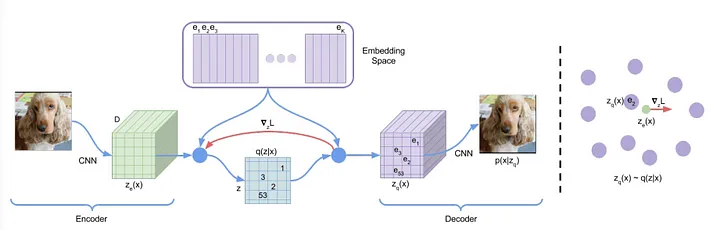
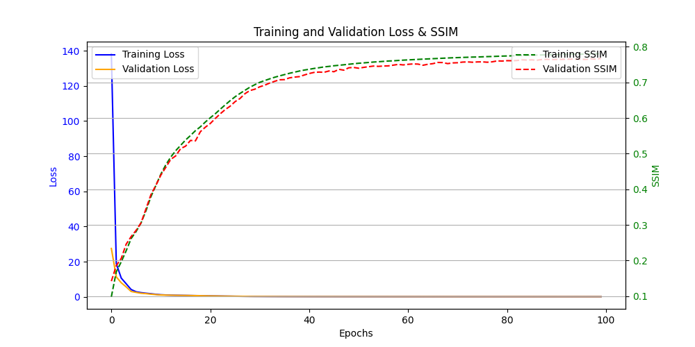
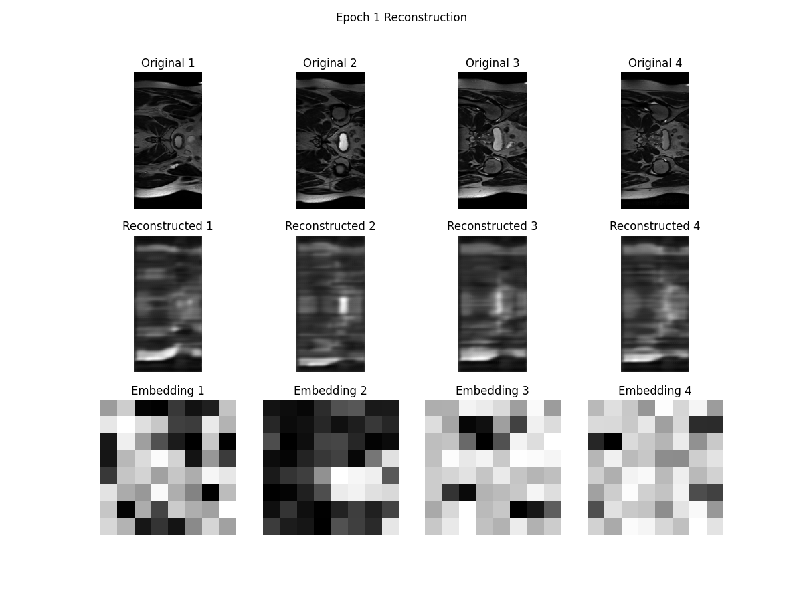
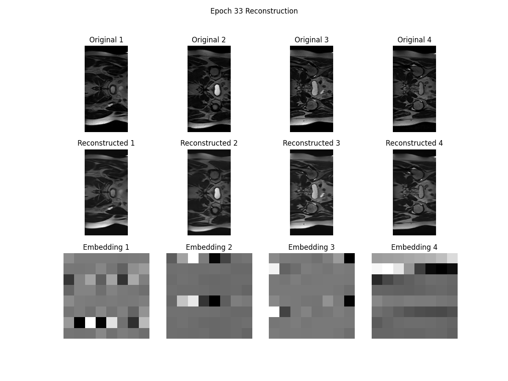
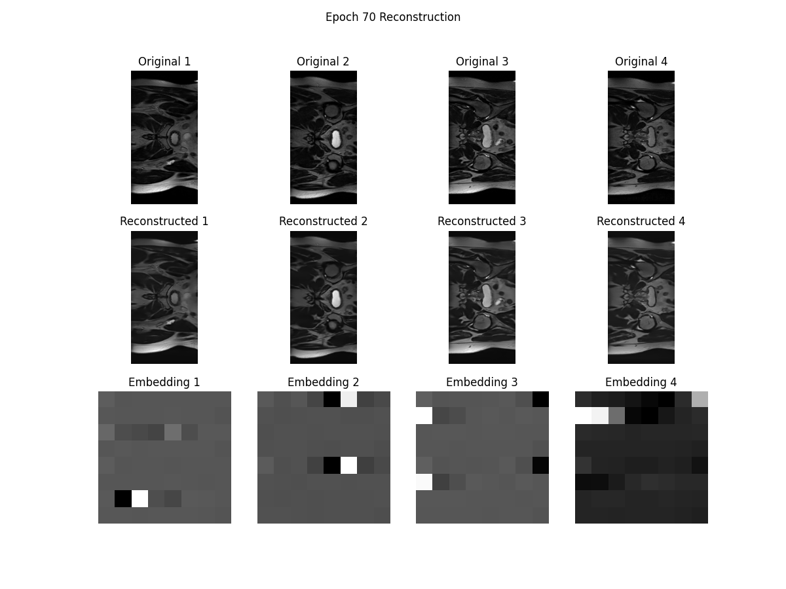
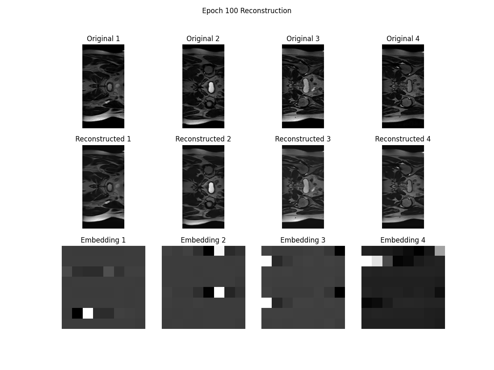

# Generative VQ-VAE model for the CSIRO HipMRI 2D Slices

**Author:** Bairu

## Overview

This project aimed to develop a generative model for the HipMRI Study on Prostate Cancer using processed 2D MRI slice images available from the CSIRO study [[1](https://data.csiro.au/collection/csiro:51392v2?redirected=true)]. The model utilizes a Vector Quantized Variational Autoencoder (VQVAE), which is trained to learn a discrete latent representation of the data. The goal is to accurately reconstruct these MRI slices, achieving a “reasonably clear image” with a Structured Similarity (SSIM) of over 0.6.

Vector Quantized Variational Autoencoders (VQ-VAEs) are an advanced variant of the traditional Variational Autoencoder (VAE), enhanced by integrating a vector quantization layer between the encoder and decoder. While standard VAEs learn continuous latent representations of data and aim to minimize the reconstruction loss between the original and reconstructed images, they often face challenges like "posterior collapse." This phenomenon occurs when the latent space becomes overly simplistic and the model fails to leverage the information effectively during reconstruction [[3](https://arxiv.org/abs/1711.00937)].

VQ-VAEs tackle these issues by employing a discrete latent space instead of a continuous one. By utilizing vector quantization, the VQ-VAE model captures more meaningful representations, facilitating the generation of higher-quality images [[2](https://medium.com/analytics-vidhya/an-overview-on-vq-vae-learning-discrete-representation-space-8b7e56cc6337)]. The architecture allows the encoder to output discrete codes, thereby learning a dynamic prior rather than relying on a static Gaussian distribution, which limits the model's ability to manipulate the outputs. This discrete approach enhances control over the generated content, making it suitable for various generative tasks [[2](https://medium.com/analytics-vidhya/an-overview-on-vq-vae-learning-discrete-representation-space-8b7e56cc6337)][[3](https://paperswithcode.com/method/vq-vae)].

The VQ-VAE architecture consists of an encoder that compresses input images into a discrete latent representation, which is then passed to a decoder for reconstruction. The vector quantization layer enables this transformation by mapping continuous latent vectors to the nearest codebook vector, facilitating a more effective backpropagation of gradients through the model. This process ultimately results in the decoder reconstructing clearer and more detailed images from the learned representations.

The figure below illustrates the VQ-VAE model architecture, highlighting the roles of the encoder, vector quantization layer, and decoder in the image reconstruction process.

The VQ-VAE model employs a loss function comprised of three key components to optimize the encoder and decoder, ensuring high-quality image reconstructions.

1. **Reconstruction Loss**: Measures the difference between input images and their reconstructions, guiding both the encoder and decoder to improve image quality.

2. **VQ Loss**: Aligns embedding vectors with the encoder output, refining the quantization process for better latent representation.

3. **Commitment Loss**: Regularizes the encoder to prevent complexity, encouraging it to commit to specific codebook embeddings and stabilizing training.

These components collaboratively ensure the VQ-VAE learns meaningful representations while generating high-quality images.

## Data Processing

The data preparation methods are contained in the dataset.py file.

The [HipMRI dataset](https://data.csiro.au/collection/csiro:51392v2?redirected=true) consists of 12,660 grayscale 2D MRI images of the pelvis in male patients, varying in size but mostly at 256x128 pixels. All images were resized to 256x128 to standardize input. The dataset was split as follows:

| Dataset    | Number of Images |
| ---------- | ---------------- |
| Training   | 11,460           |
| Validation | 660              |
| Test       | 540              |
| **Total**  | **12,660**       |

## Data pipeline

In the data pipeline, images of different sizes were resized to a uniform 256x128 dimension, with normalization as the only transformation applied to help the model generalize and produce images from a normal distribution.

## Model Architecture

The modules.py file contains the model architecture for both the VQVAE and GAN models.

VQ-VAE model structure (need to be CLICKED)

 
<pre>
VQVAE(
  (encoder): Encoder(
    (conv1): Conv2d(1, 32, kernel_size=(4, 4), stride=(2, 2), padding=(1, 1))
    (residual_stack): ResidualStack(
      (stack): Sequential(
        (0): ResidualLayer(
          (conv1): Conv2d(32, 32, kernel_size=(3, 3), padding=(1, 1))
          (conv2): Conv2d(32, 32, kernel_size=(3, 3), padding=(1, 1))
          (relu): ReLU()
        )
        (1): ResidualLayer(
          (conv1): Conv2d(32, 32, kernel_size=(3, 3), padding=(1, 1))
          (conv2): Conv2d(32, 32, kernel_size=(3, 3), padding=(1, 1))
          (relu): ReLU()
        )
      )
    )
    (conv2): Conv2d(32, 64, kernel_size=(4, 4), stride=(2, 2), padding=(1, 1))
  )
  (vector_quantization): VectorQuantizer(
    (embedding): Embedding(512, 64)
  )
  (decoder): Decoder(
    (conv1): ConvTranspose2d(64, 32, kernel_size=(4, 4), stride=(2, 2), padding=(1, 1))
    (residual_stack): ResidualStack(
      (stack): Sequential(
        (0): ResidualLayer(
          (conv1): Conv2d(32, 32, kernel_size=(3, 3), padding=(1, 1))
          (conv2): Conv2d(32, 32, kernel_size=(3, 3), padding=(1, 1))
          (relu): ReLU()
        )
        (1): ResidualLayer(
          (conv1): Conv2d(32, 32, kernel_size=(3, 3), padding=(1, 1))
          (conv2): Conv2d(32, 32, kernel_size=(3, 3), padding=(1, 1))
          (relu): ReLU()
        )
      )
    )
    (conv2): ConvTranspose2d(32, 1, kernel_size=(4, 4), stride=(2, 2), padding=(1, 1))
  )
)
</pre>

Residual Stack model structure (need to be CLICKED)

 
<pre>
ResidualStack(
  (stack): Sequential(
    (0): ResidualLayer(
      (conv1): Conv2d(64, 32, kernel_size=(3, 3), padding=(1, 1))
      (conv2): Conv2d(32, 64, kernel_size=(3, 3), padding=(1, 1))
      (relu): ReLU()
    )
    (1): ResidualLayer(
      (conv1): Conv2d(64, 32, kernel_size=(3, 3), padding=(1, 1))
      (conv2): Conv2d(32, 64, kernel_size=(3, 3), padding=(1, 1))
      (relu): ReLU()
    )
  )
)
</pre>

Residual Layer model structure (need to be CLICKED)

 
<pre>
ResidualLayer(
  (conv1): Conv2d(64, 32, kernel_size=(3, 3), padding=(1, 1))
  (conv2): Conv2d(32, 64, kernel_size=(3, 3), padding=(1, 1))
  (relu): ReLU()
)
</pre>

## Training

The `train.py` module outlines the training process for the VQ-VAE model. The primary function is responsible for training the VQ-VAE, utilizing a dataset of 2D MRI slices.

### VQ-VAE Training

The VQ-VAE training follows the same architecture as shown in the literature on VQ-VAEs [[3](https://arxiv.org/abs/1711.00937)]. The main objective is to minimize the reconstruction loss between the original and reconstructed images while ensuring effective vector quantization.

### Model Parameters

- **Batch Size**: 16
- **Epochs**: 100
- **Embedding Dimension**: 64
- **Number of Embeddings**: 512
- **Commitment Cost**: 0.25
- **Learning Rate**: 1e-4
- **Hidden Channels**: 64

### Loss Function

The loss function combines the mean-squared error loss of the original and reconstructed images with the quantization loss, ensuring both reconstruction quality and effective vector quantization are achieved.

### Optimizer

The Adam optimizer is utilized with a learning rate of 1e-4 to update model weights during training.

### Training Procedure

During each epoch, the VQ-VAE model processes batches of images through the encoder, vector quantizer, and decoder. The reconstruction and quantization losses are computed and backpropagated to optimize model parameters. The average Structural Similarity Index Measure (SSIM) score is calculated on the validation set at each epoch, with the model checkpoint saved based on the highest SSIM score.

The training and validation losses, along with SSIM scores, are plotted for analysis, and reconstructed images are saved periodically for visualization.

## Results

After 100 epochs of training, the model achieved an average SSIM of 0.789 on the test dataset. Below are graphs depicting the training loss, validation loss, and SSIM over the epochs:

The results illustrate a consistent increase in SSIM and a decrease in loss, demonstrating the model's learning capacity.

## Example Inputs and Outputs

Below are some examples of original and reconstructed images generated by the model:

**Reconstructed Image epoch 1**

**Reconstructed Image epoch 33**

**Reconstructed Image epoch 70**

**Reconstructed Image epoch 100**

These visual comparisons show the model's ability to reconstruct the general structure and patterns of the original images, albeit with some loss in detail.

## Reproduction of Results

To reproduce the results, the following hyperparameters were used during training:

### Training Configuration

- **Number of Epochs:** 100
- **Learning Rate:** 1e-4
- **Batch Size:** 16

To run the model, execute the `train.py` file. This will train the VQVAE model and save its weights for further testing. After training, run the `predict.py` file to evaluate the model's performance on test data. Ensure the data paths are set correctly.

### Dependencies

This is a Python project that requires at least Python 3.10.15.

| **Dependency** | **Version** |
| -------------- | ----------- |
| torch          | 2.5.1       |
| torchaudio     | 2.5.1       |
| numpy          | 1.26.4      |
| matplotlib     | 3.9.2       |
| torchvision    | 0.20.1      |
| torchmetrics   | 1.5.1       |
| nibabel        | 5.3.2       |
| tqdm           | 4.66.6      |

## Conclusion

In conclusion, the VQVAE model demonstrated strong generalization capabilities, achieving Structural Similarity Index Measure (SSIM) scores exceeding 0.81 on unseen test images. Although extending the number of training epochs could potentially enhance image clarity, it is likely that the SSIM would plateau around 0.80. To maximize performance while maintaining efficiency, the model was halted at a score of 0.78, which is approximately 97.5% of the projected plateau. This decision balances the trade-off between further training and the diminishing returns in image quality. Overall, the results indicate that the model effectively captures the essential features of the data, providing a solid foundation for further exploration and refinement.

## References

1. CSIRO Study. [Link](https://data.csiro.au/collection/csiro:51392v2?redirected=true)

2. Conventional VQVAE Architecture. [Link](https://medium.com/analytics-vidhya/an-overview-on-vq-vae-learning-discrete-representation-space-8b7e56cc6337)

3. Neural Discrete Representation Learning VQVAE. [Link](https://arxiv.org/abs/1711.00937)

4. VQ-VAE Method. [Link](https://paperswithcode.com/method/vq-vae)
