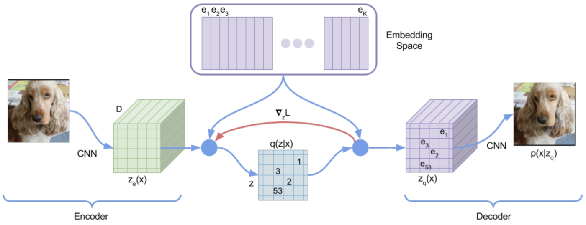
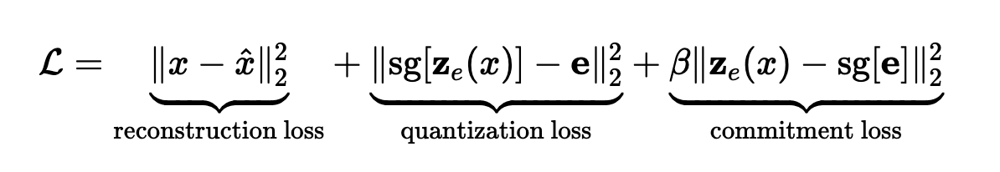
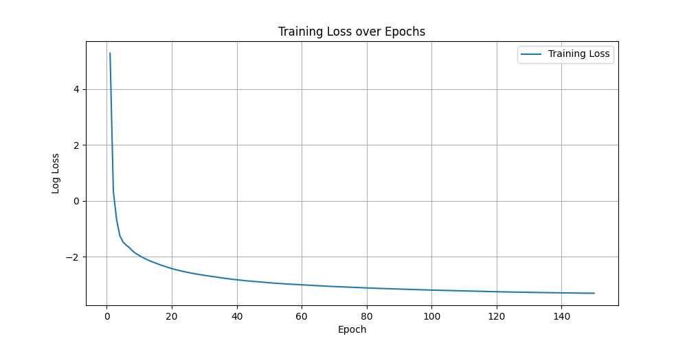
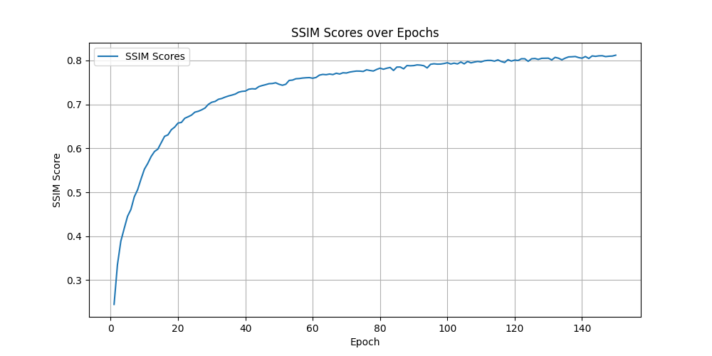
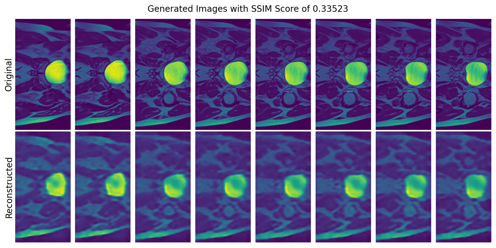
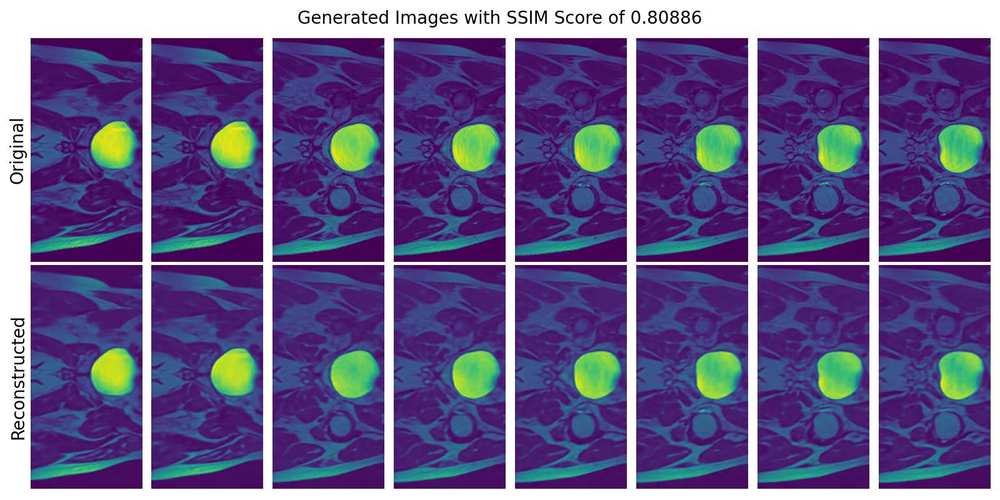

# VQVAE HipMRI Image Generation

## Description:

This repository contains an implementation of a [Vector Quantised Variational AutoEncoder (VQVAE)](https://arxiv.org/abs/1711.00937) that generates HipMRI images using data from a CSIRO study. This VQVAE aims to reconstruct recognizable images of provided HipMRI images; this will be measured by a Structural Similarity (SSIM) index, with an acceptable result being a value of over 0.6. The intentions of this project are to allow the generation of high-quality MRI imaging that can be applied in numerous medical settings and extended to producing other MRI imaging if provided with a sufficient dataset to train on.

## VQVAE Description

The VQVAE is a generative machine learning model that improves upon variational autoencoders (VAE) with the use of vector quantization. VAEs work by encoding data onto a continuous latent space from which new data can be generated. VQVAEs, on the other hand, encode data onto a discrete latent space by matching them to a codebook of learned vectors; this process is known as vector quantization. The use of vector quantization improves upon performance on tasks that involve discrete data, in this instance images, with a more compact representation improving efficiency and allowing the generation of higher quality images.

## Implementation

### VQVAE Architecture

The diagram above depicts the classic architecture of a VQVAE, consisting of three main components: the encoder, the vector quantizer, and the decoder.

#### Encoder and Decoder

The encoder and the decoder are both convolutional neural networks (CNN) that act as inverses of each other. The decoder will take an input image, or batch of images, and reduce their shape through convolutions to feed into the vector quantizer (VQ). Meanwhile, the decoder will take the output of the VQ, which will be of the same shape as its input, and then using transposed convolutions will reshape the input back to that of the original input. Along with these convolutional layers, these CNNs also transform the data through batch normalization, RELU functions, and residual stacks. A residual stack is comprised of multiple residual blocks that are used to prevent gradient vanishing through the use of skip connections. These residual stacks are part of both the encoder and decoder to preserve gradient information as training persists.

#### Vector Quantizer

After the encoder transforms an image into the latent space, it is then passed into the VQ, which quantizes these latents to the nearest codebook vectors in the VQ embedding. By doing this, a quantized latent space is created that is then passed into the decoder.

### Training

The VQVAE is trained using a loss function of three components: reconstruction, quantization, and commitment loss. These subloss functions combine to form the loss function,

Where:

- $\mathbf{z}_e(x)$ is the encoder output.
- $\mathbf{e}$ is the nearest embedding vector from the codebook.
- $\text{sg}[\cdot]$ denotes the stop-gradient operation, which prevents gradients from flowing through.
- $\beta$ is a hyperparameter that controls the weight of the commitment loss term.

Due to the nature of a VQVAE, that is having multiple segments, a combined loss function allows the training of each part of the model. An example of the loss of this function can be found in the plot below, followed by a plot of SSIM scores that demonstrate the model's progressive improvement.

  

### Image Generation

Images were generated in a grid of 8x4, where the first two rows contain the original images input to the model, and the second two rows contain the corresponding reconstructions that relate to the image of the same position in the above rows. Note that while the images contained only one channel and were thus grayscale, a colormap was used in plotting to better highlight the differences between the original and reconstructed images.

#### First Epoch

  
This image demonstrates the baseline of the model at the first epoch; clearly, the results are unsatisfactory and the model will need substantial training.  
  
This image demonstrates the full capability of the model to generate recognizable images with an SSIM greater than 0.6 after a full training process. This image achieved an SSIM score of 0.80886, achieving well above the required 0.6 and thus completing the aim of this project.

## Dependencies

- Python 3.x
- Pytorch
- Torchvision
- Nibabel
- OpenCV
- Pillow
- Tqdm
- Matplotlib
- Scikit-Image
- Numpy

## Reproducing

To reproduce the results, complete the following:

1. Install all required dependencies.
2. Ensure to change the folder destination strings at the top of the `load_data` and `load_test_data` functions in [`dataset.py`](./dataset.py) to wherever you have the nifti files stored.
3. Run the [`train.py`](./train.py) file; this will create/wipe all necessary output folders and train the model. The training loop will update the SSIM scores plot and training loss plot on each epoch completion, and at specified intervals will generate output images to compare progression. After training is complete, the final image will be output.
4. Run the [`predict.py`](./predict.py) file to generate more reconstructed images.

It is recommended to run these files on a device with a GPU; otherwise, training may take much longer than intended. By following these steps, it will be possible to replicate the above results.

#### Hyperparameters

The hyperparameters are specified at the top of the [`train.py`](./train.py) file; these have been carefully chosen to best fit this model and dataset, so it is not recommended to make any changes. However, if you wish to implement it for a new dataset, you may change them as you wish; they can easily be interpreted by their names.

## Inputs and Outputs

### Input

This model was trained on batches of images taken from the [HipMRI dataset from CSIRO](https://data.csiro.au/collection/csiro:51392v2?redirected=true).

The basic input for reconstruction is a batch of images from the dataset, preferably a batch of 16 images.

### Output

Reconstructed images compared with their original images based on the best model achieved during training.

### Plots

Plots of training loss and validation SSIM scores are also output over each epoch. Note that the folder names of the models, epoch reconstructions, and the outputs can be specified at the top of the [`train.py`](./train.py) file; it is only necessary to change the names there.

## Preprocessing the Data

The data was taken from the CSIRO HipMRI Dataset in the form of Nifti files. It was found that not all of that data was of the same dimension or shape. As such, when loading in the data, it was checked whether each image had the correct dimension and shape; if they didn't, they either had their dimension reduced, image resized, or both. After this had been ensured, the data was loaded as grayscale with one channel and then normalized to ensure more efficient training and better performance. The data was then put into a PyTorch DataLoader and passed into the model.

Note that the data itself is grayscale images, but for better interpretation of the generated images, a colormap was used to give more detail and allow better comparison between original and reconstructed images.

## Splitting the Dataset

The data was split into training, validation, and testing data loaders to allow a proper training/testing cycle. The sizes of the splits were predetermined by the provided folders of nifti files; however, the training nifti folder was split in half and each half given to the validation and training data loaders. It is common practice in machine learning to have equally sized validation and testing sets. The use of a validation set makes it easier to adjust hyperparameters, as we are given instant feedback on how the model is performing on unseen data at the end of each epoch. The use of a training dataset is then used to see how the final model performs on unseen data, meaning we cannot use the validation set; this gives us the final metric with which we can judge our fully trained model.

## Code Structure

This project contains the following files:

#### [modules.py](./modules.py)

This file contains the models for this project, including the Residual Layer, Residual Stack, Vector Quantiser, and the VQVAE. The structure of the VQVAE can be interpreted from the class; also, the calculation of the quantization and commitment loss can be found in the Vector Quantizer class.

#### [dataset.py](./dataset.py)

This file contains the functions used to load in the data from the specified folders containing Nifti files. This file contains two functions: the main data loader that creates the train, validation, and test data loaders for the training of the function, and a basic load data file that only creates the test loader, intended for use when generating images and not wanting to unnecessarily load in the training dataset.

#### [train.py](./train.py)

This file contains the main training loop for the project, initializing all required models, folders, and optimizers before running through the training process. Hyperparameters are also specified at the top of this file for ease of changing.

#### [test.py](./test.py)

This file contains a single function used to generate an 8x4 grid of images, where the first
