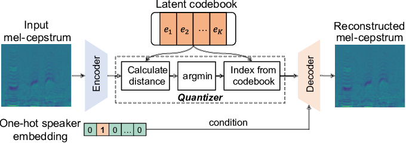
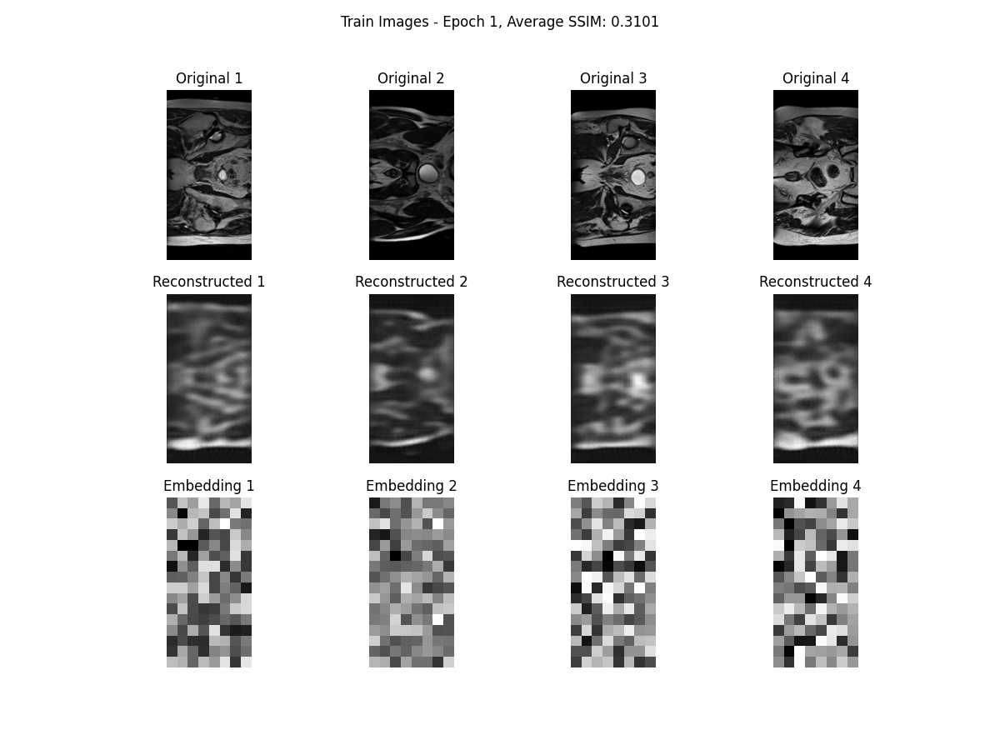
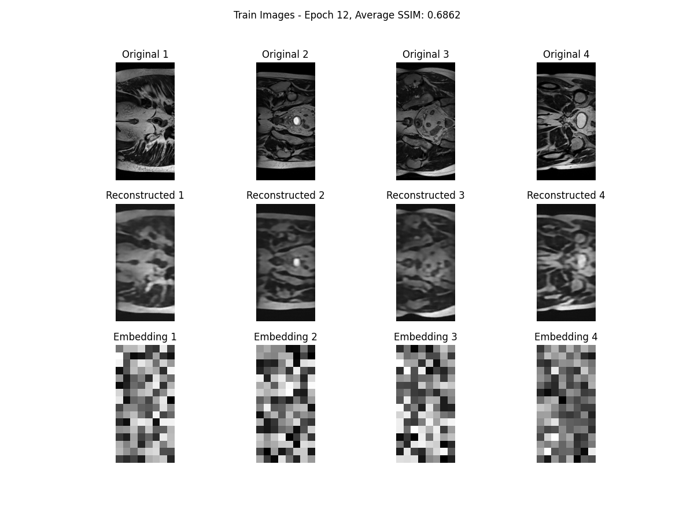
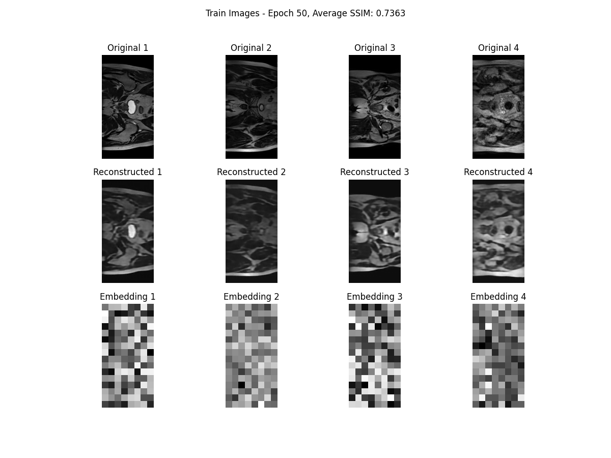
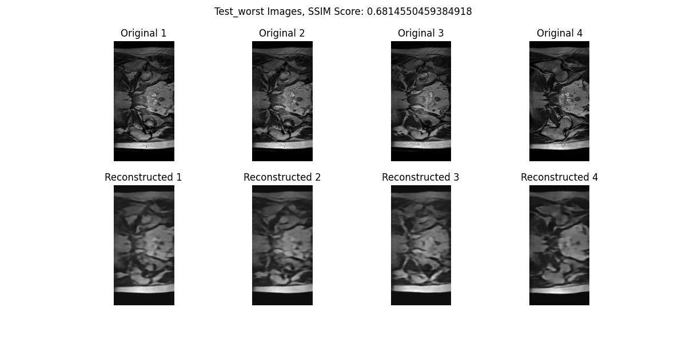
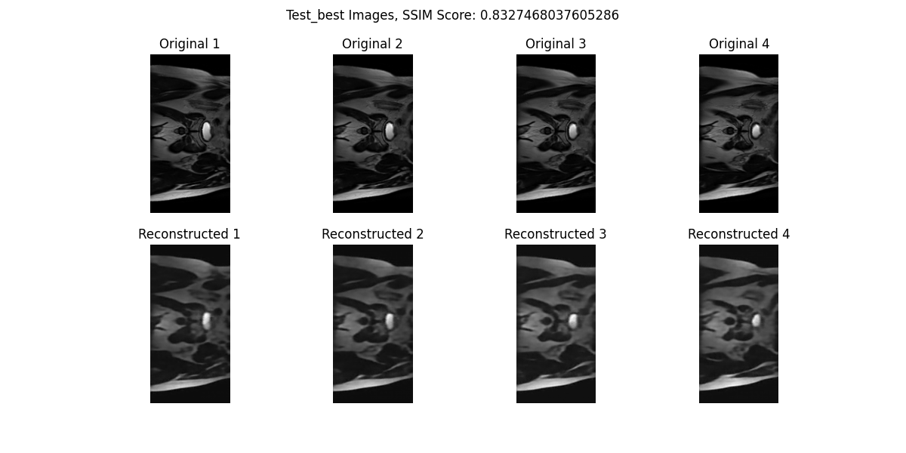

# Generative Vector Quantized Variational Autoencoder (VQVAE) Model for CSIRO HipMRI 2D Slices

Author: James Lewis, 47442829

## Overview

The goal of this project was to develop a VQVAE model which is able to learn off the 2D MRI slice images from a CSIRO study [[1](https://data.csiro.au/collection/csiro:51392v2?redirected=true)] and reconstruct accurate recreations of the MRI slices.

VQVAE architecure consits of three main components: an encoder, a decoder and a vector quantizer. The encoder is responsible for compressing the data into a lower dimensional latent space using multiple convolution layers. This allows the model to not only reduce the complexity of the data but also keeping important features. The encoder feeds a vector quantizer a latent vector. The vector quantizer takes the continuous representations that have been learned by the encoder and maps them to a finite pre-defined codebook. This allows the model to better capture similarities in the data, which is important given the 2D MRI slices are all of the same part of the body. The vector quantizer then feeds the discrete representations to the decoder where its job is to reconstruct the input data into an 'new' image using transposed convolutional layers. This process is shown in the image below. The output of the decoder can be made into an image to compare with the original MRI image. Structured Similarity Index Measure (SSIM) was used to determine the accuracy of the decoded images.

Another key feature of my implementation of the VQVAE model was the use of residual layers in both the encoder and decoder. The residual layer in the encoder allow the encoder and decoder to learn the difference between its input and the current representation by feeding the input values through to the output.

## Data Processing

The [HipMRI dataset](https://data.csiro.au/collection/csiro:51392v2?redirected=true) consists of 12000 greyscale 2D MRI images of the pelvis is male patients. While the images were varying sizes, most were 256x128. To deal with this all data was put through resizing to 256x128. SSIM was calculated by comparing the data produced by the decoder and the real image the model was trying to 'immitate'. These images were fed to the model in batches of 32, as this provided the best balance between computational efficiency and memory usage.

## Results

After 50 epochs of training, my model achieved an average SSIM of 0.76 when tested using the test dataset. The following graphs show the SSIM and losses during the 50 epochs of training.

You can clearly see a very sharp rise in SSIM and a sharp decrease in loss over the first 5-10 epochs. This may have been because both the learning rate and decay rate were too high. After only about 15-20 epochs there was only marginal improve in SSIM and loss indicating that learning decay may have started too soon.

Despite this, the images produced by the decoder are more than clear enough. While the images may be more 'blurry' than the originals, the shapes and patterns in the hip MRI's were learned incredibly well. 

To visualise the progression of the model, I've made images showing the reconstructed images next to their real counterparts throughout various epochs of training.

The following images take a look at the the worst four reconstructed images and the best four reconstructed images based on SSIM during testing.

In conclusion, the results and generated images show that the model was able to generalise the data quite well with SSIM scores of over 0.75 with unseen test images. It must be noted that if you were to increase the number epochs (and maybe decreased the decay rate), the images would be come marginally more clear, but since SSIM remained between 0.7 and 0.75 for over half of the training process, I decided to limit epochs to 50.

## Reproduction of Results

In order to reproduce these results I've listed all the hyperparameters I used on my training runs below.

### Model Configuration

- **Input Dimension:** 1
- **Output Dimension:** 128
- **Number of Residual Blocks:** 2
- **Number of Residual Channels:** 64
- **Stride:** 2
- **Number of Embeddings:** 256
- **Embedding Dimensions:** 128
- **Commitment Cost:** 0.25

### Training Configuration

- **Number of Epochs:** 50
- **Learning Rate:** 0.0005
- **Batch Size:** 32

In order to run the model, run the train.py file. This will train a VQVAE model and save its weights in order for further testing. Once the model has been saved the predict.py file can be run to provide testing data for the model.

### Dependencies

Versions for libraries used needed to run the model.

| **Library**    | **Version** |
| -------------- | ----------- |
| `python`       | 3.9         |
| `torch`        | 2.0.1       |
| `torchmetrics` | 1.5.1       |
| `torchvision`  | 0.15.2      |
| `matplotlib`   | 3.8.4       |
| `scikit-image` | 0.23.2      |
