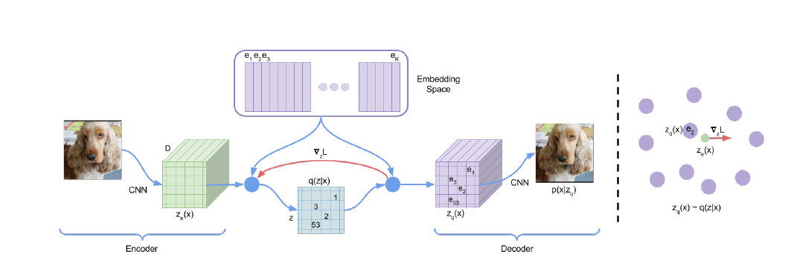
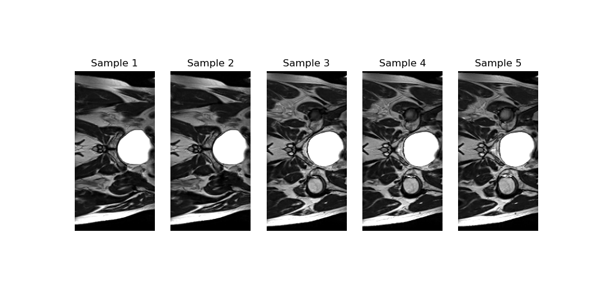
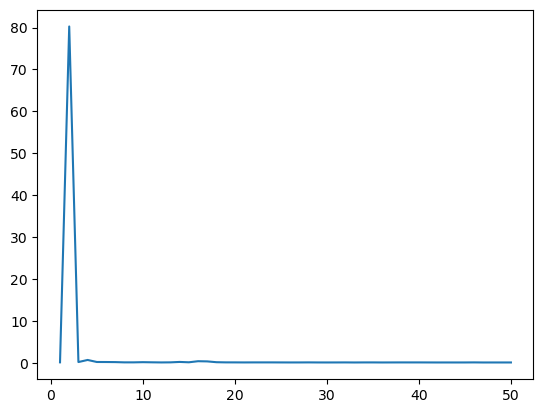
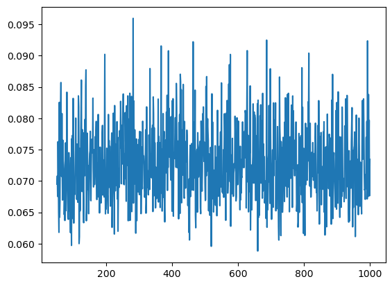
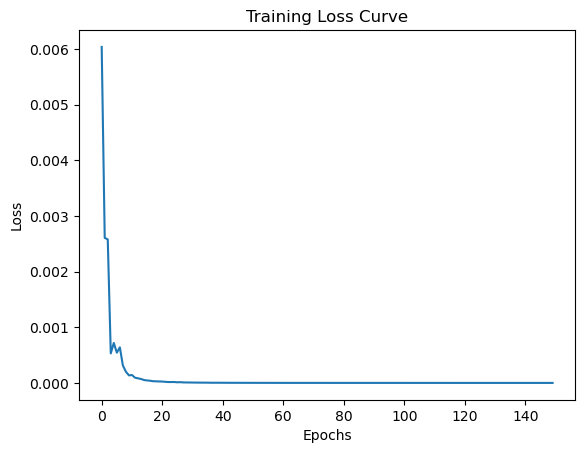
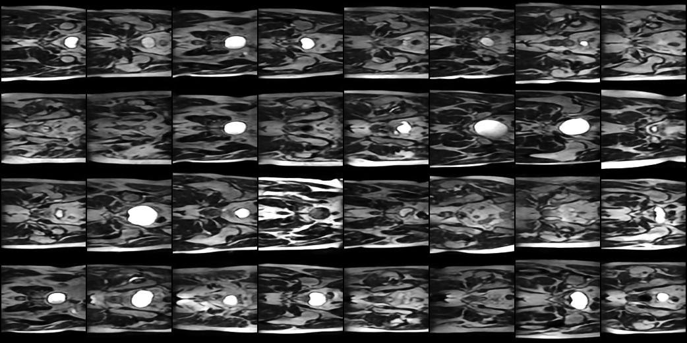
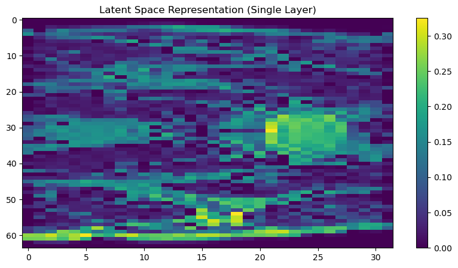
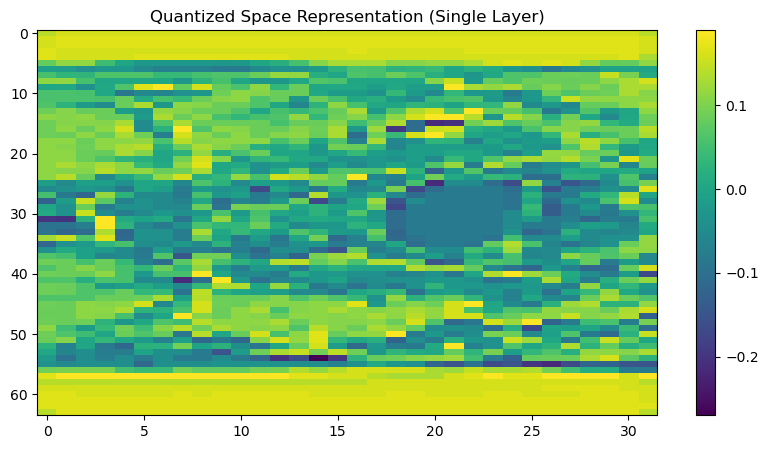
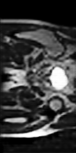

# Image Generation using VQ-VAE and PixelCNN
**Author:** Harshit Rathore, 48143749.
## Overview
This project implements **Vector Quantised-Variational Autoencoder (VQ-VAE)** combined with **PixelCNN** to generate high-quality images. VQ-VAE leverages discrete latent spaces to overcome limitations like posterior collapse found in traditional VAEs. Instead of learning continuous latents, the encoder maps the input data to a discrete codebook, providing compressed but meaningful representations.

Once the VQ-VAE learns the latent space, PixelCNN models the prior distribution over these discrete latent variables. PixelCNN captures the dependencies within these codes, allowing it to generate new samples by sequentially predicting one pixel/code at a time conditioned on previously generated ones. This model combination ensures high-quality generation, with meaningful features learned in the latent space and improved sample diversity through autoregressive priors.

## VQ-VAE: Discrete Latent Space for Efficient Encoding



### **Concept of VQ-VAE**
VQ-VAE improves on traditional VAEs by using **discrete latent variables**. The encoder maps input images to continuous latent vectors, which are then **quantized to discrete codes** by selecting the nearest entry from a **learned codebook**. This quantization ensures that the model focuses on learning useful features rather than trivial or noisy details.

### **Workflow of VQ-VAE**
1. **Encoder**: Maps input image \(x\) to a continuous latent vector \(z_e(x)\).
   \[
   z_e(x) = \text{Encoder}(x)
   \]

2. **Quantization**: Finds the nearest embedding vector \(e_k\) from the codebook for each latent vector.
   \[
   z_q(x) = e_k \quad \text{where} \quad k = \arg \min_j \|z_e(x) - e_j\|^2
   \]

3. **Decoder**: Uses the quantized latent vector \(z_q(x)\) to reconstruct the original image.
   \[
   \hat{x} = \text{Decoder}(z_q(x))
   \]

4. **Training Objective**: VQ-VAE minimizes a combination of three losses:
   - **Reconstruction Loss**: Measures the difference between the input and reconstructed image.
     \[
     L_{\text{recon}} = \|x - \hat{x}\|_2^2
     \]
   - **Codebook Loss**: Moves the codebook embeddings closer to the encoder output.
     \[
     L_{\text{codebook}} = \| \text{sg}(z_e(x)) - e_k \|_2^2
     \]
   - **Commitment Loss**: Encourages the encoder to commit to a specific code in the codebook.
     \[
     L_{\text{commit}} = \beta \| z_e(x) - \text{sg}(e_k) \|_2^2
     \]

   **Total Loss**:
   \[
   L = L_{\text{recon}} + L_{\text{codebook}} + L_{\text{commit}}
   \]

   Here, **sg** denotes the **stop-gradient** operation, preventing the gradients from flowing into the codebook embeddings.


## PixelCNN: Autoregressive Prior over Latent Codes

### **Concept of PixelCNN**
PixelCNN is an **autoregressive model** designed to learn the dependencies between pixels (or, in this case, latent codes). In this project, **PixelCNN models the prior distribution over the discrete latent codes generated by VQ-VAE**, allowing it to sample new latent codes that can be decoded into novel images.

### **How PixelCNN Works for VQ-VAE**
- **Training Phase**: PixelCNN learns the joint distribution of the discrete latent codes produced by the VQ-VAE encoder. Each code is predicted sequentially, conditioned on previously generated codes.
  
- **Generation Phase**: PixelCNN generates **quantized latent codes**, which are then decoded by the VQ-VAE decoder to generate a new image. This ensures that the sampled images follow the structure and style of the training data.

### **Mathematical Formulation**
The joint distribution over latent codes is factorized as:
\[
p(z) = \prod_{i=1}^{n} p(z_i | z_1, \ldots, z_{i-1})
\]
Where \(z_i\) is the code for the \(i^{th}\) position in the latent space. 

During training, PixelCNN maximizes the **log-likelihood** of the latent codes:
\[
L_{\text{PixelCNN}} = - \sum_{i=1}^{n} \log p(z_i | z_1, \ldots, z_{i-1})
\]

This formulation ensures that the model learns the dependencies between latent codes, making it capable of generating realistic samples when used in combination with the VQ-VAE decoder.


## How VQ-VAE and PixelCNN Work Together for Image Generation

1. **Training VQ-VAE**:
   - The VQ-VAE encoder learns to map input images to discrete latent codes.
   - The VQ-VAE decoder reconstructs the input images from these codes.

2. **Training PixelCNN**:
   - PixelCNN is trained on the quantized latent space generated by the VQ-VAE encoder.
   - It learns to model the dependencies between the latent codes, acting as a **prior distribution**.

3. **Generating New Images**:
   - PixelCNN samples a sequence of latent codes following the learned distribution.
   - These sampled codes are passed to the VQ-VAE decoder to generate a new image.

This two-stage pipeline ensures high-quality and realistic image generation, with PixelCNN providing structure to the discrete latent space learned by VQ-VAE.


## Dataset Details

The dataset used in this project contains 2D Hip MRI **12,460 images**:
- **12,400 images** are of size **256 × 128 pixels**.
- **60 images** are of size **256 × 144 pixels**. These were **filtered out** to maintain consistent dimensions during training.




## Project Structure
[`dataset.py`](./dataset.py): Contains the dataset loader, which handles data pre-processing and filtering of inconsistent image dimensions.

[`modules.py`](./modules.py): Implements both the **VQ-VAE** and **PixelCNN** models.

[`train_VQVAE.py`](./train_VQVAE.py): Trains the **VQ-VAE** model to learn the latent representations.

[`train_PixelCNN.py`](./train_PixelCNN.py): Trains the **PixelCNN** to model the prior distribution over the **VQ-VAE**’s discrete latent space.

[`predict.py`](./predict.py): Compares original images with their reconstructed versions and generates new images using both the **VQ-VAE** and **PixelCNN** models.

[`visualization_utils.py`](./visualization_utils.py): Provides utilities to plot loss curves, generate image comparisons, and visualize training progress.

[`environment.yml`](./environment.yml): Contains a complete list of dependencies to **reproduce the environment** used in this project.

## How to Use

### 1. Setting Up the Environment
To reproduce the environment, use the provided `environment.yml` file:

```bash
conda env create -f environment.yml
conda activate gpupytorch
```

The following dependencies are required for this project:

| **Dependency**  | **Version**|
|-----------------|----------|
| PyTorch         | 2.4.0    |
| TQDM            | 4.66.5   |
| NumPy           | 1.26.4   |
| Matplotlib      | 3.8.4    |
| Pillow (PIL)    | 10.4.0   |
| scikit-image    | 0.23.2   |
| NiBabel         | 5.2.1    |

Requirements.txt file is provided to install these files.

### 2. Training VQ-VAE
```bash
python train_VQVAE.py
```

### 3. Training PixelCNN
```bash
python train_PixelCNN.py
```
### 4. Generating Samples and Comparing Reconstructions
```bash
python predict.py
```

## Training and Loss Curves

### Loss Curve for the VQVAE Model


Training Loss Curve of VQVAE for first 50 epoch.



Training Loss Curve for VQVAE beyond 50 epoch.

### Loss Curve for the PixelCNN Model



Training Loss Curve for PixelCNN.

## Prediction Comparison

### Below is the comparison of the original images and reconstructed images from VQVAE Model. On an average these images have the **SSIM score of 0.90**


These are the batch of Original Images passed to the VQVAE Model.



These are the batch of Generated Images passed to the VQVAE Model.

### These are the Latent Spaces and Quantized spaces frpm the model.




Single Channel of Latent Space from VQVAE Model.




Single Channel of Quantised Latent Space from VQVAE Model.

### Image Generated using PixelCNN and VQVAE.




## References

* [1] VQ-VAEs: Neural Discrete Representation Learning: https://www.youtube.com/watch?v=VZFVUrYcig0.
* [2] Paper: *Neural Discrete Representation Learning*, Aaron van den Oord, Oriol Vinyals, Koray Kavukcuoglu, 2017. https://arxiv.org/abs/1711.00937
* [3] Sonnet VQ-VAE implementation: https://github.com/google-deepmind/sonnet/blob/v1/sonnet/examples/vqvae_example.ipynb.
* [4] PixelCNN Theory: https://sergeiturukin.com/2017/02/22/pixelcnn.html 
* [5] Albert's Repo for code reference: https://github.com/Albert-bc/vq-vae/tree/topic-recognition